# 多因子變異數分析 {#sec-Factorial-ANOVA}

```{r}
#| include: FALSE
source("header.R")
```

過去幾章已經探討了相當多的內容，我們探討過當研究中包含一個具有兩組（例如 @sec-Comparing-two-means 的t檢定）或三組以上（見 @sec-Comparing-several-means-one-way-ANOVA ）的名義變項時，可以使用的統計檢定。 @sec-Correlation-and-linear-regression  介紹了一個強大的新概念：建立具有多個連續預測變項的統計模型，用以解釋單一的結果變項。舉例來說，迴歸模型可以根據學生投入學習的時數，以及他們在標準化智商測驗上的分數，來預測其在閱讀理解測驗中可能犯錯的次數。

這個單元的目標，是將使用多個預測變項的概念，延伸至變異數分析的架構。舉例來說，假設我們想利用閱讀理解測驗來評估三所不同學校學生的學習成就，同時我們也懷疑性別可能會影響學生的發展速度（因此預期不同性別的學生成績表現也會有差異）。在這種情況下，每位學生都會被兩個變項分類：一是「性別」，二是「學校」。我們希望能同時根據這兩個分組變項，來分析學生的閱讀理解分數。用來進行這種分析的工具，泛稱為**因子設計變異數分析** (factorial ANOVA)。由於我們的設計中有兩個分組變項，因此也常稱為二因子變異數分析 (two-way ANOVA)，此名稱正好與 @sec-Comparing-several-means-one-way-ANOVA 所介紹的單因子變異數分析 (one-way ANOVA) 相對應。


<!--- Over the course of the last few chapters we have done quite a lot. We have looked at statistical tests you can use when you have one nominal predictor variable with two groups (e.g. the t-test in @sec-Comparing-two-means) or with three or more groups (@sec-Comparing-several-means-one-way-ANOVA). @sec-Correlation-and-linear-regression introduced a powerful new idea, that is building statistical models with multiple continuous predictor variables used to explain a single outcome variable. For instance, a regression model could be used to predict the number of errors a student makes in a reading comprehension test based on the number of hours they studied for the test and their score on a standardised $IQ$ test.

The goal in this chapter is to extend the idea of using multiple predictors into the ANOVA framework. For instance, suppose we were interested in using the reading comprehension test to measure student achievements in three different schools, and we suspect that girls and boys are developing at different rates (and so would be expected to have different performance on average). Each student is classified in two different ways: on the basis of their gender and on the basis of their school. What we'd like to do is analyse the reading comprehension scores in terms of both of these grouping variables. The tool for doing so is generically referred to as **factorial ANOVA**. However, since we have two grouping variables, we sometimes refer to the analysis as a two-way ANOVA, in contrast to the one-way ANOVAs that we ran in @sec-Comparing-several-means-one-way-ANOVA. --->

## 平衡且無交互作用的因子設計分析 {#sec-Factorial-ANOVA-balanced-n-interaction}

修改建議當我們在 @sec-Comparing-several-means-one-way-ANOVA 討論變異數分析時，我們是基於一個相對簡單的實驗設計。在該設計中，每位受試者會被分配到數個組別的其中一組，而我們想知道這些組別在某個結果變項上的平均數是否有所不同。本節將討論一類更廣泛的實驗設計，稱為因子設計 (factorial designs)，其中包含了多個分組變項。前文已舉過一個這類設計的例子，另一個例子則來自 @sec-Comparing-several-means-one-way-ANOVA ，我們在其中探討了不同藥物對每位受試者情緒改善程度 (`mood.gain`) 的影響。在那一章中，我們確實發現藥物具有顯著效果，但章末的另一項分析卻顯示治療沒有效果。然而，這種為了預測同一個結果變項而執行兩次獨立分析的做法，其實有些令人憂慮。治療對於情緒改善 (`mood.gain`) 也許確實有效果，但我們之所以沒發現，會不會是因為它的效果被藥物的效果所「遮蔽」(hidden) 了呢？換句話說，我們需要執行一個單一分析，將「藥物」和「治療」同時納為預測變項。在這種分析中，每位受試者會依其服用的藥物 (一個有 3 個水平的因子) 與接受的治療 (一個有 2 個水平的因子) 來進行交叉分類。我們將這樣的設計稱為$3 \times 2$**因子設計**。

如果我們用jamovi的“次數分析”模組-“列聯表”(Contingency Tables)分析藥物和治療方式的效果（見 @sec-Tabulating-and-cross-tabulating-data），會得到 @fig-fig13-1  的表格。


<!--- When we discussed analysis of variance in @sec-Comparing-several-means-one-way-ANOVA, we assumed a fairly simple experimental design. Each person is in one of several groups and we want to know whether these groups have different mean scores on some outcome variable. In this section, I'll discuss a broader class of experimental designs known as **factorial designs**, in which we have more than one grouping variable. I gave one example of how this kind of design might arise above. Another example appears in @sec-Comparing-several-means-one-way-ANOVA in which we were looking at the effect of different drugs on the mood.gain experienced by each person. In that chapter we did find a significant effect of drug, but at the end of the chapter we also ran an analysis to see if there was an effect of therapy. We didn't find one, but there's something a bit worrying about trying to run two separate analyses trying to predict the same outcome. Maybe there actually is an effect of therapy on mood gain, but we couldn't find it because it was being "hidden" by the effect of drug? In other words, we're going to want to run a single analysis that includes both drug and therapy as predictors. For this analysis each person is cross-classified by the drug they were given (a factor with 3 levels) and what therapy they received (a factor with 2 levels). We refer to this as a $3 \times 2$ factorial design.

If we cross-tabulate drug by therapy, using the 'Frequencies' - 'Contingency Tables' analysis in jamovi (see @sec-Tabulating-and-cross-tabulating-data), we get the table shown in @fig-fig13-1. --->

```{r}
#| label: fig-fig13-1
#| fig-cap: 藥物與治療效果的列聯表
#jamovi contingency table of drug by therapy
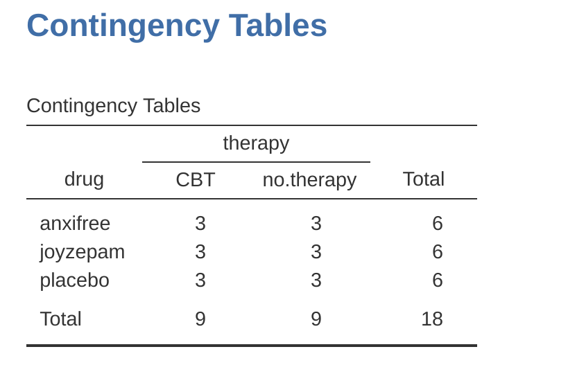
```

從列聯表中可見，本研究的設計不僅涵蓋了兩個因子的所有可能組合──這代表它是一個**完全交叉 (completely crossed)** 的設計──而且每個組別的受試者人數也完全相同。換句話說，這是一個**平衡設計 (balanced design)**。本節將先探討如何分析平衡設計的資料，因為這是最單純的情況。非平衡設計 (unbalanced designs) 的情況則相當繁瑣，因此我們暫時先不討論。


<!--- As you can see, not only do we have participants corresponding to all possible combinations of the two factors, indicating that our design is **completely crossed**, it turns out that there are an equal number of people in each group. In other words, we have a balanced design. In this section I'll talk about how to analyse data from **balanced** designs, since this is the simplest case. The story for unbalanced designs is quite tedious, so we'll put it to one side for the moment. --->

### 我們要檢定的是何種假設？ {#sec-What-hypotheses-are-we-testing}

與單因子變異數分析 (one-way ANOVA) 類似，因子設計ANOVA 也是一種用來檢定特定母體平均數假設的工具。因此，一個合理的起點，便是明確地定義我們所要檢定的假設。然而，在此之前，我們有必要先建立一套簡潔的符號系統，用以描述母體平均數。由於觀測值是依據兩個不同的因子進行交叉分類，因此我們可能會對許多不同層次的平均數感興趣。為了理解這點，讓我們先思考一下，在這類設計中我們可以計算出哪些不同的樣本平均數。首先，最顯而易見的，就是我們會對 @tbl-tab13-1  中所列出的各組平均數感興趣。


<!--- Like one-way ANOVA, factorial ANOVA is a tool for testing certain types of hypotheses about population means. So a sensible place to start would be to be explicit about what our hypotheses actually are. However, before we can even get to that point, it's really useful to have some clean and simple notation to describe the population means. Because of the fact that observations are cross-classified in terms of two different factors, there are quite a lot of different means that one might be interested in. To see this, let's start by thinking about all the different sample means that we can calculate for this kind of design. Firstly, there's the obvious idea that we might be interested in this list of group means (@tbl-tab13-1). --->

```{r}
#| label: tbl-tab13-1
#| tbl-cap: clinicaltrial依藥物和治療方法分組的各組平均值
#Group means for drug and therapy groups in the *clinicaltrial.csv*  data
huxtabs[[14]][[1]] |>
  set_number_format(value=2)
```

@tbl-tab13-2 列出了這兩個因子所有可能組合下的組別平均數。(例如：服用安慰劑且無治療的受試者、服用安慰劑並同時接受認知行為治療(CBT)的受試者等)如果我們將這些組別平均數，連同邊際平均數 (marginal means) 與總平均數 (grand mean)，一併整理成單一表格，將有助於我們理解。完整的表格如下所示：


<!--- Now, the next Table (@tbl-tab13-2) shows a list of the group means for all possible combinations of the two factors (e.g., people who received the placebo and no therapy, people who received the placebo while getting CBT, etc.). It is helpful to organise all these numbers, plus the marginal and grand means, into a single table which looks like this: --->

```{r}
#| label: tbl-tab13-2
#| tbl-cap: clinicaltrial依藥物和治療方法分組的總平均值
#Group and total means for drug and therapy groups in the clintrial.csv data
huxtabs[[14]][[2]]
```

當然，前面提到的這些平均數，都屬於樣本統計量 (sample statistic)。這個數值是根據我們在研究中所觀測到的特定資料計算而來。而我們真正想推論的，是與之對應的母體參數 (population parameters)。也就是存在於更廣泛母體中的真實平均數。這些母體平均數同樣可以整理成一個類似的表格 (見 @tbl-tab13-3)，但需要借助一些數學符號來標示。依照慣例，我們會用 $\mu$代表母體平均數。然而，由於這裡有許多不同層次的平均數，因此需要使用下標 (subscripts) 來加以區分。

這套符號系統的運作方式如下。它基於一個由兩個因子所定義的表格：每一行對應因子 A (本例中為「藥物」) 的一個水平；每一列則對應因子 B (本例中為「治療」) 的一個水平。如果我們以 R 代表表格的總行數，C 代表總列數，便可以稱之為一個$R \times C$因子設計ANOVA。在本例中，$R = 3$ 且 $C = 2$。接著，我們用小寫字母來指代特定的行與列，因此$\mu_{rc}$所代表的，就是因子$A$第$r$個水平 (即第$r$行) 與因子$B$第$c$個水平 (即第 c 列) 交叉組合下的母體平均數。[^factorial-anova-1]所以現在母體的均值是寫成@tbl-tab13-1的形式：

[^factorial-anova-1]: 這套下標標示法的好處，在於其良好的延伸性 (generalisability)。如果我們的實驗包含第三個因子，只需多加一個下標即可。原則上，這套標示法可以延伸至任意數量的因子；但在本書中，我們罕少討論超過兩個因子的分析，且絕不涉及三個以上的因子。

<!--- Now, each of these different means is of course a sample statistic. It's a quantity that pertains to the specific observations that we've made during our study. What we want to make inferences about are the corresponding population parameters. That is, the true means as they exist within some broader population. Those population means can also be organised into a similar table, but we'll need a little mathematical notation to do so (@tbl-tab13-3). As usual, I'll use the symbol $\mu$ to denote a population mean. However, because there are lots of different means, I'll need to use subscripts to distinguish between them.

Here's how the notation works. Our table is defined in terms of two factors. Each row corresponds to a different level of Factor A (in this case drug), and each column corresponds to a different level of Factor B (in this case therapy). If we let R denote the number of rows in the table, and $C$ denote the number of columns, we can refer to this as an $R \times C$ factorial ANOVA. In this case $R = 3$ and $C = 2$. We'll use lowercase letters to refer to specific rows and columns, so $\mu_{rc}$ refers to the population mean associated with the $r$-th level of Factor $A$ (i.e. row number $r$) and the $c$-th level of Factor B (column number c).[^factorial-anova-1] So the population means are now written like in @tbl-tab13-1:

[^factorial-anova-1]: The nice thing about the subscript notation is that it generalises nicely. If our experiment had involved a third factor, then we could just add a third subscript. In principle, the notation extends to as many factors as you might care to include, but in this book we'll rarely consider analyses involving more than two factors, and never more than three. --->

```{r}
#| label: tbl-tab13-3
#| tbl-cap: 因子設計表各分組使用的母群參數符號
#Notation for population means in a factorial table
huxtabs[[14]][[3]]
```

那麼，表格中剩下的項目該如何理解？舉例來說，我們要如何描述「所有可能服用 Joyzepam 的(假設)母群，無論其是否接受 CBT 治療，其平均情緒改善程度」？我們會使用「點」標示法 (dot notation) 來表達這個概念。以 Joyzepam 為例，我們所關心的是與表格第三行 (row) 相關的平均數。換句話說，我們是將兩個細格平均數 ($\mu_{31}$與 $\mu_{32}$) 加以平均。這個平均後的結果，就稱為邊際平均數 (marginal mean)，在此例中記為 $\mu_{3.}$。同樣地，CBT 的邊際平均數對應的是表格中第二欄 (column) 的母體平均數，我們將它記為$\mu_{.2}$，因為這個數值是將所有列 (rows) 的資料加以平均 (或稱邊際化 (marginalising)[^factorial-anova-2]) 後得到的。如此一來，我們完整的母體平均數表格便可寫成如 @tbl-tab13-4 的形式。

[^factorial-anova-2]: 嚴格來說，邊際化 (marginalising) 與一般的平均數不完全相同。它是一種加權平均數 (weighted average)，計算時需考量所平均之不同事件的發生頻率。然而，在平衡設計 (balanced design) 中，根據定義，所有細格的次數 (cell frequencies) 皆相等，因此兩者是等價的。我們稍後會討論非平衡設計 (unbalanced designs)，屆時讀者將會發現，所有的計算都會變得相當棘手。但目前讓我們先忽略這個問題。

<!--- Okay, what about the remaining entries? For instance, how should we describe the average mood gain across the entire (hypothetical) population of people who might be given Joyzepam in an experiment like this, regardless of whether they were in CBT? We use the "dot" notation to express this. In the case of Joyzepam, notice that we're talking about the mean associated with the third row in the table. That is, we're averaging across two cell means (i.e., $\mu_{31}$ and $\mu_{32}$). The result of this averaging is referred to as a marginal mean, and would be denoted $\mu_3.$ in this case. The **marginal mean** for CBT corresponds to the population mean associated with the second column in the table, so we use the notation because it is the mean obtained by averaging (marginalising[^factorial-anova-2]) over both. So our full table of population means can be written down like in @tbl-tab13-4.

[^factorial-anova-2]: Technically, marginalising isn't quite identical to a regular mean. It's a weighted average where you take into account the frequency of the different events that you're averaging over. However, in a balanced design, all of our cell frequencies are equal by definition so the two are equivalent. We'll discuss unbalanced designs later, and when we do so you'll see that all of our calculations become a real headache. But let's ignore this for now. --->

```{r}
#| label: tbl-tab13-4
#| tbl-cap: 因子設計表各獨變項處置使用的母群參數符號
#Notation for population and total means in a factorial table
huxtabs[[14]][[4]]
```


現在我們有了這套標示法，便可以輕易地建構並陳述假設。假設我們的目標是探討兩個問題：第一，藥物選擇是否對情緒有影響？第二，CBT 治療是否對情緒有影響？當然，這些並非我們能建構的全部假設 (我們將在 @sec-Factorial-ANOVA-balanced-w-interaction 看到一個非常重要的不同案例)，但這兩個假設是最容易檢定的，因此我們先從這裡開始。

先考慮第一個檢定，也就是藥物的效果。如果藥物沒有效果，那麼我們便會預期所有代表不同藥物的**行平均數 (row means)** 都相同。這就是我們的虛無假說。反之，如果藥物確實有效果，我們則會預期這些行平均數會有所不同。在形式上，我們將此假說寫為：

> **虛無假說 $H_0$**：所有行平均數皆相等，即 $\mu_{1. } = \mu_{2. } = \mu_{3. }$
>
> **對立假說 $H_1$**：至少有一個行平均數與其他不同

值得注意的是，這與我們在 @sec-Comparing-several-means-one-way-ANOVA ，對這筆資料進行**單因子變異數分析**時所建構的統計假設完全相同。當時，我們用 $\mu_{P}$ 符號代表安慰劑組的平均情緒改善程度，並以 $\mu_{A}$ 和 $\mu_{J}$ 分別代表兩種藥物的組別平均數，其虛無假說為 $\mu_{P} = \mu_{A} = \mu_{J}$。所以，我們談論的其實是同一個假設，只是因為現在有多個分組變項，更複雜的變異數分析需要更嚴謹的標示法，才將此假設改寫為 $\mu_{ 1.} = \mu_{ 2.} = \mu_{ 3.}$。然而，讀者很快就會看到，儘管假說內容相同，但由於我們現在考量了第二個分組變項的存在，對此假說的檢定方式會有些微的差異。

接著談到另一個分組變項（心理治療方法），讀者大概不會對此感到意外：我們的第二個假說檢定，也是用同樣的方式建構。然而，由於我們在此討論的是心理治療而非藥物，因此我們的虛無假說所對應的，便是**列平均數 (column means)** 的相等性：

> **虛無假說 $H_0$**：所有列平均數皆相等，即 $\mu_{.1} = \mu_{.2}$
>
> **對立假說 $H_1$**：列平均數不相等，即 $\mu_{.1} \neq \mu_{.2}$


<!--- Now that we have this notation, it is straightforward to formulate and express some hypotheses. Let's suppose that the goal is to find out two things. First, does the choice of drug have any effect on mood? And second, does CBT have any effect on mood? These aren't the only hypotheses that we could formulate of course, and we'll see a really important example of a different kind of hypothesis in the section [Factorial ANOVA 2: balanced designs, interactions allowed], but these are the two simplest hypotheses to test, and so we'll start there. Consider the first test. If the drug has no effect then we would expect all of the row means to be identical, right? So that's our null hypothesis. On the other hand, if the drug does matter then we should expect these row means to be different. Formally, we write down our null and alternative hypotheses in terms of the equality of marginal means:

$$\text{Null hypothesis, } H_0 \text{: row means are the same, i.e., } \mu_{1. } = \mu_{2. } = \mu_{3. }$$

$$\text{Alternative hypothesis, } H_1 \text{: at least one row mean is different}$$

It's worth noting that these are exactly the same statistical hypotheses that we formed when we ran a one-way ANOVA on these data in @sec-Comparing-several-means-one-way-ANOVA. Back then I used the notation $\mu \times {P}$ to refer to the mean mood gain for the placebo group, with $\mu{A}$ and $\mu \times {J}$ corresponding to the group means for the two drugs, and the null hypothesis was $\mu{P} = \mu{A} = \mu{J}$ . So we're actually talking about the same hypothesis, it's just that the more complicated ANOVA requires more careful notation due to the presence of multiple grouping variables, so we're now referring to this hypothesis as $\mu_{ 1.} = \mu_{ 2.} = \mu_{ 3.}$ . However, as we'll see shortly, although the hypothesis is identical the test of that hypothesis is subtly different due to the fact that we're now acknowledging the existence of the second grouping variable.

Speaking of the other grouping variable, you won't be surprised to discover that our second hypothesis test is formulated the same way. However, since we're talking about the psychological therapy rather than drugs our null hypothesis now corresponds to the equality of the column means:

$$\text{Null hypothesis, } H_0 \text{: column means are the same, i.e., } \mu_{ .1} = \mu_{ .2} $$
$$\text{Alternative hypothesis, } H_1 \text{: column means are different, i.e., } \mu_{ .1} \neq \mu_{ .2}$$
--->

### 使用jamovi完成多因子變異數分析

上一節描述的虛無假說與對立假說，讀者應該會感到相當熟悉。它們基本上與我們在 @sec-Comparing-several-means-one-way-ANOVA 中，對更簡單的**單因子變異數分析**所檢定的假說相同。因此，讀者可能會預期**因子設計ANOVA**所使用的假說檢定，在本質上会與 @sec-Comparing-several-means-one-way-ANOVA 的 F 檢定相同。讀者會預期看到書中提及平方和 (SS)、**均方 (MS)**、自由度 (df)，以及最終能轉換為 p 值的 F 統計量。嗯，你會這樣想的話完全符合傳統的學習脈絡。正因如此，本書接下來將一反常態。在本書中，一般的做法是先描述特定分析背後的邏輯 (以及部份數學原理)，接著才介紹 jamovi 的操作。但這一次，我們要反過來，先示範如何在 jamovi 中執行分析。這麼做的目的，是為了強調在 @sec-Comparing-several-means-one-way-ANOVA 中所討論的單因子變異數分析，與我們將在本章使用的更複雜方法之間的相似之處。

若讀者要分析的**資料**屬於**平衡因子設計**，那麼執行**變異數分析**將會非常簡單。為了讓讀者感受其簡易之處，讓我們先重現 @sec-Comparing-several-means-one-way-ANOVA 中的分析。回顧先前的分析，當時我們只用了一個**因子** (即「藥物」) 來預測**結果變項** (`mood.gain`)，並得到如 **圖 13.2** 所示的結果。


我在上一節中描述的虛無假設和替代假設應該讓你感到非常熟悉。它們基本上與我們在 @sec-Comparing-several-means-one-way-ANOVA 中執行的更簡單的單因素ANOVA檢驗相同。所以你可能期望因子ANOVA中使用的假設檢驗本質上與 @sec-Comparing-several-means-one-way-ANOVA 中的F檢驗相同。您期望看到對平方和（SS）、平均平方（MS）、自由度（df）以及最終可以將之轉換為p值的F統計量的引用，對吧？好吧，你絕對是對的。 這麼多，以至於我要改變我的常規方法。在本書中，我通常採用先描述特定分析的基礎邏輯（在某程度上還有數學），然後再介紹jamovi中的分析的方法。這次我要相反地做，先告訴你如何在jamovi中執行它。這樣做的原因是我想強調 @sec-Comparing-several-means-one-way-ANOVA 中討論的簡單的單因素ANOVA工具，以及我們將在本章中使用的更複雜的方法之間的相似之處。

如果您試圖分析的數據對應於平衡的因子設計，那麼執行方差分析就很容易。要了解它有多容易，讓我們先重現 @sec-Comparing-several-means-one-way-ANOVA 中的原始分析。以防你忘了，對於那個分析，我們只使用一個因素（即藥物）來預測我們的結果變量（即mood.gain），並且得到了 @fig-fig13-2 中顯示的結果。


<!--- The null and alternative hypotheses that I described in the last section should seem awfully familiar. They're basically the same as the hypotheses that we were testing in our simpler oneway ANOVAs in @sec-Comparing-several-means-one-way-ANOVA. So you're probably expecting that the hypothesis tests that are used in factorial ANOVA will be essentially the same as the F-test from @sec-Comparing-several-means-one-way-ANOVA. You're expecting to see references to sums of squares (SS), mean squares (MS), degrees of freedom (df), and finally an F-statistic that we can convert into a p-value, right? Well, you're absolutely and completely right. So much so that I'm going to depart from my usual approach. Throughout this book, I've generally taken the approach of describing the logic (and to an extent the mathematics) that underpins a particular analysis first and only then introducing the analysis in jamovi. This time I'm going to do it the other way around and show you how to do it in jamovi first. The reason for doing this is that I want to highlight the similarities between the simple one-way ANOVA tool that we discussed in @sec-Comparing-several-means-one-way-ANOVA, and the more complicated approach that we're going to use in this chapter.

If the data you're trying to analyse correspond to a balanced factorial design then running your analysis of variance is easy. To see how easy it is, let's start by reproducing the original analysis from @sec-Comparing-several-means-one-way-ANOVA. In case you've forgotten, for that analysis we were using only a single factor (i.e., drug) to predict our outcome variable (i.e., mood.gain), and we got the results shown in @fig-fig13-2. --->

```{r}
#| label: fig-fig13-2
#| classes: .enlarge-image
#| fig-cap: 藥物對情緒改善程度的單因子變異分析
#jamovi one way anova of mood.gain by drug
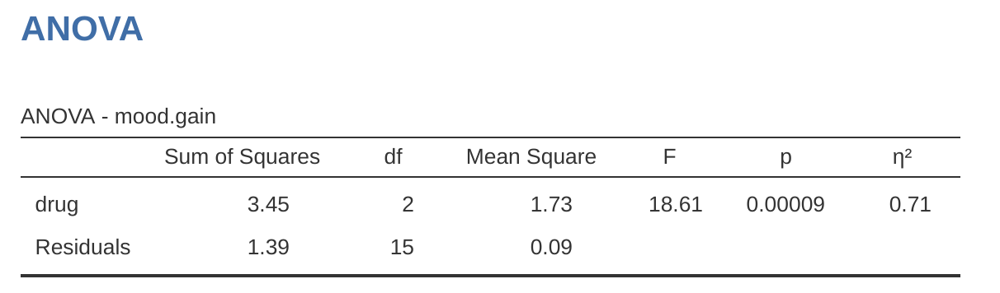
```

現在，假設我們也想探討「心理治療」是否與情緒改善程度 (`mood.gain`) 有關。回顧我們在 @sec-Correlation-and-linear-regression 中對多元迴歸的討論，讀者大概不會感到意外：我們所需要做的，就只是在分析中將「治療」新增為第二個「**固定因子 (Fixed Factor)**」，如 **圖 13.3** 所示。

<!---現在，假設我也好奇心理治療是否與mood.gain有關。根據我們在 @sec-Correlation-and-linear-regression 中對多元回歸的討論，你可能不會感到意外，我們所要做的就是在分析中將治療作為第二個"固定因素"，如 @fig-fig13-3 所示。
 Now, suppose I'm also curious to find out if therapy has a relationship to mood.gain. In light of what we've seen from our discussion of multiple regression in @sec-Correlation-and-linear-regression, you probably won't be surprised that all we have to do is add therapy as a second 'Fixed Factor' in the analysis, see @fig-fig13-3. --->

```{r}
#| label: fig-fig13-3
#| classes: .enlarge-image
#| fig-cap: 藥物和心理治療對情緒改善程度的雙因子變異數分析
#jamovi two way anova of mood.gain by drug and therapy
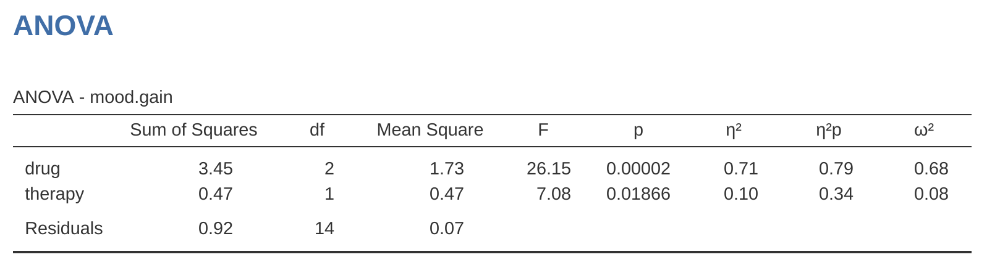
```


<!---這個輸出也很容易閱讀。表格的第一行報告了與藥物因素相關的組間平方和（SS）值，以及相應的組間 df 值。它還計算了平均平方（MS）、F統計量和p值。還有一行對應於心理治療因素和一行對應於殘差（即組內變異）。--->

這份 jamovi 的輸出結果同樣很容易解讀。表格的第一列出了與「藥物」因子相關的**組間平方和** (between-group SS)，以及其對應的**組間自由度**(df)。它同時也計算出**平方和平均 (MS)**、**F 統計量**及**p 值**。此外，表格中也分別有對應「治療」因子及**殘差 (residuals)** (即組內變異) 的列。


<!---所有的單個量都非常熟悉，這些不同量之間的關係也保持不變，就像我們在原始單因素ANOVA中看到的一樣。注意，平均平方值是通過將$SS$除以相應的$df$來計算的。也就是說，無論我們談論的是藥物、治療還是殘差，都還是

$$MS=\frac{SS}{df}$$

為了看到這一點，讓我們不要擔心平方和值是如何計算的。相反，讓我們相信 jamovi 已經正確計算了 $SS$ 值，並嘗試驗證所有其他數字是否合理。首先，注意對於藥物因素，我們將 $3.45$ 除以 $2$，得到平均平方值為 $1.73$。對於心理治療因素，只有1個自由度，所以我們的計算更簡單：將 $0.47$（$SS$ 值）除以1，得到答案為 $0.47$（$MS$ 值）。--->


不僅這些個別的數值我們都很熟悉，它們之間的關係也維持不變，就如同我們在最初的**單因子變異數分析**中所見。請注意，**平方和平均 (MS)** 的計算方式，依然是將**平方和 (SS)** 除以其對應的**自由度 (df)**。也就是說，無論我們討論的是「藥物」、「治療」還是「殘差」，這個公式都成立：

$$MS=\frac{SS}{df}$$

為了驗證這點，我們暫時不必擔心平方和 (SS) 的數值是如何算出的，先當作 jamovi 已正確算好，來驗證表格中其餘的數值是否合理。首先，看到「藥物」因子，我們將 $3.45$ 除以 $2$，便得到**平方和平均**為 $1.73$。至於「治療」因子，其自由度只有 1，計算更為簡單：將 $0.47$ (SS值) 除以 1，即得到 $0.47$ (MS值)。

<!---轉向 F 統計量和 p 值，注意我們有兩個；一個對應藥物因素，另一個對應心理治療因素。無論我們談論的是哪一個，F 統計量都是將與因素相關的平均平方值除以與殘差相關的平均平方值。如果我們用 "A" 作為簡寫符號來指代第一個因素（因素 A；在本例中是藥物），用 "R" 作為簡寫符號來指代殘差，那麼與因素 A 相關的 F 統計量表示為 $F_A$，並按如下方式計算：

$$F_A=\frac{MS_A}{MS_R}$$

因素 B（即心理治療）也有等效公式。注意，這裡使用 "R" 來指代殘差有點尷尬，因為我們也用字母 R 來指代表格中的行數，但我只會在 SSR 和 MSR 的上下文中用 "R" 表示殘差，所以希望這不會令人困惑。無論如何，將這個公式應用於藥物因素，我們將平均平方值 1.73 除以殘差平均平方值 $0.07$，得到 F 統計量為 26.15。對於心理治療變量的相應計算將是將 $0.47$ 除以 $0.07$，得到 $7.08$ 作為 F 統計量。當然，這些值與 jamovi 在上面的 ANOVA 表中報告的值相同。--->


接著看到 F 統計量與 p 值，讀者會注意到這兩者各有兩個：一個對應「藥物」因子，另一個則對應「治療」因子。無論是哪個因子，其 F 統計量的計算方式，都是將該因子的平方和平均，除以殘差的平方和平均。如果我們用「A」簡稱第一個因子 (因子 A，本例中為「藥物」)，並用「R」簡稱殘差 (residuals)，那麼因子 A 的 F 統計量便可記為 $F\_A$，其計算方式如下：

$$F_A=\frac{MS_A}{MS_R}$$

這個公式也同樣適用於因子 B (即「治療」)。這裡用「R」來代表殘差是有點尷尬， क्योंकि我們也曾用 R 代表表格的行數。不過，「R」僅會在**殘差平方和 ($SS\_R$)** 與**殘差平方和平均 ($MS\_R$)** 的脈絡中代表殘差，因此應不致混淆。總之，用這道公式計算「藥物」因子的統計值，就是將平方和平均 1.73 除以殘差的平方和平均 0.07，就能得出 F 統計量為 26.15。同理，計算「治療」因子的統計值，是將 0.47 除以 0.07，得到 F 統計量為 7.08。這些數值與 jamovi 輸出的 ANOVA 表格裡的數值完全相同。


<!--- 同樣在 ANOVA 表中的是 p 值的計算。再次，這裡沒有什麼新鮮事物。對於我們的兩個因素，我們試圖做的是測試關於因素與結果變量之間沒有關係的虛無假設（稍後我將更加明確）。為此，我們（顯然）遵循了類似於單因素 ANOVA 的策略，為每個假設計算了一個 F 統計量。要將這些轉換為 p 值，我們只需要注意，在虛無假設下（即所謂因素無關）的 F 統計量的抽樣分佈是一個 F 分佈。還要注意，兩個自由度值分別對應於因素和殘差。對於藥物因素，我們談論的是具有 2 和 14 自由度的 F 分佈（稍後我將更詳細地討論自由度）。相反，對於心理治療因素，抽樣分佈是具有 1 和 14 自由度的 F 分佈。

在這一點上，我希望您能看到，這個更複雜的因子分析的 ANOVA 表應該以與較簡單的單因素分析的 ANOVA 表相同的方式進行閱讀。簡而言之，它告訴我們，我們的 $3 \times 2$ 設計的因子 ANOVA 發現藥物的顯著效應（$F_{2,14} = 26.15, p < .001$）以及心理治療的顯著效應（$F_{1,14} = 7.08, p = .02$）。或者，使用更技術正確的術語，我們會說藥物和心理治療有兩個**主要效果**。此刻，將這些稱為“主要”效果似乎有點多餘，但實際上是有道理的。稍後，我們將討論兩個因素之間可能存在的“交互作用”，因此我們通常區分主要效果和交互作用。 --->


ANOVA 表格中也包含了 p 值的計算。同樣地，這裡的概念也沒什麼新奇之處。對於這兩個因子，我們的目標都是檢定「該因子與結果變項之間沒有關係」的虛無假說 (稍後會對此有更精確的說明)。為此，我們顯然遵循了與**單因子變異數分析**類似的策略，為每一個假說都計算出一個 F 統計量。要將 F 統計量轉換為 p 值，只需了解在虛無假說 (即該因子無關緊要) 成立的情況下，F 統計量的抽樣分佈會是 **F 分布 (F distribution)**。此外也需注意，計算時所需的兩個自由度，分別來自因子本身以及殘差。以「藥物」因子為例，我們使用的是具有 2 和 14 自由度的 F 分布 (自由度的細節稍後會詳述)。相對地，「治療」因子所對應的抽樣分佈，則是具有 1 和 14 自由度的 F 分布。

至此，讀者應該可以理解，解讀這種更複雜的因子設計分析的 ANOVA 表格，其方式與解讀較簡單的單因子分析表格大致相同。簡言之，這個 $3 \times 2$ 設計的**因子設計ANOVA** 結果告訴我們：「藥物」有顯著效果 ($F_{2,14} = 26.15, p \< .001$)，「治療」同樣也有顯著效果 ($F\_{1,14} = 7.08, p = .02$)。或者，換個更精確的技術術語來說，我們會稱「藥物」與「治療」各有一個**主要效果 (main effect)**。目前將這些效果稱為「主要」效果，似乎有些冗贅，但這麼做其實是有道理的。稍後，我們將會討論兩因子之間可能存在的「**交互作用 (interaction)**」，因此我們通常會區分**主要效果**與**交互作用效果**。


<!--- This output is pretty simple to read too. The first row of the table reports a between-group sum of squares (SS) value associated with the drug factor, along with a corresponding between-group df value. It also calculates a mean square value (MS), an F-statistic and a p-value. is also a row corresponding to the therapy factor and a row corresponding to the residuals (i.e., the within groups variation).

Not only are all of the individual quantities pretty familiar, the relationships between these different quantities has remained unchanged, just like we saw with the original one-way ANOVA. Note that the mean square value is calculated by dividing $SS$ by the corresponding $df$. That is, it's still true that

$$MS=\frac{SS}{df}$$

regardless of whether we're talking about drug, therapy or the residuals. To see this, let's not worry about how the sums of squares values are calculated. Instead, let's take it on faith that jamovi has calculated the $SS$ values correctly, and try to verify that all the rest of the numbers make sense. First, note that for the drug factor, we divide $3.45$ by $2$ and end up with a mean square value of $1.73$. For the therapy factor, there's only 1 degree of freedom, so our calculations are even simpler: dividing $0.47$ (the $SS$ value) by 1 gives us an answer of $0.47$ (the $MS$ value).

Turning to the F statistics and the p values, notice that we have two of each; one corresponding to the drug factor and the other corresponding to the therapy factor. Regardless of which one we're talking about, the F statistic is calculated by dividing the mean square value associated with the factor by the mean square value associated with the residuals. If we use "A" as shorthand notation to refer to the first factor (factor A; in this case drug) and "R" as shorthand notation to refer to the residuals, then the F statistic associated with factor A is denoted $F_A$, and is calculated as follows:

$$F_A=\frac{MS_A}{MS_R}$$

and an equivalent formula exists for factor B (i.e., therapy). Note that this use of "R" to refer to residuals is a bit awkward, since we also used the letter R to refer to the number of rows in the table, but I'm only going to use "R" to mean residuals in the context of SSR and MSR, so hopefully this shouldn't be confusing. Anyway, to apply this formula to the drugs factor we take the mean square of 1.73 and divide it by the residual mean square value of $0.07$, which gives us an F-statistic of 26.15. The corresponding calculation for the therapy variable would be to divide $0.47$ by $0.07$ which gives $7.08$ as the F-statistic. Not surprisingly, of course, these are the same values that jamovi has reported in the ANOVA table above.

Also in the ANOVA table is the calculation of the p values. Once again, there is nothing new here. For each of our two factors what we're trying to do is test the null hypothesis that there is no relationship between the factor and the outcome variable (I'll be a bit more precise about this later on). To that end, we've (apparently) followed a similar strategy to what we did in the one way ANOVA and have calculated an F-statistic for each of these hypotheses. To convert these to p values, all we need to do is note that the sampling distribution for the F statistic under the null hypothesis (that the factor in question is irrelevant) is an F distribution. Also note that the two degrees of freedom values are those corresponding to the factor and those corresponding to the residuals. For the drug factor we're talking about an F distribution with 2 and 14 degrees of freedom (I'll discuss degrees of freedom in more detail later). In contrast, for the therapy factor the sampling distribution is F with 1 and 14 degrees of freedom.

At this point, I hope you can see that the ANOVA table for this more complicated factorial analysis should be read in much the same way as the ANOVA table for the simpler one way analysis. In short, it's telling us that the factorial ANOVA for our $3 \times 2$ design found a significant effect of drug ($F_{2,14} = 26.15, p < .001$) as well as a significant effect of therapy ($F_{1,14} = 7.08, p = .02$). Or, to use the more technically correct terminology, we would say that there are two **main effects** of drug and therapy. At the moment, it probably seems a bit redundant to refer to these as "main" effects, but it actually does make sense. Later on, we're going to want to talk about the possibility of "interactions" between the two factors, and so we generally make a distinction between main effects and interaction effects. --->

### 計算因子設計子變異數分析的平方差

<!---在上一節中，我有兩個目標。首先，向您顯示執行因子 ANOVA 所需的 jamovi 方法與我們用於單因素 ANOVA 的方法幾乎相同。唯一的區別是添加了第二個因素。其次，我想向您展示在這種情況下 ANOVA 表的樣子，以便您從一開始就可以看到因子 ANOVA 背後的基本邏輯和結構與支撐單因素 ANOVA 的那些相同。試著抱著這種感覺。這是真實的，因為因子 ANOVA 的建立方式與更簡單的單因素 ANOVA 模型大致相同。只是一旦您開始挖掘細節，這種熟悉的感覺就會消失。傳統上，這種令人欣慰的感覺會被向統計教科書作者傾訴怒氣的衝動所替代。

好的，讓我們先看看其中一些細節。上一節中的解釋表明了主效應（本例中為藥物和心理治療）的假設檢驗是 F 檢驗，但它沒有顯示如何計算平方和（SS）值。也沒有明確告訴您如何計算自由度（df 值），儘管相比之下這是一個簡單的事情。現在讓我們假設我們只有兩個預測變量，因子 A 和因子 B。如果我們用 Y 來表示結果變量，那麼我們可以用 Yrci 來表示與 rc 組的第 i 位成員相關的結果（即因子 A 的第 r 級/行和因子 B 的第 c 級/列）。因此，如果我們用 $\bar{Y}$ 表示樣本均值，我們可以使用與之前相同的表示法來表示組均值、邊際均值和總均值。也就是說，$\bar{Y}_{rc}$ 是與因子 A 的第 r 級和因子 B 的第 c 級相關的樣本均值：$\bar{Y}_{r.}$ 將是因子 A 的第 r 級的邊際均值，$\bar{Y}_{.c}$ 將是因子 B 的第 c 級的邊際均值，$\bar{Y}_{..}$ 是總體均值。換句話說，我們的樣本均值可以按照與母體均值相同的表格進行組織。對於我們的臨床試驗數據，該表格如@tbl-tab13-5所示。 --->


前一節有兩個目標。第一，是為了展示執行**因子設計ANOVA** 的 jamovi 操作，與我們用於**單因子變異數分析**的方法幾乎相同，唯一的差別只有新增了第二個因子。第二，是為了呈現這個範例的 ANOVA 統計表，好讓讀者從一開始就明白，因子設計ANOVA 背後的基本邏輯與架構，和支撐單因子變異數分析的邏輯與架構並無二致。請讀者先記住這種感覺。會有這種感覺千真萬確，因為因子設計ANOVA 的建構方式，與較簡單的單因子變異數分析模型或多或少是相同的。只不過，一旦開始深究細節，這種熟悉感便會煙消雲散。在傳統的學習過程中，這種欣慰感通常會被一股想對統計教科書作者們咆哮的衝動所取代。

我們接著來看一些細節。前一節的解釋說明了主要效果的假設檢定是 F 檢定, 但並未展示平方和 (SS) 是如何計算的，也未明確說明如何計算自由度 (df)，儘管後者相對單純。假設目前只有兩個預測變項：因子 A 與因子 B。若以 Y 代表結果變項，那麼 $Y\_{rci}$ 就代表 rc 組中第 i 位受試者的結果值 (亦即因子 A 的第 r 個水平/列，以及因子 B 的第 c 個水平/行)。因此，若以 $\bar{Y}$ 代表樣本平均數，我們便能沿用先前的標示法來表示細格平均數、邊際平均數及總平均數。也就是說：$\bar{Y}_{rc}$ 是因子 A 第 r 個水平與因子 B 第 c 個水平對應的樣本平均數；$\bar{Y}_{r.}$ 是因子 A 第 r 個水平的邊際平均數；$\bar{Y}_{.c}$ 是因子 B 第 c 個水平的邊際平均數；而 $\bar{Y}_{..}$ 則是總平均數。換言之，我們的樣本平均數可以組織成與**母群**平均數相同的表格。以我們的臨床試驗資料為例，該表格如 @tbl-tab13-5 所示。


<!--- In the previous section I had two goals. Firstly, to show you that the jamovi method needed to do factorial ANOVA is pretty much the same as what we used for a one way ANOVA. The only difference is the addition of a second factor. Secondly, I wanted to show you what the ANOVA table looks like in this case, so that you can see from the outset that the basic logic and structure behind factorial ANOVA is the same as that which underpins one way ANOVA. Try to hold onto that feeling. It's genuinely true, insofar as factorial ANOVA is built in more or less the same way as the simpler one-way ANOVA model. It's just that this feeling of familiarity starts to evaporate once you start digging into the details. Traditionally, this comforting sensation is replaced by an urge to hurl abuse at the authors of statistics textbooks.

Okay, let's start by looking at some of those details. The explanation that I gave in the last section illustrates the fact that the hypothesis tests for the main effects (of drug and therapy in this case) are F-tests, but what it doesn't do is show you how the sum of squares (SS) values are calculated. Nor does it tell you explicitly how to calculate degrees of freedom (df values) though that's a simple thing by comparison. Let's assume for now that we have only two predictor variables, Factor A and Factor B. If we use Y to refer to the outcome variable, then we would use Yrci to refer to the outcome associated with the i-th member of group rc (i.e., level/row r for Factor A and level/column c for Factor B). Thus, if we use $\bar{Y}$ to refer to a sample mean, we can use the same notation as before to refer to group means, marginal means and grand means. That is, $\bar{Y}_{rc}$ is the sample mean associated with the rth level of Factor A and the cth level of Factor: $\bar{Y}_{r.}$ would be the marginal mean for the rth level of Factor A, $\bar{Y}_{.c}$ would be the marginal mean for the cth level of Factor B, and $\bar{Y}_{..}$ is the grand mean. In other words, our sample means can be organised into the same table as the population means. For our clinical trial data, that table is shown in @tbl-tab13-5. --->

```{r}
#| label: tbl-tab13-5
#| tbl-cap: clinicaltrial的樣本平均值的符號標示
#Notation for sample means for the clinical trial data
huxtabs[[14]][[5]]
```

<!---如果我們查看之前顯示的樣本均值，我們有 $\bar{Y}_{11} = 0.30$，$\bar{Y}_{12} = 0.60$ 等。在我們的臨床試驗示例中，藥物因子有 3 個水平，治療因子有 2 個水平，因此我們試圖執行的是一個 $3 \times 2$ 因子方差分析。然而，我們將更一般地說，因子 A（行因子）有 R 個水平，因子 B（列因子）有 C 個水平，因此我們在這裡執行的是一個 $R \times C$ 因子方差分析。--->


回顧先前表格中的樣本平均數，我們可以看到 $\bar{Y}_{11} = 0.30$、$\bar{Y}_{12} = 0.60$ 等數值。在我們的臨床試驗範例中，「藥物」因子有 3 種處置，「治療」因子有 2 種處置，因此我們所要處理的，便是一個 $3 \times 2$ 的**因子設計ANOVA**。然而，為了讓說法更具一般性，我們會說因子 A (行因子) 有 $R$ 個水平，因子 B (列因子) 有 $C$ 個水平，因此這裡執行的，便是一個 $R \times C$ 的因子設計ANOVA。


[額外的技術細節[^factorial-anova-3]]

[^factorial-anova-3]: 現在我們的標示法已經確立，便可以用相對熟悉的方式，計算出兩個因子的平方和。對於因子 A，其組間平方和的計算，是透過衡量各個列的邊際平均數 ($\bar{Y}_{1.}$、$\bar{Y}_{2.}$ 等) 與總平均數 ($\bar{Y}_{..}$) 之間的差異程度。計算方式與單因子變異數分析相同：計算 $\bar{Y}_{r.}$ 值與 $\bar{Y}_{..}$ 值之間的**離均差平方和 (sum of squared difference)**。具體來說，如果每個細格有 $N$ 位受試者，那麼計算公式如下：<br />$$SS_A=(N \times C)\sum_{r=1}^R (\bar{Y}_{r.}-\bar{Y}_{..})^2$$<br />與單因子變異數分析一樣，此公式最不繁瑣[^a] 的部分，是 $(\bar{Y}_{r.}-\bar{Y}_{..})^2$ 這部分，它對應的是第 r 個水平的離均差平方。這個公式的運作方式是：先計算出因子所有 $R$ 個水平的離均差平方，將其加總，最後再將結果乘以 $N \times C$。<br />之所以要乘以 $N \times C$，是因為在我們的研究設計中，因子 A 的每一個水平 (如水平 $r$) 都會出現在多個細格裡。事實上，它會對應到因子 B 的所有 $C$ 個水平，因此總共會出現在 $C$ 個細格中。舉例來說，在我們的範例中，就有兩個不同的細格對應 Anxifree 這種藥物：一個是「無治療」組，另一個是「CBT」組。不僅如此，每一個細格中都還包含 $N$ 個觀測值。因此，若我們想將這個平方和 (SS) 的計算基礎，轉換到「每一個觀測值」的層級，就必須乘以 $N \times C$。<br />因子 B 的公式自然也是同理，只是更動了下標而已：<br />$$SS_B=(N \times R)\sum_{c=1}^C (\bar{Y}_{.c}-\bar{Y}_{..})^2$$<br />有了這些公式後，便可以將計算結果與先前章節的 jamovi 輸出進行核對。同樣地，建議讀者可使用試算表軟體來輔助這類計算，親自動手試試。讀者也可參考本書提供的 Excel 檔案 *clinicaltrial_factorialanova.xls*。<br />首先，計算「藥物」主要效果的平方和。在每個細格中，受試者人數為 $N = 3$，而治療的種類 (因子 B 的水平數) 為 $C = 2$。換句話說，服用任一種特定藥物的總人數為 $3 \times 2 = 6$ 人。在試算表軟體中完成計算後，會得到「藥物」主要效果的平方和為 3.45。不意外地，這個數值與 @fig-fig13-3 的 ANOVA 表格中，「藥物」因子的 SS 值完全相同。<br />接著，我們能以相同方式計算「治療」的效果。同樣地，每個細格的受試者人數為 $N = 3$，但這次藥物的種類 (因子 A 的水平數) 為 $R = 3$。因此，接受任一種特定治療的總人數為 $3 \times 3 = 9$ 人。此次計算結果，會得到「治療」主要效果的平方和為 $0.47$。這個數值同樣也與 @fig-fig13-3 的 ANOVA 輸出結果相符。<br />以上就是計算兩個主要效果的平方和 (SS) 的方式。這些 SS 值，類似於我們在 @sec-Comparing-several-means-one-way-ANOVA 中進行單因子變異數分析時所計算的組間平方和。然而，最好不要再將它們視為組間平方和，因為現在有兩個不同的分組變項，容易造成混淆。<br />不過，為了建構 F 檢定，我們還需要計算**組內平方和 (within-groups sum of squares)**。為了與 @sec-Correlation-and-linear-regression 章節及 jamovi 輸出的 ANOVA 表格術語保持一致，接下來會將組內平方和稱為**殘差平方和 ($SS_R$)**。<br />要理解殘差平方和，最簡單的方式，就是將其視為：在考量了邊際平均數的差異 (亦即減去 $SS_A$ 與 $SS_B$) 之後，結果變項中所剩餘的變異量。也就是說，我們可以先計算出**總平方和 (total sum of squares)**，記為 $SS_T$。其計算公式與單因子變異數分析的公式幾乎相同：計算每一個觀測值 $Y_{rci}$ 與總平均數 $\bar{Y}_{..}$ 的離均差平方，再將全部數值加總。<br />$$SS_T=\sum_{r=1}^R \sum_{c=1}^C \sum_{i=1}^N (Y_{rci}-\bar{Y}_{..})^2$$<br />這裡的「**三重加總 (triple summation)**」看起來比實際上複雜。前兩個加總是對因子 A 的所有水平 (即表格中所有可能的行 r) 與因子 B 的所有水平 (即所有可能的列 c) 進行加總。每一個 rc 組合對應一個細格，而每個細格又包含 $N$ 位受試者，因此我們還必須對細格中所有受試者 (即所有 $i$ 值) 進行加總。換言之，我們在此所做的，就只是將資料集中的所有觀測值 (即所有可能的 rci 組合) 加總起來。<br />至此，我們已知結果變項的總變異量 ($SS_T$)，也知道其中有多少變異量可歸因於因子 A ($SS_A$) 及因子 B ($SS_B$)。因此，殘差平方和的定義即為：無法歸因於這兩個因子的 Y 變異量。換言之：<br />$$SS_R=SS_T-(SS_A+SS_B)$$<br />當然，也可以使用一個公式來直接計算殘差平方和，但從概念上這樣思考會更有助於理解。之所以稱之為「殘差」，其意義便在於它是「剩餘的變異量」，而上述公式便清楚地體現了這點。此外也需注意，依照迴歸章節所使用的術語，通常會將 $SS_A + SS_B$ 稱為可歸因於「ANOVA 模型」的**模型平方和 (model sum of squares)**，記為 $SS_M$。因此我們常說：總平方和等於模型平方和，加上殘差平方和。稍後在本章中將會看到，這不僅是表面上的相似：ANOVA 與迴歸在根本上其實是同一回事。<br />無論如何，值得花點時間用此公式來計算 $SS_R$，並驗證我們得到的答案與 jamovi 的 ANOVA 表格輸出結果相同。在試算表軟體中，計算過程相當直接 (可參見 clinicaltrial_factorialanova.xls 檔案)：先用上述公式算出總平方和 ($SS_T = 4.85$)，然後計算殘差平方和 ($SS_R = 0.92$)。最終，我們再次得到了相同的答案。<br />---<br />`[^a]`：原文為 "least tedious"，意為「最不繁瑣」。


<!--- And if we look at the sample means that I showed earlier, we have $\bar{Y}_{11} = 0.30$, $\bar{Y}_{12} = 0.60$ etc. In our clinical trial example, the drugs factor has 3 levels and the therapy factor has 2 levels, and so what we're trying to run is a $3 \times 2$ factorial ANOVA. However, we'll be a little more general and say that Factor A (the row factor) has R levels and Factor B (the column factor) has C levels, and so what we're running here is an $R \times C$ factorial ANOVA.

[Additional technical detail [^factorial-anova-3]]

[^factorial-anova-3]: Now that we've got our notation straight, we can compute the sum of squares values for each of the two factors in a relatively familiar way. For Factor A, our between group sum of squares is calculated by assessing the extent to which the (row) marginal means $\bar{Y}_{1.} , \bar{Y}_{2.}$ etc, are different from the grand mean $\bar{Y}_{..}$ We do this in the same way that we did for one-way ANOVA: calculate the sum of squared difference between the $\bar{Y}_{i.}$ values and the $\bar{Y}_{..}$ values. Specifically, if there are N people in each group, then we calculate this $$SS_A=(N \times C)\sum_{r=1}^R (\bar{Y}_{r.}-\bar{Y}_{..})^2$$ As with one-way ANOVA, the most interesting $^a$ part of this formula is the bit, which corresponds to the squared deviation associated with level r. All that this formula does is calculate this squared deviation for all R levels of the factor, add them up, and then multiply the result by $N \times C$. The reason for this last part is that there are multiple cells in our design that have level $r$ on Factor A. In fact, there are C of them, one corresponding to each possible level of Factor B. For instance, in our example there are two different cells in the design corresponding to the anxifree drug: one for people with no.therapy and one for the CBT group. Not only that, within each of these cells there are N observations. So, if we want to convert our SS value into a quantity that calculates the between-groups sum of squares on a "per observation" basis, we have to multiply by $N \times C$. The formula for factor $B$ is of course the same thing, just with some subscripts shuffled around $$SS_B=(N \times R)\sum_{c=1}^C (\bar{Y}_{.c}-\bar{Y}_{..})^2$$ Now that we have these formulas we can check them against the jamovi output from the earlier section. Once again, a dedicated spreadsheet programme is helpful for these sorts of calculations, so please have a go yourself. You can also take a look at the version I did in Excel in the file *clinicaltrial_factorialanova.xls*. First, let's calculate the sum of squares associated with the main effect of drug. There are a total of $N = 3$ people in each group and $C = 2$ different types of therapy. Or, to put it another way, there are $3 \times 2 = 6$ people who received any particular drug. When we do these calculations in a spreadsheet programme, we get a value of 3.45 for the sum of squares associated with the main effect of drug. Not surprisingly, this is the same number that you get when you look up the SS value for the drugs factor in the ANOVA table that I presented earlier, in @fig-fig13-3. <br /> We can repeat the same kind of calculation for the effect of therapy. Again there are $N = 3$ people in each group, but since there are $R = 3$ different drugs, this time around we note that there are $3 \times 3 = 9$ people who received CBT and an additional 9 people who received the placebo. So our calculation in this case gives us a value of $0.47$ for the sum of squares associated with the main effect of therapy. Once again, we are not surprised to see that our calculations are identical to the ANOVA output in @fig-fig13-3. <br /> So that's how you calculate the SS values for the two main effects. These SS values are analogous to the between-group sum of squares values that we calculated when doing one-way ANOVA in @sec-Comparing-several-means-one-way-ANOVA. However, it's not a good idea to think of them as between-groups SS values anymore, just because we have two different grouping variables and it's easy to get confused. In order to construct an $F$ test, however, we also need to calculate the within-groups sum of squares. In keeping with the terminology that we used in @sec-Correlation-and-linear-regression and the terminology that jamovi uses when printing out the ANOVA table, I'll start referring to the within-groups SS value as the residual sum of squares $SS_R$. <br /> The easiest way to think about the residual SS values in this context, I think, is to think of it as the leftover variation in the outcome variable after you take into account the differences in the marginal means (i.e., after you remove $SS_A$ and $SS_B$). What I mean by that is we can start by calculating the total sum of squares, which I'll label $SS_T$ . The formula for this is pretty much the same as it was for one-way ANOVA. We take the difference between each observation Yrci and the grand mean $\hat{Y}_{..}$, square the differences, and add them all $$SS_T=\sum_{r=1}^R \sum_{c=1}^C \sum_{i=1}^N (Y_{rci}-\bar{Y}_{..})^2$$ The "triple summation" here looks more complicated than it is. In the first two summations, we're summing across all levels of Factor $A$ (i.e., over all possible rows r in our table) and across all levels of Factor $B$ (i.e., all possible columns $c$). Each rc combination corresponds to a single group and each group contains $N$ people, so we have to sum across all those people (i.e., all $i$ values) too. In other words, all we're doing here is summing across all observations in the data set (i.e., all possible rci combinations). At this point, we know the total variability of the outcome variable SST , and we know how much of that variability can be attributed to Factor A ($SS_A$) and how much of it can be attributed to Factor B ($SS_B$). The residual sum of squares is thus defined to be the variability in $Y$ that can't be attributed to either of our two factors. In other words $$SS_R=SS_T-(SS_A+SS_B)$$ Of course, there is a formula that you can use to calculate the residual SS directly, but I think that it makes more conceptual sense to think of it like this. The whole point of calling it a residual is that it's the leftover variation, and the formula above makes that clear. I should also note that, in keeping with the terminology used in the regression chapter, it is commonplace to refer to $SS_A + SS_B$ as the variance attributable to the "ANOVA model", denoted SSM, and so we often say that the total sum of squares is equal to the model sum of squares plus the residual sum of squares. Later on in this chapter we'll see that this isn't just a surface similarity: ANOVA and regression are actually the same thing under the hood. In any case, it's probably worth taking a moment to check that we can calculate $SS_R$ using this formula and verify that we do obtain the same answer that jamovi produces in its ANOVA table. The calculations are pretty straightforward when done in a spreadsheet (see the clinicaltrial_factorialanova.xls file). We can calculate the total SS using the formulas above (getting an answer of total $SS = 4.85$) and then the residual SS ( = 0.92). Yet again, we get the same answer. <br /> --- <br /> $^a$English translation: "least tedious". --->

### 計算自由度的規則

<!---自由度的計算方式與單因素變異數分析非常相似。對於任何給定因子，自由度等於級別數減 1（即，行變量因子 A 的 $R - 1$，列變量因子 B 的 $C - 1$）。因此，對於藥物因子，我們得到 $df = 2$，對於療法因子，我們得到 $df = 1$。稍後，在我們討論將 ANOVA 解釋為回歸模型時（參見 @sec-ANOVA-as-a-linear-model），我將更清楚地說明我們如何得出此數字。但就目前而言，我們可以使用自由度的簡單定義，即自由度等於觀察到的數量數目減去約束數目。因此，對於藥物因子，我們觀察到 3 個單獨的組平均值，但這些受到 1 個總平均值的約束，因此自由度為 2。對於殘差，邏輯相似但不完全相同。我們實驗中的總觀察次數是 18。約束對應於 1 個總平均值，藥物因子引入的 2 個額外組平均值，以及療法因子引入的 1 個額外組平均值，因此我們的自由度為 14。作為公式，這是 $N - 1 - (R - 1) - (C - 1)$，簡化後是 $N - R - C + 1$。--->

自由度的計算方式，與單因子變異數分析非常相似。對於任一給定因子，其自由度等於其水平數減 1 (即行因子 A 的自由度為 $R - 1$，列因子 B 的自由度為 $C - 1$)。因此，「藥物」因子的自由度為 $df = 2$，而「治療」因子的自由度為 $df = 1$。關於這個數字的計算原理，在稍後討論將 ANOVA 解釋為迴歸模型時 (見 @sec-ANOVA-as-a-linear-model)，會有更清楚的說明。但目前，可以先採用自由度的簡易定義，亦即：

**自由度 = 觀測數量的個數 - 限制條件的個數**

因此，就「藥物」因子而言，我們觀測到 3 個獨立的組別平均數，但這些平均數受到 1 個總平均數的限制，因此其自由度為 2。殘差的計算邏輯相似，但並不完全相同。在本實驗中，觀測值總數為 18。而限制條件則有：1 個總平均數、加上「藥物」因子衍生的 2 個額外組別平均數、再加上「治療」因子衍生的 1 個額外組別平均數，因此殘差自由度為 14。寫成公式，即為 $N\_{total} - 1 - (R - 1) - (C - 1)$，可簡化為 $N\_{total} - R - C + 1$。


<!--- The degrees of freedom are calculated in much the same way as for one-way ANOVA. For any given factor, the degrees of freedom is equal to the number of levels minus 1 (i.e., $R - 1$ for the row variable Factor A, and $C - 1$ for the column variable Factor B). So, for the drugs factor we obtain $df = 2$, and for the therapy factor we obtain $df = 1$. Later on, when we discuss the interpretation of ANOVA as a regression model (see @sec-ANOVA-as-a-linear-model), I'll give a clearer statement of how we arrive at this number. But for the moment we can use the simple definition of degrees of freedom, namely that the degrees of freedom equals the number of quantities that are observed, minus the number of constraints. So, for the drugs factor, we observe 3 separate group means, but these are constrained by 1 grand mean, and therefore the degrees of freedom is 2. For the residuals, the logic is similar, but not quite the same. The total number of observations in our experiment is 18. The constraints correspond to 1 grand mean, the 2 additional group means that the drug factor introduces, and the 1 additional group mean that the the therapy factor introduces, and so our degrees of freedom is 14. As a formula, this is $N - 1 - (R - 1) - (C - 1)$, which simplifies to $N - R - C + 1$. --->

### 多因子與單因子變異數分析

<!---既然我們已經了解了因子變異數分析（factorial ANOVA）的運作方式，那麼花一點時間將其與單因素分析的結果進行比較是值得的，因為這將讓我們真正理解為什麼進行因子變異數分析是個好主意。在 @sec-Comparing-several-means-one-way-ANOVA 中，我進行了一個單因素變異數分析，以查看藥物之間是否存在差異，並進行了第二個單因素變異數分析，以查看療法之間是否存在差異。正如我們在 @sec-What-hypotheses-are-we-testing 節中看到的，單因素變異數分析所檢驗的零假設和對立假設實際上與因子變異數分析所檢驗的假設相同。更仔細地查看變異數分析表，我們可以看到，在兩種不同的分析中，與因子相關的平方和是相同的（藥物為 3.45，療法為 0.92），自由度也是相同的（藥物為 2，療法為 1）。但它們的答案並不相同！最值得注意的是，當我們在 @sec-On-the-relationship-between-ANOVA-and-the-Student-t-test 中對療法進行單因素變異數分析時，我們沒有發現顯著效應（p 值為 .21）。然而，當我們在兩因素變異數分析的背景下查看療法的主效應時，我們確實得到了顯著效應（p = .019）。這兩種分析顯然不同。

為什麼會發生這種情況？答案在於理解殘差是如何計算的。回想一下 F 檢驗背後的整個概念是將可以歸因於特定因子的變異性與無法解釋的變異性（殘差）進行比較。如果您對療法進行單因素變異數分析，因此忽略了藥物的影響，那麼變異數分析將把所有藥物引起的變異性放入殘差中！這會使數據看起來比實際情況更加嘈雜，而在兩因素變異數分析中被正確認為顯著的療法效果現在變得不顯著。如果我們在試圖評估其他事物（例如，療法）的貢獻時忽略了實際上有意義的事物（例如，藥物），那麼我們的分析將受到扭曲。當然，如果我們記錄了墻壁的顏色，並且在三因素變異數分析中發現這是一個無關緊要的因素，那麼完全可以忽略它，僅報告不包括這個無關因素的更簡單的兩因素變異數分析。您不應該放棄那些確實有所作為的變數！--->


既然已經了解**因子設計ANOVA** 的運作方式，便值得花點時間將其與**單因子變異數分析**的結果進行比較，因為這能讓我們更深刻地體會到，為何執行因子設計ANOVA 是明智之舉。在 @sec-Comparing-several-means-one-way-ANOVA 中，曾分別進行過兩次單因子變異數分析：一次是檢視不同「藥物」之間是否存在差異，另一次則是檢視不同「治療」之間是否存在差異。如 @sec-What-hypotheses-are-we-testing 所見，單因子變異數分析所檢定的虛無假說與對立假說，實際上與因子設計ANOVA 所檢定的假說完全相同。

若更仔細地檢視 ANOVA 表格，會發現兩種分析中，各個因子所對應的平方和 (藥物為 3.45，治療為 0.92) 與自由度 (藥物為 2，治療為 1) 都是相同的。但兩者的結果卻不相同！最值得注意的是， @sec-On-the-relationship-between-ANOVA-and-the-Student-t-test 進行「治療」的單因子變異數分析，並未發現顯著效果 (p 值為 .21)。然而，當我們在**二因子變異數分析**的脈絡中檢視「治療」的主要效果時，卻得到了顯著的結果 (p = .019)。這兩種分析的結果顯然並不相同。

為什麼會發生這種情況？答案在於理解殘差的計算方式。回想 F 檢定的核心概念，便是比較「可歸因於特定因子的變異量」與「無法解釋的變異量」(即殘差)。

若只對「治療」進行單因子變異數分析，因而忽略了「藥物」的效果，那麼分析模型便會將所有由藥物引起的變異量，全都歸入殘差之中！這會使得資料看起來比實際上含有更多的雜訊，導致在二因子變異數分析中被正確判定為顯著的治療效果，在此變得不再顯著。當我們試圖評估某個變項 (如「治療」) 的貢獻時，若忽略了另一個確實有影響力的變項 (如「藥物」)，分析結果便會失真。

當然，忽略那些與研究主題真正無關的變項是完全沒問題的。例如，假設我們記錄了牆壁顏色，並在一個**三因子變異數分析**中發現它是不顯著的因子，那麼將其忽略，並只報告不含此無關因子的、更簡潔的二因子變異數分析，是完全可以接受的。真正不該做的，是捨棄那些確實有影響力的變項！


<!--- Now that we've seen how a factorial ANOVA works, it's worth taking a moment to compare it to the results of the one way analyses, because this will give us a really good sense of why it's a good idea to run the factorial ANOVA. In @sec-Comparing-several-means-one-way-ANOVA I ran a one-way ANOVA that looked to see if there are any differences between drugs, and a second one-way ANOVA to see if there were any differences between therapies. As we saw in the section @sec-What-hypotheses-are-we-testing, the null and alternative hypotheses tested by the one-way ANOVAs are in fact identical to the hypotheses tested by the factorial ANOVA. Looking even more carefully at the ANOVA tables, we can see that the sum of squares associated with the factors are identical in the two different analyses (3.45 for drug and 0.92 for therapy), as are the degrees of freedom (2 for drug, 1 for therapy). But they don't give the same answers! Most notably, when we ran the one-way ANOVA for therapy in @sec-On-the-relationship-between-ANOVA-and-the-Student-t-test we didn't find a significant effect (the p-value was .21). However, when we look at the main effect of therapy within the context of the two-way ANOVA, we do get a significant effect (p = .019). The two analyses are clearly not the same.

Why does that happen? The answer lies in understanding how the residuals are calculated. Recall that the whole idea behind an F-test is to compare the variability that can be attributed to a particular factor with the variability that cannot be accounted for (the residuals). If you run a one-way ANOVA for therapy, and therefore ignore the effect of drug, the ANOVA will end up dumping all of the drug-induced variability into the residuals! This has the effect of making the data look more noisy than they really are, and the effect of therapy which is correctly found to be significant in the two-way ANOVA now becomes non-significant. If we ignore something that actually matters (e.g., drug) when trying to assess the contribution of something else (e.g., therapy) then our analysis will be distorted. Of course, it's perfectly okay to ignore variables that are genuinely irrelevant to the phenomenon of interest. If we had recorded the colour of the walls, and that turned out to be a non-significant factor in a three-way ANOVA, it would be perfectly okay to disregard it and just report the simpler two-way ANOVA that doesn't include this irrelevant factor. What you shouldn't do is drop variables that actually make a difference! --->

### 解讀多因子變異數分析的結果

迄今為止我們討論的變異數分析模型涵蓋了我們可能在數據中觀察到的各種不同模式。例如，在兩因素變異數分析設計中有四種可能性：（a）只有因素A有意義，（b）只有因素B有意義，（c）A和B都有意義，（d）A和B都無意義。 @fig-fig13-4中繪製了這四種可能性的示例。


到目前為止，我們所討論的變異數分析模型，已涵蓋了在資料中可能觀察到的數種不同模式。例如，在一個**二因子變異數分析**設計中，會出現四種可能的結果：(a) 只有因子 A 具顯著效果；(b) 只有因子 B 具顯著效果；(c) 因子 A 與 B 皆具顯著效果；以及 (d) 因子 A 與 B 皆不具顯著效果。 @fig-fig13-4 是這四種可能性的示意統計圖。


<!--- The ANOVA model that we've been talking about so far covers a range of different patterns that we might observe in our data. For instance, in a two-way ANOVA design there are four possibilities: (a) only Factor A matters, (b) only Factor B matters, (c) both A and B matter, and (d) neither A nor B matters. An example of each of these four possibilities is plotted in @fig-fig13-4. --->


```{r}
#| label: fig-fig13-4
#| fig-cap: 沒有交互作用的$2 \times 2$因子設計， 四種ANOVA分析可能結果。圖（a）顯示因子A有主要效果，因子B沒有主要效果。圖（b）顯示因子B有主要效果，因子A沒有主要效果。圖（c）顯示因子A和因子B都有主要效果。最後，圖（d）顯示兩個因子都沒有效果。
#The four different outcomes for a $2 \times 2$ ANOVA when no interactions are present. In panel (a) we see a main effect of Factor A and no effect of Factor B. Panel (b) shows a main effect of Factor B but no effect of Factor A. Panel (c) shows main effects of both Factor A and Factor B. Finally, panel (d) shows no effect of either factor

mn=c(1.0, 2.0, 1.0, 2.0)
FactA = factor(c('level 1', 'level 2', 'level 1', 'level 2'))
FactB = factor(c('level 1', 'level 2', 'level 2', 'level 1'))
dat <- data.frame(mn, FactA, FactB)

p1 <- ggplot(dat, aes(x= FactA, y=mn, group=FactB)) +
  geom_line(aes(linetype = FactB), position=position_dodge(width=.1),
            stat="identity", col=blueshade) +
  geom_point(aes(shape = FactB), size = 3, position=position_dodge(width=.1),
             stat="identity", col= blueshade) +
  scale_shape_manual("Factor B", values=c(16,1), labels=c('Factor B, level 1', 'Factor B, level 2')) +
  scale_linetype_manual("Factor B", values=c("solid", "dotted"),  labels=c('Factor B, level 1', 'Factor B, level 2')) +
  ggtitle("Only Factor A has an effect") +
  ylim(0.5,2.5) +
  labs(x = "Factor A\n\n(a)", y = "Group mean", group = "Factor B") +
  theme_classic() +
  theme(
    plot.title = element_text(size=10, hjust=0),
    legend.key.width = unit(0.7,"cm"),
    legend.key.size = unit(0.5, 'lines'),
    legend.background = element_rect(fill = "transparent"),
    legend.position = c(0.35, 0.95),
    legend.title = element_blank())

mn=c(1.8, 1.2, 1.2, 1.8)
dat <- data.frame(mn, FactA, FactB)

p2 <- ggplot(dat, aes(x= FactA, y=mn, group=FactB)) +
  geom_line(aes(linetype = FactB),
            stat="identity", col=blueshade) +
  geom_point(aes(shape = FactB), size = 3,
             stat="identity", col= blueshade) +
  scale_shape_manual("Factor B", values=c(16,1), labels=c('Factor B, level 1', 'Factor B, level 2')) +
  scale_linetype_manual("Factor B", values=c("solid", "dotted"),  labels=c('Factor B, level 1', 'Factor B, level 2')) +
  ggtitle("Only Factor B has an effect") +
  ylim(0.5,2.5) +
  labs(x = "Factor A\n\n(b)", y = "Group mean", group = "Factor B") +
  theme_classic() +
  theme(
    plot.title = element_text(size=10, hjust=0),
    legend.key.width = unit(0.7,"cm"),
    legend.key.size = unit(0.5, 'lines'),
    legend.background = element_rect(fill = "transparent"),
    legend.position = c(0.35, 0.95),
    legend.title = element_blank())

mn=c(1.3, 1.3, 0.6, 2.0)
dat <- data.frame(mn, FactA, FactB)

p3 <- ggplot(dat, aes(x= FactA, y=mn, group=FactB)) +
  geom_line(aes(linetype = FactB),
            stat="identity", col=blueshade) +
  geom_point(aes(shape = FactB), size = 3,
             stat="identity", col= blueshade) +
  scale_shape_manual("Factor B", values=c(16,1), labels=c('Factor B, level 1', 'Factor B, level 2')) +
  scale_linetype_manual("Factor B", values=c("solid", "dotted"),  labels=c('Factor B, level 1', 'Factor B, level 2')) +
  ggtitle("A and B both have an effect") +
  ylim(0.5,2.5) +
  labs(x = "Factor A\n\n(c)", y = "Group mean", group = "Factor B") +
  theme_classic() +
  theme(
    plot.title = element_text(size=10, hjust=0),
    legend.key.width = unit(0.7,"cm"),
    legend.key.size = unit(0.5, 'lines'),
    legend.background = element_rect(fill = "transparent"),
    legend.position = c(0.35, 0.95),
    legend.title = element_blank())

mn=c(1.6, 1.5, 1.5, 1.6)
dat <- data.frame(mn, FactA, FactB)

p4 <- ggplot(dat, aes(x= FactA, y=mn, group=FactB)) +
  geom_line(aes(linetype = FactB),
            stat="identity", col=blueshade) +
  geom_point(aes(shape = FactB), size = 3,
             stat="identity", col= blueshade) +
  scale_shape_manual("Factor B", values=c(16,1), labels=c('Factor B, level 1', 'Factor B, level 2')) +
  scale_linetype_manual("Factor B", values=c("solid", "dotted"),  labels=c('Factor B, level 1', 'Factor B, level 2')) +
  ggtitle("Neither A or B has an effect") +
  ylim(0.5,2.5) +
  labs(x = "Factor A\n\n(d)", y = "Group mean", group = "Factor B") +
  theme_classic() +
  theme(
    plot.title = element_text(size=10, hjust=0),
    legend.key.width = unit(0.7,"cm"),
    legend.key.size = unit(0.5, 'lines'),
    legend.background = element_rect(fill = "transparent"),
    legend.position = c(0.35, 0.95),
    legend.title = element_blank())

gridExtra::grid.arrange(p1,p2,p3,p4,ncol=2)

```

## 平衡且有交互作用的因子設計分析 {#sec-Factorial-ANOVA-balanced-w-interaction}

@fig-fig13-4 所展示的四種資料模式都相當常見，許多資料集都會呈現出這些模式。然而，這並非故事的全貌；到目前為止所介紹的變異數分析模型，依然不足以完整解釋所有組別的平均數表格所代表的意義。為什麼呢？因為我們只能探討「藥物」對情緒的影響，以及「治療」對情緒的影響，卻無法探討兩者之間可能存在的**交互作用 (interaction)**。

所謂交互作用，是指因子 A 的效果，會隨著因子 B 的處置差別，而產生*差異*。 @fig-fig13-5 展示在 $2 \\times 2$ ANOVA 的脈絡下，幾個交互作用效果的範例。在此舉個更具體的例子：假設 Anxifree 與 Joyzepam 這兩種藥物的作用，是由完全不同的生理機制所調節。這可能導致一種情況：無論受試者是否接受CBT治療，Joyzepam 對情緒的效果都差不多；然而，Anxifree 卻是要搭配 CBT 治療時，才會表現出更強的效果。前一節所介紹的 ANOVA 模型，並無法掌握到這樣的概念。

想知道資料中是否真的存在交互作用，一種建議方法是將各組的平均數繪製成圖。我們可以使用 jamovi ANOVA 分析模組設定選項的「估計邊際均值 (Estimated Marginal Means)」來達成 —— 只要將「藥物」與「治療」兩個因子，移動到「第 1 項 (Term 1)」下方的「邊際平均數」欄位，便能得到如 @fig-fig13-6 所示的圖表。我們主要關心的是兩條線不平行的結果。當藥物為 Joyzepam (右側) 時，CBT 的效果 (實線與虛線的差距) 趨近於零，甚至比安慰劑 (左側) 的效果還小。然而，當藥物為 Anxifree (中間) 時，CBT 的效果則明顯大於安慰劑。

究竟這個效果是真實的，還是純粹是機率因素造成的隨機變異？前一節介紹的 ANOVA 模型無法解答這個問題，因為該模型並未考慮交互作用存在的可能性。在這一節，我們學習如何處理這個問題。

<!--- @fig-fig13-4 中顯示的四種數據模式都非常現實。有很多數據集正好產生這些模式。然而，它們並非全部故事，到目前為止我們一直在談論的變異數分析模型並不足以充分解釋一個組均值表格。為什麼呢？嗯，到目前為止，我們可以討論藥物如何影響心情，以及治療如何影響心情，但無法談論兩者之間可能存在的**交互作用**。只有當因素$A$的效果因為我們討論的因素$B$的水平而有*差異*時，我們才說$A$和$B$之間存在交互作用。@fig-fig13-5中顯示了在$2 \times 2$ ANOVA環境下的幾個交互作用效果實例。舉一個更具體的例子，假設Anxifree和Joyzepam的運作受到完全不同的生理機制控制。這導致了一個結果，即儘管在接受治療的情況下，Joyzepam對心情的影響基本相同，但與CBT一起使用時，Anxifree實際上更有效。我們在上一節中開發的ANOVA無法捕捉到這個想法。要判斷此處是否確實存在交互作用，最好繪製各個組的均值。在jamovi中，這是通過ANOVA的“估計邊際均值”選項完成的——只需將藥物和治療移至“條款1”下的“邊際均值”框中。這應該看起來像@fig-fig13-6。我們的主要關注點與這兩條線不平行的事實有關。當藥物為Joyzepam（右側）時，CBT的效果（實線與虛線之間的差異）似乎接近零，甚至比使用安慰劑時（左側）的CBT效果還要小。然而，當給予Anxifree時，CBT的效果大於安慰劑（中間）。這種效果是真實的，還是僅僅由於機會引起的隨機變化？我們最初的ANOVA無法回答這個問題，因為我們根本不允許交互作用的存在！在本節中，我們將解決這個問題。

The four patterns of data shown in @fig-fig13-4 are all quite realistic. There are a great many data sets that produce exactly those patterns. However, they are not the whole story and the ANOVA model that we have been talking about up to this point is not sufficient to fully account for a table of group means. Why not? Well, so far we have the ability to talk about the idea that drugs can influence mood, and therapy can influence mood, but no way of talking about the possibility of an **interaction** between the two. An interaction between $A$ and $B$ is said to occur whenever the effect of Factor $A$ is *different*, depending on which level of Factor $B$ we're talking about. Several examples of an interaction effect with the context of a $2 \times 2$ ANOVA are shown in @fig-fig13-5. To give a more concrete example, suppose that the operation of Anxifree and Joyzepam is governed by quite different physiological mechanisms. One consequence of this is that while Joyzepam has more or less the same effect on mood regardless of whether one is in therapy, Anxifree is actually much more effective when administered in conjunction with CBT. The ANOVA that we developed in the previous section does not capture this idea. To get some idea of whether an interaction is actually happening here, it helps to plot the various group means. In jamovi this is done via the ANOVA 'Estimated Marginal Means' option - just move drug and therapy across into the 'Marginal Means' box under 'Term 1'. This should look something like @fig-fig13-6. Our main concern relates to the fact that the two lines aren't parallel. The effect of CBT (difference between solid line and dotted line) when the drug is Joyzepam (right side) appears to be near zero, even smaller than the effect of CBT when a placebo is used (left side). However, when Anxifree is administered, the effect of CBT is larger than the placebo (middle). Is this effect real, or is this just random variation due to chance? Our original ANOVA cannot answer this question, because we make no allowances for the idea that interactions even exist! In this section, we'll fix this problem. --->


```{r}
#| label: fig-fig13-5
#| fig-cap: $2 \times 2$ 因子設計各組數值差異造成的各種交互作用模式
#Qualitatively different interactions for a $2 \times 2$ ANOVA

mn=c(1.0, 1.0, 2.0, 2.0)
FactA = factor(c('level 1', 'level 2', 'level 1', 'level 2'))
FactB = factor(c('level 1', 'level 2', 'level 2', 'level 1'))
dat <- data.frame(mn, FactA, FactB)

p1 <- ggplot(dat, aes(x= FactA, y=mn, group=FactB)) +
  geom_line(aes(linetype = FactB),
            stat="identity", col=blueshade) +
  geom_point(aes(shape = FactB), size = 3,
             stat="identity", col= blueshade) +
  scale_shape_manual("Factor B", values=c(16,1), labels=c('Factor B, level 1', 'Factor B, level 2')) +
  scale_linetype_manual("Factor B", values=c("solid", "dotted"),  labels=c('Factor B, level 1', 'Factor B, level 2')) +
  ggtitle("Crossover interaction") +
  ylim(0.5,2.5) +
  labs(x = "Factor A\n\n(a)", y = "Group mean", group = "Factor B") +
  theme_classic() +
  theme(
    plot.title = element_text(size=10, hjust=0),
    legend.key.width = unit(0.7,"cm"),
    legend.key.size = unit(0.5, 'lines'),
    legend.background = element_rect(fill = "transparent"),
    legend.position = c(0.35, 0.95),
    legend.title = element_blank())

mn=c(1.0, 2.0, 1.05, 1.4)
dat <- data.frame(mn, FactA, FactB)

p2 <- ggplot(dat, aes(x= FactA, y=mn, group=FactB)) +
  geom_line(aes(linetype = FactB),
            stat="identity", col=blueshade) +
  geom_point(aes(shape = FactB), size = 3,
             stat="identity", col= blueshade) +
  scale_shape_manual("Factor B", values=c(16,1), labels=c('Factor B, level 1', 'Factor B, level 2')) +
  scale_linetype_manual("Factor B", values=c("solid", "dotted"),  labels=c('Factor B, level 1', 'Factor B, level 2')) +
  ggtitle("Effect for one level of Factor A") +
  ylim(0.5,2.5) +
  labs(x = "Factor A\n\n(b)", y = "Group mean", group = "Factor B") +
  theme_classic() +
  theme(
    plot.title = element_text(size=10, hjust=0),
    legend.key.width = unit(0.7,"cm"),
    legend.key.size = unit(0.5, 'lines'),
    legend.background = element_rect(fill = "transparent"),
    legend.position = c(0.35, 0.95),
    legend.title = element_blank())

mn=c(1.0, 2.0, 1.05, 1.0)
dat <- data.frame(mn, FactA, FactB)

p3 <- ggplot(dat, aes(x= FactA, y=mn, group=FactB)) +
  geom_line(aes(linetype = FactB),
            stat="identity", col=blueshade) +
  geom_point(aes(shape = FactB), size = 3,
             stat="identity", col= blueshade) +
  scale_shape_manual("Factor B", values=c(16,1), labels=c('Factor B, level 1', 'Factor B, level 2')) +
  scale_linetype_manual("Factor B", values=c("solid", "dotted"),  labels=c('Factor B, level 1', 'Factor B, level 2')) +
  ggtitle("One cell is different") +
  ylim(0.5,2.5) +
  labs(x = "Factor A\n\n(c)", y = "Group mean", group = "Factor B") +
  theme_classic() +
  theme(
    plot.title = element_text(size=10, hjust=0),
    legend.key.width = unit(0.7,"cm"),
    legend.key.size = unit(0.5, 'lines'),
    legend.background = element_rect(fill = "transparent"),
    legend.position = c(0.35, 0.95),
    legend.title = element_blank())

mn=c(1.0, 2.0, 1.5, 1.0)
dat <- data.frame(mn, FactA, FactB)

p4 <- ggplot(dat, aes(x= FactA, y=mn, group=FactB)) +
  geom_line(aes(linetype = FactB),
            stat="identity", col=blueshade) +
  geom_point(aes(shape = FactB), size = 3,
             stat="identity", col= blueshade) +
  scale_shape_manual("Factor B", values=c(16,1), labels=c('Factor B, level 1', 'Factor B, level 2')) +
  scale_linetype_manual("Factor B", values=c("solid", "dotted"),  labels=c('Factor B, level 1', 'Factor B, level 2')) +
  ggtitle("Effect for one level of Factor B") +
  ylim(0.5,2.5) +
  labs(x = "Factor A\n\n(d)", y = "Group mean", group = "Factor B") +
  theme_classic() +
  theme(
    plot.title = element_text(size=10, hjust=0),
    legend.key.width = unit(0.7,"cm"),
    legend.key.size = unit(0.5, 'lines'),
    legend.background = element_rect(fill = "transparent"),
    legend.position = c(0.35, 0.95),
    legend.title = element_blank())

gridExtra::grid.arrange(p1,p2,p3,p4,ncol=2)

```

```{r}
#| label: fig-fig13-6
#| classes: .enlarge-image
#| fig-cap: 設定ANOVA模組選單選項，在報表顯示描繪交互作用折線圖
#jamovi screen showing how to generate a descriptive interaction plot in ANOVA using the clinical trial data
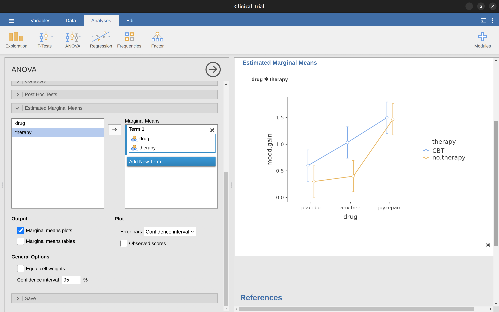
```

### 交互作用的意義？

這一小節要介紹的關鍵概念，便是「交互作用效應」(interaction effect)。至此所討論過的 ANOVA 模型，只有兩個因子 (即「藥物」與「治療」)。然而，一旦加入交互作用，模型便會多出一個成分：「藥物」與「治療」的組合。

直觀來說，交互作用效應的概念相當單純。字面意思是：因子 A 的效果，會隨著因子 B 的不同水平 (或處置) 而有所差異。然而，由範例資料來看，實際上代表什麼意思呢？ @fig-fig13-5 描繪數種不同的交互作用模式，這些模式雖然彼此差異甚大，卻都是交互作用效應。因此，要將這個模式多變的概念，轉換為統計學家可以運用的數學形式，並非一件全然直接了當的事。

<!--- 本節我們要介紹的關鍵概念是交互作用效應。在我們迄今為止討論的ANOVA模型中，我們的模型中只有兩個因素（即藥物和治療）。但是，當我們添加交互作用時，我們在模型中添加了一個新的組件：藥物和治療的組合。直觀地說，交互作用效應的概念相當簡單。這只是意味著因子A的效應會因為我們談論的因子B的不同水平而有所不同。但是，在我們的數據方面，這實際上意味著什麼呢？ @fig-fig13-5中的圖表描述了幾種不同的模式，儘管它們彼此相當不同，但它們都被視為交互作用效應。因此，將這個質的概念轉化為統計學家可以使用的數學概念並不完全簡單。--->

[附加技術細節[^factorial-anova-4]]

[^factorial-anova-4]: 

要透過虛無假說與對立假說，將交互作用效應的概念公式化，確實有些困難，本書多數讀者對此可能也不會太感興趣。儘管如此，作者在此盡力為有興趣的讀者介紹其中的基本概念。<br />首先，我們需要更明確地定義主要效果。以因子 A (本章範例資料的「藥物」) 的主要效果為例。我們最初是將其虛無假說定義為所有邊際平均數 ($\mu_{r.}$) 皆相等。顯然，若所有邊際平均數都相等，那它們必然也會等於總平均數 ($\mu_{..}$)。因此，我們可以將因子 A 在水平 r 的**效果 (effect)** 定義為邊際平均數 $\mu_{r.}$ 與總平均數 $\mu_{..}$ 之間的差值。我們將此效果記為 $\alpha_r$，也就是：$$\alpha_r=\mu_{r.}-\mu_{..}$$根據定義，所有 $\\alpha\_r$ 值的總和必然為零 (原因與「各列邊際平均數的平均值，必然等於總平均數」相同)。同理，我們也能定義因子 B 在水平 c 的效果，即行邊際平均數 $\mu_{.c}$ 與總平均數 $\mu_{..}$ 的差值：$$\beta_c=\mu_{.c}-\mu_{..}$$同樣地，所有 $\beta_c$ 值的總和也必然為零。<br />統計學家有時偏好使用 $\alpha_r$ 與 $\beta_c$ 這些參數來討論主要效果，是因為這能讓他們精確地定義「不存在交互作用」的意涵。如果完全沒有交互作用，那麼單靠 $\alpha_r$ 與 $\beta_c$ 這兩個主要效果參數，便足以完美地描述每一個細格平均數 ($\mu_{rc}$)。具體來說，這代表：$$\mu_{rc}=\mu_{..}+\alpha_{r}+\beta_{c}$$換言之，只要知道所有的邊際平均數，就能完美預測出每一個細格平均數，不存在任何「特殊加成」。這，就是我們的虛無假說。而對立假說則是：在表格中，至少有一個細格 ($rc$) 的情況並非如此：$$\mu_{rc} \neq \mu_{..}+\alpha_{r}+\beta_{c}$$然而，統計學家們通常會偏好另一種稍微不同的寫法。他們會定義一個與細格 $rc$ 相關的特定交互作用數值，並給它一個有點彆扭的稱呼：$(\alpha\beta)_{rc}$。然後，他們會將對立假說寫成：$$\mu_{rc}=\mu_{..} +\alpha_{r} +\beta_{c} + (\alpha \beta )_{rc}$$其中，至少有一個細格的 $(\alpha\beta)_{rc}$ 不為零。這套標示法看起來有些不甚雅觀，但在後續討論平方和的計算時，讀者會發現這樣標示非常方便。<br />那麼，交互作用項的平方和 ($SS\_{A:B}$) 該如何計算呢？首先，有助於我們回想先前是如何定義交互作用的：亦即「實際的細格平均數」與「僅從邊際平均數推斷的預期值」之間的差異程度。當然，先前所有的公式都涉及**母群**參數而非樣本統計量，所以我們無從得知其真實數值。然而，我們可以透過樣本平均數來取代母群平均數，藉此估計這些參數。<br />因此，對於因子 A，其在水平 r 的主要效果，一個好的**效果估計值**( $\hat{\alpha}_r$) 便是在樣本中所觀察到的邊際平均數 $\bar{Y}_{r.}$ 與總平均數 $\bar{Y}_{..}$ 的差值：$$\hat{\alpha}_r = \bar{Y}_{r.}-\bar{Y}_{..}$$同理，因子 B 在水平 c 的主要效果的估計值 ($\hat{\beta}_c$) 則為： $$\hat{\beta}_{c}=\bar{Y}_{.c}-\bar{Y}_{..}$$ 若讀者回顧前文用來描述兩個主要效果的 SS 公式，便會注意到，這些「效果估計值」($\hat{\alpha}_r$ 與 $\hat{\beta}_c$) 正是我們進行平方與加總的對象！那麼，這個邏輯該如何類比到交互作用項上呢？答案可以透過重新排列對立假說的公式來得到： $$\begin{aligned} (\alpha \beta)_{rc} & = \mu_{rc} - \mu_{..} - \alpha_r - \beta_c \\ & = \mu_{rc} - \mu_{..} - (\mu_{r.}-\mu_{..})-(\mu_{.c}-\mu_{..}) \\ & = \mu_{rc} - \mu_{r.} - \mu_{.c} +\mu_{..} \end{aligned}$$ 如此一來，只要再次以樣本統計量取代母群平均數，我們便能得到細格 $rc$ 的交互作用效果估計值，亦即：$$(\hat{\alpha \beta})_{rc}=\bar{Y}_{rc}-\bar{Y}_{r.}-\bar{Y}_{.c}+\bar{Y}_{..}$$ 現在，我們只需將所有細格的交互作用效果估計值，對因子 A 的所有 $R$ 個水平、以及因子 B 的所有 $C$ 個水平進行加總，便能得到整個交互作用的平方和公式：<br />$$SS_{A:B}=N \sum_{r=1}^R \sum_{c=1}^C (\bar{Y}_{rc}-\bar{Y}_{r.}-\bar{Y}_{.c}+\bar{Y}_{..})^2$$ 此處之所以要乘以 $N$，是因為每個細格中都有 $N$ 個觀測值，而我們希望 SS 值所反映的，是由交互作用所解釋的「觀測值之間」的變異，而非「細格之間」的變異。<br />有了計算 $SS_{A:B}$ 的公式後，務必認知到交互作用項也是模型的一部分。因此，與模型相關的平方和 ($SS_M$)，現在會等於三個相關平方和的總和：$SS_A + SS_B + SS_{A:B}$。<br />殘差平方和 ($SS_R$) 的定義依然是剩餘的變異量，即 $SS_T - SS_M$；但由於現在模型中包含了交互作用項，其公式變為：$$SS_R=SS_T-(SS_A+SS_B+SS_{A:B})$$這麼做的結果是，此處的殘差平方和 ($SS_R$)，將會小於我們原先那個不包含交互作用項的 ANOVA 模型中的殘差平方和。


<!--- 因此，將交互作用效應的概念用零假設和替代假設的條款來正式表示的方式有點困難，我猜想這本書的很多讀者可能對此並不感興趣。儘管如此，我將在此嘗試介紹基本概念。首先，我們需要更明確地說明我們的主要效果。考慮因子$A$（我們的運行示例中的藥物）的主要效果。我們最初根據兩個邊際均值$\mu_r$相等的零假設來表述這一點。顯然，如果所有這些值彼此相等，那麼它們也必須等於總均值$\mu_{..}$，對吧？所以我們可以做的是將因子$A$在水平$r$的效應定義為邊際均值$\mu_{r.}$和總均值$\mu_{..}$之間的差。讓我們用$\alpha_r$表示這個效果，並注意到 $$\alpha_r=\mu_{r.}-\mu_{..}$$ 現在，根據定義，所有的$\alpha_r$值必須相加為零，原因是邊際均值$\mu_c$的平均值必須等於總平均值$\mu_{..}$。我們可以類似地將因子B在$c$水平的效應定義為列邊際均值$\mu_{.c}$和總均值$\mu_{..}$之間的差： $$\beta_c=\mu_{.c}-\mu_{..}$$同樣地，這些$\beta_c$值必須相加為零。統計學家有時喜歡用這些$\alpha_r$和$\beta_c$值來談論主要效果，因為這樣他們可以明確地說明無交互作用效應意味著什麼。如果完全沒有交互作用，那麼這些$\alpha_r$和$\beta_c$值將完美地描述組均值$\mu_{rc}$。具體來說，這意味著$$\mu_{rc}=\mu_{..}+\alpha_{r}+\beta_{c}$$也就是說，僅僅通過了解所有邊際均值，您就能完全預測到組均值。這就是我們的零假設。替代假設是$$\mu_{rc} \neq \mu_{..}+\alpha_{r}+\beta_{c}$$至少對於表格中的一個組$rc$而言。然而，統計學家通常喜歡稍微不同地寫這個。他們通常會定義與組$rc$相關的特定交互作用為一個數字，笨拙地稱為$(\alpha \beta)_{rc}$，然後他們將說替代假設是$$\mu_{rc}=\mu_{..} +\alpha_{r} +\beta_{c} + (\alpha \beta )_{rc}$$其中$(\alpha \beta)_{rc}$對於至少一個組是非零。這種表示法看起來有點難看，但在討論如何計算平方和時它非常方便。我們應該如何計算交互項的平方和，$SS_{A:B}$？首先，有助於注意我們如何剛剛根據實際組均值與僅查看邊際均值所預期的程度的差異來定義交互作用效應。當然，所有這些公式都是指群體參數而非樣本統計數據，因此我們實際上不知道它們是什麼。但是，我們可以通過將樣本均值代替群體均值來估計它們。因此，對於因子$A$，在$r$水平的主要效果的一個好的估計方法是樣本邊際均值$\bar{Y}_{rc}$與樣本總均值$\bar{Y}_{..}$之間的差。也就是說，我們將使用這個作為效果的估計$$\hat{\alpha}_r = \bar{Y}_{r.}-\bar{Y}_{..}$$同樣地，我們可以將因子$B$在$c$水平的主要效果的估計定義為以下$$\hat{\beta}_{c}=\bar{Y}_{.c}-\bar{Y}_{..}$$現在，如果您回顧一下我用來描述兩個主要效果的$SS$值的公式，您會注意到這些效果值正是我們正方形和求和的量！那麼，對於交互項來說，這個類比是什麼呢？通過首先重新排列替代假設下組均值$\mu_{rc}$的公式，我們可以找到這個答案，以便我們得到這個$$\begin{aligned} (\alpha \beta)_{rc} & = \mu_{rc} - \mu_{..} - \alpha_r - \beta_c \\ & = \mu_{rc} - \mu_{..} - (\mu_{r.}-\mu_{..})-(\mu_{.c}-\mu_{..}) \\ & = \mu_{rc} - \mu_{r.} - \mu_{.c} +\mu_{..} \end{aligned}$$因此，再次將樣本統計數據代替群體均值，我們將得到以下作為組$rc$的交互作用效應的估計，即$$(\hat{\alpha \beta})_{rc}=\bar{Y}_{rc}-\bar{Y}_{r.}-\bar{Y}_{.c}+\bar{Y}_{..}$$現在我們所要做的就是將所有這些估計加起來，涵蓋因子$A$的所有$R$水平和因子$B$的所有$C$水平，然後我們得到以下公式，與整個交互作用相關的平方和$$SS_{A:B}=N \sum_{r=1}^R \sum_{c=1}^C (\bar{Y}_{rc}-\bar{Y}_{r.}-\bar{Y}_{.c}+\bar{Y}_{..})^2$$這裡，我們將其乘以N，因為每個組中都有N個觀察值，我們希望我們的$SS$值反映交互作用解釋的觀察值變異，而不是組之間的變異。現在我們有了計算$SS_{A:B}$的公式，重要的是要認識到交互項是模型的一部分（當然），所以與模型相關的總平方和，SSM，現在等於三個相關的SS值之和，$SS_A + SS_B + SS_{A:B}$。剩餘平方和SSR仍然被定義為剩餘變異，即$SS_T - SS_M$，但現在我們有了交互項，這變成了$$SS_R=SS_T-(SS_A+SS_B+SS_{A:B})$$ 因此，剩餘平方和$SS_R$將小於我們原先沒有交互作用的ANOVA。

The key idea that we're going to introduce in this section is that of an interaction effect. In the ANOVA model we have looked at so far there are only two factors involved in our model (i.e., drug and therapy). But when we add an interaction we add a new component to the model: the combination of drug and therapy. Intuitively, the idea behind an interaction effect is fairly simple. It just means that the effect of Factor A is different, depending on which level of Factor B we're talking about. But what does that actually mean in terms of our data? The plot in @fig-fig13-5 depicts several different patterns that, although quite different to each other, would all count as an interaction effect. So it's not entirely straightforward to translate this qualitative idea into something mathematical that a statistician can work with.

[Additional technical detail [^factorial-anova-4]]

[^factorial-anova-4]: As a consequence, the way that the idea of an interaction effect is formalised in terms of null and alternative hypotheses is slightly difficult, and I'm guessing that a lot of readers of this book probably won't be all that interested. Even so, I'll try to give the basic idea here. To start with, we need to be a little more explicit about our main effects. Consider the main effect of Factor $A$ (drug in our running example). We originally formulated this in terms of the null hypothesis that the two marginal means $\mu_r$. are all equal to each other. Obviously, if all of these are equal to each other, then they must also be equal to the grand mean $\mu_{..}$ as well, right? So what we can do is define the effect of Factor $A$ at level $r$ to be equal to the difference between the marginal mean $\mu_{r.}$ and the grand mean $\mu_{..}$. Let's denote this effect by $\alpha_r$, and note that $$\alpha_r=\mu_{r.}-\mu_{..}$$  Now, by definition all of the $\alpha_r$ values must sum to zero, for the same reason that the average of the marginal means $\mu_c$ must be the grand mean $\mu_{..}$. We can similarly define the effect of Factor B at level i to be the difference between the column marginal mean $\mu_{.c}$ and the grand mean $\mu_{..}$ $$\beta_c=\mu_{.c}-\mu_{..}$$ and once again, these $\beta_c$ values must sum to zero. The reason that statisticians sometimes like to talk about the main effects in terms of these $\alpha_r$ and $\beta_c$ values is that it allows them to be precise about what it means to say that there is no interaction effect. If there is no interaction at all, then these $\alpha_r$ and $\beta_c$ values will perfectly describe the group means $\mu_{rc}$. Specifically, it means that $$\mu_{rc}=\mu_{..}+\alpha_{r}+\beta_{c}$$ That is, there's nothing special about the group means that you couldn't predict perfectly by knowing all the marginal means. And that's our null hypothesis, right there. The alternative hypothesis is that $$\mu_{rc} \neq \mu_{..}+\alpha_{r}+\beta_{c}$$ for at least one group $rc$ in our table. However, statisticians often like to write this slightly differently. They'll usually define the specific interaction associated with group $rc$ to be some number, awkwardly referred to as $(\alpha \beta)_{rc}$, and then they will say that the alternative hypothesis is that $$\mu_{rc}=\mu_{..} +\alpha_{r} +\beta_{c} + (\alpha \beta )_{rc}$$ where $(\alpha \beta)_{rc}$ is non-zero for at least one group. This notation is kind of ugly to look at, but it is handy as we'll see when discussing how to calculate the sum of squares. How should we calculate the sum of squares for the interaction terms, $SS_{A:B}$? Well, first off, it helps to notice how we have just defined the interaction effect in terms of the extent to which the actual group means differ from what you'd expect by just looking at the marginal means. Of course, all of those formulas refer to population parameters rather than sample statistics, so we don't actually know what they are. However, we can estimate them by using sample means in place of population means. So for Factor $A$, a good way to estimate the main effect at level r is as the difference between the sample marginal mean $\bar{Y}_{rc}$ and the sample grand mean $\bar{Y}_{..}$. That is, we would use this as our estimate of the effect $$\hat{\alpha}_r = bar{Y}_{r.}-\bar{Y}_{..}$$ Similarly, our estimate of the main effect of Factor B at level c can be defined as follows $$\hat{\beta}_{c}=\hat{Y}_{.c}-\bar{Y}_{..}$$ Now, if you go back to the formulas that I used to describe the $SS$ values for the two main effects, you'll notice that these effect terms are exactly the quantities that we were squaring and summing! So, what's the analog of this for interaction terms? The answer to this can be found by first rearranging the formula for the group means $\mu_{rc}$ under the alternative hypothesis, so that we get this $$\begin{aligned} (\alpha \beta)_{rc} & = \mu_{rc} - \mu_{..} - \alpha_r - \beta_c \\ & = \mu_{rc} - \mu_{..} - (\mu_{r.}-\mu_{..})-(\mu_{.c}-\mu_{..}) \\ & = \mu_{rc} - \mu_{r.} - \mu_{.c} +\mu_{..} \end{aligned}$$ So, once again if we substitute our sample statistics in place of the population means, we get the following as our estimate of the interaction effect for group $rc$, which is $$(\hat{\alpha \beta})_{rc}=\bar{Y}_{rc}-\hat{Y}_{r.}-\bar{Y}_{.c}+\bar{Y}_{..}$$ Now all we have to do is sum all of these estimates across all $R$ levels of Factor $A$ and all $C$ levels of Factor $B$, and we obtain the following formula for the sum of squares associated with the interaction as a whole $$SS_{A:B}=N \sum_{r=1}^R \sum_{c=1}^C (\bar{Y}_{rc}-\bar{Y}_{r.}-\bar{Y}_{.c}+\bar{Y}_{..})^2$$ where we multiply by N because there are N observations in each of the groups, and we want our $SS$ values to reflect the variation among observations accounted for by the interaction, not the variation among groups. Now that we have a formula for calculating $SS_{A:B}$, it's important to recognise that the interaction term is part of the model (of course), so the total sum of squares associated with the model, SSM, is now equal to the sum of the three relevant SS values, $SS_A + SS_B + SS_{A:B}$. The residual sum of squares SSR is still defined as the leftover variation, namely $SS_T - SS_M$, but now that we have the interaction term this becomes $$SS_R=SS_T-(SS_A+SS_B+SS_{A:B})$$
As a consequence, the residual sum of squares $SS_R$ will be smaller than in our original ANOVA that didn't include interactions. --->

### 交互作用的自由度

同樣地，計算交互作用的自由度，會比計算主要效果時稍微複雜一些。首先，若考量整個ANOVA模型。要是模型包括交互作用效應，就表示每一個細格都會有其獨特的平均數 ($\mu_{rc}$)。這代表一個 $R \times C$ 的因子設計ANOVA模型，便包含了 $R \times C$ 個所關心的參數，卻只受到一個限制條件約束：所有的細格平均數的平均值，必須等於總平均數。因此，整個模型的自由度為 $(R \times C) - 1$。然而，因子 A 的主要效果佔了 $R - 1$ 個自由度，因子 B 的主要效果則佔了 $C - 1$ 個自由度。這代表交互作用的自由度為：

$$
\begin{aligned}
df_{A:B} & = (R \times C - 1) - (R - 1) - (C - 1) \\
& = RC - R - C + 1 \\
& = (R-1)(C-1)
\end{aligned}
$$

這個結果，正好就是行因子與列因子各自自由度的乘積。

那麼殘差自由度呢？由於模型中新增了會佔用自由度的交互作用項，剩餘的自由度便會減少。具體來說，當模型允許每個細格都有獨特的平均數時，總共有 $R \times C$ 個組別。若觀測值總數為 $N_{total}$，那麼殘差自由度便是觀測值總數減去組別總數，即 $N_{total} - (R \times C)$。


<!--- 將交互作用納入計算後，計算自由度變得稍微複雜一些。首先，讓我們考慮整個ANOVA模型。一旦我們在模型中包括交互效應，我們允許每個單獨組具有唯一的平均值，$mu_{rc}$。對於一個$R \times C$的因子ANOVA，這意味著模型中有$R \times C$個感興趣的數量，並且只有一個約束：所有組均值需要平均為總體均值。因此，整個模型需要有($R \times C$) - 1個自由度。但是因子A的主效應具有$R-1$個自由度，因子B的主效應具有$C-1$個自由度。這意味著與交互作用相關的自由度為

$$
\begin{aligned}
df_{A:B} & = (R \times C - 1) - (R - 1) - (C - 1) \\
& = RC - R - C + 1 \\
& = (R-1)(C-1)
\end{aligned}
$$

這只是與行因子和列因子相關的自由度之積。

那剩餘自由度呢？由於我們添加了吸收一些自由度的交互項，剩餘的自由度變得更少。具體來說，請注意，如果具有交互作用的模型總共有$(R \times C) - 1$，並且在數據集中有$N$個受1個總體均值約束的觀察值，那麼您的剩餘自由度現在變為$N-(R \times C)-1+1$，或者只是$N-(R \times C)$。

Calculating the degrees of freedom for the interaction is, once again, slightly trickier than the corresponding calculation for the main effects. To start with, let's think about the ANOVA model as a whole. Once we include interaction effects in the model we're allowing every single group to have a unique mean, $mu_{rc}$. For an $R \times C$ factorial ANOVA, this means that there are $R \times C$ quantities of interest in the model and only the one constraint: all of the group means need to average out to the grand mean. So the model as a whole needs to have ($R \times C$) - 1 degrees of freedom. But the main effect of Factor A has $R - 1$ degrees of freedom, and the main effect of Factor B has $C - 1$ degrees of freedom. This means that the degrees of freedom associated with the interaction is

$$
\begin{aligned}
df_{A:B} & = (R \times C - 1) - (R - 1) - (C - 1) \\
& = RC - R - C + 1 \\
& = (R-1)(C-1)
\end{aligned}
$$

which is just the product of the degrees of freedom associated with the row factor and the column factor.

What about the residual degrees of freedom? Because we've added interaction terms which absorb some degrees of freedom, there are fewer residual degrees of freedom left over. Specifically, note that if the model with interaction has a total of $(R \times C) - 1$, and there are $N$ observations in your data set that are constrained to satisfy 1 grand mean, your residual degrees of freedom now become $N - (R \times C) - 1 + 1$, or just $N - (R \times C)$. --->

### 使用jamovi完成多因子變異數分析

在 jamovi 中，將交互作用項加入 ANOVA 模型是相當直接了當的。其實這這種設定不僅簡單，更是 ANOVA 分析的預設選項。也就是使用者設定要分析兩因子 ANOVA 時(例如「藥物」與「治療」)，交互作用項 (藥物$\times$治療) 就會自動加入模型中[^factorial-anova-5]。只要模型包括交互作用項並執行完成，就會得到如 @fig-fig13-7 所示的結果。


[^factorial-anova-5]:  前一節我們討論如何查看jamovi報表的主要效果分析時，讀者可能已經發現這一點。為讓本書的解釋脈絡順暢，前一節呈現的模型特意刪除交互作用項，以保持內容清晰簡單。

<!---Adding interaction terms to the ANOVA model in jamovi is straightforward. In fact it is more than straightforward because it is the default option for ANOVA. This means that when you specify an ANOVA with two factors, e.g. drug and therapy then the interaction component - drug $\times$ therapy - is added automatically to the model[^factorial-anova-5]. When we run the ANOVA with the interaction term included, then we get the results shown in @fig-fig13-7.

[^factorial-anova-5]: You may have spotted this already when looking at the main effects analysis in jamovi that we described earlier. For the purpose of the explanation in this book I removed the interaction component from the earlier model to keep things clean and simple--->

```{r}
#| label: fig-fig13-7
#| classes: .enlarge-image
#| fig-cap: 包括藥物$\times$治療方法交互作用項的完整ANOVA結果報表
#Results for the full factorial model, including the interaction component drug $\times$ therapy
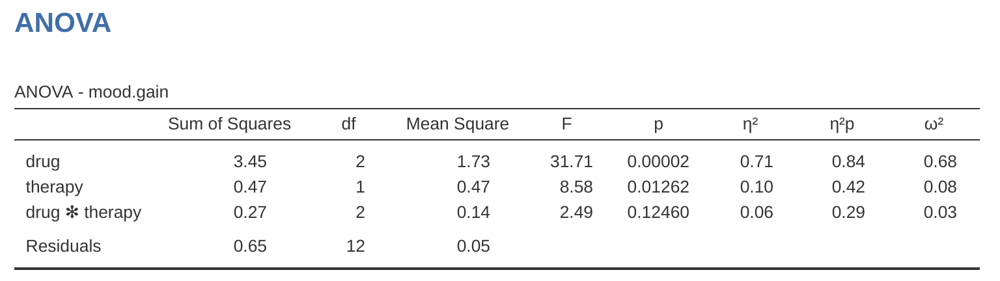
```


結果顯示，「藥物」種類($F(2,12) = 31.7, p < .001$) 與「治療」方法 ($F(1,12) = 8.6, p = .013$) 確實都具有顯著的主要效果，但兩者之間並無顯著的交互作用 ($F(2,12) = 2.5, p = 0.125$)。


<!---結果顯示，儘管我們確實對藥物有顯著的主效應（$F_{2,12} = 31.7, p < .001$）和療法類型（$F_{1,12} = 8.6, p = .013$），但兩者之間沒有顯著的交互作用（$F_{2,12} = 2.5, p = 0.125$）。

As it turns out, while we do have a significant main effect of drug ($F_{2,12} = 31.7, p < .001$) and therapy type ($F_{1,12} = 8.6, p = .013$), there is no significant interaction between the two ($F_{2,12} = 2.5, p = 0.125$). --->

### 解讀分析結果

在解讀**因子設計ANOVA** 的結果時，有幾項重點需要考量。首先，它與**單因子變異數分析**有相同的問題：比如說，即使分析結果顯示「藥物」因子具有顯著的主要效果，我們也無法知道是**哪幾種**藥物之間彼此存在差異。要找出答案，便需要進行額外的分析。關於這些額外的分析方法，我們將在後續的[各種多重比較方案]與[事後檢定] (Post hoc tests)等小節中討論。這個原則同樣適用於交互作用效果：得知交互作用效果顯著，我們仍無法知道究竟是什麼樣的交互作用造成差異。同樣地，這也需要進行額外的分析。

其次，當分析結果出現顯著的交互作用，但是主要效果不顯著時，會衍生出一個相當特殊的詮釋議題。分析實務時常會發生這種情況，例如 @fig-fig13-5 的圖(a)展示的**交叉型交互作用**，便是一個典型範例。這個範例的兩個主要效果皆不顯著，但是交互作用效果卻是顯著的。

這種情況不容易解釋，也常讓研究者感到困惑。統計學家給的通用建議是：交互作用顯著時，就不必過度關心主要效果。之所以如此建議，是因為儘管從數學上來說，主要效果的檢定依然完全有效，但在交互作用顯著的前提下，主要效果所檢定的，通常已經不再是個有意義的假說。

回顧 @sec-What-hypotheses-are-we-testing ，可知主要效果的虛無假說，是檢定各邊際平均數是否相等。然而，邊際平均數便是數個不同細格平均數的平均值。交互作用顯著的意義，便是這些構成邊際平均數的細格平均數，本質上是**異質的 (non-homogeneous)**。此，再去探討這些異質組別平均值 (即邊際平均數) 之間的差異，其意義何在，就變得不那麼顯而易見了。

以下透過一項虛構的臨床研究來說明。假設我們規劃 2×2 的實驗設計，來比較兩種不同的恐懼症治療方法 (例如系統減敏法 vs. 洪水療法)，以及兩種不同的抗焦慮藥物的效果 (例如 Anxifree vs. Joyzepam)。假如研究發現：使用系統減敏法時，Anxifree 沒有效果；使用洪水療法時，Joyzepam 沒有效果。也就是說，一種藥物只在搭配特定療法時，才會出現效果。

這便是一個典型的交叉型交互作用；用 ANOVA 分析資料便會發現沒有藥物的主要效果，但是交互作用卻是顯著的。那麼，所謂「沒有主要效果」究竟是什麼意思？這意味著，若我們將兩種不同治療方法的效果加以平均，會發現 Anxifree 與 Joyzepam 的平均效果是相同的。

然而，有誰會在意這個平均值呢？沒有任何接受恐懼症治療的病患，所接受的洪水療法與系統減敏法是「平均後」的，這樣解讀不合理。病患接受的只會是其中一種療法。對於某一種療法，某一種藥物是有效的；對於另一種療法，另一種藥物才有效。在這種情況下，交互作用才是重點，主要效果則顯得無關緊要了。

這種情況相當常見。主要效果檢定的對象是邊際平均數，然而當交互作用存在時，研究者往往對邊際平均數比較沒興趣，因為交互作用的存在，恰恰就說明了那些用來計算邊際平均數的細格，其實不應該被混合在一起平均！

當然，這並非意謂著只要交互作用存在，主要效果就必然毫無意義。統計實務常會遇到一種情況：一個顯著的主要效果，伴隨著一個相對微弱但依然顯著的交互作用。因為藥物的主要效果很強，在此情況下，研究者依然可以做出「整體來說，藥物 A 比藥物 B更有效」的結論，不過必須加上一個但書：「這種效果的差異，會因心理治療方式的不同而有所變化」。

總而言之，本節的重點是：每當分析結果出現顯著的交互作用時，都應該停下來，審慎思考主要效果在此脈絡下的真實意義。切勿理所當然地認為主要效果依然是我們所關心的重點。

<!--- 在解釋因子ANOVA結果時，有幾個非常重要的事情需要考慮。首先，我們在單因子ANOVA中遇到的相同問題，即如果您獲得（例如）藥物的顯著主效應，它並不能告訴您哪些藥物彼此有差異。要找出這個答案，您需要進行額外的分析。稍後我們將討論可以在[指定對比方式的不同方法]和[事後檢驗]中運行的一些分析。對於交互作用效果也是如此。知道有顯著的交互作用並不能告訴您存在哪種類型的交互作用。同樣，您需要進行額外的分析。

其次，在獲得顯著的交互作用效果但沒有相應主效應的情況下，會出現非常奇特的解釋問題。有時候會發生這種情況。例如，在@fig-fig13-5 a中顯示的交叉互動中，這正是您會發現的情況。在這種情況下，主效應都不顯著，但交互作用效果顯著。這是一個難以解釋的情況，人們通常對此感到困惑。統計學家在這種情況下喜歡給出的一般建議是，當存在交互作用時，您不應該過多地關注主效應。他們這樣說的原因是，雖然從數學的角度看，主效應的檢驗完全有效，但是當存在顯著的交互作用效果時，主效應很少檢驗有趣的假設。回想一下@sec-What-hypotheses-are-we-testing，主效應的虛無假設是邊際均值彼此相等，邊際均值是由幾個不同組的平均值形成的。但是，如果您有一個顯著的交互作用效果，那麼您就知道組成邊際均值的組並不是同質的，所以真的不明顯為什麼您會關心那些邊際均值。

以下是我的意思。再次以臨床實例為例。假設我們有一個$2 \times 2$設計，比較了兩種不同的恐懼症治療方法（例如，系統性緩解法和淹沒療法），以及兩種不同的減輕焦慮藥物（例如，Anxifree和Joyzepam）。現在，假設我們發現當緩解法是治療方法時，Anxifree無效；當淹沒療法是治療方法時，Joyzepam無效。但對於另一種治療方法，兩者都相當有效。這是一個典型的交叉互動，當我們運行ANOVA時，我們會發現沒有藥物的主要效果，但有顯著的互動。那麼，說沒有主效應究竟意味著什麼呢？那意味著，如果我們平均兩種不同的心理治療方法，那麼Anxifree和Joyzepam的平均效果是相同的。但是，有誰會在意這個呢？在治療恐懼症時，從來沒有一個人可以使用“平均”的淹沒療法和緩解法進行治療。這並不合理。您要么得到一個，要么得到另一個。對於一種治療方法，一種藥物是有效的，對於另一種治療方法，另一種藥物是有效的。交互作用是重要的，而主效應在某種程度上是無關緊要的。

這樣的事情經常發生。主效應是邊際均值的檢驗，當交互作用存在時，我們經常會發現自己對邊際均值不感興趣，因為它們意味著在交互作用告訴我們不應該取平均值的事物上取平均值！當然，並非總是在存在交互作用的情況下，主效應就毫無意義。經常出現的情況是，主效應很大，交互作用很小，這種情況下，您仍然可以說類似於“藥物A通常比藥物B更有效”（因為藥物效果很大），但您需要對其進行一些修改，添加“對於不同的心理治療，有效性差異有所不同。”無論如何，這裡的主要觀點是，每當您獲得顯著的交互作用時，您應該停下來思考主效應在這個語境中的真正意義。不要自動假設主效應是有趣的。

There's a couple of very important things to consider when interpreting the results of factorial ANOVA. First, there's the same issue that we had with one-way ANOVA, which is that if you obtain a significant main effect of (say) drug, it doesn't tell you anything about which drugs are different to one another. To find that out, you need to run additional analyses. We'll talk about some analyses that you can run in later Sections: [Different ways to specify contrasts] and [Post hoc tests]. The same is true for interaction effects. Knowing that there's a significant interaction doesn't tell you anything about what kind of interaction exists. Again, you'll need to run additional analyses.

Secondly, there's a very peculiar interpretation issue that arises when you obtain a significant interaction effect but no corresponding main effect. This happens sometimes. For instance, in the crossover interaction shown in @fig-fig13-5 a, this is exactly what you'd find. In this case, neither of the main effects would be significant, but the interaction effect would be. This is a difficult situation to interpret, and people often get a bit confused about it. The general advice that statisticians like to give in this situation is that you shouldn't pay much attention to the main effects when an interaction is present. The reason they say this is that, although the tests of the main effects are perfectly valid from a mathematical point of view, when there is a significant interaction effect the main effects rarely test interesting hypotheses. Recall from @sec-What-hypotheses-are-we-testing that the null hypothesis for a main effect is that the marginal means are equal to each other, and that a marginal mean is formed by averaging across several different groups. But if you have a significant interaction effect then you know that the groups that comprise the marginal mean aren't homogeneous, so it's not really obvious why you would even care about those marginal means.

Here's what I mean. Again, let's stick with a clinical example. Suppose that we had a $2 \times 2$ design comparing two different treatments for phobias (e.g., systematic desensitisation vs flooding), and two different anxiety reducing drugs (e.g., Anxifree vs Joyzepam). Now, suppose what we found was that Anxifree had no effect when desensitisation was the treatment, and Joyzepam had no effect when flooding was the treatment. But both were pretty effective for the other treatment. This is a classic crossover interaction, and what we'd find when running the ANOVA is that there is no main effect of drug, but a significant interaction. Now, what does it actually mean to say that there's no main effect? Well, it means that if we average over the two different psychological treatments, then the average effect of Anxifree and Joyzepam is the same. But why would anyone care about that? When treating someone for phobias it is never the case that a person can be treated using an "average" of flooding and desensitisation. That doesn't make a lot of sense. You either get one or the other. For one treatment one drug is effective, and for the other treatment the other drug is effective. The interaction is the important thing and the main effect is kind of irrelevant.

This sort of thing happens a lot. The main effect are tests of marginal means, and when an interaction is present we often find ourselves not being terribly interested in marginal means because they imply averaging over things that the interaction tells us shouldn't be averaged! Of course, it's not always the case that a main effect is meaningless when an interaction is present. Often you can get a big main effect and a very small interaction, in which case you can still say things like "drug A is generally more effective than drug B" (because there was a big effect of drug), but you'd need to modify it a bit by adding that "the difference in effectiveness was different for different psychological treatments". In any case, the main point here is that whenever you get a significant interaction you should stop and think about what the main effect actually means in this context. Don't automatically assume that the main effect is interesting. --->

## 變異數分析的效果量

**因子設計ANOVA** 的效果量計算，與**單因子變異數分析**所用的方法相當類似 (見 [效果量] 一節)。具體來說，我們同樣可以使用**$\eta^2$ (eta-squared)**，來簡易地衡量模型中任一個特定項 (term)** 的整體效果有多大。如同先前所定義，$\eta^2$ 的計算方式，是將該項的平方和除以總平方和。舉例來說，要計算因子 A 主要效果的公式是：

$$\eta_A^2=\frac{SS_A}{SS_T}$$

如同先前所述，這個數值的詮釋方式與迴歸分析中的 $R^2$ 非常類似。[^factorial-anova-6] 它代表的是結果變項的總變異量中，可由因子 A 的主要效果所解釋的百分比。因此，$\eta^2$ 的值域介於 0 (完全沒效果) 到 1 (解釋結果變項的全部變異) 之間。此外，模型中所有項的 $\eta^2$ 值總和，會等於該 ANOVA 模型的總 $R^2$ 值。舉例來說，若 ANOVA 模型能完美配適資料 (亦即完全沒有組內變異)，則各項 $\eta^2$ 值的總和將會是 1。當然，這種情況在統計實務極為罕見。

然而，在進行因子設計ANOVA 時，還有第二種研究者們偏好報告的效果量指標，稱為**partial $\eta^2$**。partial $\eta^2$ (有時也記為 $p^{\eta^2}$ 或 $\eta_p^2$) 的運算概念是：在衡量模型中某一特定項 (例如因子 A 的主要效果) 的效果量時，要刻意忽略模型中其他項的效果 (例如因子 B 的主要效果)。也就是說，要假定所有特定項的效果量皆為零，再來計算此時的 $\eta^2$ 值會是多少。

partial $\eta^2$的計算相當簡單，只要從分母中，移除其他項所對應的平方和即可。換言之，若想計算因子 A 主要效果的partial $\eta^2$，其分母就只會是因子 A 的平方和與殘差平方和的總和。

$$\text{partial }\eta_A^2= \frac{SS_A}{SS_A+SS_R}$$

這個值永遠會比 $\eta^2$ 來得大，我內心的犬儒主義者懷疑這正是partial $\eta^2$ 之所以受歡迎的原因。同樣地，這個數值的範圍也介於 0 (沒有效果) 到 1 之間。

然而，要詮釋一個較大的partial $\eta^2$ 值代表何種意義，就有些棘手了。特別需要注意的是，不同特定項之間的partial $\eta^2$ 值是**不能**直接相互比較的！舉例來說，假設完全沒有組內變異量，亦即 $SS_R = 0$。這代表模型中每一個項的partial $\eta^2$ 值都會是 1。但這不代表模型中所有特定項都同等重要，或其效果大小完全相同。它只代表模型中每一個特定項的效果量，相對於殘差變異量都很大，但無法用來比較不同項之間何者更重要。

透過一個具體範例，可以更容易理解箇中差異。首先，我們來檢視 @fig-fig13-3 ，一開始示範的不含交互作用項 ANOVA 模型，各項效果量數值列在 @tbl-tab13-6 。


[^factorial-anova-6]: 這個單元似乎創下了字母 R 指涉對象數量的新紀錄。到目前為止，R 已經代表過：R 語言套件、平均數表格的列數 (rows)、模型中的殘差 (residuals)，以及現在迴歸分析中的相關係數 (correlation coefficient)。向各位說聲抱歉，英文字母顯然不夠用。不過，本書已經盡力在內文中清楚標示每個 R 的不同指涉對象。


<!--- The effect size calculation for a factorial ANOVA is pretty similar to those used in one way ANOVA (see [Effect size] section). Specifically, we can use $\eta^2$ (eta-squared) as a simple way to measure how big the overall effect is for any particular term. As before, $\eta^2$ is defined by dividing the sum of squares associated with that term by the total sum of squares. For instance, to determine the size of the main effect of Factor A, we would use the following formula:

$$\eta_A^2=\frac{SS_A}{SS_T}$$

As before, this can be interpreted in much the same way as $R^2$ in regression.[^factorial-anova-6] It tells you the proportion of variance in the outcome variable that can be accounted for by the main effect of Factor A. It is therefore a number that ranges from 0 (no effect at all) to 1 (accounts for all of the variability in the outcome). Moreover, the sum of all the $\eta^2$ values, taken across all the terms in the model, will sum to the the total $R^2$ for the ANOVA model. If, for instance, the ANOVA model fits perfectly (i.e., there is no within-groups variability at all!), the $\eta^2$ values will sum to 1. Of course, that rarely if ever happens in real life.

[^factorial-anova-6]: This chapter seems to be setting a new record for the number of different things that the letter R can stand for. So far we have R referring to the software package, the number of rows in our table of means, the residuals in the model, and now the correlation coefficient in a regression. Sorry. We clearly don't have enough letters in the alphabet. However, I've tried pretty hard to be clear on which thing R is referring to in each case

However, when doing a factorial ANOVA, there is a second measure of effect size that people like to report, known as partial $\eta^2$. The idea behind partial $\eta^2$ (which is sometimes denoted $p^{\eta^2}$ or $\eta_p^2$) is that, when measuring the effect size for a particular term (say, the main effect of Factor A), you want to deliberately ignore the other effects in the model (e.g., the main effect of Factor B). That is, you would pretend that the effect of all these other terms is zero, and then calculate what the $\eta^2$ value would have been. This is actually pretty easy to calculate. All you have to do is remove the sum of squares associated with the other terms from the denominator. In other words, if you want the partial $\eta^2$ for the main effect of Factor A, the denominator is just the sum of the SS values for Factor A and the residuals

$$\text{partial }\eta_A^2= \frac{SS_A}{SS_A+SS_R}$$

This will always give you a larger number than $\eta^2$, which the cynic in me suspects accounts for the popularity of partial $\eta^2$. And once again you get a number between 0 and 1, where 0 represents no effect. However, it's slightly trickier to interpret what a large partial $\eta^2$ value means. In particular, you can't actually compare the partial $\eta^2$ values across terms! Suppose, for instance, there is no within-groups variability at all: if so, $SS_R = 0$. What that means is that every term has a partial $\eta^2$ value of 1. But that doesn't mean that all terms in your model are equally important, or indeed that they are equally large. All it mean is that all terms in your model have effect sizes that are large relative to the residual variation. It is not comparable across terms.

To see what I mean by this, it's useful to see a concrete example. First, let's have a look at the effect sizes for the original ANOVA (@tbl-tab13-6) without the interaction term, from @fig-fig13-3. --->

```{r}
#| label: tbl-tab13-6
#| tbl-cap: 無交互作用項目的ANOVA模型的效果量
#Effect sizes when the interaction term **is not** included in the ANOVA model
huxtabs[[14]][[6]]
```


首先看各特定項的 $\eta^2$ 值，「藥物」因子能解釋「情緒改善程度 (`mood.gain`)」 71% 的變異量 ($\eta^2 = 0.71$)，而「治療」因子僅解釋了 10%。剩餘 19% 的變異量則無法被解釋 (亦即殘差佔了結果變項總變異量的 19%)。整體而言，這代表「藥物」具有非常大的效果[^factorial-anova-7]，而「治療」的效果則屬中等。

[^factorial-anova-7]：我會認為這個效果量大到有點不切實際。這份資料集的人造痕跡在這裡可說是展露無遺了！

接著來看各特定項的partial $\eta^2$ (請見 @fig-fig13-3 )。由於「治療」的效果並不算特別大，因此在計算時將其效果加以控制，並不會造成太大改變，這使得「藥物」的partial $\eta^2$ 僅微幅上升至 $\eta_p^2 = 0.79$。反之，由於「藥物」的效果非常強，控制此效果便會造成顯著的差異；因此，當我們計算「治療」的partial $\eta^2$ 值時，會發現它大幅上升至 $\eta_p^2 = 0.34$。

這裡必須探討的問題是：這些partial $\eta^2$ 值究竟代表什麼意義？詮釋因子 A 主要效果的partial $\eta^2$ 值，一種常見的方式是，將其視為一個「**假設性實驗**」的結果，在該實驗中，僅有因子 A 是唯一的變項。也就是說，雖然在我們當前的實驗中，因子 A 與 B 都是變項，但我們可以想像另一個只變動因子 A 的實驗；而partial $\eta^2$ 這個統計量所代表的，便是在那個假設性實驗中，我們預期因子 A 能解釋結果變項多少百分比的變異量。然而，必須注意的是，這種詮釋方式 (如同許多與主要效果相關的概念)，在模型存在一個巨大且顯著的交互作用時，將會變得不太有意義。

接著來看交互作用效果，@tbl-tab13-7 呈現有交互作用項的模型 (請見 @fig-fig13-7 )，效果量的計算結果。可以看到，主要效果的 $\eta^2$ 並未改變，但是partial $\eta^2$ 不一樣了：


<!--- Looking at the $\eta^2$ values first, we see that drug accounts for 71% of the variance (i.e. $\eta^2 = 0.71$) in mood.gain, whereas therapy only accounts for 10%. This leaves a total of 19% of the variation unaccounted for (i.e., the residuals constitute 19% of the variation in the outcome). Overall, this implies that we have a very large effect[^factorial-anova-7] of drug and a modest effect of therapy.

[^factorial-anova-7]: Implausibly large, I would think. The artificiality of this data set is really starting to show!

Now let's look at the partial $\eta^2$ values, shown in @fig-fig13-3. Because the effect of therapy isn't all that large, controlling for it doesn't make much of a difference, so the partial $\eta^2$ for drug doesn't increase very much, and we obtain a value of $p^{\eta^2} = 0.79$. In contrast, because the effect of drug was very large, controlling for it makes a big difference, and so when we calculate the partial $\eta^2$ for therapy you can see that it rises to $p^{\eta^2} = 0.34$. The question that we have to ask ourselves is, what do these partial $\eta^2$ values actually mean? The way I generally interpret the partial $\eta^2$ for the main effect of Factor A is to interpret it as a statement about a hypothetical experiment in which only Factor A was being varied. So, even though in this experiment we varied both A and B, we can easily imagine an experiment in which only Factor A was varied, and the partial $\eta^2$ statistic tells you how much of the variance in the outcome variable you would expect to see accounted for in that experiment. However, it should be noted that this interpretation, like many things associated with main effects, doesn't make a lot of sense when there is a large and significant interaction effect.

Speaking of interaction effects, @tbl-tab13-7 shows what we get when we calculate the effect sizes for the model that includes the interaction term, as in @fig-fig13-7. As you can see, the $\eta^2$ values for the main effects don't change, but the partial $\eta^2$ values do: --->

```{r}
#| label: tbl-tab13-7
#| tbl-cap: 有交互作用項目的ANOVA模型的效果量
#Effect sizes when the interaction term **is** included in the ANOVA model
huxtabs[[14]][[7]]
```

### 估計細格平均數

在許多實務情況，研究者會希望根據 ANOVA 的結果，報告所有細格平均數的估計值，以及其對應的**信賴區間 (confidence intervals)**。在 jamovi 中，可使用 ANOVA 分析裡的「估計邊際平均數」選項來達成此目的，如 @fig-fig13-8 的示範。若所執行的 ANOVA 是一個**飽和模型 (saturated model)**，也就是模型包含所有可能的主要效果與交互作用效果項目，那麼細格平均數的估計值，實際上會與樣本平均數完全相同；不過，細格平均數的信賴區間將使用標準誤的**共同估計值 (pooled estimate)**計算，而非各組各自獨立估計。


<!--- In many situations you will find yourself wanting to report estimates of all the group means based on the results of your ANOVA, as well as confidence intervals associated with them. You can use the 'Estimated Marginal Means' option in the jamovi ANOVA analysis to do this, as in @fig-fig13-8. If the ANOVA that you have run is a saturated model (i.e., contains all possible main effects and all possible interaction effects) then the estimates of the group means are actually identical to the sample means, though the confidence intervals will use a pooled estimate of the standard errors rather than use a separate one for each group. --->

```{r}
#| label: fig-fig13-8
#| classes: .enlarge-image
#| fig-cap: jamovi報表區展示飽和模型的各組邊際平均值，列出臨床試驗資料集構成交互作用項目的各細格估計值
#jamovi screenshot showing the marginal means for the saturated model, i.e. including the interaction component, with the clinical trial data set

```

從輸出結果中可以看到，「無治療」條件的「安慰劑」組，估計情緒改善程度平均值為 $0.300$，95% 信賴區間為 $0.006$ 至 $0.594$。需要注意的是，這些信賴區間估計值，與各組獨立計算的信賴區間並不相同。這是因為 ANOVA 模型假定這份資料符合**變異數同質性 (homogeneity of variance)**，因此使用標準差的共同估計值。


當使用非飽和模型 (亦即不含交互作用項的模型) 時，所估計的細格平均數將會與樣本平均數不同。此時，jamovi 不會回報樣本平均數，而是會基於邊際平均數 (亦即假定不存在交互作用) 來計算預期的細格平均數。

套用我們先前建立的符號系統，此時所回報的細格平均數 ($\mu_{rc}$，即因子 A 第 r 個水平與因子 B 第 c 個水平的平均數)，其計算方式會是 $\mu_{..} + \alpha_r + \beta_c$。若兩個因子之間確實不存在交互作用，這個估計值其實會比原始的樣本平均數，能更準確地估計母群平均數。

在 jamovi 的 ANOVA 分析模組，可透過「模型 (Model)」設定選項來移除交互作用項，得到 @fig-fig13-9 的示範分析結果。


<!--- In the output we see that the estimated mean mood gain for the placebo group with no therapy was $0.300$, with a $95\%$ confidence interval from $0.006$ to $0.594$. Note that these are not the same confidence intervals that you would get if you calculated them separately for each group, because of the fact that the ANOVA model assumes homogeneity of variance and therefore uses a pooled estimate of the standard deviation.

When the model doesn't contain the interaction term, then the estimated group means will be different from the sample means. Instead of reporting the sample mean, jamovi will calculate the value of the group means that would be expected on the basis of the marginal means (i.e., assuming no interaction). Using the notation we developed earlier, the estimate reported for µrc, the mean for level r on the (row) Factor A and level c on the (column) Factor B would be $\mu_{..} + \alpha_r + \beta_c$. If there are genuinely no interactions between the two factors, this is actually a better estimate of the population mean than the raw sample mean would be. Removing the interaction term from the model, via the 'Model' options in the jamovi ANOVA analysis, provides the marginal means for the analysis shown in @fig-fig13-9. --->

```{r}
#| label: fig-fig13-9
#| classes: .enlarge-image
#| fig-cap: jamovi報表區展示非飽和模型的各組邊際平均值，列出臨床試驗資料集構成交互作用項目的各細格估計值
#jamovi screenshot showing the marginal means for the unsaturated model, i.e. without the interaction component, with the clinical trial data set
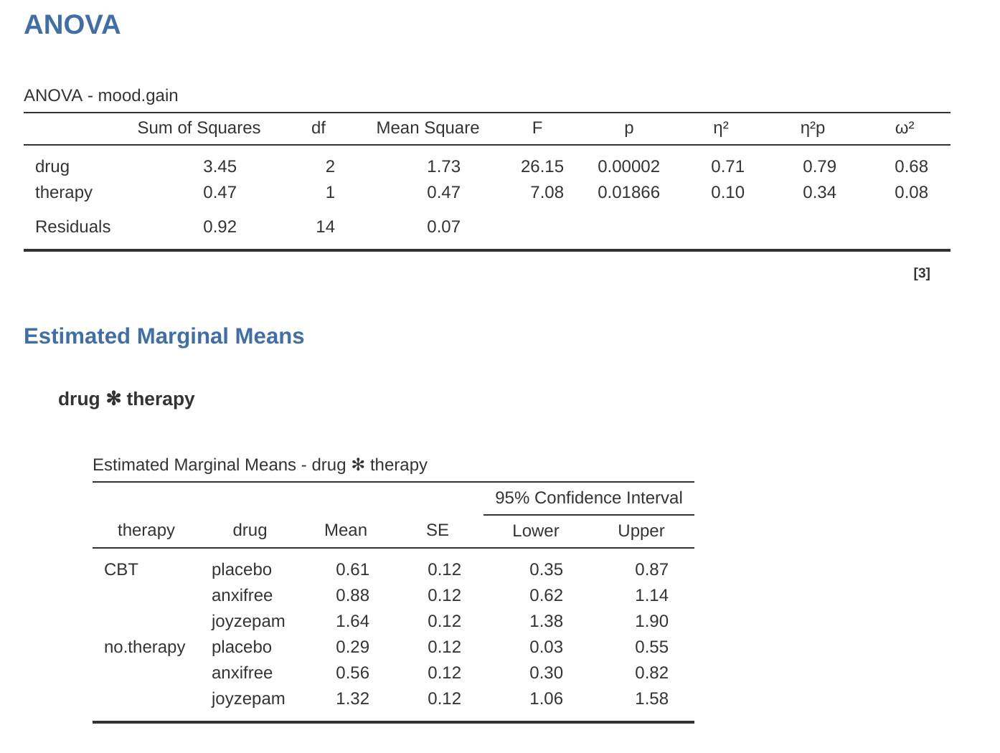
```

## 檢核變異數分析的適用條件

與單因子變異數分析一樣，因子設計因子變異數分析也有幾項關鍵的適用條件，即**變異數同質性** (homogeneity of variance，所有組別的標準差皆相同)、**殘差的常態性** (normality of the residuals)，以及**觀測值的獨立性** (independence of the observations)。前兩項是可以透過統計方法來檢核的，第三項則需要研究者根據研究設計自行評估，判斷不同觀測值之間是否存在特殊關聯。以獨變項是「時間」的重複測量(repeated measures)設計來說，時間點一與時間點二的觀察值是有相關的，因為都是來自同一位參與者。此外，若研究者不是使用飽和模型 (像是省略交互作用)，等於也接受「被省略的項目是不重要的」的假設。當然，這一點可以很容易地透過「執行包含該省略項的 ANOVA 模型，並檢視其是否顯著」來進行確認。那麼，該如何檢核變異數同質性與殘差的常態性呢？事實上，檢核方法相當簡單，與單因子變異數分析的做法並無不同。

<!---與單因素ANOVA一樣，因子ANOVA的關鍵假設是方差同質性（所有組具有相同的標準差）、殘差正態性和觀察值獨立性。前兩者是我們可以檢查的內容。對於第三點，您需要自己評估不同觀察值之間是否存在特殊關係，例如獨立變量是時間的重複測量，因此觀察值在時間1和時間2之間存在關係：不同時間點的觀察值來自同一個人。此外，如果您沒有使用飽和模型（例如，如果您省略了交互作用項），那麼您還假定省略的項不重要。當然，您可以通過運行包含省略項的ANOVA來檢查這最後一點，看看它們是否顯著，所以這非常簡單。那麼方差同質性和殘差正態性呢？事實證明，這些非常容易檢查。這與我們為單因素ANOVA所做的檢查沒有區別。

 As with one-way ANOVA, the key assumptions of factorial ANOVA are homogeneity of variance (all groups have the same standard deviation), normality of the residuals, and independence of the observations. The first two are things we can check for. The third is something that you need to assess yourself by asking if there are any special relationships between different observations, for example repeated measures where the independent variable is time so there is a relationship between the observations at time one and time two: observations at different time points are from the same people. Additionally, if you aren't using a saturated model (e.g., if you've omitted the interaction terms) then you're also assuming that the omitted terms aren't important. Of course, you can check this last one by running an ANOVA with the omitted terms included and see if they're significant, so that's pretty easy. What about homogeneity of variance and normality of the residuals? As it turns out, these are pretty easy to check. It's no different to the checks we did for a one-way ANOVA. --->

### 變異數的同質性

如同 @sec-Checking-the-homogeneity-of-variance-assumption 所述，一個好的做法是，先建立視覺化圖表來檢視，比較各組別或各類別的標準差，然後再看 Levene 檢定的結果是否與圖表一致。Levene 檢定的理論基礎已在 @sec-Checking-the-homogeneity-of-variance-assumption 介紹過，此處不再贅述。Levene檢定預設統計實務是採用飽和模型 (包含所有特定項的模型)，因為檢定的主要目標是組內變異數，而這個數值只有在飽和模型下進行計算才最具意義。在 jamovi 中，可在 ANOVA 分析的「適用條件檢核 (Assumption Checks)」–「同質性檢定 (Homogeneity Tests)」選項中執行 Levene 檢定，示範結果可參考 @fig-fig13-10 。若 Levene 檢定結果不顯著，而且與標準差的視覺化趨勢一致，我們便可以認定變異數同質性的適用條件並未被違反。

<!--- 正如上一章 @sec-Checking-the-homogeneity-of-variance-assumption 中提到的，最好是通過視覺檢查標準差在不同組/類別之間的比較圖，並查看Levene檢驗是否與視覺檢查一致。Levene檢驗的理論在 @sec-Checking-the-homogeneity-of-variance-assumption 中 討論過，所以我不再討論。該檢驗要求您使用一個飽和模型（即，包含所有相關條款），因為該檢驗主要關注的是組內方差，而不是使用與完整模型相關的其他方法計算。在jamovi中，可以在ANOVA 'Assumption Checks' - 'Homogeneity Tests'選項下指定Levene檢驗，結果如 @fig-fig13-10 所示。Levene檢驗的非顯著性意味著，只要與標準差圖的視覺檢查一致，我們就可以放心地假定方差同質性假設沒有被違反。

As mentioned in @sec-Checking-the-homogeneity-of-variance-assumption in the last chapter, it's a good idea to visually inspect a plot of the standard deviations compared across different groups / categories, and also see if the Levene test is consistent with the visual inspection. The theory behind the Levene test was discussed in @sec-Checking-the-homogeneity-of-variance-assumption, so I won't discuss it again. This test expects that you have a saturated model (i.e., including all of the relevant terms), because the test is primarily concerned with the within-group variance, and it doesn't really make a lot of sense to calculate this any way other than with respect to the full model. The Levene test can be specified under the ANOVA 'Assumption Checks' - 'Homogeneity Tests' option in jamovi, with the result shown as in @fig-fig13-10. The fact that the Levene test is non-significant means that, providing it is consistent with a visual inspection of the plot of standard deviations, we can safely assume that the homogeneity of variance assumption is not violated. --->

### 殘差的常態性

與單因子變異數分析一樣，我們可以用 @sec-Checking-the-normality-assumption 介紹過的方法測試殘差的常態性。不過，通常最好的方法是先使用QQ圖檢查有沒有殘差太大的資料。請參見 @fig-fig13-10 的示範。


<!--- As with one-way ANOVA we can test for the normality of residuals in a straightforward fashion (see @sec-Checking-the-normality-assumption). Primarily though, it's generally a good idea to examine the residuals graphically using a QQ plot. See @fig-fig13-10. --->

```{r}
#| label: fig-fig13-10
#| classes: .enlarge-image
#| fig-cap: ANOVA模型的適用條件檢定
#Checking assumptions in an ANOVA model
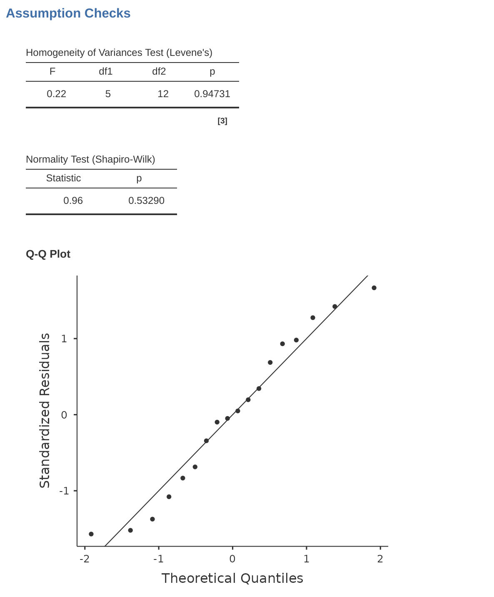
```

## 共變數分析 (ANCOVA) {#sec-analysis-of-covariance-ancova}

變異數分析的一種變形適合用於當研究中包含一個可能與依變項有相關的額外連續變項時。這個額外的變項，通常稱為共變項 (covariate)。 將共變項加入分析之中的做法，便稱為共變異數分析 (analysis of covariance, ANCOVA)。

執行共變異數分析之前，通常會根據共變項的影響程度「校正 」(adjusted)
依變項的數值。接著依照變異數分析的流程，檢定各組之間「校正後」的平均數是否存在差異。這種校正能提升分析的精確度，因此在**檢定**依變項的組間平均數是否相等時，能提供更強的**檢定力 (power)**。共變異數分析是如何提升檢定力的呢？雖然通常共變項並非研究所關心的重點，但是透過統計方法控制共變項，可以降低實驗誤差的估計值；藉由減少誤差變異數，就能提升統計結果的精確度。也就是說，研究者不當地「未能拒絕」虛無假說 (即偽陰性，或稱型二錯誤 Type II error) 的機率將會降低。也就是說，研究者錯將結果認定為不可拒絕虛無假說 (偽陰性，或稱型二錯誤 (Type II error)) 的機率將會降低。

儘管有前述優點，共變異數分析仍然存在一個缺陷，可能會抵銷真實存在的組間差異，使用者必須避免這種狀況。以 @fig-fig13-11 舉例說明，這份散佈圖呈現「統計焦慮」與「年齡」的關係，同時顯示兩個背景或偏好相異的分組：文組學生(Artists)與理組學生(Scientists)。

若將這個例子的年齡當作共變項，共變異數分析的結果可能會得出「兩組學生的統計焦慮程度並無差異」的結論。這個結論合理嗎？很可能不合理。因為看了散佈圖可知，兩組的年齡分佈並未重疊，因此變異數分析實質上是「從沒有資料存在的空間推斷研究結果」( @Everitt1996, p. 68 )。

<!--- ANOVA的一種變體是當您擁有一個可能與因變量相關的額外連續變量時。這個額外的變量可以作為協變量添加到分析中，正如協方差分析（ANCOVA）這個貼切的名稱所示。

在ANCOVA中，因變量的值會根據協變量的影響進行「調整」，然後以通常的方式在各組之間測試「調整後」的均值。這種技術可以提高實驗的精確性，因此提供了對因變量中組均值相等性的更「有效」的檢驗。ANCOVA是如何做到這一點的呢？儘管協變量本身通常不是實驗性的，但對協變量的調整可以降低實驗誤差的估計，從而通過減少誤差變異，提高精確性。這意味著不適當地無法拒絕虛無假設（偽陰性或第二類錯誤）的可能性較小。

儘管存在這個優勢，ANCOVA仍然存在解除組間實際差異的風險，這應該避免。例如，看看@fig-fig13-11，它顯示了統計焦慮與年齡的關係，並顯示了兩個不同的組別--具有藝術或科學背景或偏好的學生。以年齡為協變量的ANCOVA可能會得出統計焦慮在兩個組別之間沒有差異的結論。這個結論是否合理呢？很可能不合理，因為兩個組別的年齡不重疊，方差分析實質上是「將結果外推到沒有數據的區域」（@Everitt1996，第68頁）。

A variation in ANOVA is when you have an additional continuous variable that you think might be related to the dependent variable. This additional variable can be added to the analysis as a covariate, in the aptly named analysis of covariance (ANCOVA).

In ANCOVA the values of the dependent variable are "adjusted" for the influence of the covariate, and then the "adjusted" score means are tested between groups in the usual way. This technique can increase the precision of an experiment, and therefore provide a more "powerful" test of the equality of group means in the dependent variable. How does ANCOVA do this? Well, although the covariate itself is typically not of any experimental interest, adjustment for the covariate can decrease the estimate of experimental error and thus, by reducing error variance, precision is increased. This means that an inappropriate failure to reject the null hypothesis (false negative or type II error) is less likely.

Despite this advantage, ANCOVA runs the risk of undoing real differences between groups, and this should be avoided. Look at @fig-fig13-11, for example, which shows a plot of Statistics anxiety against age and shows two distinct groups -- students who have either an Arts or Science background or preference. ANCOVA with age as a covariate might lead to the conclusion that statistics anxiety does not differ in the two groups. Would this conclusion be reasonable -- probably not because the ages of the two groups do not overlap and analysis of variance has essentially "extrapolated into a region with no data" (@Everitt1996, p. 68). --->

```{r}
#| label: fig-fig13-11
#| fig-cap: 統計焦慮與年齡的圖示，對於兩個不同的組別
#Plot of Statistics anxiety against age for two distinct groups
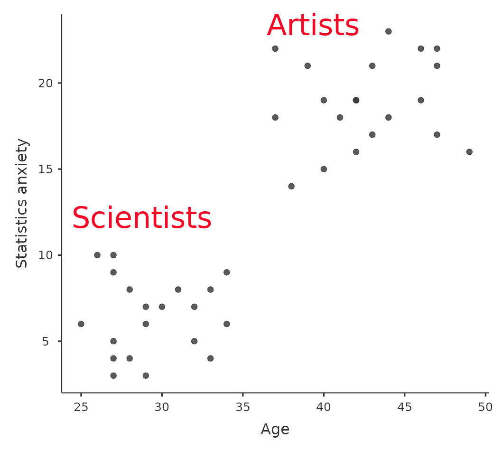
```

顯然，要用共變異數分析處理組別差異懸殊的資料時，必須格外謹慎。這個原則無論是在單因子還是因子設計中都適用，因為共變異數分析可以應用於這兩種研究設計。

<!---Clearly, careful thought needs to be given to an analysis of covariance with distinct groups. This applies to both one-way and factorial designs, as ANCOVA can be used with both.--->

### 使用jamovi完成共變數分析

一位健康心理學家想探討平常通勤方式與壓力感受對幸福感的影響，參與者的年齡當作共變項。完整的研究資料集可見 ancova.csv 。

用 jamovi 開啟檔案後，執行共變數分析的步驟是：點選「分析 (Analyses)」–「變異數分析 (ANOVA)」–「共變異數分析 (ANCOVA)」，開啟分析對話窗 (參考 @fig-fig13-12 )。將依變項「happiness」放進「依變項 (Dependent Variable)」欄位；將自變項「stress」與「commute」放進「固定因子 (Fixed Factors)」欄位；最後將共變項「age」放進「共變項 (Covariates)」欄位。接著，開啟選單「估計邊際平均數 (Estimated Marginal Means)」，設定圖表與表格選項。

<!---一位健康心理學家對例行騎自行車和壓力對幸福程度的影響感興趣，並將年齡作為協變量。您可以在*ancova.csv*文件中找到數據集。在jamovi中打開此文件，然後選擇分析 - ANOVA - ANCOVA 以打開ANCOVA分析窗口（@fig-fig13-12）。突顯因變量「幸福」，將其轉移到「因變量」文本框中。突顯自變量「壓力」和「通勤」，將它們轉移到「固定因素」文本框中。突顯協變量「年齡」，將其轉移到「協變量」文本框中。然後單擊估計邊際均值以顯示圖表和表格選項。

A health psychologist was interested in the effect of routine cycling and stress on happiness levels, with age as a covariate. You can find the dataset in the file *ancova.csv*. Open this file in jamovi and then, to undertake an ANCOVA, select Analyses - ANOVA - ANCOVA to open the ANCOVA analysis window (@fig-fig13-12). Highlight the dependent variable 'happiness' and transfer it into the 'Dependent Variable' text box. Highlight the independent variables 'stress' and 'commute' and transfer them into the 'Fixed Factors' text box. Highlight the covariate 'age' and transfer it into the 'Covariates' text box. Then Click on Estimated Marginal Means to bring up the plots and tables options. --->

```{r}
#| label: fig-fig13-12
#| classes: .enlarge-image
#| fig-cap: jamovi 共變異數分析 (ANCOVA) 操作選單
#The jamovi ANCOVA analysis window
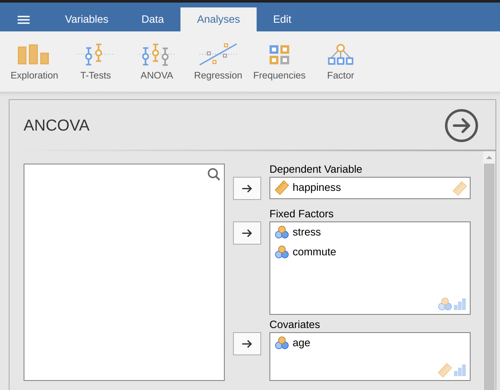
```

jamovi 的報表區會輸出 ANCOVA 結果表，標題是「受試者間效應檢定 (Tests of Between-Subjects Effects)」(參考 @fig-fig13-13 )。首先看到共變項「age」的 F 值達到顯著水準 ($p = .023$)，這代表年齡是依變項「happiness」的一個重要預測變項。接著檢視估計邊際平均數 (參考 @fig-fig13-14 )，因為模型包含共變項「age」，會發現其數值已經過校正 (此處數值與未包含共變項的分析結果會有所不同)。運用像 @fig-fig13-15 的視覺化圖表，更能詮釋顯著效果的意義。

<!--- jamovi結果窗口中產生了一個顯示主題效應測試的ANCOVA表格（@fig-fig13-13）。協變量「年齡」的F值在 $p = .023$ 上顯著，這表明年齡是影響因變量幸福的重要預測因子。當我們查看估計的邊際平均分數（@fig-fig13-14）時，由於在此ANCOVA中包含協變量「年齡」，所以已進行了調整（與未包含協變量的分析相比）。圖表（@fig-fig13-15）是一個很好的視覺化和解釋顯著效應的方法。


An ANCOVA table showing Tests of Between-Subjects Effects is produced in the jamovi results window (@fig-fig13-13). The F value for the covariate 'age' is significant at $p = .023$, suggesting that age is an important predictor of the dependent variable, happiness. When we look at the estimated marginal mean scores (@fig-fig13-14), adjustments have been made (compared to an analysis without the covariate) because of the inclusion of the covariate 'age' in this ANCOVA. A plot (@fig-fig13-15) is a good way of visualising and interpreting the significant effects. --->

```{r}
#| label: fig-fig13-13
#| classes: .enlarge-image
#| fig-cap: jamovi 共變異數分析 (ANCOVA) 結果表格：以「壓力」與「通勤方式」為因子，「年齡」為共變項，「幸福感」為依變項的分析結果
#jamovi ANCOVA output for happiness as a function of stress and commuting method, with age as a covariate
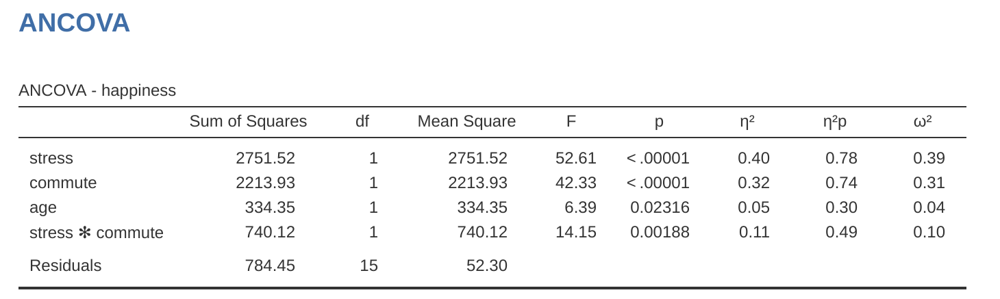
```

```{r}
#| label: fig-fig13-14
#| classes: .enlarge-image
#| fig-cap: 「壓力」與「通勤方式」對「幸福感」的平均數表格 (已針對共變項「年齡」進行校正)，含 95% 信賴區間
#Table of mean happiness level as a function of stress and commuting method (adjusted for the covariate age) with 95% confidence intervals
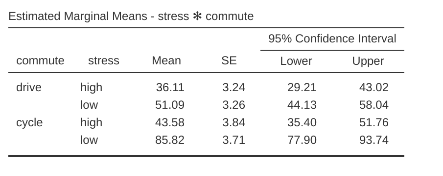
```


從表格中可見，「壓力」主要效果的 F 值為 52.61，對應的 p 值小於 .001；「通勤方式」主要效果的 F 值為 42.33，p 值亦小於 .001。由於這兩個 p 值都小於一般判定的顯著水準 ($p < .05$)，我們可以宣稱「壓力」($F(1, 15) = 52.61, p < .001$) 與「通勤方式」($F(1, 15) = 42.33, p < .001$) 皆有顯著的主要效果。此外，研究也發現兩者之間有顯著的交互作用 ($F(1, 15) = 14.15, p = .002$)。

我們可以從 @fig-fig13-15 看到，將年齡作為共變項加入 ANCOVA 模型後，校正後的邊際平均幸福感分數。這個交互作用的模式可以從 @fig-fig13-15 的圖表中看出：低壓力且騎單車上班的分組，幸福感顯著高於其他三組，包括低壓力/開車上班，以及高壓力的所有通勤方式分組。分析結果同時也顯示顯著的「壓力」主要效果 (低壓力者比較高壓力者幸福)，以及顯著的「通勤方式」主要效果 (平均來說，騎單車者比開車者幸福)。


<!--- $F$ 值主要效果「壓力」（52.61）的相應概率為 $p < .001$。主要效果「通勤」（42.33）的 $F$ 值的相應概率為 $p < .001$。由於這兩者都小於通常用於判定統計結果是否顯著的概率（$p < .05$），我們可以得出壓力的顯著主要效應（$F(1, 15) = 52.61, p < .001$）和通勤方式的顯著主要效應（$F(1, 15) = 42.33, p < .001$）。還發現了壓力和通勤方式之間的顯著交互作用（$F(1, 15) = 14.15, p = .002$）。

在 @fig-fig13-15 中，我們可以看到年齡作為協變量時的調整後、邊際的平均幸福分數。在這個分析中，存在一個顯著的交互效應，即壓力較低的騎自行車上班的人比壓力較低的開車上班的人和壓力較高的人（無論他們是騎自行車還是開車上班）更幸福。還有壓力的顯著主要效應——壓力較低的人比壓力較高的人更幸福。而且通勤行為的顯著主要效應也是如此——平均而言，騎自行車上班的人比開車上班的人更幸福。

The $F$ value for the main effect 'stress' (52.61) has an associated probability of $p < .001$. The $F$ value for the main effect 'commute' (42.33) has an associated probability of $p < .001$. Since both of these are less than the probability that is typically used to decide if a statistical result is significant ($p < .05$) we can conclude that there was a significant main effect of stress ($F(1, 15) = 52.61, p < .001$) and a significant main effect of commuting method ($F(1, 15) = 42.33, p < .001$). A significant interaction between stress and commuting method was also found ($F(1, 15) = 14.15, p = .002$).

In @fig-fig13-15 we can see the adjusted, marginal, mean happiness scores when age is a covariate in an ANCOVA. In this analysis there is a significant interaction effect, whereby people with low stress who cycle to work are happier than people with low stress who drive and people with high stress whether they cycle or drive to work. There is also a significant main effect of stress -- people with low stress are happier than those with high stress. And there is also a significant main effect of commuting behaviour -- people who cycle are happier, on average, than those who drive to work. --->

```{r}
#| label: fig-fig13-15
#| fig-cap: 「壓力」與「通勤方式」對「幸福感」的平均數交互作用圖
#Plot of mean happiness level as a function of stress and commuting method
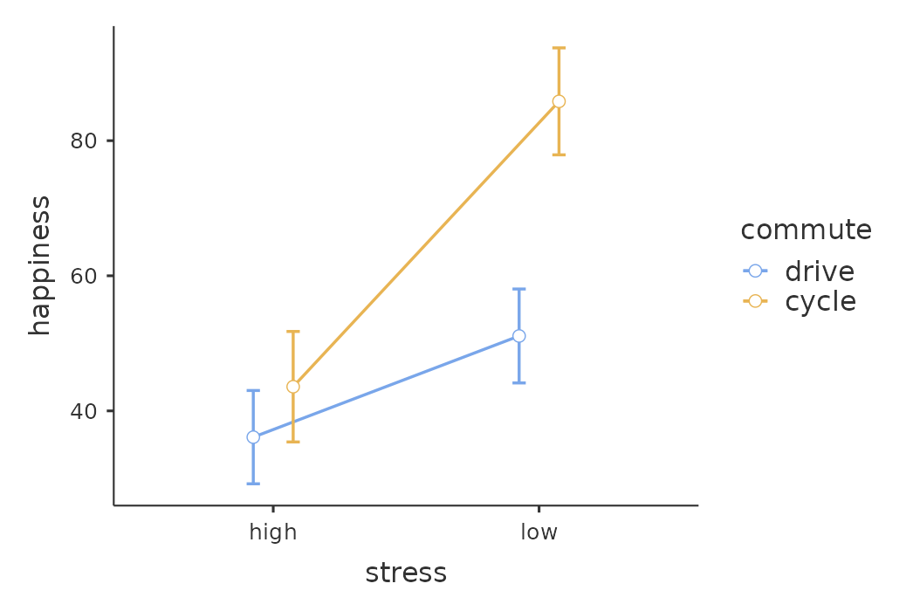
```

還有一點需要注意，若想將共變項加入 ANOVA 模型，必須符合一項額外的適用條件：共變項與依變項之間的關係，在自變項的每一個水平之間都應當是相似的。要檢核這項條件，可以操作在 jamovi 的「模型 (Model)」–「模型項 (Model terms)」選單，為共變項與每一個自變項都新增交互作用項，來進行檢核。若每項交互作用效果不顯著，便可以移除；反之，若交互作用顯著，則可能需要採用更進階的其他統計方法(這部分已經超出本書範圍，建議讀者諮詢友善的統計學家)。

<!--- 需要注意的一點是，如果您想在 ANOVA 中包含協變量，那麼還有一個額外的假設：協變量與因變量之間的關係應對所有自變量的水平都是相似的。這可以通過在 jamovi Model - Model terms 選項中為協變量和每個自變量添加交互項來檢查。如果交互效應不顯著，則可以將其移除。如果它顯著，則可能需要使用更高級的統計技術（這超出了本書的範疇，所以您可能需要諮詢一位友好的統計學家）。總之，在進行 ANCOVA 分析時，要仔細考慮協變量與自變量的關係，以確保結果的準確性和有效性。


One thing to be aware of is that, if you are thinking of including a covariate in your ANOVA, there is an additional assumption: the relationship between the covariate and the dependent variable should be similar for all levels of the independent variable. This can be checked by adding an interaction term between the covariate and each independent variable in the jamovi Model - Model terms option. If the interaction effect is not significant it can be removed. If it is significant then a different and more advanced statistical technique might be appropriate (which is beyond the scope of this book so you might want to consult a friendly statistician). --->

## 變異數分析就是線性模型 {#sec-ANOVA-as-a-linear-model}

關於變異數分析與迴歸分析，有一件極為重要的事需要知道，就是去理解它們的本質是相同的。從表面上看，讀者可能不這麼認為。畢竟，本書至今的描述，似乎都在暗示變異數分析主要用途是檢定組間差異，而迴歸則是用來處理變項之間的相關性。就此而言，這樣的說法完全正確。然而，深入探究便會發現，變異數分析與迴歸的**底層機制 (underlying mechanics)** 極為相似。事實上，讀者若仔細回想，應該已經看見許多蛛絲馬跡：兩者都需要計算差異平方和 (SS)、都是使用 F 檢定等等。回想起來，實在很難擺脫 @sec-Correlation-and-linear-regression 與 @sec-Comparing-several-means-one-way-ANOVA 的內容有些重複的感覺。

之所以如此，是因為變異數分析與迴歸都是一種**線性模型 (linear models)**。對迴歸分析而言，這點無庸置疑。我們用來定義預測變項與結果變項之間關係的迴歸方程式，本身就是一個直線方程式，因此它顯然是一個線性模型，寫出來的公式是：

$$Y_p=b_0+b_1 X_{1p} +b_2 X_{2p} + \epsilon_p$$

其中 $Y_p$ 代表第 p 個觀測值 (例如第 p 位受試者) 的結果變項數值；$X_{1p}$ 是該觀測值的第一個預測變項數值；$X_{2p}$ 則是第二個預測變項數值；$b_0$、$b_1$ 與 $b_2$ 是迴歸係數；而 $\epsilon_p$ 則是第 p 個殘差。若我們先忽略殘差 $\epsilon_p$，只關注迴歸線，便會得到以下公式：

$$\hat{Y}_p=b_0+b_1 X_{1p} +b_2 X_{2p}$$

其中 $\hat{Y}_p$ 是迴歸線對第 p 位受試者的 Y 預測值，對應實際觀測到的 $Y_p$。然而，先前章節較未闡明的是，我們也可以將變異數分析寫成線性模型的形式。其實這麼做能更直接了解變異數分析的本質。接下來，本書將從一個非常簡單的例子開始，將一個 $2 \times 2$ 的因子設計ANOVA 改寫為線性模型。


<!--- 一個非常重要的事情是要了解 ANOVA 和回歸實際上是一回事。從表面上看，您可能不會認為這是真的。畢竟，到目前為止我對它們的描述表明 ANOVA 主要關注測試組間差異，而回歸主要關注瞭解變量之間的相關性。在這一點上，這完全沒錯。但是當你深入了解時，所謂的 ANOVA 和回歸的基本機制非常相似。事實上，如果你仔細想想，你已經看到了這一點的證據。 ANOVA 和回歸都依賴於平方和 (SS)，都使用 F 檢驗等。回顧過去，很難逃避這樣的感覺：  @sec-Correlation-and-linear-regression 和  @sec-Comparing-several-means-one-way-ANOVA 有點重複。

這樣做的原因是 ANOVA 和回歸都是**線性模型**。在回歸的情況下，這是顯而易見的。我們用來定義預測因素和結果之間關係的回歸方程是一條直線的方程，所以這顯然是一個線性模型，方程式為

$$Y_p=b_0+b_1 X_{1p} +b_2 X_{2p} + \epsilon_p$$

其中 $Y_p$ 是第 p 次觀察（例如，第 p 個人）的結果值，$X_{1p}$ 是第 p 次觀察的第一個預測因子的值，$X_{2p}$ 是第 p 次觀察的第二個預測因子的值，$b_0$，$b_1$ 和 $b_2$ 是我們的回歸係數，$\epsilon_p$ 是第 p 個殘差。如果我們忽略殘差 $\epsilon_p$，僅關注回歸線本身，我們得到以下公式：

$$\hat{Y}_p=b_0+b_1 X_{1p} +b_2 X_{2p} $$

其中 $\hat{Y}_p$ 是回歸線為第 p 個人預測的 Y 值，而不是實際觀察到的值 $Y_p$。不是立即顯而易見的事情是，我們可以將 ANOVA 也寫成線性模型。然而，實際上這非常簡單。讓我們從一個非常簡單的例子開始，將 $2 \times 2$ 因子 ANOVA 重寫為線性模型。


One of the most important things to understand about ANOVA and regression is that they're basically the same thing. On the surface of it, you maybe wouldn't think this is true. After all, the way that I've described them so far suggests that ANOVA is primarily concerned with testing for group differences, and regression is primarily concerned with understanding the correlations between variables. And, as far as it goes that's perfectly true. But when you look under the hood, so to speak, the underlying mechanics of ANOVA and regression are awfully similar. In fact, if you think about it, you've already seen evidence of this. ANOVA and regression both rely heavily on sums of squares (SS), both make use of F tests, and so on. Looking back, it's hard to escape the feeling that  @sec-Correlation-and-linear-regression and @sec-Comparing-several-means-one-way-ANOVA were a bit repetitive.

The reason for this is that ANOVA and regression are both kinds of **linear models**. In the case of regression, this is kind of obvious. The regression equation that we use to define the relationship between predictors and outcomes is the equation for a straight line, so it's quite obviously a linear model, with the equation

$$Y_p=b_0+b_1 X_{1p} +b_2 X_{2p} + \epsilon_p$$

where $Y_p$ is the outcome value for the p-th observation (e.g., p-th person), $X_{1p}$ is the value of the first predictor for the p-th observation, $X_{2p}$ is the value of the second predictor for the p-th observation, the $b_0$, $b_1$, and $b_2$ terms are our regression coefficients, and $\epsilon_p$ is the p-th residual. If we ignore the residuals $\epsilon_p$ and just focus on the regression line itself, we get the following formula:

$$\hat{Y}_p=b_0+b_1 X_{1p} +b_2 X_{2p} $$

where $\hat{Y}_p$ is the value of Y that the regression line predicts for person p, as opposed to the actually-observed value $Y_p$. The thing that isn't immediately obvious is that we can write ANOVA as a linear model as well. However, it's actually pretty straightforward to do this. Let's start with a really simple example, rewriting a $2 \times 2$ factorial ANOVA as a linear model. --->

### 示範資料

為了讓說明更具體，假設我們的結果變項，是學生課堂的成績，這是一個**比率量尺 (ratio-scale)** 變項，分數範圍介於 0% 到 100% 之間。研究中有兩個感興趣的預測變項：學生是否有出席上課 (變項 `attend`)，以及學生是否有讀過指定教材 (變項 `reading`)。我們將這兩個變項編碼：若學生有上課， `attend` = 1，反之則為 0。同樣地，若學生有讀過指定教材，則 `reading` = 1，反之則為 0。

好了，到目前為止還算簡單。接下來需要讀者辛苦一點，我要開始用一些數學符號說明了。在這個範例中，我們以 $Y_p$ 代表班上第 p 位學生的成績。這個符號標示與本章先前的用法不完全相同。先前我們使用 $Y_{rci}$ 來代表在預測因子 1 (列因子) 的第 r 組、且在預測因子 2 (行因子) 的第 c 組中的第 i 位受試者。那套符號標示在描述如何計算差異平方和 (SS) 時非常方便，但用在這個範例卻顯得礙手礙腳，因此接下來將更新符號標示。

$Y_p$ 在視覺上比 $Y_{rci}$ 感覺更簡潔，但缺點是無法追蹤受試者的**組別歸屬資訊 (group memberships)**。也就是說，若讀者看到 $Y_{0,0,3} = 35$，便能立刻知道我們所指的是第三位缺課 (`attend` = 0) 又未讀指定教材 (`reading` = 0) 的學生，而他的成績是 35 分。但若只寫 $Y_p = 35$，我們只能知道第 p 位學生的成績不好，卻沒有寫出關鍵的組別資訊。當然，要解決這個障礙並不難。我們只需引入兩個新的變項 $X_{1p}$ 與 $X_{2p}$ 來記錄這些資訊即可。以這個示範的學生案例來說，我們已經知道 $X_{1p} = 0$ (`attend` = 0)，而且 $X_{2p} = 0$ (`reading` = 0)。如此一來，資料便會呈現如同 @tbl-tab13-8 的樣貌。


<!--- 為了具體說明，假設我們的結果變量是學生在我的課堂上獲得的成績，這是一個比例尺度變量，對應於 $0％$ 到 $100％$ 的分數。有兩個感興趣的預測變量：學生是否參加了課程（出席變量）以及學生是否真正閱讀了教科書（閱讀變量）。我們將假設如果學生參加課程，那麼 attend = 1，如果他們沒有參加，那麼 attend = 0。同樣，如果學生閱讀了教科書，我們將說 reading = 1，如果他們沒有，那麼 reading = 0。

好吧，到目前為止，這還算簡單。接下來我們需要做的是將一些數學概念應用在這裡（抱歉！）。為了舉例，讓 $Y_p$ 表示課堂中第 p 個學生的成績。這與我們在本章前面使用的符號不完全相同。以前，我們用符號 $Y_{rci}$ 來表示第 1 個預測因子的第 r 個組中的第 i 個人（行因子）和第 2 個預測因子的第 c 個組（列因子）。這種擴展符號對於描述如何計算 SS 值非常方便，但在目前的情況下很繁瑣，所以我在這裡更換符號。現在，$Y_p$ 符號比 $Y_{rci}$ 更簡單，但它的缺點是它實際上沒有跟踪組成員資訊！也就是說，如果我告訴你 $Y_{0,0,3} = 35$，你會立刻知道我們在談論一個沒有上課（即 attend = 0）並且沒有閱讀教科書（即 reading = 0）的學生（事實上是第 3 個這樣的學生），並且最終未通過課程（成績 = 35）。但如果我告訴你 $Y_p = 35$，你只知道第 p 個學生沒有取得好成績。我們在這裡丟失了一些關鍵資訊。當然，想想如何解決這個問題並不費力。相反，我們將引入兩個新變量 $X_{1p}$ 和 $X_{2p}$ 來追踪這些資訊。在我們假設的學生案例中，我們知道 $X_{1p} = 0$（即 attend = 0）和 $X_{2p} = 0$（即 reading = 0）。因此，數據可能如 @tbl-tab13-8 所示。

To make things concrete, let's suppose that our outcome variable is the grade that a student receives in my class, a ratio-scale variable corresponding to a mark from $0%$ to $100%$. There are two predictor variables of interest: whether or not the student turned up to lectures (the attend variable) and whether or not the student actually read the textbook (the reading variable). We'll say that attend = 1 if the student attended class, and attend = 0 if they did not. Similarly, we'll say that reading = 1 if the student read the textbook, and reading = 0 if they did not.

Okay, so far that's simple enough. The next thing we need to do is to wrap some maths around this (sorry!). For the purposes of this example, let $Y_p$ denote the grade of the p-th student in the class. This is not quite the same notation that we used earlier in this chapter. Previously, we've used the notation $Y_{rci}$ to refer to the i-th person in the r-th group for predictor 1 (the row factor) and the c-th group for predictor 2 (the column factor). This extended notation was really handy for describing how the SS values are calculated, but it's a pain in the current context, so I'll switch notation here. Now, the $Y_p$ notation is visually simpler than $Y_{rci}$, but it has the shortcoming that it doesn't actually keep track of the group memberships! That is, if I told you that $Y_{0,0,3} = 35$, you'd immediately know that we're talking about a student (the 3rd such student, in fact) who didn't attend the lectures (i.e., attend = 0) and didn't read the textbook (i.e. reading = 0), and who ended up failing the class (grade = 35). But if I tell you that $Y_p = 35$, all you know is that the p-th student didn't get a good grade. We've lost some key information here. Of course, it doesn't take a lot of thought to figure out how to fix this. What we'll do instead is introduce two new variables $X_{1p}$ and $X_{2p}$ that keep track of this information. In the case of our hypothetical student, we know that $X_{1p} = 0$ (i.e., attend = 0) and $X_{2p} = 0$ (i.e., reading = 0). So the data might look like @tbl-tab13-8. --->

```{r}
#| label: tbl-tab13-8
#| tbl-cap: 成績、出席、與教材閱讀狀態資料表
#Data for grade, attendance and reading the textbook
huxtabs[[14]][[8]]
```


當然，這沒什麼特別之處，這正是我們所預期的資料格式！(詳見資料檔 *rtfm.csv*)。我們可以使用 jamovi 的**描述統計 (Descriptives)**分析，來確認這筆資料集屬於平衡設計，也就是 `attend` 與 `reading` 的每種組合裡，都有 2 個觀測值。同樣地，我們也能計算出每種組合的平均成績，如同 @fig-fig13-16 的示範。從這些平均分數來看，可以讓人強烈地感覺到，閱讀指定教材與出席上課兩者都相當重要。


<!--- 當然，這並沒有什麼特別之處。這正是我們期望看到的數據格式！請參閱數據文件 *rtfm.csv*。我們可以使用 jamovi 的 'Descriptives' 分析來確認這個數據集對應於一個平衡設計，對於 attend 和 reading 的每個組合，都有 2 個觀測值。同樣，我們還可以為每個組合計算平均成績。這在 @fig-fig13-16 中顯示。看著平均分數，人們會強烈感覺到閱讀課本和上課都非常重要。

This isn't anything particularly special, of course. It's exactly the format in which we expect to see our data! See the data file *rtfm.csv*. We can use the jamovi 'Descriptives' analysis to confirm that this data set corresponds to a balanced design, with 2 observations for each combination of attend and reading. In the same way we can also calculate the mean grade for each combination. This is shown in @fig-fig13-16. Looking at the mean scores, one gets the strong impression that reading the text and attending the class both matter a lot. --->

```{r}
#| label: fig-fig13-16
#| classes: .enlarge-image
#| fig-cap: rtfm 資料集的 jamovi 描述統計結果
#jamovi descriptives for the rtfm data set
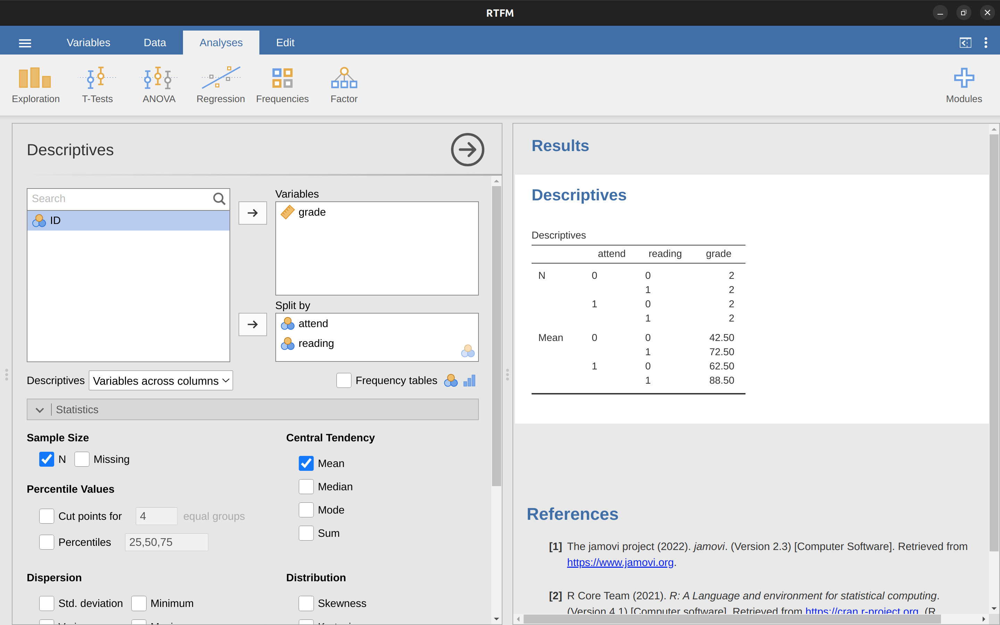
```

### 以迴歸模型處理非連續因子

好啦，讓我們繼續數學符號的說明。現在起可用三個數值變項來表示資料內容：一個連續變項 $Y$，以及兩個**二元變項 (binary variables)** $X_1$ 與 $X_2$。這裡希望讀者能理解，$2 \times 2$ 因子設計ANOVA，完全等同於以下的迴歸模型：

$$Y_p=b_0+b_1 X_{1p} + b_2 X_{2p} + \epsilon_p$$

你沒看錯，這與先前用來描述有兩個預測變項的迴歸模型方程式完全相同！唯一的差別是，$X_1$ 與 $X_2$ 是二元變項 (數值只能是 0 或 1)，但是在典型的迴歸分析中，我們會先認定 $X_1$ 與 $X_2$ 是連續變項。

要如何說服讀者相信兩套方程式是等同的呢？一種可能是進行冗長的數學推導，但本書的多數讀者可能會覺得此舉令人厭煩而且沒幫助。因此，本書將採取另一種方式：先解釋基本概念，再透過 jamovi 來展示變異數分析與迴歸分析不僅相似，本質更是完全相同。讓我們先用變異數分析來執行分析。以下示範使用 rtfm 資料集，jamovi 的分析結果如 @fig-fig13-17 的展示。


<!--- 好吧，讓我們回到數學上的討論。現在，我們的數據已用三個數值變量表示：連續變量 $Y$ 和兩個二元變量 $X_1$ 和 $X_2$。我希望您能認識到，我們的 $2 \times 2$ 因子分析變異數完全等同於迴歸模型

$$Y_p=b_0+b_1 X_{1p} + b_2 X_{2p} + \epsilon_p$$

當然，這正是我之前用來描述具有兩個預測變量的迴歸模型的完全相同的方程式！唯一的區別是 $X_1$ 和 $X_2$ 現在是二元變量（即，值只能為 0 或 1），而在迴歸分析中，我們期望 $X_1$ 和 $X_2$ 是連續的。有幾種方法可以說服您相信這一點。一個可能性是進行冗長的數學練習，證明這兩者是相同的。然而，我要冒昧地猜測，這本書的大多數讀者會覺得這很煩人而不是有幫助。相反，我將解釋基本思想，然後依賴 jamovi 來說明 ANOVA 分析和迴歸分析不僅相似，而且在所有意圖和目的上是相同的。讓我們首先將其作為 ANOVA 運行。為此，我們將使用 rtfm 數據集，@fig-fig13-17 顯示了在 jamovi 中運行分析時我們得到的結果。

Okay, let's get back to talking about the mathematics. We now have our data expressed in terms of three numeric variables: the continuous variable $Y$ and the two binary variables $X_1$ and $X_2$. What I want you to recognise is that our $2 \times 2$ factorial ANOVA is exactly equivalent to the regression model

$$Y_p=b_0+b_1 X_{1p} + b_2 X_{2p} + \epsilon_p$$

This is, of course, the exact same equation that I used earlier to describe a two-predictor regression model! The only difference is that $X_1$ and $X_2$ are now binary variables (i.e., values can only be 0 or 1), whereas in a regression analysis we expect that $X_1$ and $X_2$ will be continuous. There's a couple of ways I could try to convince you of this. One possibility would be to do a lengthy mathematical exercise proving that the two are identical. However, I'm going to go out on a limb and guess that most of the readership of this book will find that annoying rather than helpful. Instead, I'll explain the basic ideas and then rely on jamovi to show that ANOVA analyses and regression analyses aren't just similar, they're identical for all intents and purposes. Let's start by running this as an ANOVA. To do this, we'll use the rtfm data set, and @fig-fig13-17 shows what we get when we run the analysis in jamovi. --->

```{r}
#| label: fig-fig13-17
#| classes: .enlarge-image
#| fig-cap: jamovi 對 rtfm.csv 資料集的 ANOVA 分析結果 (已排除交互作用項)
#ANOVA of the *rtfm.csv* data set in jamovi, without the interaction term
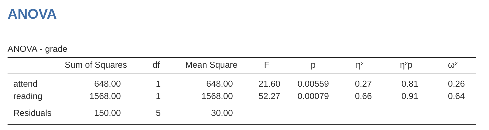
```

根據 ANOVA 表格及先前呈現的平均分數，可以解讀幾個關鍵結果：學生有出席課程 ($F_{1,5} = 21.6, p = .0056$) 以及有閱讀指定教材 ($F_{1,5} = 52.3, p = .0008$)，會讓成績顯著較高。請各位先記下這些 p 值與 F 統計值。

接著讓我們從線性迴歸的角度來思考如何分析這筆資料，先將 rtfm 資料集的`attend` 與 `reading` 編碼為數值預測變項。以迴歸模型來說，這種做法完全可以接受。因為相較於缺課的學生 (`attend` = 0)，有來上課的學生 (`attend` = 1) 確實可被視為符合「較多的出席」。因此，將此作為迴歸模型中的預測變項並無不妥。雖然這個預測變項只有兩個數值，和之前的範例相比有些不尋常，但這並未違反任何線性迴歸的適用條件，且結果詮釋也相當直觀。若 `attend` 的迴歸係數大於 0，代表有出席課程的學生成績較高；若係數小於 0，則代表有出席課程的學生成績反而較低。這個的做法同樣適用 `reading` 變項。

不過先稍停一下，為什麼這樣的做法是可行的呢？對於修過幾門統計課、對數學不會陌生的讀者來說，這種做法相當直觀；但是對於初學者而言，卻不見得如此。要讓初學者理解其中緣由，仔細檢視幾個特定學生的案例會很有幫助。讓我們用資料集裡的第 6 位與第 7 位學生 ($p=6$ 與 $p=7$) 來解釋。

這兩位學生都沒有課前閱讀指定教材，因此這兩位學生的`reading`變項都可以設定 `reading` = 0。用數學符號表示的話，就是 $X_{2,6} = 0$ 與 $X_{2,7} = 0$。不過，第 7 位學生有出席課程 (`attend` = 1, $X_{1,7} = 1$)，第 6 位學生則沒有 (`attend` = 0, $X_{1,6} = 0$)。接下來，我們來看看將這些數值代入迴歸線公式後會發生什麼事。

迴歸模型預測第 6 位學生的成績為：

$$
\begin{split}
\hat{Y}_6 & = b_0 + b_1 X_{1,6} + b_2 X_{2,6} \\
& = b_0 + (b_1 \times 0) + (b_2 \times 0) \\
& = b_0
\end{split}
$$

因此，我們預期這位學生的成績會相等於截距項 $b_0$ 代表的數值。那麼第 7 位學生呢？將數值代入迴歸線公式後，會得到：

$$
\begin{split}
\hat{Y}_7 & = b_0 + b_1 X_{1,7} + b_2 X_{2,7} \\
& = b_0 + (b_1 \times 1) + (b_2 \times 0) \\
& = b_0 + b_1
\end{split}
$$

因為這位學生有出席課程，預測成績等於截距項 $b_0$ 加上 `attend` 變項的係數 $b_1$。所以，若 $b_1$ 大於 0，我們預期有出席課程的學生，成績會高於缺課的學生。若此係數為負，則預期結果相反：有出席課程者的表現反而更差。

其實還可以再拿另一個學生示範。以第 1 位學生來說，他既有出席課程 ($X_{1,1} = 1$) 也有先讀指定教材 ($X_{2,1} = 1$)。將這些數值代入迴歸模型會得到：

$$
\begin{split}
\hat{Y}_1 & = b_0 + b_1 X_{1,1} + b_2 X_{2,1} \\
& = b_0 + (b_1 \times 1) + (b_2 \times 1) \\
& = b_0 + b_1 + b_2
\end{split}
$$

因此，若我們假定出席課程有助於提升成績 ($b_1 > 0$)，且閱讀指定教材也有助於提升成績 ($b_2 > 0$)，那麼迴歸線的預測結果就是：第 1 位學生的成績將會高於第 6 位與第 7 位學生。

至此，讀者大概不會再感到意外：迴歸模型會預測第 3 位學生 (有閱讀、未出席) 的預測成績是 $b_0 + b_2$。這裡就不再為讀者做一次示範了，所有學生的*預測成績*已經整理在 @tbl-tab13-9 。

<!--- 好的，通過從 ANOVA 表和我們之前呈現的平均分數中讀取關鍵數字，我們可以看到，如果學生參加課程（$F_{1,5} = 21.6, p = .0056$），他們的成績會更高，如果他們閱讀教材（$F_{1,5} = 52.3, p = .0008$）。讓我們記下這些 p 值和這些 $F$ 統計數字。

現在讓我們從線性迴歸的角度考慮相同的分析。在 rtfm 數據集中，我們將 attend 和 reading 編碼為數值預測變量。在這種情況下，這是完全可以接受的。在某種意義上，參加課程的學生（即 attend = 1）事實上的確比沒有參加的學生（即 attend = 0）做了“更多的出席”。因此，將其作為迴歸模型中的預測變量完全不是不合理的。這有點不尋常，因為預測變量只有兩個可能的值，但這並不違反線性迴歸的任何假設。而且易於解釋。如果 attend 的迴歸係數大於 0，則意味著參加課程的學生會獲得更高的成績。如果小於零，那麼參加課程的學生會獲得較低的成績。對於我們的閱讀變量也是如此。

等一下。為什麼會這樣？這對於接受過幾堂統計課程並熟悉數學的人來說是直觀明顯的，但對其他人來說一開始並不清楚。要理解為什麼會這樣，有助於仔細觀察幾個特定的學生。讓我們首先考慮我們數據集中的第 6 位和第 7 位學生（即 $p = 6$ 和 $p = 7$）。兩者都沒有閱讀教科書，因此在這兩種情況下，我們都可以將 reading 設為 0。換句話說，用我們的數學符號表示，我們觀察到 $X_{2,6} = 0$ 和 $X_{2,7} = 0$。然而，第 7 位學生參加了課程（即 attend = 1，$X_{1,7} = 1$），而第 6 位學生沒有參加（即 attend = 0，$X_{1,6} = 0$）。現在讓我們看看當我們將這些數字插入迴歸線的一般公式時會發生什麼。對於第 6 位學生，迴歸預測：

$$
\begin{split}
\hat{Y}_6 & = b_0 + b_1 X_{1,6} + b_2 X_{2,6} \\
& = b_0 + (b_1 \times 0) + (b_2 \times 0) \\
& = b_0
\end{split}
$$

因此，我們預計這位學生將獲得與截距項 $b_0$ 相對應的成績。那麼第 7 位學生呢？這次當我們將數字插入迴歸線公式時，我們得到以下結果：

$$
\begin{split}
\hat{Y}_7 & = b_0 + b_1 X_{1,7} + b_2 X_{2,7} \\
& = b_0 + (b_1 \times 1) + (b_2 \times 0) \\
& = b_0 + b_1
\end{split}
$$

因為這位學生參加了課程，預計成績等於截距項 b0 加上與 attend 變量相關的係數 $b_1$。所以，如果 $b_1$ 大於零，我們預期參加課程的學生將比那些沒有參加的學生獲得更高的成績。如果這個係數為負，我們則預期相反：上課的學生表現會更差。實際上，我們可以更進一步。第一位學生呢？他參加了課程（$X_{1,1} = 1$），並且閱讀了教科書（$X_{2,1} = 1$）？如果我們將這些數字插入迴歸，我們得到：

$$
\begin{split}
\hat{Y}_1 & = b_0 + b_1 X_{1,1} + b_2 X_{2,1} \\
& = b_0 + (b_1 \times 1) + (b_2 \times 1) \\
& = b_0 + b_1 + b_2
\end{split}
$$

因此，如果我們假設參加課程有助於獲得好成績（即 $b1 \> 0$），並假設閱讀教科書也有助於獲得好成績（即 $b2 \> 0$），那麼我們的預期是，第 1 位學生將比第 6 位學生和第 7 位學生獲得更高的成績。

此時，你可能一點也不會感到驚訝地了解到迴歸模型預測，讀了書但沒有參加課程的第 3 位學生將獲得 $b_{2} + b_{0}$ 的成績。我不會再用另一個迴歸公式來煩悶你。相反，我將向你展示的是帶有*預期成績*的 @tbl-tab13-9。

So, by reading the key numbers off the ANOVA table and the mean scores that we presented earlier, we can see that the students obtained a higher grade if they attended class ($F_{1,5} = 21.6, p = .0056$) and if they read the textbook ($F_{1,5} = 52.3, p = .0008$). Let's make a note of those p-values and those $F$ statistics.

Now let's think about the same analysis from a linear regression perspective. In the rtfm data set, we have encoded attend and reading as if they were numeric predictors. In this case, this is perfectly acceptable. There really is a sense in which a student who turns up to class (i.e. attend = 1) has in fact done "more attendance" than a student who does not (i.e. attend = 0). So it's not at all unreasonable to include it as a predictor in a regression model. It's a little unusual, because the predictor only takes on two possible values, but it doesn't violate any of the assumptions of linear regression. And it's easy to interpret. If the regression coefficient for attend is greater than 0 it means that students that attend lectures get higher grades. If it's less than zero then students attending lectures get lower grades. The same is true for our reading variable.

Wait a second though. Why is this true? It's something that is intuitively obvious to everyone who has taken a few stats classes and is comfortable with the maths, but it isn't clear to everyone else at first pass. To see why this is true, it helps to look closely at a few specific students. Let's start by considering the 6th and 7th students in our data set (i.e. $p = 6$ and $p = 7$). Neither one has read the textbook, so in both cases we can set reading = 0. Or, to say the same thing in our mathematical notation, we observe $X_{2,6} = 0$ and $X_{2,7} = 0$. However, student number 7 did turn up to lectures (i.e., attend = 1, $X_{1,7} = 1$) whereas student number 6 did not (i.e., attend = 0, $X_{1,6} = 0$). Now let's look at what happens when we insert these numbers into the general formula for our regression line. For student number 6, the regression predicts that

$$
\begin{split}
\hat{Y}_6 & = b_0 + b_1 X_{1,6} + b_2 X_{2,6} \\
& = b_0 + (b_1 \times 0) + (b_2 \times 0) \\
& = b_0
\end{split}
$$

So we're expecting that this student will obtain a grade corresponding to the value of the intercept term $b_0$. What about student 7? This time when we insert the numbers into the formula for the regression line, we obtain the following

$$
\begin{split}
\hat{Y}_7 & = b_0 + b_1 X_{1,7} + b_2 X_{2,7} \\
& = b_0 + (b_1 \times 1) + (b_2 \times 0) \\
& = b_0 + b_1
\end{split}
$$

Because this student attended class, the predicted grade is equal to the intercept term b0 plus the coefficient associated with the attend variable, $b_1$. So, if $b_1$ is greater than zero, we're expecting that the students who turn up to lectures will get higher grades than those students who don't. If this coefficient is negative we're expecting the opposite: students who turn up at class end up performing much worse. In fact, we can push this a little bit further. What about student number 1, who turned up to class ($X_{1,1} = 1$) and read the textbook ($X_{2,1} = 1$)? If we plug these numbers into the regression we get

$$
\begin{split}
\hat{Y}_1 & = b_0 + b_1 X_{1,1} + b_2 X_{2,1} \\
& = b_0 + (b_1 \times 1) + (b_2 \times 1) \\
& = b_0 + b_1 + b_2
\end{split}
$$

So if we assume that attending class helps you get a good grade (i.e., $b1 \> 0$) and if we assume that reading the textbook also helps you get a good grade (i.e., $b2 \> 0$), then our expectation is that student 1 will get a grade that that is higher than student 6 and student 7.

And at this point you won't be at all suprised to learn that the regression model predicts that student 3, who read the book but didn't attend lectures, will obtain a grade of $b_{2} + b_{0}$. I won't bore you with yet another regression formula. Instead, what I'll do is show you is @tbl-tab13-9 with the *expected grades*. --->

```{r}
#| label: tbl-tab13-9
#| tbl-cap: 迴歸模型的預測成績
#Expected grades from the regression model
huxtabs[[14]][[9]]
```


從表格中可以看到，截距項 $b_0$ 的作用，就是代表那些既未出席課程、也未閱讀指定教材的學生的**基準線**成績。同樣地，$b_1$ 代表預期有出席課程而帶來的成績提升；而$b_2$ 則代表閱讀指定教材所能帶來的成績提升。若是改用變異數分析的術語來說，我們很自然地把 $b_1$ 當做「出席」的主要效果，把 $b_2$ 當做「閱讀」的主要效果。就一個簡單的 $2 \\times 2$ 變異數分析來說，兩種模型確實是如此對應。

好了，既然我們已經可以接受為何 ANOVA 與迴歸分析本質上是同一回事，就讓我們實際使用 rtfm 資料集與 jamovi 的迴歸分析功能，來做個驗證。用已經學過的方式執行迴歸分析，會得到 @fig-fig13-18 所示範的結果。


<!--- 正如你所看到的，截距項 $b_0$ 作為一種基線成績，用來表示那些沒有花時間參加課程或閱讀教科書的學生所期望的成績。同樣，$b_1$ 表示你預期能從上課中得到的提升，而 $b_2$ 表示閱讀教科書帶來的提升。事實上，如果這是一個 ANOVA，你可能很想將 b1 稱為出席的主要效應，將 $b_2$ 稱為閱讀的主要效應！事實上，對於一個簡單的 $2 \times 2$ ANOVA，情況確實是這樣。

好的，既然我們已經開始看到為什麼 ANOVA 和迴歸基本上是同一回事，讓我們實際運用 rtfm 數據和 jamovi 迴歸分析來確信這確實是真的。以通常的方式運行迴歸會得到 @fig-fig13-18 中顯示的結果。

As you can see, the intercept term $b_0$ acts like a kind of "baseline" grade that you would expect from those students who don't take the time to attend class or read the textbook. Similarly, $b_1$ represents the boost that you're expected to get if you come to class, and $b_2$ represents the boost that comes from reading the textbook. In fact, if this were an ANOVA you might very well want to characterise b1 as the main effect of attendance, and $b_2$ as the main effect of reading! In fact, for a simple $2 \times 2$ ANOVA that's exactly how it plays out.

Okay, now that we're really starting to see why ANOVA and regression are basically the same thing, let's actually run our regression using the rtfm data and the jamovi regression analysis to convince ourselves that this is really true. Running the regression in the usual way gives the results shown in @fig-fig13-18. --->

```{r}
#| label: fig-fig13-18
#| classes: .enlarge-image
#| fig-cap: jamovi 對 rtfm.csv 資料集的迴歸分析結果 (已排除交互作用項)
#Regression analysis of the *rtfm.csv* data set in jamovi, without the interaction term
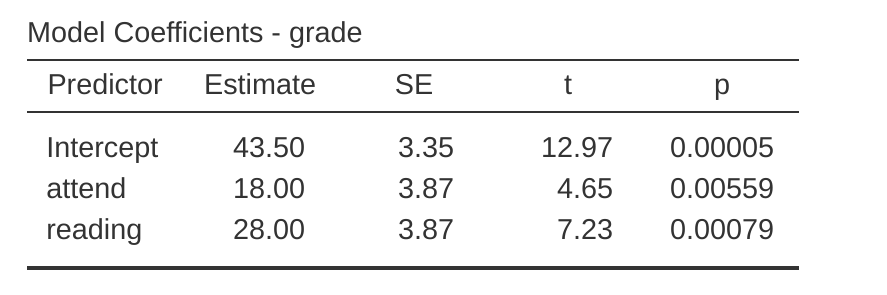
```

這裡有幾點值得注意。首先，截距項是43.5，這個數值相當接近既未閱讀指定教材也未出席課程的學生成續平均數42.5。還有，我們得到 `attend` (出席) 變項的迴歸係數 $b_1 = 18.0$，這代表有出席課程的學生，成績比未出席者的平均數高 18 分。因此，我們的預期是：那些有出席課程但未閱讀指定教材的學生，成績平均數應該是 $b_0 + b_1$，也就是 $43.5 + 18.0 = 61.5$。讀者可以自行檢視有閱讀指定教材的學生成績，驗證會不會得到相同的結論。

其實還有更直觀的方法，可以更進一步地確立變異數分析等同於迴歸。仔細閱讀迴歸分析的輸出報表，會發現 `attend` 與 `reading` 這兩個變項的 p 值，與先前變異數分析所輸出的數值完全相同。這或許有些令人意外，因為迴歸模型計算的是 t 統計值，而 ANOVA 計算的卻是 F 統計值。不過，如果讀者們還記得 @sec-Introduction-to-probability 的說明，應該會知道 t 分配與 F 分配之間其實有密切關係。若有一個數值服從自由度為 k 的 t 分配，將之平方後，這個新的數值會服從自由度為 1 與 k 的 F 分配。透過迴歸模型報表的t統計值，我們可以來驗證這一點。以 `attend` 變項為例，t值為4.65。將此數值平方後，便會得到 21.6，這個數值正好與 ANOVA 報表對應的 F 統計值相符。

最後還有一件事值得一提。因為 jamovi 開發團隊了解 ANOVA 與迴歸分析都是線性模型，所以使用者可以從迴歸模型中，輸出傳統的 ANOVA 表格。操作步驟：「線性迴歸 (Linear Regression)」–「模型係數 (Model Coefficients)」–「**整體檢定 (Omnibus Test)**」–「ANOVA 檢定 (ANOVA Test)」。執行後便會得到如 @fig-fig13-19 展示的表格。


<!--- 這裡有幾個有趣的地方需要注意。首先，注意截距項是 43.5，接近觀察到的那兩個既沒有閱讀文本也沒有參加課程的學生的 "組" 平均值 42.5。其次，注意我們得到了參加變量的迴歸係數 $b_1 = 18.0$，這表明參加課程的學生比沒有參加課程的學生高出 18%。因此，我們的期望是，那些上課但沒有閱讀教科書的學生將獲得 $b_0 + b_1$ 的成績，即 $43.5 + 18.0 = 61.5$。當我們觀察閱讀教科書的學生時，你可以自己驗證同樣的事情。

實際上，我們可以在建立 ANOVA 和迴歸等價性方面進一步推進。看看迴歸輸出中與 attend 變量和 reading 變量相關的 p 值。它們與我們之前在運行 ANOVA 時遇到的完全相同。這可能看起來有點奇怪，因為運行我們的迴歸模型時使用的檢驗計算了一個 t 統計量，而 ANOVA 計算了一個 F 統計量。然而，如果您還記得我們在 @sec-Introduction-to-probability 中提到的內容，t 分布和 F 分布之間存在著某種關係。如果你有一個根據 k 自由度的 t 分布的數量，然後將其平方，那麼這個新的平方數量就遵循一個自由度為 1 和 k 的 F 分布。對於我們迴歸模型中的 t 統計量，我們可以檢查這一點。對於 attend 變量，我們得到一個 t 值為 4.65。如果我們將這個數字平方，我們最終得到的是 21.6，這與我們 ANOVA 中相應的 F 統計量相匹配。

最後，你還應該知道一件事。因為 jamovi 瞭解到 ANOVA 和迴歸都是線性模型的例子，所以它允許您使用 'Linear Regression' - 'Model Coefficients' - 'Omnibus Test' - 'ANOVA Test' 從迴歸模型中提取經典的 ANOVA 表，這將給你在 @fig-fig13-19 中顯示的表格。

There's a few interesting things to note here. First, notice that the intercept term is 43.5 which is close to the "group" mean of 42.5 observed for those two students who didn't read the text or attend class. Second, notice that we have the regression coefficient of $b_1 = 18.0$ for the attendance variable, suggesting that those students that attended class scored 18% higher than those who didn't. So our expectation would be that those students who turned up to class but didn't read the textbook would obtain a grade of $b_0 + b_1$, which is equal to $43.5 + 18.0 = 61.5$. You can verify for yourself that the same thing happens when we look at the students that read the textbook.

Actually, we can push a little further in establishing the equivalence of our ANOVA and our regression. Look at the p-values associated with the attend variable and the reading variable in the regression output. They're identical to the ones we encountered earlier when running the ANOVA. This might seem a little surprising, since the test used when running our regression model calculates a t-statistic and the ANOVA calculates an F-statistic. However, if you can remember all the way back to @sec-Introduction-to-probability, I mentioned that there's a relationship between the t-distribution and the F-distribution. If you have some quantity that is distributed according to a t-distribution with k degrees of freedom and you square it, then this new squared quantity follows an F-distribution whose degrees of freedom are 1 and k. We can check this with respect to the t statistics in our regression model. For the attend variable we get a t value of 4.65. If we square this number we end up with 21.6, which matches the corresponding F statistic in our ANOVA.

Finally, one last thing you should know. Because jamovi understands the fact that ANOVA and regression are both examples of linear models, it lets you extract the classic ANOVA table from your regression model using the 'Linear Regression' - 'Model Coefficients' - 'Omnibus Test' - 'ANOVA Test', and this will give you the table shown in @fig-fig13-19. --->

```{r}
#| label: fig-fig13-19
#| classes: .enlarge-image
#| fig-cap: 使用 jamovi 迴歸分析輸出整體 ANOVA 檢定結果 (Omnibus ANOVA Test)
#Omnibus ANOVA Test results from the jamovi regression analysis
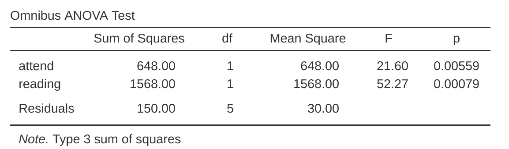
```

### 如何編碼因子設計的多重比較
<!---How to encode non binary factors as contrasts--->

至此，本書已經展示如何將 $2 \times 2$ 的變異數分析 視做線性模型處理，這個概念也很容易延伸至 $2 \times 2 \times 2$ 或 $2 \times 2 \times 2 \times 2$ 的變異數分析，原理是相同的：只要當每一個因子都是一個二元變項即可。然而，當我們要處理有兩個以上水準的因子，情況就變得棘手一些。舉例來說，本單元稍早使用的示範資料 *clinicaltrial.csv* ，需要處理 $3 \times 2$ 變異數分析，我們要如何將具有三個水準的「藥物」因子，轉換為迴歸模型的形式呢？

其實解決方法相當簡單：我們只要先了解一個概念，即一項有三個水準的因子，可以用兩個二元變項重新定義。
舉例來說，假設我們要建立一個新的二元變項名為 `druganxifree` 。當 `drug` 變項的值為 "anxifree" 時，我們便將 `druganxifree` 設為 1，否則設為 0。如此一來，這個變項便建立了一項**對比 (contrast)**，以此例來說，代表藥物"anxifree" 與另外兩種藥物之間的對比。
當然，單靠 `druganxifree` 一項對比，並不足以完全捕捉 `drug` 變項的所有資訊。我們還需要第二項對比，來區分 "joyzepam" 與安慰劑。為此，我們可以建立名為 `drugjoyzepam` 的第二項二元對比，當藥物是 "joyzepam"，其值就是1，否則為 0。結合這兩個對比，便能完美地區分所有三種可能的藥物。 @tbl-tab13-10 展示如何用兩項對比的編碼代表三種藥物。


<!--- 在這一點上，我已經向您展示了如何將 $2 \times 2$ ANOVA 轉換為線性模型。從而很容易看出這如何擴展到 $2 \times 2 \times 2$ ANOVA 或 $2 \times 2 \times 2 \times 2$ ANOVA。事實上，這是同一件事。對於每個因子，你只需添加一個新的二元變量。當我們考慮具有多於兩個級別的因子時，問題變得更加複雜。例如，考慮我們在本章前面使用*clinicaltrial.csv* 數據運行的 $3 \times 2$ ANOVA。我們如何將具有三個級別的藥物因子轉換為適合迴歸的數值形式？

事實上，這個問題的答案相當簡單。我們所要做的就是意識到三級因子可以被重新描述為兩個二元變量。假設，例如，我要創建一個名為 druganxifree 的新二元變量。每當藥物變量等於 "anxifree" 時，我們將 druganxifree 設為 1。否則，將 druganxifree 設為 0。這個變量設立了一個**對比**，在這種情況下是在 anxifree 和其他兩種藥物之間。當然，僅憑 druganxifree 對比還不足以完全捕捉我們藥物變量中的所有信息。我們需要第二個對比，一個能讓我們區分 joyzepam 和安慰劑的對比。為此，我們可以創建第二個二元對比，名為 drugjoyzepam，如果藥物是 joyzepam，則等於 1，否則等於 0。這兩個對比結合在一起，使我們能夠完美區分所有三種可能的藥物。@tbl-tab13-10 說明了這一點。


At this point, I've shown you how we can view a $2 \times 2$ ANOVA into a linear model. And it's pretty easy to see how this generalises to a $2 \times 2 \times 2$ ANOVA or a $2 \times 2 \times 2 \times 2$ ANOVA. It's the same thing, really. You just add a new binary variable for each of your factors. Where it begins to get trickier is when we consider factors that have more than two levels. Consider, for instance, the $3 \times 2$ ANOVA that we ran earlier in this chapter using the *clinicaltrial.csv*  data. How can we convert the three-level drug factor into a numerical form that is appropriate for a regression?

The answer to this question is pretty simple, actually. All we have to do is realise that a three-level factor can be redescribed as two binary variables. Suppose, for instance, I were to create a new binary variable called druganxifree. Whenever the drug variable is equal to "anxifree" we set druganxifree = 1. Otherwise, we set druganxifree = 0. This variable sets up a **contrast**, in this case between anxifree and the other two drugs. By itself, of course, the druganxifree contrast isn't enough to fully capture all of the information in our drug variable. We need a second contrast, one that allows us to distinguish between joyzepam and the placebo. To do this, we can create a second binary contrast, called drugjoyzepam, which equals 1 if the drug is joyzepam and 0 if it is not. Taken together, these two contrasts allows us to perfectly discriminate between all three possible drugs. @tbl-tab13-10 illustrates this. --->

```{r}
#| label: tbl-tab13-10
#| tbl-cap: 用以區分三種藥物的二元對比編碼
#Binary contrasts to discriminate between all three possible drugs
huxtabs[[14]][[10]]
```

若病患服用的藥物是安慰劑，那麼這兩項對比的編碼都會是 0。若服用的是 Anxifree，則 `druganxifree` 變項為 1，`drugjoyzepam` 為 0。Joyzepam 的情況則正好相反：`drugjoyzepam` 為 1，而 `druganxifree` 為 0。

使用 jamovi 建立對比變項並不困難，只要使用「**新增計算變項 (Compute New Variable)**」功能就能完成。舉例來說，若要建立 `druganxifree` 這個變項，只要在公式欄位中輸入邏輯條件式：`IF(drug == 'anxifree', 1, 0)`

同樣地，建立 `drugjoyzepam`的邏輯條件式就是：`IF(drug == 'joyzepam', 1, 0)` 設定`CBTtherapy` 的對比變項也是一樣的方式：`IF(therapy == 'CBT', 1, 0)` 讀者可以在 jamovi 資料檔 *clinicaltrial2.omv*中，看到這些新增的變項以及其對應的邏輯條件式。

至此，我們已示範如何將一個有三個水準的因子，重新編碼為兩個二元變項。如同前一小節的介紹，變異數分析與迴歸處理二元變項的運算邏輯是相同的。然而，這種做法也會增加一些運算複雜度，這是下一節要討論的內容。

<!-- 如果給病人用的藥物是安慰劑，那麼這兩個對比變量都將等於 0。如果藥物是 Anxifree，那麼 druganxifree 變量將等於 1，而 drugjoyzepam 將為 0。對於 Joyzepam，情況剛好相反：drugjoyzepam 為 1，而 druganxifree 為 0。

使用 jamovi 計算新變量命令創建對比變量並不困難。例如，要創建 druganxifree 變量，請在計算新變量公式框中編寫此邏輯表達式：IF(drug == 'anxifree', 1, 0)'。同樣，要創建新變量 drugjoyzepam，請使用此邏輯表達式：IF(drug == 'joyzepam', 1, 0)。對於 CBTtherapy，請使用：IF(therapy == 'CBT', 1, 0)。您可以在 jamovi 數據文件 *clinicaltrial2.omv* 中查看這些新變量和相應的邏輯表達式。

我們現在已經將三級因子根據兩個二元變量進行了重新編碼，我們已經看到，對於二元變量，ANOVA 和迴歸的行為方式是相同的。然而，在這種情況下，還有一些額外的複雜性，我們將在下一節中討論。

If the drug administered to a patient is a placebo then both of the two contrast variables will equal 0. If the drug is Anxifree then the druganxifree variable will equal 1, and drugjoyzepam will be 0. The reverse is true for Joyzepam: drugjoyzepam is 1 and druganxifree is 0.

Creating contrast variables is not too difficult to do using the jamovi compute new variable command. For example, to create the druganxifree variable, write this logical expression in the compute new variable formula box: IF(drug == 'anxifree', 1, 0)'. Similarly, to create the new variable drugjoyzepam use this logical expression: IF(drug == 'joyzepam', 1, 0). Likewise for CBTtherapy: IF(therapy == 'CBT', 1, 0). You can see these new variables, and the corresponding logical expressions, in the jamovi data file *clinicaltrial2.omv* .

We have now recoded our three-level factor in terms of two binary variables, and we've already seen that ANOVA and regression behave the same way for binary variables. However, there are some additional complexities that arise in this case, which we'll discuss in the next section. --->

### 為什麼變異數分析等同於非二元因子迴歸分析

至此，`clinicaltrial`這筆資料有兩種版本：一個是原始資料 (clinicaltrial.csv)，其中的 drug 變項是一個三水準的因子；其二是擴充後的資料 (clinicaltrial2.omv)，其中的 drug 變項重新定義為兩個二元對比變項。接下來，我們想證明的是原先處理 $3 \times 2$ 因子設計的變異數分析模型，等同以二元對比變項取代原始變項的迴歸模型。讓我們先重新執行變異數分析，結果列在 @fig-fig13-20 。

<!--- 現在，我們有兩個不同版本的相同數據集。我們的原始數據中，*clinicaltrial.csv* 文件中的藥物變量表示為單個三級因子，而在擴展數據 *clinicaltrial2.omv* 中，它擴展為兩個二元對比。再次，我們想要證明的是，我們原來的 $3 \times 2$ 因子 ANOVA 等同於應用於對比變量的迴歸模型。讓我們首先重新執行 ANOVA，結果顯示在 @fig-fig13-20。

Now we have two different versions of the same data set. Our original data in which the drug variable from the *clinicaltrial.csv*  file is expressed as a single three-level factor, and the expanded data *clinicaltrial2.omv*  in which it is expanded into two binary contrasts. Once again, the thing that we want to demonstrate is that our original $3 \times 2$ factorial ANOVA is equivalent to a regression model applied to the contrast variables. Let's start by re-running the ANOVA, with results shown in @fig-fig13-20. --->

```{r}
#| label: fig-fig13-20
#| classes: .enlarge-image
#| fig-cap: clinicaltrial資料的ANOVA 結果表(無交互作用項)
#jamovi ANOVA results, without interaction component
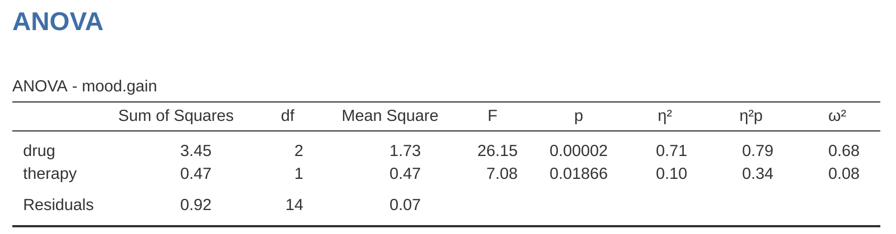
```

因為這個結果與前面執行過的變異數分析完全相同，很顯然沒有什麼要再補充說明的。接著改用`druganxifree`、`drugjoyzepam`與 `CBTtherapy`作為預測變項執行迴歸分析。結果展示在 @fig-fig13-21 。

<!--- 顯然，這裡沒有什麼驚喜。這正是我們之前執行的相同 ANOVA。接下來，讓我們使用 druganxifree、drugjoyzepam 和 CBTtherapy 作為預測因子進行迴歸。結果顯示在 @fig-fig13-21。

Obviously, there are no surprises here. That's the exact same ANOVA that we ran earlier. Next, let's run a regression using druganxifree, drugjoyzepam and CBTtherapy as the predictors. The results are shown in @fig-fig13-21. --->

```{r}
#| label: fig-fig13-21
#| classes: .enlarge-image
#| fig-cap: clinicaltrial資料的迴歸分析結果表，包含對比變項 druganxifree 和 drugjoyzepam
#jamovi regression results, with contrast variables druganxifree and drugjoyzepam
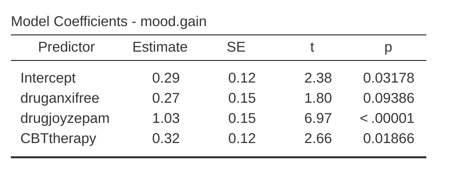
```

嗯，這個新輸出的表格與前一個完全不同。不出我們的預期，迴歸分析的報表會分開呈現三個預測變項的結果，如同之前曾做過的迴歸分析。一方面，我們可以看到 `CBTtherapy` 變項的 p 值，與變異數分析報表裡的 `therapy` p 值完全相同，這讓我們能確認迴歸模型處理這個變項的方式，與變異數分析是一樣的。另一方面，迴歸模型將 `druganxifree` 與 `drugjoyzepam` 這兩個對比變項分別進行檢定，彷彿兩者是完全無關的變項。

這種處理方式並不令人意外，因為迴歸模型不可能意識 `drugjoyzepam` 與 `druganxifree` 是來自重新編碼 `drug`的三個水準，所構成的兩個對比。對迴歸模型來說，這兩個變項之間的關聯性，跟 `drugjoyzepam` 與 `CBTtherapy` 之間沒什麼兩樣。然而，我們心知肚明，我們真正關心的並非這兩個對比是否各自顯著，而是想知道 `drug` 這個因子有沒有顯現**整體**效果。

也就是說，我們要用 jamovi 執行某種**模型比較檢定 (model comparison test)**，這個檢定能將兩個與「藥物」相關的對比項綁在一起進行評估。聽起來很熟悉吧？只要指定一個只包含 `CBTtherapy` 這個預測變項的虛無模型 (null model)，而且這個虛無模型不要納入兩個與代表藥物的二元對比變項即可，參考 @fig-fig13-22 的示範。


<!--- 嗯。這不是我們上次得到的相同輸出。毫不奇怪，迴歸輸出將每個預測因子的結果分別打印出來，就像我們之前進行迴歸分析的每一次一樣。一方面，我們可以看到 CBTtherapy 變量的 p 值與我們原始 ANOVA 中治療因子的 p 值完全相同，因此我們可以放心，迴歸模型與 ANOVA 做的事情相同。另一方面，這個迴歸模型分別測試 druganxifree 對比和 drugjoyzepam 對比，好像它們是兩個完全無關的變量。當然，這並不奇怪，因為可憐的迴歸分析根本無法知道 drugjoyzepam 和 druganxifree 實際上是我們用來編碼三級藥物因子的兩個不同對比。就它所知，drugjoyzepam 和 druganxifree 與 drugjoyzepam 和 therapyCBT 之間的關係沒有任何區別。然而，您和我都知道得更好。在這個階段，我們根本不感興趣確定這兩個對比是否各自具有顯著性。我們只想知道是否存在藥物的“整體”效果。也就是說，我們希望 jamovi 執行某種“模型比較”檢驗，在此檢驗中，為了檢驗的目的，將兩個“與藥物相關”的對比合併在一起。聽起來熟悉嗎？我們所需要做的就是指定我們的零假設模型，該模型將包括 CBTtherapy 預測因子，並省略所有與藥物相關的變量，如 @fig-fig13-22 所示。

Hmm. This isn't the same output that we got last time. Not surprisingly, the regression output prints out the results for each of the three predictors separately, just like it did every other time we conducted a regression analysis. On the one hand we can see that the p-value for the CBTtherapy variable is exactly the same as the one for the therapy factor in our original ANOVA, so we can be reassured that the regression model is doing the same thing as the ANOVA did. On the other hand, this regression model is testing the druganxifree contrast and the drugjoyzepam contrast *separately*, as if they were two completely unrelated variables. It's not surprising of course, because the poor regression analysis has no way of knowing that drugjoyzepam and druganxifree are actually the two different contrasts that we used to encode our three-level drug factor. As far as it knows, drugjoyzepam and druganxifree are no more related to one another than drugjoyzepam and therapyCBT. However, you and I know better. At this stage we're not at all interested in determining whether these two contrasts are individually significant. We just want to know if there's an "overall" effect of drug. That is, what we want jamovi to do is to run some kind of "model comparison" test, one in which the two "drugrelated" contrasts are lumped together for the purpose of the test. Sound familiar? All we need to do is specify our null model, which in this case would include the CBTtherapy predictor, and omit both of the drug-related variables, as in @fig-fig13-22. --->

```{r}
#| label: fig-fig13-22
#| classes: .enlarge-image
#| fig-cap: 迴歸分析的模型比較，模型 1(虛無)對比模型 2(含藥物變項)
#Model comparison in jamovi regression, null model 1 vs. contrasts model 2
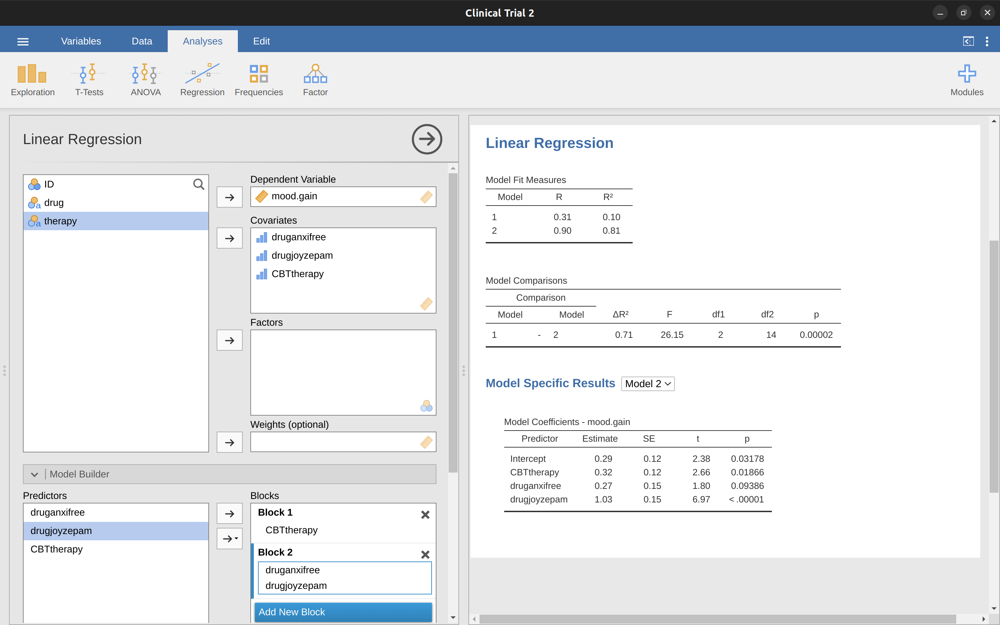
```

啊，這樣看起來好多了。報表的 F 統計值為 26.15，自由度為 2 與 14，p 值為 0.00002。這些數值與原先ANOVA報表的`drug` 主要效果所得到的數值完全相同。因此再一次證實，變異數分析與迴歸分析本質上是同一回事。它們都是一種線性模型，而且變異數分析的底層統計機制與迴歸模型分析的機制完全相同。理解這個事實是非常重要的，因為本章的剩餘部分的學習，將會相當依賴這個概念。

雖然為了證明變異數分析與迴歸模型的底層機制相同，我們大費周章地在 jamovi 建立兩個新的對比變項 `druganxifree` 與 `drugjoyzepam`，其實 jamovi 的線性迴歸分析模組，有一個更便捷的做法，參考 @fig-fig13-23 的示範。

jamovi 模組設計的巧妙之處，在於它允許使用者直接將要設定為**因子**的預測變項，直接當作**因子(factor)**加入模型！很聰明吧！使用者還可以設定**參考水準 (Reference Levels)**，指定要以哪一組作為比較的基準。這裡我們分別設定為 `placebo` 與 `no.therapy`，因為這樣最能詮釋結果的意義。


<!--- 啊，這樣好多了。我們的 F 統計量是 26.15，自由度是 2 和 14，p 值是 0.00002。這些數字與我們在原始變異數分析中得到的藥物主效應的數字相同。我們再次看到，變異數分析和迴歸本質上是相同的。它們都是線性模型，變異數分析的底層統計機制與迴歸中使用的機制相同。這一事實的重要性不應被低估。在本章的其餘部分，我們將重點依賴這個想法。

雖然我們在 jamovi 中計算了新變量 druganxifree 和 drugjoyzepam 進行對比，僅僅為了顯示變異數分析和迴歸本質上是相同的，在 jamovi 線性迴歸分析中實際上有一個巧妙的捷徑來獲得這些對比，見 @fig-fig13-23。jamovi 在這裡做的是允許您將因子作為預測變量輸入，等待它...因子！聰明，對吧。您還可以通過 'Reference Levels' 選項指定要用作參考級別的組。我們將其分別更改為 'placebo' 和 'no.therapy'，因為這是最有意義的。


Ah, that's better. Our F-statistic is 26.15, the degrees of freedom are 2 and 14, and the p-value is 0.00002. The numbers are identical to the ones we obtained for the main effect of drug in our original ANOVA. Once again we see that ANOVA and regression are essentially the same. They are both linear models, and the underlying statistical machinery for ANOVA is identical to the machinery used in regression. The importance of this fact should not be understated. Throughout the rest of this chapter we're going to rely heavily on this idea.

Although we went through all the faff of computing new variables in jamovi for the contrasts druganxifree and drugjoyzepam, just to show that ANOVA and regression are essentially the same, in the jamovi linear regression analysis there is actually a nifty shortcut to get these contrasts, see @fig-fig13-23. What jamovi is doing here is allowing you to enter the predictor variables that are factors as, wait for it...factors! Smart, eh. You can also specify which group to use as the reference level, via the 'Reference Levels' option. We've changed this to 'placebo' and 'no.therapy', respectively, because this makes most sense. --->

```{r}
#| label: fig-fig13-23
#| classes: .enlarge-image
#| fig-cap: 包含所有因子和對比的迴歸分析，包括整體變異數分析檢定結果
#Regression analysis with factors and contrasts in jamovi, including omnibus ANOVA test results
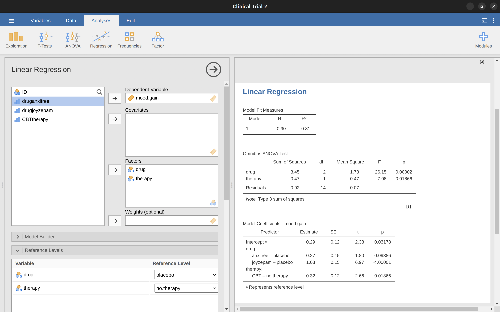
```


若是再開啟選單「模型係數 (Model Coefficients)」，點選「整體檢定 (Omnibus Test)」下方的「ANOVA 檢定 (ANOVA Test)」，便會看到  @fig-fig13-23 所展示的報表：F 統計值為 26.15，自由度為 2 與 14，p 值為 0.00002。這些數字與我們原始 ANOVA 表格的`drug` 主要效果所得到的數值完全相同。這裡再次驗證ANOVA 與迴歸本質上是同一回事。

<!--- 如果您還在 'Model Coefficients' - 'Omnibus Test' 選項下勾選 'ANOVA' 檢驗復選框，我們會看到 F 統計量為 26.15，自由度為 2 和 14，p 值為 0.00002（@fig-fig13-23）。這些數字與我們在原始變異數分析中得到的藥物主效應的數字相同。再次，我們看到變異數分析和迴歸本質上是相同的。它們都是線性模型，變異數分析的底層統計機制與迴歸中使用的機制相同。

If you also click on the 'ANOVA' test checkbox under the 'Model Coefficients' - 'Omnibus Test' option, we see that the F-statistic is 26.15, the degrees of freedom are 2 and 14, and the p-value is 0.00002 (@fig-fig13-23). The numbers are identical to the ones we obtained for the main effect of drug in our original ANOVA. Once again, we see that ANOVA and regression are essentially the same. They are both linear models, and the underlying statistical machinery for ANOVA is identical to the machinery used in regression. --->

### 自由度就是計算有多少參數

終於，到了這裡可以給出一個令人滿意的自由度定義了：**自由度就是模型中需要被估計的參數 (parameters) 個數**。就迴歸模型或 ANOVA 而言，參數的個數即對應的迴歸係數 (即 b 值) 數量，其中也包含截距項。請讀者記住，任何 F 檢定，都必然是兩個模型之間的比較，第一個自由度 ($df_1$)的意義就是兩個模型參數個數之間的差異值。舉例來說，前一小節示範的比較模型步驟裡，虛無模型 (`mood.gain ~ therapyCBT`) 有兩個參數：一個是 `therapyCBT` 變項的迴歸係數，另一個是截距項。而對立模型 (`mood.gain ~ druganxifree + drugjoyzepam + therapyCBT`) 則有四個參數：三個對比變項各有一個迴歸係數，再加上一個截距項。因此，這兩個模型之間參數數量差異便是自由度 $df_1 = 4 - 2 = 2$。

那麼，在某些看似沒有虛無模型的案例，該如何理解自由度的意義呢？例如，jamovi 線性迴歸分析的「模型配適度 (Model Fit)」功能，也有做 F 檢定。之前我們說過這對「整個迴歸模型」的檢定。然而，實際上這依然是兩個模型之間的比較。這種狀況的**虛無模型**是一個只包含 1 個迴歸係數 (即截距項) 的最簡模型。**對立模型**則包含 $K + 1$ 個迴歸係數 (K 個預測變項加上截距項)。因此，這個 F 檢定的自由度，就是 $df_1 = (K + 1) - 1 = K$。

那麼 F 檢定的第二個自由度 ($df_2$) 又代表什麼呢？這個自由度永遠都與殘差有關。我們同樣也可以從參數的角度來思考如何解釋，不過可能有點違反一般人的直覺。

各位可以這麼想：假設整個研究的觀測值總數為 N。想要模型「完美地」描述這 N 個數值，我們就需要...不用懷疑，N 個參數。當我們建立一個迴歸模型時，其實就是嘗試用其中一部分參數，能夠完美地描述整體資料。若模型有 K 個預測變項與一個截距項，就是代表我們已經用掉了 $K+1$ 個參數。如果不繼續深究具體細節，我們還需要多少個參數，才能將這個含有 $K+1$ 個參數的迴歸模型，轉變為一個能完美重現原始資料的模型呢？若是讀者心中想的是 $(K + 1) + (N - K - 1) = N$，所以答案必然是 $N - K - 1$——恭喜你，你答對了！

原則上，我們可以想像一個最複雜的迴歸模型，每一個資料點都是模型的一個參數，如此能完美地描述資料。這個「完整模型」會包含 N 個參數。而這裡所關心的殘差自由度，便是這個完整模型所需的參數個數 (N)，與我們實際接受的較簡潔模型所使用的參數個數 ($K+1$) 之間的差異值。因此，F 檢定中的第二個自由度便是 $df_2 = N - (K + 1)$，也就是 $N - K - 1$。這裡的 K，是指迴歸模型包含的預測變項個數，在 ANOVA 則是指二元對比變項的個數。以前一小節討論的範例來說，資料集有 $N=18$ 個觀測值，而 ANOVA 模型有 $K+1=4$ 個迴歸係數 (3 個對比變項 + 1 個截距)，因此殘差自由度為 $df_2 = 18 - 4 = 14$。


<!--- 經過漫長的等待，我終於可以給出一個我滿意的自由度定義。自由度是根據模型中需要估計的參數數量來定義的。對於迴歸模型或變異數分析，參數數量對應於迴歸係數的數量（即 b 值），包括截距。請記住，任何 F 檢驗都始終是兩個模型之間的比較，第一個 df 是參數數量的差。例如，在上面的模型比較中，零模型（mood.gain ~ therapyCBT）有兩個參數：therapyCBT 變量的一個迴歸係數和截距的第二個參數。替代模型（mood.gain ~ druganxifree + drugjoyzepam + therapyCBT）有四個參數：三個對比中的一個迴歸係數和截距的一個參數。因此，這兩個模型之間的差的自由度是 $df_1 = 4 - 2 = 2$。

那麼，在似乎沒有零模型的情況下呢？例如，您可能正在考慮在「線性迴歸」-「模型擬合」選項下選擇「F 檢驗」時出現的 F 檢驗。我最初將其描述為對整個迴歸模型的檢驗。然而，這仍然是兩個模型之間的比較。零模型是僅包含 1 個迴歸係數的簡單模型，用於截距項。替代模型包含 $K + 1$ 個迴歸係數，每個 K 個預測變量一個，再加上截距。因此，您在此 F 檢驗中看到的 df 值等於 $df_1 = K + 1 - 1 = K$。

那麼，在 F 檢驗中出現的第二個 df 值呢？這總是指與殘差相關的自由度。也可以用參數的方式來思考這個問題，但這有點反直覺。想象一下，假設整個研究的觀察值總數為 N。如果您想完美地描述這些 N 個值，您需要使用... N 個數字。當您建立迴歸模型時，您實際上在指定一些數字需要完美地描述數據。如果您的模型有 $K$ 個預測變量和一個截距，那麼您已經指定了 $K + 1$ 個數字。那麼，無需確定這將如何完成，您認為還需要多少數字才能將 K 个 1 參數迴歸模型轉換為原始數據的完美描述呢？如果您發現自己在想 $(K + 1) + (N - K - 1) = N$，因此答案必須是 $N - K - 1$，那就做得很好！這正是對的。原則上，您可以想像一個包含每個數據點的參數的極其複雜的迴歸模型，它當然可以完美地描述數據。這個模型總共包含了 $N$ 個參數，但是我們感興趣的是描述這個完整模型（即 $N$）所需的參數數量與您實際感興趣的更簡單的迴歸模型所使用的參數數量（即 $K + 1$）之間的差別，因此 F 檢驗中的第二個自由度是 $df_2 = N - K - 1$，其中 K 是預測變量的數量（在迴歸模型中）或對比的數量（在變異數分析中）。在我上面給出的示例中，數據集中有 $(N = 18$ 觀察值，並且與變異數分析模型相關的 $K + 1 = 4$ 個迴歸係數，因此殘差的自由度是 $df_2 = 18 - 4 = 14$。

At long last, I can finally give a definition of degrees of freedom that I am happy with. Degrees of freedom are defined in terms of the number of parameters that have to be estimated in a model. For a regression model or an ANOVA, the number of parameters corresponds to the number of regression coefficients (i.e. b-values), including the intercept. Keeping in mind that any F-test is always a comparison between two models and the first df is the difference in the number of parameters. For example, in the model comparison above, the null model (mood.gain \~ therapyCBT) has two parameters: there's one regression coefficient for the therapyCBT variable, and a second one for the intercept. The alternative model (mood.gain \~ druganxifree + drugjoyzepam + therapyCBT) has four parameters: one regression coefficient for each of the three contrasts, and one more for the intercept. So the degrees of freedom associated with the difference between these two models is $df_1 = 4 - 2 = 2$.

What about the case when there doesn't seem to be a null model? For instance, you might be thinking of the F-test that shows up when you select 'F Test' under the 'Linear Regression' - 'Model Fit' options. I originally described that as a test of the regression model as a whole. However, that is still a comparison between two models. The null model is the trivial model that only includes 1 regression coefficient, for the intercept term. The alternative model contains $K + 1$ regression coefficients, one for each of the K predictor variables and one more for the intercept. So the df value that you see in this F test is equal to $df_1 = K + 1 - 1 = K$.

What about the second df value that appears in the F-test? This always refers to the degrees of freedom associated with the residuals. It is possible to think of this in terms of parameters too, but in a slightly counter-intuitive way. Think of it like this. Suppose that the total number of observations across the study as a whole is N. If you wanted to perfectly describe each of these N values, you need to do so using, well... N numbers. When you build a regression model, what you're really doing is specifying that some of the numbers need to perfectly describe the data. If your model has $K$ predictors and an intercept, then you've specified $K + 1$ numbers. So, without bothering to figure out exactly how this would be done, how many more numbers do you think are going to be needed to transform a K \`1 parameter regression model into a perfect re-description of the raw data? If you found yourself thinking that $(K + 1) + (N - K - 1) = N$, and so the answer would have to be $N - K - 1$, well done! That's exactly right. In principle you can imagine an absurdly complicated regression model that includes a parameter for every single data point, and it would of course provide a perfect description of the data. This model would contain $N$ parameters in total, but we're interested in the difference between the number of parameters required to describe this full model (i.e. $N$) and the number of parameters used by the simpler regression model that you're actually interested in (i.e., $K +1$), and so the second degrees of freedom in the F test is $df_2 = N - K - 1$, where K is the number of predictors (in a regression model) or the number of contrasts (in an ANOVA). In the example I gave above, there are $(N = 18$ observations in the data set and $K + 1 = 4$ regression coefficients associated with the ANOVA model, so the degrees of freedom for the residuals is $df_2 = 18 - 4 = 14$. --->

## 各種多重比較方案

前一節已經展示一種將因子轉換為數個對比組合的方法。我們用這個方法指定一組二元變項，並定義如同 @tbl-tab13-11 展示的變項編碼。

<!--- 在上一節中，我向您展示了一種將因子轉換為對比組合的方法。在我向您展示的方法中，我們指定了一組二進制變量，其中我們定義了一個類似於 @tbl-tab13-11 的表格。

In the previous section, I showed you a method for converting a factor into a collection of contrasts. In the method I showed you we specify a set of binary variables in which we defined a table like @tbl-tab13-11. --->

```{r}
#| label: tbl-tab13-11
#| tbl-cap: 用以區分三種藥物的二元對比編碼
#Binary contrasts to discriminate between all three possible drugs
huxtabs[[14]][[11]]
```

表格中的每一行，對應因子的其中一個水準；每一列，則對應一個對比。這個表格的行數永遠比列數多一，這樣的表格有一個特殊的專有名詞：**對比矩陣 (contrast matrix)**。

設定對比矩陣的方式其實有很多種。這一節將討論幾種統計學家常用的標準對比矩陣，以及如何在 jamovi 設定對比矩陣。若讀者打算接著學習 @sec-Factorial-ANOVA-unbalanced-design ，仔細閱讀這一節會很有幫助。反之，若無此打算，大致看過即可，因為就平衡設計而言，對比方式怎麼設定並不太重要。


<!--- 表格中的每一行對應於因子水平之一，每一列對應於對比之一。這個表格，始終比列多一行，有一個特殊的名稱。它被稱為對比矩陣。然而，有很多不同的方法可以指定對比矩陣。在本節中，我討論了統計學家使用的一些標準對比矩陣以及如何在 jamovi 中使用它們。如果您打算稍後閱讀[因子變異數分析 3：不平衡設計]一節，那麼仔細閱讀本節是值得的。如果沒有，您可以瀏覽一下它，因為對於平衡設計來說，對比的選擇並不重要。

Each row in the table corresponds to one of the factor levels, and each column corresponds to one of the contrasts. This table, which always has one more row than columns, has a special name. It is called a contrast matrix. However, there are lots of different ways to specify a contrast matrix. In this section I discuss a few of the standard contrast matrices that statisticians use and how you can use them in jamovi. If you're planning to read the section on [Factorial ANOVA 3: unbalanced designs] later on, it's worth reading this section carefully. If not, you can get away with skimming it, because the choice of contrasts doesn't matter much for balanced designs. --->

### 比較操作效果

先前所描述的對比編碼，我們設想某一個水準是特殊的，被當作是因子水準之間的**基準線 (baseline)**，例如前述範例的「安慰劑」。至於其他水準的編碼，都是根據這個基準線。這種對比編碼有個專有名稱，稱為**處理對比 (treatment contrasts)**，有時也被稱做**虛擬編碼 (dummy coding)**。這種對比編碼的每一個因子水準，都會與一個參考基準線相互比較，而這條基準線，就是截距項的數值。

之所以會這樣稱呼，是因為當因子中的某一水準確實是代表基準數值，採用這種對比編碼便會相當自然合理。這在臨床試驗範例資料是說得通的：「安慰劑」這個條件對應的是不給予受試者任何真正藥物的情境，因此可以做為基準線。另外兩個藥物條件，都是相對於安慰劑來做編碼：一個是用 Anxifree 取代安慰劑，另一個是用 Joyzepam 取代安慰劑。

這一節開頭展示的表格，是一個因子有三個水準的處理對比矩陣。但要怎麼設定有五個水準的因子處理對比矩陣呢？建議設定可參考 @tbl-tab13-12 。

<!--- 在我上面描述的這種對比中，因子的一個水平是特殊的，並作為一種 "基線" 類別（例如，在我們的示例中是安慰劑），其他兩個則是根據這個基線來定義的。這種對比的名稱是治療對比，也稱為 "哑变量编码"。在此對比中，因子的每個水平都與基本參考水平進行比較，基本參考水平是截距的值。

這個名字反映了這樣一個事實，當你的因子中的一個類別確實很特殊，因為它確實代表了基線時，這些對比是非常自然和合理的。這在我們的臨床試驗示例中是有道理的。安慰劑條件對應於不給人們使用任何真正的藥物的情況，因此它是特殊的。其他兩個條件是相對於安慰劑定義的。在一種情況下，您用 Anxifree 替換安慰劑，而在另一種情況下，您用 Joyzepam 替換安慰劑。

上面顯示的表格是具有3個水平的因子的治療對比矩陣。但是，如果我想要一個具有5個水平的因子的治療對比矩陣呢？您可以像 @tbl-tab13-12 那樣排列它。


In the particular kind of contrasts that I've described above, one level of the factor is special, and acts as a kind of "baseline" category (i.e., placebo in our example), against which the other two are defined. The name for these kinds of contrasts is treatment contrasts, also known as "dummy coding". In this contrast each level of the factor is compared to a base reference level, and the base reference level is the value of the intercept.

The name reflects the fact that these contrasts are quite natural and sensible when one of the categories in your factor really is special because it actually does represent a baseline. That makes sense in our clinical trial example. The placebo condition corresponds to the situation where you don't give people any real drugs, and so it's special. The other two conditions are defined in relation to the placebo. In one case you replace the placebo with Anxifree, and in the other case your replace it with Joyzepam.

The table shown above is a matrix of treatment contrasts for a factor that has 3 levels. But suppose I want a matrix of treatment contrasts for a factor with 5 levels? You would set this out like @tbl-tab13-12. --->

```{r}
#| label: tbl-tab13-12
#| tbl-cap: 因子有五個水準的處理對比矩陣
#Matrix of treatment contrasts with 5 levels
huxtabs[[14]][[12]]
```

在這個範例裡，第一個對比是水準 2 與水準 1 的比較，第二個對比是水準 3 與水準 1 的比較，依此類推。請注意，在預設情況下，因子的*第一個*水準，永遠會被視為基準線，也就是整列是 0、沒有自身對比項的那一組。jamovi 的使用者可以透過調整「資料變項 (Data Variable)」選單的變項水準順序，來指定要將哪一個水準設為因子的基準線。請在試算表欄位中，對變項名稱雙擊滑鼠左鍵，即可開啟「資料變項」視窗。


<!--- 在這個例子中，第一個對比是第2級與第1級比較，第二個對比是第3級與第1級比較，依此類推。請注意，默認情況下，因子的*第一*水平始終被視為基線類別（即，它是所有零的那個，並且沒有與之相關的顯式對比）。在 jamovi 中，您可以通過操作 "數據變量" 窗口中顯示的變量的水平來更改哪個類別是因子的第一個水平（雙擊電子表格列中的變量名稱以彈出 "數據變量" 視圖。

In this example, the first contrast is level 2 compared with level 1, the second contrast is level 3 compared with level 1, and so on. Notice that, by default, the *first* level of the factor is always treated as the baseline category (i.e., it's the one that has all zeros and doesn't have an explicit contrast associated with it). In jamovi you can change which category is the first level of the factor by manipulating the order of the levels of the variable shown in the 'Data Variable' window (double click on the name of the variable in the spreadsheet column to bring up the 'Data Variable' view. --->

### Helmert 比較法

**處置對比**在許多研究案例中都很有用，但它最適用的狀況，是當因子中確實存在一個基準組別，且研究者的目的，是想將所有其他組別都與該基準組別進行比較時。然而，在某些情況裡，並不會存在一個能做比較的基準類別，這時比較每組與**先前**的所有組別平均數，可能更有意義。

這便是可發揮 **Helmert 對比 (Helmert contrasts)** 的狀況。 jamovi 使用者可透過「變異數分析 (ANOVA)」–「對比 (Contrasts)」選單裡的 `helmert` 選項來設定。Helmert 對比的概念，是比較每一組與「先前」的所有組平均數。也就是說，第一個對比是比較第 2 組與第 1 組；第二個對比是比較第 3 組與第 1、2 兩組的平均數，依此類推。對於因子有五個水準的狀況，Helmert 對比矩陣的設定如同 @tbl-tab13-13 示範。


<!--- 治療對比在很多情況下都很有用。然而，它們在真正存在基線類別的情況下最有意義，並且您希望根據該類別評估所有其他組。然而，在其他情況下，可能不存在這樣的基線類別，與其將每個組與其他組的平均值進行比較可能更有意義。這就是我們遇到 Helmert 對比的地方，由 jamovi 'ANOVA' - 'Contrasts' 選擇框中的 'helmert' 選項生成。Helmert 對比背後的想法是將每個組與 "前一個" 組的平均值進行比較。也就是說，第一個對比表示第2組和第1組之間的差異，第二個對比表示第3組與第1組和第2組的平均值之間的差異，依此類推。對於具有五個水平的因子，這轉換為看起來像 @tbl-tab13-13 的對比矩陣。


Treatment contrasts are useful for a lot of situations. However, they make most sense in the situation when there really is a baseline category, and you want to assess all the other groups in relation to that one. In other situations, however, no such baseline category exists, and it may make more sense to compare each group to the mean of the other groups. This is where we meet Helmert contrasts, generated by the 'helmert' option in the jamovi 'ANOVA' - 'Contrasts' selection box. The idea behind Helmert contrasts is to compare each group to the mean of the "previous" ones. That is, the first contrast represents the difference between group 2 and group 1, the second contrast represents the difference between group 3 and the mean of groups 1 and 2, and so on. This translates to a contrast matrix that looks like @tbl-tab13-13 for a factor with five levels. --->

```{r}
#| label: tbl-tab13-13
#| tbl-cap: 因子有五個水準的 Helmert 對比矩陣
#Matrix of helmert contrasts with 5 levels
huxtabs[[14]][[13]]
```

Helmert 對比的一種實用特性，是每一個對比項的總和皆為零，也就是矩陣中各列的總和均為零。這種特性帶來的好處是：當我們將 ANOVA 當成迴歸模型時，採用 Helmert 對比，截距項所對應的數值就是全部資料的總平均數 ($\mu_{..}$)。與處置對比的不同處是，後者的截距項對應的是基準類別的組別平均數。

這種特性在某些情況下非常有用。雖然本書至今示範的平衡設計資料裡，這個特性不是那麼重要，但後續如果要學習 @sec-Factorial-ANOVA-unbalanced-design ，將變得至關重要。其實，我們之所以不厭其煩地介紹這套編碼，主要原因便是：若讀者想透徹理解不平衡設計的 ANOVA，對比編碼的概念將是關鍵。


<!--- Helmert 對比的一個有用之處是每個對比都加起來為零（即，所有列加起來為零）。這導致了當我們將 ANOVA 解釋為回歸時，如果我們使用 Helmert 對比，截距項對應於大平均數 $\mu_{..}$。將其與治療對比進行比較，在治療對比中，截距項對應於基線類別的組平均值。這個性質在某些情況下可能非常有用。如果您有一個平衡設計，這並不太重要，到目前為止，我們一直在這樣假設，但是當我們考慮[不平衡設計]( @sec-Factorial-ANOVA-unbalanced-design )時，它將變得重要。事實上，我甚至麻煩包括這一部分的主要原因是，如果您想了解不平衡 ANOVA，對比變得很重要。

One useful thing about Helmert contrasts is that every contrast sums to zero (i.e., all the columns sum to zero). This has the consequence that, when we interpret the ANOVA as a regression, the intercept term corresponds to the grand mean $\mu_{..}$ if we are using Helmert contrasts. Compare this to treatment contrasts, in which the intercept term corresponds to the group mean for the baseline category. This property can be very useful in some situations. It doesn't matter very much if you have a balanced design, which we've been assuming so far, but it will turn out to be important later when we consider [unbalanced designs](Factorial ANOVA: unbalanced designs). In fact, the main reason why I've even bothered to include this section is that contrasts become important if you want to understand unbalanced ANOVA. --->

### 簡單比較

第三種要稍做介紹的對比編碼，稱為「**和為零對比 (sum to zero contrasts)**」，jamovi 功能選單的選項是「簡易對比 (Simple)」。這種功能被用來建構組別之間的**成對比較 (pairwise comparisons)**。具體來說，每一個對比的編碼，都是某個組別與基準類別之間的差異；這種對比編碼的基準類別，對應的是第一個組別 (@tbl-tab13-14)。


<!--- 第三個選項是我應該簡要提及的 "總和至零" 對比，在 jamovi 中稱為 "簡單" 對比，它們用於構建組間的兩兩比較。具體來說，每個對比都編碼了某個組與基線類別之間的差異，這種情況下基線類別對應於第一組 (@tbl-tab13-14)。

The third option that I should briefly mention are "sum to zero"總和至零 contrasts, called "Simple" contrasts in jamovi, which are used to construct pairwise comparisons between groups. Specifically, each contrast encodes the difference between one of the groups and a baseline category, which in this case corresponds to the first group (@tbl-tab13-14). --->

```{r}
#| label: tbl-tab13-14
#| tbl-cap: 因子有五個水準的和為零對比矩陣
#Matrix of 'sum-to' zero contrasts with 5 levels
huxtabs[[14]][[14]]
```


編碼方式與 Helmert 對比非常相似，對比矩陣的每一列總和也是零，這代表當 ANOVA 被視為迴歸模型時，截距項所對應的也是總平均數。在詮釋對比結果時，使用者要認知到，每一個對比都是第一組與其他其中一組之間的成對比較。具體而言，對比 1 代表的是「第 2 組減去第 1 組」的比較；對比 2 代表「第 3 組減去第 1 組」的比較，依此類推。[^factorial-anova-8]


[^factorial-anova-8]:
讀者可能會好奇，**處置對比**與**簡易對比**之間有何差異？以一個性別為主要效果案例來說，假設男性 (m) 編碼為 0，女性 (f) 編碼為 1。在**處置對比**中，迴歸係數所衡量的，是女性與男性平均數之間的差異，而截距項則會是男性的平均數 (基準組)。然而，若採用**簡易對比** (例如將男性編碼為 -1，女性為 1)，截距項則是兩組平均數的平均值，也就是總平均數。主要效果參數所代表的，就是各組平均數與此截距項的差異值。

<!---與 Helmert 對比非常相似，我們看到每一列的和都是零，這意味著當 ANOVA 被視為回歸模型時，截距項對應於整體平均值。在解釋這些對比時，需要認識到的是，每個對比都是第1組與其他四個組之間的兩兩比較。具體來說，對比1對應於 "第2組減去第1組" 的比較，對比2對應於 "第3組減去第1組" 的比較，依此類推。[^factorial-anova-8]

[^factorial-anova-8]: 您可能會問，治療對比和簡單對比之間有什麼區別？以性別主效應為例，其中 $m=0$ 和 $f=1$。治療對比相應的係數將衡量女性和男性之間的平均值差異，截距將是男性的平均值。然而，對於簡單對比，即 $m=-1$ 和 $f=1$，截距是平均值的平均數，主效應是每個組平均值與截距的差異。

Much like Helmert contrasts, we see that each column sums to zero, which means that the intercept term corresponds to the grand mean when ANOVA is treated as a regression model. When interpreting these contrasts, the thing to recognise is that each of these contrasts is a pairwise comparison between group 1 and one of the other four groups. Specifically, contrast 1 corresponds to a "group 2 minus group 1" comparison, contrast 2 corresponds to a "group 3 minus group 1" comparison, and so on.[^factorial-anova-8]

[^factorial-anova-8]: What's the difference between treatment and simple contrasts, I hear you ask? Well, as a basic example consider a gender main effect, with $m=0$ and $f=1$. The coefficient corresponding to the treatment contrast will measure the difference in mean between females and males, and the intercept would be the mean of the males. However, with a simple contrast, i.e., $m=-1$ and $f=1$, the intercept is the average of the means and the main effect is the difference of each group mean from the intercept.--->

### jamovi的對比選項

jamovi 的 ANOVA 分析模組內建多種可產生各種對比編碼的選項。使用者可以在各種ANOVA主選單裡，從「對比 (Contrasts)」次選單中找到這些選項，如 @tbl-tab13-15 列出的說明：

<!--- jamovi 還提供了多種可以在 ANOVA 中生成不同類型對比的選項。這些可以在主要的 ANOVA 分析窗口的 '對比' 選項中找到，其中 @tbl-tab13-15 列出了對比類型：

jamovi also comes with a variety of options that can generate different kinds of contrasts in ANOVA. These can be found in the 'Contrasts' option in the main ANOVA analysis window, where the contrast types in @tbl-tab13-15 are listed: --->

```{r}
#| label: tbl-tab13-15
#| tbl-cap:  jamovi ANOVA 分析模組可用的對比類型
#Contrasts types available in the jamovi ANOVA analysis
huxtabs[[14]][[15]] |>
  set_align(everywhere, 2, "left")
```

## 事後檢定 {#sec-Post-hoc-tests}

現在轉換一下主題。有別於使用「對比」來檢定**事前計畫**的比較，假如我們執行了 ANOVA ，而且發現結果具有顯著效果。由於 F 檢定是一種「**總括檢定 (omnibus test)**」，它只告訴我們「所有組別平均數皆相等」這個虛無假說不成立，但是無法得知是**哪幾組**之間彼此不同。@sec-Comparing-several-means-one-way-ANOVA 曾經討論過這個課題，那裡介紹的解決方案，是為所有可能的組別配對都執行一次 t 檢定，並透過多重比較校正 (例如 Bonferroni 或 Holm 法) 來控制整體的**型一錯誤率 (Type I error rate)**。這個方法的優點是相對單純，而且適用多種需要檢定複數假設的情境；但是若要在多因子研究的狀況進行有效率的**事後比較 (post hoc testing)**，這種方法未必是最佳選擇。統計文獻中存在著非常多種執行多重比較的方法 [@Hsu1996]，逐一詳細介紹會超出這本入門教科書的範圍。

話雖如此，本書仍想特別介紹一套事後檢定方法，就是 Tukey 的「誠實顯著差異法」，簡稱 **Tukey’s HSD**。在這裡，我們將省略介紹公式，專注在理解背後的概念。Tukey’s HSD 的基本概念，是檢視所有相關組別之間的成對比較；也因此，只有在研究者所關心的確實是**成對差異**時，才合適使用 Tukey’s HSD 。[^factorial-anova-9]舉例來說，分析*clinicaltrial.csv* 資料集的因子設計ANOVA，在指定了「藥物」與「治療」兩個主要效果後，我們所關心的，便是以下四組的成對比較：

[^factorial-anova-9]: 舉例來說，若研究者想知道的是「A 組的平均數，是否與 B、C 兩組的**平均值**顯著不同」，那麼就需要使用不同的工具 (例如更為保守的 Scheffe 法，這也超出了本書範圍)。然而，在多數統計實務，研究者關心的通常是成對的組間差異，因此 Tukey’s HSD 是相當實用的工具。


* Anxifree vs. 安慰劑，兩組在情緒改善程度上的差異。
* Joyzepam vs. 安慰劑，兩組在情緒改善程度上的差異。
* Anxifree vs. Joyzepam，兩組在情緒改善程度上的差異。
* CBT 治療 vs. 無治療，兩組在情緒改善程度上的差異。

對於任何一組的比較，我們感興趣的都是各組別所代表的母群，所估計的平均數之間真實差異。Tukey's HSD 會運算全部四組比較，建構**同步信賴區間 (simultaneous confidence intervals)**。所謂 95%「同步」信賴區間的意思是：若我們重複這項研究非常多次，在 95% 的研究結果中，所有資料建構的信賴區間，都會**同時**包含所對應的真實參數值。此外，我們也可以利用這些信賴區間，來計算任何一種特定比較的校正後 p 值。

用 jamovi 執行 Tukey HSD 相當容易。使用者只需指定針對哪一個 ANOVA 模型的特定項，要進行事後比較。舉例來說，若我們想針對主要效果進行事後比較，並且不考慮 交互作用 ，操作步驟是：在 ANOVA 的分析視窗，點開「事後比較 (Post Hoc Tests)」次選單，將 `drug` 與 `therapy` 這兩個變項移至右方的對話框，然後從可用的校正方法選項，勾選「Tukey」。執行完成的結果報表，如同 @fig-fig13-24 展示。


<!--- 現在轉換到另一個主題。而不是使用對比測試您已經計劃好的比較，假設您已經完成了 ANOVA，結果發現您獲得了一些顯著的效果。因為 F 檢驗是“全面”檢驗，它們實際上只測試各組之間沒有差異的虛無假設，所以獲得顯著效果並不能告訴你哪些組與其他組有所不同。我們在 @sec-Comparing-several-means-one-way-ANOVA 中討論了這個問題，並且在那章節中，我們的解決方案是對所有可能的組對執行 t 檢驗，對多重比較（例如，Bonferroni、Holm）進行校正，以控制所有比較中的 I 類型誤差率。我們在 @sec-Comparing-several-means-one-way-ANOVA 中使用的方法具有相對簡單的優點，並且可以在您在測試多個假設的多種不同情況下使用，但它們並非在 ANOVA 背景下進行有效的事後檢驗的最佳選擇。統計文獻中有很多用於執行多重比較的方法[@Hsu1996]，本書將超出範疇，無法詳細討論所有這些方法。

話雖如此，有一個工具我想引起您的注意，那就是 Tukey 的 "誠實顯著差異"，簡稱**Tukey's HSD**。這次，我將不提供公式，只講解質性思路。Tukey's HSD 的基本思想是檢查所有相關的組之間的成對比較，而且只有在您對成對差異感興趣時，使用 Tukey's HSD 才合適。[^factorial-anova-9] 例如，前面我們使用 *clinicaltrial.csv* 數據集進行了因子 ANOVA，並指定了藥物的主要作用和治療的主要作用，我們對以下四種比較感興趣：

[^factorial-anova-9]: 如果，例如，你實際上想知道 A 組與 B 組和 C 組的平均值之間是否存在顯著差異，那麼你需要使用另一種工具（例如，更保守的 Scheffe's 方法，這超出了本書的範疇）。然而，在大多數情況下，您可能對成對組別的差異感興趣，所以 Tukey 的 HSD 是一個相當有用的工具。

- 給予 Anxifree 的人與給予安慰劑的人的情緒提升之間的差異。
- 給予 Joyzepam 的人與給予安慰劑的人的情緒提升之間的差異。
- 給予 Anxifree 的人與給予 Joyzepam 的人的情緒提升之間的差異。
- 接受 CBT 治療的人與未接受治療的人的情緒提升之間的差異。

對於這些比較中的任何一個，我們都對（群體）組平均值之間的真實差異感興趣。Tukey 的 HSD 會為這四種比較構建同時置信區間。我們所說的 95% "同時"置信區間是指，如果我們重複這個研究很多次，那麼在 95% 的研究結果中，置信區間將包含相關的真實值。此外，我們可以使用這些置信區間計算任何特定比較的校正 p 值。

在 jamovi 中使用 TukeyHSD 函數非常容易。您只需指定要為其執行事後檢驗的 ANOVA 模型項。例如，如果我們要為主效應進行事後檢驗，但不考慮交互作用，我們將在 ANOVA 分析屏幕中打開“事後檢驗”選項，將藥物和治療變量移到右側的框中，然後在可能的事後校正列表中選中“Tukey”複選框。這與相應的結果表在 @fig-fig13-24 中顯示。

Time to switch to a different topic. Rather than pre-planned comparisons that you have tested using contrasts, let's suppose you've done your ANOVA and it turns out that you obtained some significant effects. Because of the fact that the F-tests are "omnibus" tests that only really test the null hypothesis that there are no differences among groups, obtaining a significant effect doesn't tell you which groups are different to which other ones. We discussed this issue back in @sec-Comparing-several-means-one-way-ANOVA, and in that chapter our solution was to run t-tests for all possible pairs of groups, making corrections for multiple comparisons (e.g., Bonferroni, Holm) to control the Type I error rate across all comparisons. The methods that we used back in @sec-Comparing-several-means-one-way-ANOVA have the advantage of being relatively simple and being the kind of tools that you can use in a lot of different situations where you're testing multiple hypotheses, but they're not necessarily the best choices if you're interested in doing efficient post hoc testing in an ANOVA context. There are actually quite a lot of different methods for performing multiple comparisons in the statistics literature [@Hsu1996], and it would be beyond the scope of an introductory text like this one to discuss all of them in any detail.

That being said, there's one tool that I do want to draw your attention to, namely Tukey's "Honestly Significant Difference", or **Tukey's HSD** for short. For once, I'll spare you the formulas and just stick to the qualitative ideas. The basic idea in Tukey's HSD is to examine all relevant pairwise comparisons between groups, and it's only really appropriate to use Tukey's HSD if it is pairwise differences that you're interested in.[^factorial-anova-9] For instance, earlier we conducted a factorial ANOVA using the *clinicaltrial.csv*  data set, and where we specified a main effect for drug and a main effect of therapy we would be interested in the following four comparisons:

[^factorial-anova-9]: If, for instance, you actually find yourself interested to know if Group A is significantly different from the mean of Group B and Group C, then you need to use a different tool (e.g., Scheffe's method, which is more conservative, and beyond the scope of this book). However, in most cases you probably are interested in pairwise group differences, so Tukey's HSD is a pretty useful thing to know about.

- The difference in mood gain for people given Anxifree versus people given the placebo.
- The difference in mood gain for people given Joyzepam versus people given the placebo.
- The difference in mood gain for people given Anxifree versus people given Joyzepam.
- The difference in mood gain for people treated with CBT and people given no therapy.

For any one of these comparisons, we're interested in the true difference between (population) group means. Tukey's HSD constructs simultaneous confidence intervals for all four of these comparisons. What we mean by 95% "simultaneous" confidence interval is that, if we were to repeat this study many times, then in 95% of the study results the confidence intervals would contain the relevant true value. Moreover, we can use these confidence intervals to calculate an adjusted p value for any specific comparison.

The TukeyHSD function in jamovi is pretty easy to use. You simply specify the ANOVA model term that you want to run the post hoc tests for. For example, if we were looking to run post hoc tests for the main effects but not the interaction, we would open up the 'Post Hoc Tests' option in the ANOVA analysis screen, move the drug and therapy variables across to the box on the right, and then select the 'Tukey' checkbox in the list of possible post hoc corrections that could be applied. This, along with the corresponding results table, is shown in @fig-fig13-24. --->

```{r}
#| label: fig-fig13-24
#| classes: .enlarge-image
#| fig-cap: jamovi 因子設計ANOVA 的 Tukey HSD 事後比較 (模型不含交互作用項)
#Tukey HSD post hoc test in jamovi factorial ANOVA, without an interaction term
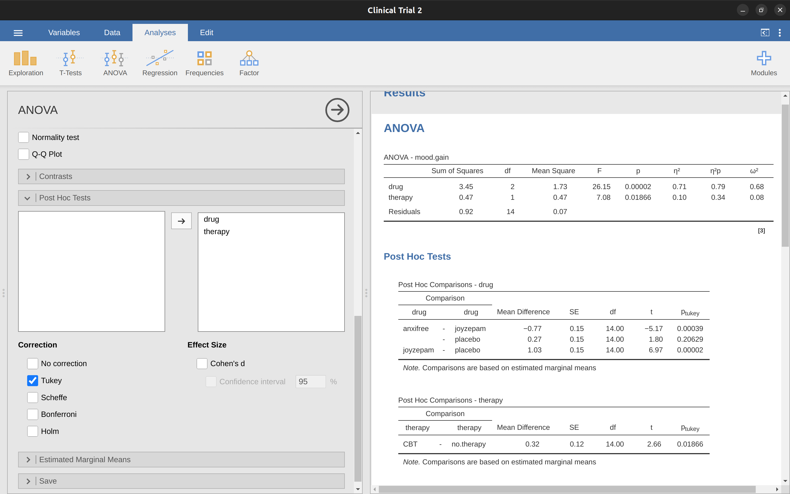
```


「事後比較」結果報表的內容相當簡單明瞭。舉例來說，第一組比較的是 Anxifree 與安慰劑的差異，報表的第一部分顯示，兩組平均數的觀測差異值為 .27。下一個數值是差異的標準誤，雖然目前版本的 jamovi 尚未直接提供，但是讀者若有需要，可以據此計算出 95% 信賴區間。接著依序是自由度、t 統計值，以及 p 值。從表格內容可以知道，第一組比較的校正後 p 值為 .21。相對地，下一行顯示 Joyzepam 與安慰劑的觀測差異值為 1.03，且此結果達到顯著水準 ($p < .001$)。

目前為止，一切順利。那麼，如果分析模型有交互作用項時，要如何處理呢？舉例來說，jamovi 的預設選項，便是設定「藥物」與「治療」之間存在交互作用。在這種情況，我們需要考慮的成對比較數量便會開始增加。

如前所述，我們還是要考慮與「藥物」主要效果相關的三組比較，以及與「治療」主要效果相關的唯一一組比較。但是要探討交互作用顯著的原因時，就要找出是哪些組別的差異，造成了交互作用顯著，便需考慮以下的比較組合：

* 使用 Anxifree 且接受 CBT 治療者 vs. 使用安慰劑且接受 CBT 治療者，兩者在情緒改善程度上的差異。
* 使用 Anxifree 且未接受治療者 vs. 使用安慰劑且未接受治療者，兩者在情緒改善程度上的差異。
* ...以此類推。

我們會發現需要考慮的比較組合數量相當多。因此，對這個包含交互作用的 ANOVA 模型執行 Tukey 事後分析後，會發現它計算了大量的成對比較 (總計 19 組)，如同 @fig-fig13-25 的展示。很明顯地，報表格式與前一個非常相似，只是比較的組數變得更多了。


<!--- 在「事後檢驗」結果表中顯示的輸出非常直觀。例如，第一個比較是Anxifree與安慰劑之間的差異，輸出的第一部分顯示組均值之間的觀察差異為0.27。接下來的數字是差異的標準誤，如果我們想要，我們可以根據此計算出95%置信區間，儘管jamovi目前尚不提供此選項。然後有一列是自由度，一列是t值，最後一列是p值。對於第一個比較，調整後的p值為0.21。相比之下，如果您看下一行，我們會發現安慰劑和Joyzepam之間的觀察差異為1.03，並且這個結果顯著（p < .001）。

到目前為止，一切都很好。那麼，如果您的模型包括交互作用項怎麼辦？例如，jamovi中的默認選項是允許藥物和療法之間存在交互作用。如果是這樣，我們需要考慮的兩兩比較數量開始增加。像以前一樣，我們需要考慮與藥物主效應相關的三個比較以及與療法主效應相關的一個比較。但是，如果我們要考慮顯著交互作用的可能性（並嘗試找到支持這一顯著交互作用的組差異），我們需要包括以下比較：

- 使用Anxifree並接受CBT治療的人的情緒增益與使用安慰劑並接受CBT治療的人的情緒增益之間的差異
- 使用Anxifree並不接受治療的人與使用安慰劑並不接受治療的人的情緒增益之間的差異。
- 等等

您需要考慮相當多的這些比較。因此，當我們對此ANOVA模型運行Tukey事後分析時，我們會發現它進行了很多兩兩比較（共19個），如@fig-fig13-25所示。您會發現它看起來與之前非常相似，但進行了更多的比較。


The output shown in the 'Post Hoc Tests' results table is (I hope) pretty straightforward. The first comparison, for example, is the Anxifree versus placebo difference, and the first part of the output indicates that the observed difference in group means is .27. The next number is the standard error for the difference, from which we could calculate the 95% confidence interval if we wanted, though jamovi does not currently provide this option. Then there is a column with the degrees of freedom, a column with the t-value, and finally a column with the p-value. For the first comparison the adjusted p-value is .21. In contrast, if you look at the next line, we see that the observed difference between joyzepam and the placebo is 1.03, and this result is significant (p < .001).

So far, so good. What about the situation where your model includes interaction terms? For instance, the default option in jamovi is to allow for the possibility that there is an interaction between drug and therapy. If that's the case, the number of pairwise comparisons that we need to consider starts to increase. As before, we need to consider the three comparisons that are relevant to the main effect of drug and the one comparison that is relevant to the main effect of therapy. But, if we want to consider the possibility of a significant interaction (and try to find the group differences that underpin that significant interaction), we need to include comparisons such as the following:

-   The difference in mood gain for people given Anxifree and treated with CBT, versus people given the placebo and treated with CBT
-   The difference in mood gain for people given Anxifree and given no therapy, versus people given the placebo and given no therapy.
-   etc

There are quite a lot of these comparisons that you need to consider. So, when we run the Tukey post hoc analysis for this ANOVA model, we see that it has made a lot of pairwise comparisons (19 in total), as shown in @fig-fig13-25. You can see that it looks pretty similar to before, but with a lot more comparisons made. --->

```{r}
#| label: fig-fig13-25
#| classes: .enlarge-image
#| fig-cap: jamovi 因子設計ANOVA 的 Tukey HSD 事後比較 (模型包含交互作用項)
#Tukey HSD post hoc test in jamovi factorial ANOVA with an interaction term
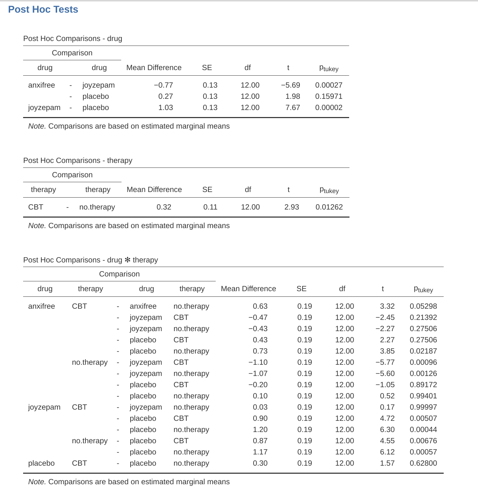
```

## 事前檢定方法 {#sec-The-method-of-planned-comparisons}

延續前面關於 ANOVA 中「對比」與「事後比較」的討論，本書認為**計畫式比較 (planned comparisons)** 也相當重要，值得在此簡單介紹。在關於多重比較方案的討論裡，包括這個單元，還有 @sec-Comparing-several-means-one-way-ANOVA ，都是預設研究者所執行的是**事後**比較。舉例來說，在藥物改善情緒的示範案例裡，研究者可能預期不同藥物對情緒會有不同效果，也就是假設藥物的主要效果存在，但是對於「效果會如何不同」，以及「哪些**成對比較**值得探討」，並沒有任何具體的事前假設。在這種情況，確實就需要像 Tukey's HSD 這類的事後比較方法。

然而，事前檢定的情況將會截然不同，如果研究者打從一開始要進行感興趣的特定比較，就會事先提出明確且具體的假說，並且絕對不打算探究任何事先指定範圍之外的比較。若是如此，且研究者能誠實、嚴格地堅守此「高尚的意圖」，不去執行任何額外的比較。就算是資料看起來，那些未曾預先設定假說的比較，呈現出**誘人的顯著效果 (deliciously significant effects)**，也不為所動。那麼採用像 Tukey's HSD 這樣的方法便不太合理。因為 Tukey's HSD 會對一整批研究者從未關心、也無意探究的比較，進行多餘的校正。在這種研究情境，研究者可以安心地執行有限數量的假說檢定，而無需進行多重比較校正。這種作法，便稱為「計畫式比較」，有時會應用於臨床試驗中。然而，更深入的探討已超出這本入門書的範圍，但至少，讀者現在知道有這類方法存在！


<!--- 延續前面關於ANOVA中對比和事後檢驗的部分，我認為預先設定的比較方法（planned comparisons）非常重要，值得簡要討論。在前面的章節以及@sec-Comparing-several-means-one-way-ANOVA中對多重比較的討論中，我們假設你想運行的檢驗確實是事後檢驗。例如，在上面的藥物示例中，可能你認為這些藥物對情緒的影響各有不同（即你假設藥物有主效應），但你沒有關於它們如何不同的具體假設，也沒有任何真正的想法關於哪些兩兩比較值得觀察。如果是這樣，那麼你確實需要使用Tukey的HSD來進行兩兩比較。

然而，情況會有所不同，如果你真的有關於哪些比較感興趣的確切、具體的假設，而且你絕對無意觀察除了提前指定的那些比較以外的任何其他比較。當這是真的，並且如果你真誠並嚴格地堅持不進行任何其他比較的高尚意圖（即使數據看起來似乎對你沒有假設的東西顯示出非常顯著的效應），那麼使用像Tukey的HSD這樣的方法並不合理，因為它對一整套你從未關心過，也從未打算觀察的比較進行了矯正。在這種情況下，你可以安全地運行有限數量的假設檢驗，而無需對多重檢驗進行調整。這種情況被稱為預先設定的比較方法，有時用於臨床試驗。然而，進一步的考慮超出了這本入門書的範疇，但至少你知道這種方法是存在的！

Following on from the previous sections on contrasts and post hoc tests in ANOVA, I think the method of planned comparisons is important enough to deserve a quick discussion. In our discussions of multiple comparisons, in the previous section and back in @sec-Comparing-several-means-one-way-ANOVA, I've been assuming that the tests you want to run are genuinely post hoc. For instance, in our drugs example above, maybe you thought that the drugs would all have different effects on mood (i.e., you hypothesised a main effect of drug), but you didn't have any specific hypothesis about how they would be different, nor did you have any real idea about which pairwise comparisons would be worth looking at. If that is the case, then you really have to resort to something like Tukey's HSD to do your pairwise comparisons.

The situation is rather different, however, if you genuinely did have real, specific hypotheses about which comparisons are of interest, and you never ever have any intention to look at any other comparisons besides the ones that you specified ahead of time. When this is true, and if you honestly and rigorously stick to your noble intentions to not run any other comparisons (even when the data look like they're showing you deliciously significant effects for stuff you didn't have a hypothesis test for), then it doesn't really make a lot of sense to run something like Tukey's HSD, because it makes corrections for a whole bunch of comparisons that you never cared about and never had any intention of looking at. Under those circumstances, you can safely run a (limited) number of hypothesis tests without making an adjustment for multiple testing. This situation is known as the method of planned comparisons, and it is sometimes used in clinical trials. However, further consideration is out of scope for this introductory book, but at least you know that this method exists! --->

## 不平衡的因子設計分析 {#sec-Factorial-ANOVA-unbalanced-design}

因子設計ANOVA 是一個相當實用的統計方法。數十年來，它一直是分析實驗資料的標準方法之一；讀者會發現，在心理學領域，閱讀大約兩三篇論文，就會看到 ANOVA 的統計資訊。然而，在實際的科學文獻中所見到的 ANOVA，與本書所描述的 ANOVA 有一個巨大的差別：在現實世界中，很少有研究案能執行完美的**平衡設計 (balanced design)**。出於種種原因，許多研究中，部分細格的觀測值數量，往往會比其他細格來得多。換言之，我們所身處的世界其實是充斥著**不平衡設計 (unbalanced design)**。

處理不平衡設計需要比處理平衡設計更加謹慎，要理解的統計理論也混亂許多。或許正是因為要了解的理論很雜亂，或者授課時間不夠，根據本書作者的經驗，大學部的心理學研究法課程，常有一種壞習慣，就是完全跳過這個課題。許多統計教科書對此課題通常是輕描淡寫。本書作者認為，這最終導致許多領域要處理統計實務的研究者，其實並不曉得不平衡設計的 ANOVA 存在數種相異的「類型」，各種類型其實會產出各自不同的結果。

最令人驚訝的是，多數心理學文獻報告的不平衡因子設計ANOVA 結果的論文，其實並未提供足以重現其分析的詳細資訊。作者私自懷疑，大多數研究者甚至沒有意識到，他們所用的統計軟體，後台預設值讓他們無意間避過許多重大的資料分析決策。細想起來，這其實有點恐怖。因此，若讀者想避免將資料分析的主控權，交給一套笨拙的軟體擺佈，就請繼續讀下去。


<!-- 因子ANOVA是一個非常方便的工具。它已經成為分析實驗數據的標準工具之一，已有數十年的歷史，你會發現在心理學上，你無法閱讀超過兩三篇論文而不在其中某個地方遇到ANOVA。然而，在很多真實的科學文章中，你將會看到的ANOVA和我迄今為止描述的ANOVA之間有一個巨大的差異。在現實生活中，我們很少有幸擁有完美平衡的設計。出於某種原因，通常會在某些單元中得到比其他單元更多的觀察結果。換句話說，我們有一個不平衡的設計。

不平衡設計需要比平衡設計更加謹慎地處理，支撐它們的統計理論也更為混亂。這種混亂可能是結果，也可能是時間短缺，但我的經驗是心理學本科研究方法課程有一個令人討厭的傾向，那就是完全忽略這個問題。很多統計教科書也容易忽略它。我認為，這導致了很多領域內的在職研究人員實際上並不知道存在幾種不同類型的不平衡ANOVA，而它們產生的答案相差很大。事實上，閱讀心理學文獻時，我對大多數報告不平衡因子ANOVA結果的人實際上無法提供足夠的詳細信息來重現分析感到驚訝。我暗自懷疑，大多數人甚至沒有意識到他們的統計軟件包正在代替他們做出大量實質性的數據分析決策。當你想到這一點時，它實際上是有點恐怖的。因此，如果你想避免將數據分析的控制權交給愚蠢的軟件，請繼續閱讀。

Factorial ANOVA is a very handy thing to know about. It's been one of the standard tools used to analyse experimental data for many decades, and you'll find that you can't read more than two or three papers in psychology without running into an ANOVA in there somewhere. However, there's one huge difference between the ANOVAs that you'll see in a lot of real scientific articles and the ANOVAs that I've described so far. In in real life we're rarely lucky enough to have perfectly balanced designs. For one reason or another, it's typical to end up with more observations in some cells than in others. Or, to put it another way, we have an unbalanced design.

Unbalanced designs need to be treated with a lot more care than balanced designs, and the statistical theory that underpins them is a lot messier. It might be a consequence of this messiness, or it might be a shortage of time, but my experience has been that undergraduate research methods classes in psychology have a nasty tendency to ignore this issue completely. A lot of stats textbooks tend to gloss over it too. The net result of this, I think, is that a lot of active researchers in the field don't actually know that there's several different "types" of unbalanced ANOVAs, and they produce quite different answers. In fact, reading the psychological literature, I'm kind of amazed at the fact that most people who report the results of an unbalanced factorial ANOVA don't actually give you enough details to reproduce the analysis. I secretly suspect that most people don't even realise that their statistical software package is making a whole lot of substantive data analysis decisions on their behalf. It's actually a little terrifying when you think about it. So, if you want to avoid handing control of your data analysis to stupid software, read on. --->

### 咖啡飲用資料

如同我們一路走來的風格，利用實際資料來學習會很有幫助。*coffee.csv* 這個資料檔是一筆$3 \times 2$的虛構資料集，可用不平衡設計  ANOVA 分析。假想我們要用這筆資料探討一個問題：人們喝了太多咖啡後變得很愛說話，究竟純粹是咖啡本身的效果，還是咖啡中所加的牛奶與糖也造成了影響？

假定我們找了 18 位受試者，請他們喝咖啡。咖啡因的含量是固定的，但我們操弄了兩個因子：第一個是「牛奶」，這是一個二元因子，有兩個水準：「加」與「不加」。第二個是「糖」，這是有三個水準的因子，分別是：「真糖」、「代糖 (人工甜味劑)」，以及「無糖」。結果變項`babble`是一個連續變項，用來衡量受試者「愛說話」的程度，其中具體的心理學意義是什麼，在此先不計較。這筆資料匯入 jamovi 試算表的內容，如同 @fig-fig13-26 展示。


<!--- 跟往常一樣，使用一些數據將對我們有所幫助。*coffee.csv* 文件包含了一個產生不平衡 $3 \times 2$ ANOVA 的假設數據集。假設我們有興趣了解人們在喝太多咖啡時胡言亂語的趨勢是否純粹是咖啡本身的影響，還是人們在咖啡中加入牛奶和糖所產生的影響。假設我們找了18個人，給他們喝了一些咖啡。咖啡/咖啡因的含量保持恆定，我們改變是否加入牛奶，所以牛奶是一個有兩個水平的二元因子，分別是“是”和“否”。我們還改變了涉及的糖的種類。咖啡中可能含有“真正”的糖，或者可能含有“假”的糖（即人工甜味劑），或者可能根本不含糖，所以糖變量是一個有三個水平的因子。我們的結果變量是一個連續變量，這可能意味著某個心理上有意義的衡量某人“胡言亂語”程度的指標。對於我們的目的，細節並不真正重要。查看 jamovi 試算表視圖中的數據，如 @fig-fig13-26。


As usual, it will help us to work with some data. The *coffee.csv* file contains a hypothetical data set that produces an unbalanced $3 \times 2$ ANOVA. Suppose we were interested in finding out whether or not the tendency of people to babble when they have too much coffee is purely an effect of the coffee itself, or whether there's some effect of the milk and sugar that people add to the coffee. Suppose we took 18 people and gave them some coffee to drink. The amount of coffee / caffeine was held constant, and we varied whether or not milk was added, so milk is a binary factor with two levels, "yes" and "no". We also varied the kind of sugar involved. The coffee might contain "real" sugar or it might contain "fake" sugar (i.e., artificial sweetener) or it might contain "none" at all, so the sugar variable is a three level factor. Our outcome variable is a continuous variable that presumably refers to some psychologically sensible measure of the extent to which someone is "babbling". The details don't really matter for our purpose. Take a look at the data in the jamovi spreadsheet view, as in @fig-fig13-26. --->

```{r}
#| label: fig-fig13-26
#| classes: .enlarge-image
#| fig-cap: jamovi 中的 coffee.csv 資料集，並依因子水準呈現描述統計
#The *coffee.csv* data set in jamovi, with descriptive information aggregated by factor levels
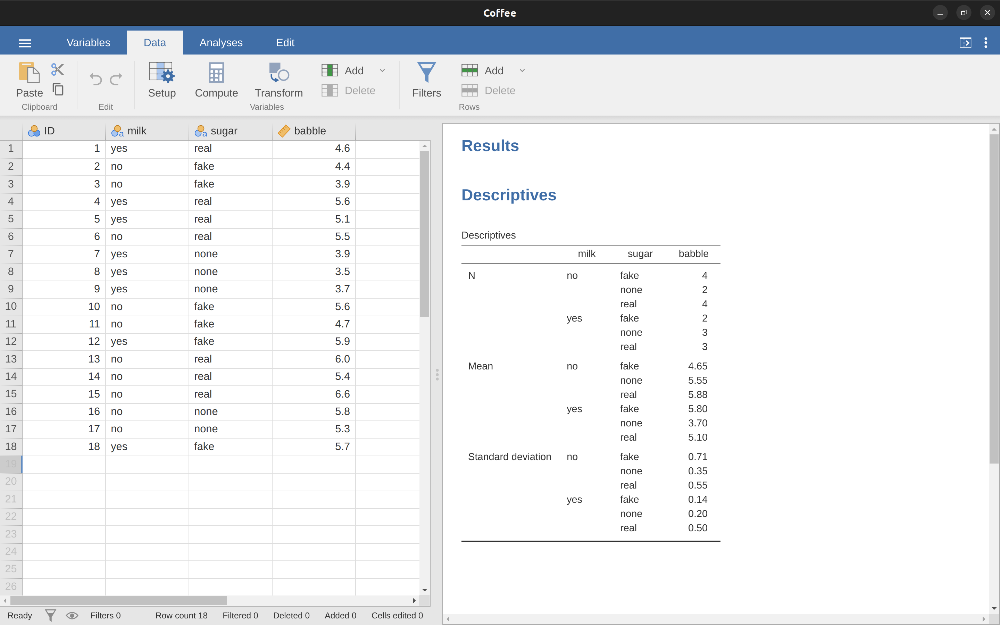
```

看過 @fig-fig13-26 報表區的平均數表格，可以讓人強烈感覺到組別之間存在差異，特別是比較一下各組平均數與標準差，會發現標準差最小只有 .14，最大是 .71，相較於各組平均數之間的差異，這樣的數值差異是相當小的。[^14-factorial-anova-8]

乍看之下這筆資料使用因子設計ANOVA分析是理所當然，但是看過各組的觀測值個數之後，問題便浮現了。 @fig-fig13-26 表格列出的各組 N 值可知，這筆資料違反最基本的適用條件：各組的受試者人數應相等。如何處理這種狀況，本書至今尚未真正討論。

[^14-factorial-anova-8]: 各組標準差的差異，可能會讓細心的讀者懷疑，這些資料是否違反變異數同質性的適用條件？本書將此問題當作練習題，讓讀者自行使用 Levene 檢定做檢核。


<!--- 查看 @fig-fig13-26 中的平均值表，我們可以強烈感受到各組之間的差異。與 babble 變量的標準偏差相比，這一點尤其明顯。在各組中，這個標準偏差從 .14 到 .71 不等，這相對於組間平均值的差異來說相當小。[^14-factorial-anova-8] 雖然這一開始看起來像是一個簡單的因子ANOVA，但當我們查看每個組中有多少個觀察值時，問題就出現了。參見 @fig-fig13-26 中顯示的不同組別的不同 N 值。這違反了我們最初的假設，即每個組中的人數是相同的。我們還沒有真正討論如何處理這種情況。

[^14-factorial-anova-8]: 這種標準偏差的差異可能會（並且應該）讓您懷疑我們是否違反了變異數同質性假設。我將使用 Levene 檢驗選項將其作為讀者的練習來仔細檢查這一點。

Looking at the table of means in @fig-fig13-26 we get a strong impression that there are differences between the groups. This is especially true when we compare these means to the standard deviations for the babble variable. Across groups, this standard deviation varies from .14 to .71, which is fairly small relative to the differences in group means.[^14-factorial-anova-8] Whilst this at first may seem like a straightforward factorial ANOVA, a problem arises when we look at how many observations we have in each group. See the different Ns for different groups shown in @fig-fig13-26. This violates one of our original assumptions, namely that the number of people in each group is the same. We haven't really discussed how to handle this situation.

[^14-factorial-anova-8]: This discrepancy in standard deviations might (and should) make you wonder if we have a violation of the homogeneity of variance assumption. I'll leave it as an exercise for the reader to double check this using the Levene test option. --->

### 不平衡設計不適用「標準變異數分析」

不平衡設計帶來一個有點令人不安的發現：其實世界上並沒有可以被稱為「標準 ANOVA」的存在。實際上，我們可以透過三種截然不同的方式[^14-factorial-anova-9]來處理不平衡設計ANOVA。如果是平衡設計，這三種方式會產生完全相同的結果，包括平方和 (SS)、F 值等，都會與本章一開始所討論的公式相同。然而用在不平衡設計，各種方法的計算結果便會不同。此外，並非所有方式都是適用於所有情境；某些方式會比其他方式更適合您的研究情境。有鑑於此，理解處理不平衡設計的各種 ANOVA 類型，以及它們彼此之間有何差異，是最重要的課題。

[^14-factorial-anova-9]:坦白說，這裡的說法並不完全正確。除了本書所討論的類型之外，ANOVA模型還有其他的變化形式。例如，本書完全不談**固定效果模型 (fixed-effect models)** (因子的水準由實驗者或資料世界所「固定」) 與**隨機效果模型 (random-effect models)** (因子的水準是從一個更大的可能水準母群中隨機抽樣而來) 之間的差異，本書只討論固定效果模型。讀者切勿誤以為本書或任何一本書，能告訴你所有「你需要知道的統計學知識」，如同不可能有一本書可以窮盡所有心理學、物理學或哲學的知識一樣。現實世界遠比任何一本書複雜得多。不過，讀者不必感到絕望。多數研究者僅憑藉本書所涵蓋的 ANOVA 基礎知識，便足以應付研究工作。這裡只是想提醒讀者，本書只是一個漫長故事的開端，而非全部。

處理不平衡設計的第一種 ANOVA 類型，按照命名慣例，稱為**第一型平方和 (Type I sum of squares)**。讀者大概能猜到另外兩種類型的名稱。這個名稱中的「平方和」一詞，最初是出現在 SAS 統計軟體，後成為標準術語，但是這個名稱在某些地方會誤導使用者。

之所以會用不同類型的「平方和」來命名，背後邏輯或許是，使用者閱讀軟體產出的 ANOVA 表格時，最吸引注意力的數值就是SS。自由度並未改變，平方和平均 (MS) 依然是 SS 除以 df，以此類推。

然而，這個術語的不夠充分之處，在於它並未揭露各種 SS 內在各異的原因。有鑑於此，建議讀者將這三種類型的 ANOVA，理解為三種不同的**假說檢定策略 (hypothesis testing strategies)**。各種策略確實會導致不同的 SS 數值，但是我們要了解的重點是「策略」本身，而非 SS 的數值。

回顧 @sec-ANOVA-as-a-linear-model 可以發現，任何一個 F 檢定，都是為了比較兩個線性模型的資料解釋能力是否不同。閱讀 ANOVA 表格的每一個 F 檢定值，務必記得都是對應一組要相互比較的模型。由此帶出一個問題：我們比較的究竟是「哪一組」模型呢？這便是第一類、第二類、與第三類 ANOVA 之間的根本差異：每一種類型各自對應一種為檢定選擇模型配對的方式。


<!--- 不平衡設計讓我們發現，實際上並不存在我們可能稱之為標準 ANOVA 的任何一種事物。事實上，你可能希望在不平衡設計中以三種根本不同的方式 [^14-factorial-anova-9]來運行 ANOVA。如果您有一個平衡設計，這三個版本都會產生相同的結果，與我在本章開始時給出的公式一致的平方和、F 值等。然而，當您的設計不平衡時，它們的答案並不相同。此外，它們對於每種情況的適用程度也不盡相同。有些方法對您的情況可能更適用。鑒於此，了解不同類型的 ANOVA 及其相互之間的差異非常重要。

[^14-factorial-anova-9]: 實際上，這有點誇張。除了我在本書中討論的那些方面之外，ANOVA 還可以有其他變化。例如，我完全忽略了固定效應模型（其中因子的水平是由實驗者或世界“固定”的）和隨機效應模型（其中水平是來自可能水平的更大群體的隨機樣本）之間的區別（本書僅涵蓋固定效應模型）。不要犯誤認為這本書或任何其他書籍將告訴您關於統計的“您需要知道的一切”，正如一本書可能告訴您關於心理學、物理學或哲學的一切。生活太複雜了，以至於這永遠不會是真的。然而，這並非絕望的原因。大多數研究者只憑本書所涵蓋的基本 ANOVA 工作知識就能應對。我只是希望您記住，這本書只是一個非常長的故事的開始，而不是整個故事。

第一種 ANOVA 通常被稱為**第一類平方和**。我敢肯定你能猜到其他兩個叫什麼。名稱中的“平方和”部分是由 SAS 統計軟件包引入的，並已成為標準術語，但在某些方面有點誤導。我認為把它們稱為不同類型的平方和的邏輯是，當你看到它們產生的 ANOVA 表時，數字之間的關鍵區別是 SS 值。自由度沒有變化，MS 值仍然被定義為 SS 除以 df 等。然而，這種術語的錯誤之處在於它掩蓋了 SS 值之間為何會有差異的原因。為此，了解三種不同類型的 ANOVA 作為三種不同的假設檢驗策略要有幫助得多。這些不同的策略確實導致了不同的 SS 值，但這裡重要的是策略，而不是 SS 值本身。回想一下[ANOVA 作為線性模型]一節，任何特定的 F 檢驗最好被認為是兩個線性模型之間的比較。因此，當您查看 ANOVA 表時，請記住每個 F 檢驗對應於要比較的模型對。當然，這自然引出了要比較哪對模型的問題。這就是 ANOVA 類型 I、II 和 III 之間的根本區別：每一種都對應於為檢驗選擇模型對的不同方式。

Unbalanced designs lead us to the somewhat unsettling discovery that there isn't really any one thing that we might refer to as a standard ANOVA. In fact, it turns out that there are three fundamentally different ways[^14-factorial-anova-9] in which you might want to run an ANOVA in an unbalanced design. If you have a balanced design all three versions produce identical results, with the sums of squares, F-values, etc., all conforming to the formulas that I gave at the start of the chapter. However, when your design is unbalanced they don't give the same answers. Furthermore, they are not all equally appropriate to every situation. Some methods will be more appropriate to your situation than others. Given all this, it's important to understand what the different types of ANOVA are and how they differ from one another.

[^14-factorial-anova-9]: Actually, this is a bit of a lie. ANOVAs can vary in other ways besides the ones I've discussed in this book. For instance, I've completely ignored the difference between fixed-effect models in which the levels of a factor are "fixed" by the experimenter or the world, and random-effect models in which the levels are random samples from a larger population of possible levels (this book only covers fixed-effect models). Don't make the mistake of thinking that this book, or any other one, will tell you "everything you need to know" about statistics, any more than a single book could possibly tell you everything you need to know about psychology, physics or philosophy. Life is too complicated for that to ever be true. This isn't a cause for despair, though. Most researchers get by with a basic working knowledge of ANOVA that doesn't go any further than this book does. I just want you to keep in mind that this book is only the beginning of a very long story, not the whole story.

The first kind of ANOVA is conventionally referred to as **Type I sum of squares**. I'm sure you can guess what the other two are called. The "sum of squares" part of the name was introduced by the SAS statistical software package and has become standard nomenclature, but it's a bit misleading in some ways. I think the logic for referring to them as different types of sum of squares is that, when you look at the ANOVA tables that they produce, the key difference in the numbers is the SS values. The degrees of freedom don't change, the MS values are still defined as SS divided by df, etc. However, what the terminology gets wrong is that it hides the reason *why* the SS values are different from one another. To that end, it's a lot more helpful to think of the three different kinds of ANOVA as three different *hypothesis testing strategies*. These different strategies lead to different SS values, to be sure, but it's the strategy that is the important thing here, not the SS values themselves. Recall from the section [ANOVA as a linear model] that any particular F-test is best thought of as a comparison between two linear models. So, when you're looking at an ANOVA table, it helps to remember that each of those F-tests corresponds to a pair of models that are being compared. Of course, this leads naturally to the question of which pair of models is being compared. This is the fundamental difference between ANOVA Types I, II and III: each one corresponds to a different way of choosing the model pairs for the tests. --->


### 第一型平方和

第一型平方和有時也會被稱為**序列 (sequential)**平方和，因為它來自將模型項逐一加入的過程。以 範例資料*coffee.csv*來說，假如要執行一個包含交互作用項的完整 $3 \times 2$ 因子設計ANOVA，這個模型包含結果變項 `babble`、預測變項 `sugar` 與 `milk`，以及交互作用項 `sugar × milk`，模型公式可寫成 `babble ~ sugar + milk + sugar × milk`。第一型的策略就是循序漸進地建構這個模型，從最簡單的模型開始，逐步加入模型項。

這筆資料的最簡單模型，是假設 `milk` 與 `sugar` 對 `babble` 都不具任何效果，所以模型只有截距項，可寫成 `babble ~ 1`，也就是 @sec-ANOVA-as-a-linear-model 提到的虛無假設模型。僅次於虛無假設的簡單模型，是只有兩個主要效果其中之一的線性模型。這裡有兩種選擇：可以先加入 `milk`，也可以先加入 `sugar`。稍後，我們會知道順序其實相當重要，不過目前我們先隨意選擇 `sugar`。因此，模型序列的第二個模型便是 `babble ~ sugar`，如此構成我們第一個檢定的對立假說。至此，我們便能進行第一個假說檢定 (@tbl-tab13-16)。


<!--- 類型 I 方法有時被稱為"序列"平方和，因為它涉及一次添加一個術語到模型的過程。以 *coffee* 數據為例。假設我們要運行完整的 $3 \times 2$ 因子 ANOVA，包括交互作用術語。完整的模型包含了結果變量 babble，預測變量 sugar 和 milk，以及交互術語 sugar $\times$ milk。這可以寫成 $babble \sim sugar + milk + sugar {\times} milk$。類型 I 策略會按順序構建這個模型，從最簡單的模型開始，逐步添加術語。

數據的最簡單模型將是一個假設牛奶和糖都不影響胡言亂語的模型。這樣的模型只包括截距，寫成 babble ~ 1。這是我們最初的零假設。數據的下一個最簡單模型將是其中只包含兩個主效應之一的模型。在 *coffee* 數據中，這裡有兩個不同的可能選擇，因為我們可以選擇先添加 milk 或者先添加 sugar。實際上，順序是很重要的，我們稍後會看到，但現在讓我們只是隨意選擇一個，選擇 sugar。所以，我們模型序列中的第二個模型是 babble ~ sugar，它形成了我們第一次檢驗的替代假設。我們現在有了我們的第一個假設檢驗（@tbl-tab13-16）。

The Type I method is sometimes referred to as the "sequential" sum of squares, because it involves a process of adding terms to the model one at a time. Consider the *coffee* data, for instance. Suppose we want to run the full $3 \times 2$ factorial ANOVA, including interaction terms. The full model contains the outcome variable babble, the predictor variables sugar and milk, and the interaction term sugar $\times$ milk. This can be written as $babble \sim sugar + milk + sugar {\times} milk$. The Type I strategy builds this model up sequentially, starting from the simplest possible model and gradually adding terms.

The simplest possible model for the data would be one in which neither milk nor sugar is assumed to have any effect on babbling. The only term that would be included in such a model is the intercept, written as babble ~ 1. This is our initial null hypothesis. The next simplest model for the data would be one in which only one of the two main effects is included. In the *coffee* data, there are two different possible choices here, because we could choose to add milk first or to add sugar first. The order actually turns out to matter, as we'll see later, but for now let's just make a choice arbitrarily and pick sugar. So, the second model in our sequence of models is babble ~ sugar, and it forms the alternative hypothesis for our first test. We now have our first hypothesis test (@tbl-tab13-16). --->

```{r}
#| label: tbl-tab13-16
#| tbl-cap: 以 babble 為結果變項的虛無假說與對立假說
#Null and alternative hypotheses with the outcome variable 'babble'
huxtabs[[14]][[16]]
```

這個比較代表針對 `sugar` 主要效果的假設檢定。模型建構的下一步，是加入另一個主要效果項，因此序列的下一個模型便是 `babble ~ sugar + milk`。這組模型形成第二個假設檢定 (@tbl-tab13-17)。


<!--- 這個比較形成了我們對糖的主效應的假設檢驗。我們模型建立練習的下一步是添加另一個主效應術語，因此我們序列中的下一個模型是 babble \~ sugar + milk。然後，通過比較以下模型對（@tbl-tab13-17）形成第二個假設檢驗。

This comparison forms our hypothesis test of the main effect of sugar. The next step in our model building exercise is to add the other main effect term, so the next model in our sequence is babble \~ sugar + milk. The second hypothesis test is then formed by comparing the following pair of models (@tbl-tab13-17). --->

```{r}
#| label: tbl-tab13-17
#| tbl-cap: 以 babble 為結果變項的第二組假說檢定
#Further null and alternative hypotheses with the outcome variable 'babble'
huxtabs[[14]][[17]]
```

這組模型比較構成對 `milk` 主要效果的假說檢定。從某個角度來看，這種方法非常「優雅」：第一個檢定的對立假說，直接成為了第二個檢定的虛無假說。正是如此的過程，第一型平方和的方法是如同字面意義的「序列性」，每一個檢定都是建立在前一個檢定的結果之上。然而，從另一個角度來看，這種方式非常「不優雅」，因為各組檢定之間存在著強烈的不對稱性：「sugar」主要效果的檢定 (第一個檢定) 完全忽略 `milk`，而「milk」主要效果的檢定 (第二個檢定) 卻將 `sugar` 納入比較。無論如何，模型序列的第四個模型，就是包含交互作用的完整模型 `babble ~ sugar + milk + sugar × milk`，對應的假說檢定如同 @tbl-tab13-18 展示。


<!--- 這個比較形成了我們對牛奶主效應的假設檢驗。在某種意義上，這種方法非常優雅：第一次測試的替代假設形成了第二次測試的零假設。正是在這個意義上，類型 I 方法是嚴格有序的。每個測試都直接基於上一個測試的結果。然而，在另一個意義上，它非常不優雅，因為這兩個測試之間有很強的不對稱性。糖的主效應測試（第一次測試）完全忽略了牛奶，而牛奶的主效應測試（第二次測試）確實考慮了糖。無論如何，我們序列中的第四個模型現在是完整的模型，babble \~ sugar + milk + sugar $\times$ milk，相應的假設檢驗顯示在 @tbl-tab13-18 中。

This comparison forms our hypothesis test of the main effect of milk. In one sense, this approach is very elegant: the alternative hypothesis from the first test forms the null hypothesis for the second one. It is in this sense that the Type I method is strictly sequential. Every test builds directly on the results of the last one. However, in another sense it's very inelegant, because there's a strong asymmetry between the two tests. The test of the main effect of sugar (the first test) completely ignores milk, whereas the test of the main effect of milk (the second test) does take sugar into account. In any case, the fourth model in our sequence is now the full model, babble \~ sugar + milk + sugar $\times$ milk, and the corresponding hypothesis test is shown in @tbl-tab13-18. --->

```{r}
#| label: tbl-tab13-18
#| tbl-cap: 以 babble 為結果變項的第三組假說檢定
#And more possible null and alternative hypotheses with the outcome variable 'babble'
huxtabs[[14]][[18]]
```

jamovi 的 ANOVA 模組預設值，是計算**第三型平方和**。因此，若要執行**第一型平方和**的分析，必須在「ANOVA」–「模型 (Model)」選項中，將「平方和 (Sum of squares)」次選單的預設值改為「第一型 (Type 1)」。這會產出如同 @fig-fig13-27 展示的 ANOVA 表格。


<!---類型 III 平方和是 jamovi ANOVA 使用的默認假設檢驗方法，因此要運行類型 I 平方和分析，我們必須在 jamovi 'ANOVA' - 'Model' 選項中的 '平方和' 選擇框中選擇 'Type 1'。這給我們提供了 @fig-fig13-27 中顯示的 ANOVA 表。

 Type III sum of squares is the default hypothesis testing method used by jamovi ANOVA, so to run a Type I sum of squares analysis we have to select 'Type 1' in the 'Sum of squares' selection box in the jamovi 'ANOVA' - 'Model' options. This gives us the ANOVA table shown in @fig-fig13-27. --->

```{r}
#| label: fig-fig13-27
#| classes: .enlarge-image
#| fig-cap: jamovi 採用第一型平方和生成的 ANOVA 結果表格
#ANOVA results table using Type I sum of squares in jamovi
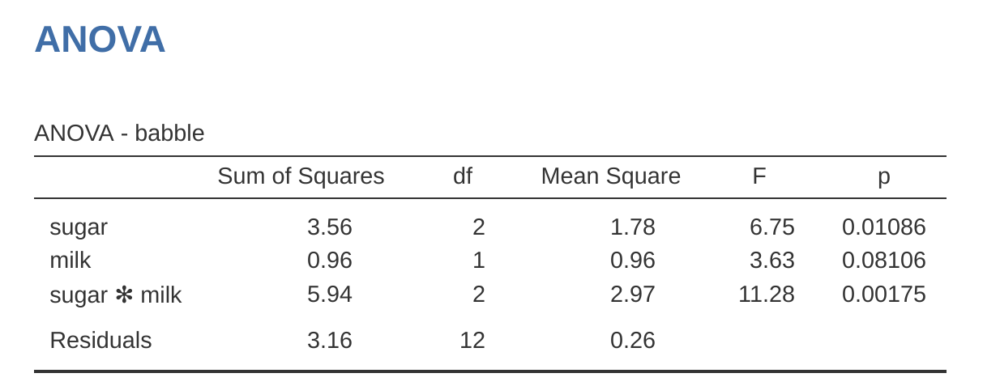
```

使用第一型平方和的最大問題，在於其結果會受到變項加入模型的**順序**所影響。然而，在許多實務狀況，研究者大多沒有任何理論依據，能說明為何某個排序是優先於另一個。這就是牛奶與糖問題反映的真實情況。我們應該先放牛奶，還是先放糖？這個數據分析問題，感覺就像點咖啡時一樣隨興。或許有些人對某種順序有堅定不移的看法，但很難想像這個問題存在著任何有可靠根據的答案。

然而，當我們改變加入變項的順序時 (參考 @fig-fig13-28 )，看一看發生了什麼事：兩個主要效果的 p 值都改變了，而且改變幅度相當大。其中，`milk` 的效果甚至變得顯著。儘管我們已經知道，應避免對此結果變化下過強的結論。那麼，這兩份 ANOVA 報表(@fig-fig13-27 或 @fig-fig13-28 )，我們該呈現哪一份呢？答案並非顯而易見。


<!---使用類型 I 平方和的最大問題是它確實取決於您輸入變量的順序。然而，在許多情況下，研究人員無需優先考慮一種排序而不考慮另一種排序。這可能是我們牛奶和糖問題的情況。我們應該先添加牛奶還是糖？在數據分析問題中，這與製作咖啡問題一樣隨意。事實上，可能有一些人對排序有堅定的看法，但很難想像這個問題有一個原則性的答案。然而，當我們改變順序時，看看會發生什麼，如 @fig-fig13-28 中所示。

 The big problem with using Type I sum of squares is the fact that it really does depend on the order in which you enter the variables. Yet, in many situations the researcher has no reason to prefer one ordering over another. This is presumably the case for our milk and sugar problem. Should we add milk first or sugar first? It feels exactly as arbitrary as a data analysis question as it does as a coffee-making question. There may in fact be some people with firm opinions about ordering, but it's hard to imagine a principled answer to the question. Yet, look what happens when we change the ordering, as in @fig-fig13-28. --->

```{r}
#| label: fig-fig13-28
#| classes: .enlarge-image
#| fig-cap: jamovi 採用第一型平方和生成的 ANOVA 結果表格 (因子投入順序不同，milk 優先)
#ANOVA results table using Type I sum of squares in jamovi, but with factors entered in a different order (milk first)
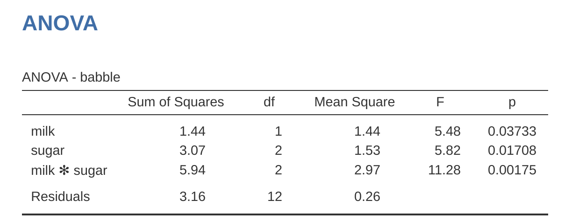
```

當我們檢視用來定義「第一個」與「第二個」主要效果的假說檢定時，會發現它們在本質上有所不同。在最初的範例中，`sugar`主要效果的檢定完全忽略了`milk`，而`milk`主要效果的檢定卻考量了`sugar`。因此，第一型的檢定策略，確實是將第一個加入的主要效果，賦予了某種凌駕於第二個主要效果之上的「理論優先性」。根據本書作者的經驗，現實中極少、甚至從未出現有任何理論優越性，能支持我們將兩個主要效果進行如此不對稱的處理。

這一切所導致的結論是：第一型檢定在多數情況下都不能回答我們真正感興趣的問題，因此，我們要來認識第二型與第三型。


<!---兩個主效應術語的 p 值都發生了變化，而且變化相當大。在其他方面，牛奶的效果已經顯著（儘管我之前提到過，人們應該避免對此得出任何強烈的結論）。應該報告這兩個 ANOVA 中的哪一個？這並不是立即明顯的。

當您查看用於定義“第一”主效應和“第二”主效應的假設檢驗時，很明顯它們之間有質的不同。在我們最初的示例中，我們看到了糖的主效應檢驗完全忽略了牛奶，而牛奶的主效應檢驗確實考慮了糖。因此，類型 I 檢驗策略確實將第一個主效應視為在第二個主效應之上具有某種理論優越性。根據我的經驗，很少（甚至從未）有這種理論優越性，可以證明將任何兩個主效應非對稱地對待。

所有這些的結果是類型 I 測試很少有趣，所以我們應該繼續討論類型 II 測試和類型 III 測試。

 The p-values for both main effect terms have changed, and fairly dramatically. Among other things, the effect of milk has become significant (though one should avoid drawing any strong conclusions about this, as I've mentioned previously). Which of these two ANOVAs should one report? It's not immediately obvious.

When you look at the hypothesis tests that are used to define the "first" main effect and the "second" one, it's clear that they're qualitatively different from one another. In our initial example, we saw that the test for the main effect of sugar completely ignores milk, whereas the test of the main effect of milk does take sugar into account. As such, the Type I testing strategy really does treat the first main effect as if it had a kind of theoretical primacy over the second one. In my experience there is very rarely if ever any theoretically primacy of this kind that would justify treating any two main effects asymmetrically.

The consequence of all this is that Type I tests are very rarely of much interest, and so we should move on to discuss Type II tests and Type III tests. --->

### 第三型平方和

經過使用第一型平方和進行假設檢定的實例討論，讀者可能會認為接下來自然該談談第二型檢定。然而，在討論較為棘手的第二型之前，先來討論概念較簡單的第三型會更為自然，而且是 jamovi ANOVA 模組的預設選項。

第三型的基本概念相當單純：無論要評估模型的哪一個特定項，F 檢定的對立假設，永遠都是使用者所設定的完整 ANOVA 模型；而虛無假設，則是從完整模型移除被檢定的目標特定項之模型。以咖啡範例資料來說，完整模型是 `babble ~ sugar + milk + sugar × milk`。那麼，檢定「sugar」主要效果，便是比較 @tbl-tab13-19 列出的兩個模型。


<!--- 剛剛談完類型 I 測試後，您可能會認為接下來自然要談論類型 II 測試。然而，我認為在談論類型 II 測試（比較棘手）之前，先討論類型 III 測試（簡單且是 jamovi ANOVA 的默認設置）實際上更自然。類型 III 測試背後的基本思想非常簡單。無論您要評估哪個術語，都要運行 F 檢驗，其中替代假設對應用戶指定的完整 ANOVA 模型，而零模型僅刪除您正在測試的那一個術語。例如，在咖啡示例中，我們的完整模型是 babble ~ sugar + milk + sugar × milk，糖的主效應檢驗將對應於以下兩個模型之間的比較（@tbl-tab13-19）。

Having just finished talking about Type I tests, you might think that the natural thing to do next would be to talk about Type II tests. However, I think it's actually a bit more natural to discuss Type III tests (which are simple and the default in jamovi ANOVA) before talking about Type II tests (which are trickier). The basic idea behind Type III tests is extremely simple. Regardless of which term you're trying to evaluate, run the F-test in which the alternative hypothesis corresponds to the full ANOVA model as specified by the user, and the null model just deletes that one term that you're testing. For instance, in the coffee example, in which our full model was babble \~ sugar + milk + sugar $\times$ milk, the test for a main effect of sugar would correspond to a comparison between the following two models (@tbl-tab13-19). --->

```{r}
#| label: tbl-tab13-19
#| tbl-cap: 以'babble'作為結果變量的零假設和替代假設，使用類型 III 平方和
#Null and alternative hypotheses with the outcome variable 'babble', with Type III sum of squares
huxtabs[[14]][[19]]
```

同理，檢定「milk」的主要效果，就是比較「完整模型」與「移除 `milk` 的虛無模型」，如同 @tbl-tab13-20 的展示。

<!--- 同樣，通過將完整模型與刪除牛奶術語的零模型進行檢驗，可以評估牛奶的主效應，如 @tbl-tab13-20。


Similarly the main effect of milk is evaluated by testing the full model against a null model that removes the milk term, like in @tbl-tab13-20. --->

```{r}
#| label: tbl-tab13-20
#| tbl-cap: 以'babble'作為結果變量的更多零假設和替代假設，使用類型 III 平方和
#Further null and alternative hypotheses with the outcome variable 'babble', with Type III sum of squares
huxtabs[[14]][[20]]
```

最後要檢定「sugar × milk」的交互作用項，也是依循完全相同的方式：比較「完整模型」與「一個移除了 `sugar × milk` 交互作用項的虛無模型」，如同 @tbl-tab13-21 展示。

<!--- 最後，用完全相同的方式評估糖 × 牛奶的交互項。再次，我們將完整模型與刪除糖 × 牛奶交互項的零模型進行比較，如 @tbl-tab13-21。

Finally, the interaction term sugar $\times$ milk is evaluated in exactly the same way. Once again, we test the full model against a null model that removes the sugar $\times$ milk interaction term, like in @tbl-tab13-21.--->

```{r}
#| label: tbl-tab13-21
#| tbl-cap: 從以“babble”為結果變量的假設中刪除交互項，使用類型 III 平方和
#Removing the interaction term from hypotheses with the outcome variable 'babble', with Type III sum of squares
huxtabs[[14]][[21]]
```

這些基本概念，可以延伸至處理設計更複雜的 ANOVA。舉例來說，如果我們的資料要處理包含 A、B、C 三個因子的 ANOVA，其中要檢定所有可能的主要效果與交互作用，包括三因子交互作用 A × B × C。 @tbl-tab13-22  展示這種狀況的第三型檢定要比較的各組模型。雖然這張表格看起來有些嚇人，其實概念相當單純。在所有情況下，對立假說皆對應到包含三個主要效果項 (如 A)、三個雙因子交互作用 (如 A × B)，以及三因子交互作用 (A × B × C) 的完整模型。至於虛無假說，永遠都是從這 7 個項中移除目標效果項的那一個縮減模型。


<!--- 基本思想可以推廣到更高階 ANOVA。例如，假設我們嘗試運行一個具有三個因素 A、B 和 C 的 ANOVA，並且我們希望考慮所有可能的主效應和所有可能的交互作用，包括三者之間的交互作用 A × B × C。(@tbl-tab13-22)為您展示了這種情況下類型 III 測試的外觀。

The basic idea generalises to higher order ANOVAs. For instance, suppose that we were trying to run an ANOVA with three factors, A, B and C, and we wanted to consider all possible main effects and all possible interactions, including the three way interaction A $\times$ B $\times$ C. (@tbl-tab13-22) shows you what the Type III tests look like for this situation). --->

```{r}
#| label: tbl-tab13-22
#| tbl-cap: 具有三個因素和所有主效應和交互項的類型 III 測試
#Type III tests with three factors and all main effect and interaction term
huxtabs[[14]][[22]]
```

乍看之下，用第三型平方和做假設檢定似乎是個好方法。首先，它排除第一型檢定中所遇到的不對稱問題。而且，由於現在所有效果項都是用一樣的方式處理，假說檢定的結果，並不會受到效果項加入順序的影響，這無疑是一件好事。然而，在詮釋檢定結果時，特別是針對主要效果項，卻存在一個大問題。

我們再用 *coffee* 資料來說明。假設根據第三型的檢定結果，`milk` 的主要效果不顯著。這說明 `babble ~ sugar + sugar*milk` 這個模型，比完整模型更能配適資料。但這究竟代表什麼？如果 `sugar*milk` 這個交互作用項也不顯著，我們或許會傾向下結論說：資料顯示唯一重要的因子是 `sugar`。但假設我們得到的是一個顯著的交互作用，以及一個不顯著的 `milk` 主要效果。在這種情況下，我們應該認定真的存在「`sugar` 的效果」、也存在「`milk` 與 `sugar` 的交互作用」，卻不存在「`milk` 的效果」嗎？這聽起來太古怪了。

正確的答案必然是：當交互作用顯著時，去談論主要效果是沒有意義的。[^factorial-anova-12] 這似乎是多數統計學家的共識建議，本書作者也認為這是正確的建議。然而，若是交互作用顯著時，談論不顯著的主要效果是沒有意義的，那麼「為何第三型檢定要允許一個『包含交互作用項，卻移除了構成該交互作用之主要效果』的模型，來作為虛無假說」，這樣的前提就變得非常不合理了。當我們用這種方式來描述檢定結果時，第三型的虛無假設就真的沒什麼道理了。

[^factorial-anova-12]: 或至少可以說，是很少能引發研究興趣的。

稍後我們將會看到，第三型的檢定結果在某些實務情況，依然有其價值。但首先，讓我們先看一下採用第三型平方和的 ANOVA 結果表格，請見 @fig-fig13-29 。


<!--- 儘管該表看起來很難看，但它相當簡單。在所有情況下，替代假設對應於包含三個主效應術語（例如 A）、三個雙向交互作用（例如 A * B）和一個三向交互作用（即 A * B * C）的完整模型。零模型總是包含其中 7 項中的 6 項，而缺少的一項就是我們正在嘗試測試其顯著性的那一項。

初步看來，類型 III 測試似乎是一個好主意。首先，我們消除了在運行類型 I 測試時遇到問題的不對稱性。而且，由於我們現在以相同的方式對待所有術語，假設測試的結果不依賴於我們指定它們的順序。這絕對是一件好事。然而，在解釋測試結果，特別是主效應術語時存在一個大問題。考慮*咖啡*數據。假設根據類型 III 測試，牛奶的主要效果並不顯著。這告訴我們的是，相比於完整模型，babble \~ sugar + sugar * milk 是數據的更好模型。但這意味著什麼呢？如果糖 * 牛奶的交互項也不顯著，我們會想得出結論說數據告訴我們唯一重要的事情是糖。但是，假設我們有一個顯著的交互項，但是牛奶的主效應不顯著。在這種情況下，我們是否應該認為真的有一個“糖的效果”，一個“牛奶和糖之間的交互作用”，但沒有“牛奶的效果”？那看起來很瘋狂。正確的答案簡直一定是，在交互作用顯著的情況下，談論主效應是毫無意義的[^factorial-anova-12]。一般來說，這似乎是大多數統計學家給我們的建議，而我認為這是正確的建議。但是，如果談論存在顯著交互作用的非顯著主效應確實是毫無意義的，那麼類型 III 測試應該允許零假設依賴於一個包括交互作用但省略了其中一個主效應的模型就不是很明顯了。以這種方式表述的零假設實際上根本沒有什麼意義。

[^factorial-anova-12]: 或者，至少很少有趣。

稍後，我們將看到類型 III 測試在某些情況下可以挽救，但首先讓我們看一下使用類型 III 和平方的 ANOVA 結果表，見 @fig-fig13-29。

As ugly as that table looks, it's pretty simple. In all cases, the alternative hypothesis corresponds to the full model which contains three main effect terms (e.g. A), three two-way interactions (e.g. A\*B) and one three-way interaction (i.e., A\*B\*C)). The null model always contains 6 of these 7 terms, and the missing one is the one whose significance we're trying to test.

At first pass, Type III tests seem like a nice idea. Firstly, we've removed the asymmetry that caused us to have problems when running Type I tests. And because we're now treating all terms the same way, the results of the hypothesis tests do not depend on the order in which we specify them. This is definitely a good thing. However, there is a big problem when interpreting the results of the tests, especially for main effect terms. Consider the *coffee* data. Suppose it turns out that the main effect of milk is not significant according to the Type III tests. What this is telling us is that babble \~ sugar + sugar\*milk is a better model for the data than the full model. But what does that even mean? If the interaction term sugar\*milk was also non significant, we'd be tempted to conclude that the data are telling us that the only thing that matters is sugar. But suppose we have a significant interaction term, but a non-significant main effect of milk. In this case, are we to assume that there really is an "effect of sugar", an "interaction between milk and sugar", but no "effect of milk"? That seems crazy. The right answer simply must be that it's meaningless[^factorial-anova-12] to talk about the main effect if the interaction is significant. In general, this seems to be what most statisticians advise us to do, and I think that's the right advice. But if it really is meaningless to talk about non-significant main effects in the presence of a significant interaction, then it's not at all obvious why Type III tests should allow the null hypothesis to rely on a model that includes the interaction but omits one of the main effects that make it up. When characterised in this fashion, the null hypotheses really don't make much sense at all.

[^factorial-anova-12]: Or, at the very least, rarely of interest.

Later on, we'll see that Type III tests can be redeemed in some contexts, but first let's take a look at the ANOVA results table using Type III sum of squares, see @fig-fig13-29. --->

```{r}
#| label: fig-fig13-29
#| classes: .enlarge-image
#| fig-cap: 在 jamovi 中使用類型 III 和平方的 ANOVA 結果表
#ANOVA results table using Type III sum of squares in jamovi
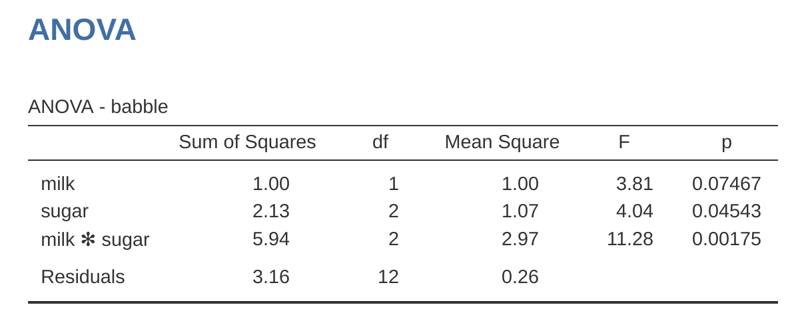
```


但請注意，第三型檢定策略有一個古怪的特性：一般來說，檢定結果會受到研究者用來編碼因子的「對比」類型所影響 (如果讀者忘了不同類型的對比是什麼，可回顧 @sec-Different-ways-to-specify-contrasts 一節)。[^factorial-anova-13]

[^factorial-anova-13]: 然而，無論使用者選擇何種對比， jamovi 的第三型平方和 ANOVA 分析結果都是相同的。因此，jamovi 顯然採用某些不一樣的運算方式！

好啦，既然第三型分析所產出的 p 值，對「對比」的選擇如此敏感(這裡指jamovi以外的統計軟體)，這是否代表第三型檢定結果本質是武斷的、不可信的？某種程度上來說，確實如此；當我們稍後討論第二型的檢定策略，會看到第二型分析完全避免了這種武斷性。但本書作者認為這樣的判斷有些過於武斷。首先，務必認知到，某些「對比」的選擇，產出的答案永遠是相同 (啊，這就是 jamovi 的演算常態)。特別重要的一點是：若是對比矩陣的每一行總和都被限制為零，那麼第三型分析永遠都是提供相同的答案。


<!--- 但要注意，類型 III 測試策略的一個怪異特徵是，通常結果依賴於用於編碼因子的對比（如果您忘記了不同類型對比是什麼，請參見 [指定對比的不同方式]一節）。[^factorial-anova-13]

[^factorial-anova-13]: 但是，在 jamovi 中，類型 III 和平方 ANOVA 的結果與所選對比無關，所以 jamovi 顯然在做一些不同的事情！

那麼，如果類型 III 分析（但不是在 jamovi 中）通常產生的 p 值對對比的選擇非常敏感，那是否意味著類型 III 測試本質上是任意的，不值得信任？在某種程度上，這是真的，當我們轉向討論類型 II 測試時，我們將看到類型 II 分析完全避免了這種任意性，但我認為這是一個過於強烈的結論。首先，重要的是要認識到某些對比選擇總是會產生相同的答案（啊，所以這就是 jamovi 中發生的事情）。特別重要的是，如果我們的對比矩陣的列都受限於求和為零，那麼類型 III 分析將始終給出相同的答案。

在類型 II 測試中，我們將看到類型 II 分析完全避免了這種任意性，但我認為這是一個過於強烈的結論。首先，重要的是要認識到某些對比選擇總是會產生相同的答案（啊，所以這就是 jamovi 中發生的事情）。特別重要的是，如果我們的對比矩陣的列都受限於求和為零，那麼類型 III 分析將始終給出相同的答案。

But be aware, one of the perverse features of the Type III testing strategy is that typically the results turn out to depend on the contrasts that you use to encode your factors (see the [Different ways to specify contrasts] section if you've forgotten what the different types of contrasts are).[^factorial-anova-13]

[^factorial-anova-13]: However, in jamovi the results for Type III sum of squares ANOVA are the same regardless of the contrast selected, so jamovi is obviously doing something different!

Okay, so if the p-values that typically come out of Type III analyses (but not in jamovi) are so sensitive to the choice of contrasts, does that mean that Type III tests are essentially arbitrary and not to be trusted? To some extent that's true, and when we turn to a discussion of Type II tests we'll see that Type II analyses avoid this arbitrariness entirely, but I think that's too strong a conclusion. Firstly, it's important to recognise that some choices of contrasts will always produce the same answers (ah, so this is what is happening in jamovi). Of particular importance is the fact that if the columns of our contrast matrix are all constrained to sum to zero, then the Type III analysis will always give the same answers.

In Type II tests we'll see that Type II analyses avoid this arbitrariness entirely, but I think that's too strong a conclusion. Firstly, it's important to recognise that some choices of contrasts will always produce the same answers (ah, so this is what is happening in jamovi). Of particular importance is the fact that if the columns of our contrast matrix are all constrained to sum to zero, then the Type III analysis will always give the same answers.--->

### 第二型平方和

好了，我們已經討論了第一型與第三型的假設檢定，兩種都相當直接了當。第一型是透過逐一加入模型效果項；第三型則是從完整模型出發，檢視移除每一個效果項後所發生的變化。然而，這兩種方式都有限制：第一型檢定會受到加入變項的順序影響；第三型檢定則會受到對比編碼方式的影響。相比之後，第二型的檢定雖然要用點功夫理解概念，但是能避免以上的問題，因此檢定結果的詮釋也相對容易。

第二型的檢定程序與第三型大致類似，都是從一個「完整」模型出發，透過刪除特定的項來進行檢定。不過，第二型是基於**邊際性原則 (marginality principle)**，這個原則主張：若模型中有高階效果項 (例如交互作用)，那麼所有與該高階效果相關的低階效果 (例如構成該交互作用的主要效果項) 都不應被省略。舉例來說，如果完整模型包括雙因子交互作用 A × B (二階效果項)，要比較的模型也應該要包括 A 與 B 這兩個主要效果 (一階效果項)。同理，如果完整模型包括三因子交互作用 A × B × C，要比較的模型就必須同時包含 A、B、C 三個主要效果，以及 A × B、A × C、B × C 等較簡單的交互作用。

第三型的檢定程序很容易違反邊際性原則。例如，處理包含所有可能交互作用項的三因子 ANOVA，根據第三型檢定，若要檢定 A 的主要效果，虛無假說與對立假說會是像 @tbl-tab13-23 。


<!---- 好的，到目前為止，我們已經看過了類型 I 和 III 測試，兩者都非常簡單。類型 I 測試是通過逐一添加條款進行的，而類型 III 測試是通過使用完整模型並檢查在刪除每個條款時會發生什麼來執行的。然而，這兩者都可能有一些局限性。類型 I 測試取決於您輸入條款的順序，而類型 III 測試則取決於您如何編碼對比。類型 II 測試描述起來稍微困難一些，但它們避免了這兩個問題，因此解釋起來稍微容易一些。

類型 II 測試與類型 III 測試大致相似。從一個“完整”模型開始，通過從該模型中刪除特定條款來進行測試。然而，類型 II 測試是基於邊際性原則的，該原則規定如果您的模型中有任何依賴於較低階條款的較高階條款，則不應從模型中省略較低階條款。所以，例如，如果您的模型包含兩個因素的交互作用 A × B（二階條款），那麼它確實應該包含主效應 A 和 B（一階條款）。同樣，如果它包含三個因素的交互作用項 A × B × C，那麼模型還必須包括主效應 A、B 和 C 以及簡單的交互作用 A × B、A × C 和 B × C。類型 III 測試經常違反邊際性原則。例如，考慮在包含所有可能交互作用條款的三因子 ANOVA 中測試 A 的主效應。根據類型 III 測試，我們的零假設和對立假設在 @tbl-tab13-23 中。


Okay, so we've seen Type I and III tests now, and both are pretty straightforward. Type I tests are performed by gradually adding terms one at a time, whereas Type III tests are performed by taking the full model and looking to see what happens when you remove each term. However, both can have some limitations. Type I tests are dependent on the order in which you enter the terms, and Type III tests are dependent on how you code up your contrasts. Type II tests are a little harder to describe, but they avoid both of these problems, and as a result they are a little easier to interpret.

Type II tests are broadly similar to Type III tests. Start with a "full" model, and test a particular term by deleting it from that model. However, Type II tests are based on the marginality principle which states that you should not omit a lower order term from your model if there are any higher order ones that depend on it. So, for instance, if your model contains the two-way interaction A $\times$ B (a 2nd order term), then it really ought to contain the main effects A and B (1st order terms). Similarly, if it contains a three-way interaction term A $\times$ B $\times$ C, then the model must also include the main effects A, B and C as well as the simpler interactions A $\times$ B, A $\times$ C and B $\times$ C. Type III tests routinely violate the marginality principle. For instance, consider the test of the main effect of A in the context of a three-way ANOVA that includes all possible interaction terms. According to Type III tests, our null and alternative models are in @tbl-tab13-23. --->

```{r}
#| label: tbl-tab13-23
#| tbl-cap: 在包含所有可能交互作用項的三因子 ANOVA 中，對主要效果 A 的第三型檢定
#Type III tests for a main effect, A, in a three-way ANOVA with all possible interaction terms
huxtabs[[14]][[23]]
```

注意，這套虛無假說移除主要效果 A，卻有保留 A × B、A × C、以及 A × B × C 等項。根據第二型的觀點，這並不是一個好的虛無假說選擇。

若要檢定「A 與結果變項無關」的虛無假設，較好的做法應該是設定虛無假設為「不包含 A的任何最複雜模型形式，即使交互作用有A也不能算」；對立假設則是對應於這個虛無假設，再加上 A 的主要效果項。這個概念更貼近多數人對於「A 的主要效果」的直觀理解，所以第二型要檢定的模型組合如同 @tbl-tab13-24 展示。[^factorial-anova-14]

[^factorial-anova-14]: 當然，要如何設定取決於使用者所設定的原始模型。若原始模型並未有 B × C 的交互作用，那麼虛無或對立假設自然也不會有這一項。但這點對三種類型的檢定程序來說都一樣：統計軟體演算法永遠不會納入使用者未曾指定的效果項，演算法只會針對使用者**已納入**的項，提供不同的檢定模型建構。

<!--- 注意，零假設省略了 A，但將 A × B、A × C 和 A × B × C 作為模型的一部分。根據類型 II 測試，這並不是一個好的零假設選擇。相反，如果我們希望檢驗 A 對結果無關的零假設，我們應該指定一個不依賴於 A 的任何形式（即使是交互作用）的最復雜的模型。對立假設對應於該零模型加上 A 的主效應項。這個概念更接近大多數人對 "A 的主效應" 的直觀理解，並且得出了 A 的主效應的類型 II 測試（@tbl-tab13-24）。[^factorial-anova-14]

[^factorial-anova-14]: 當然，這確實取決於用戶指定的模型。如果原始 ANOVA 模型不包含 $B \times C$ 的交互作用項，那麼顯然它不會出現在零假設或對立假設中。但這對類型 I、II 和 III 都是如此。它們永遠不會包含您未包含的任何條款，但是在您包含的條款中，它們在構建測試方面做出了不同的選擇。


Notice that the null hypothesis omits A, but includes A $\times$ B, A $\times$ C and A $\times$ B $\times$ C as part of the model. This, according to the Type II tests, is not a good choice of null hypothesis. What we should do instead, if we want to test the null hypothesis that A is not relevant to our outcome, is to specify the null hypothesis that is the most complicated model that does not rely on A in any form, even as an interaction. The alternative hypothesis corresponds to this null model plus a main effect term of A. This is a lot closer to what most people would intuitively think of as a "main effect of A", and it yields the following as our Type II test of the main effect of A (@tbl-tab13-24). [^factorial-anova-14]

[^factorial-anova-14]: Note, of course, that this does depend on the model that the user specified. If the original ANOVA model doesn't contain an interaction term for $B \times C$, then obviously it won't appear in either the null or the alternative. But that's true for Types I, II and III. They never include any terms that you didn't include, but they make different choices about how to construct tests for the ones that you did include. --->

```{r}
#| label: tbl-tab13-24
#| tbl-cap: 在包含所有可能交互作用項的三因子 ANOVA 中，對主要效果 A 的第二型檢定
#Type II tests for a main effect, A, in a three-way ANOVA with all possible interaction terms
huxtabs[[14]][[24]]
```

總之，為了讓讀者對第二型的檢定過程有完整概念， @tbl-tab13-25 呈現一個三因子變異數分析，檢定各種效果項的假設模型。


<!--- 無論如何，僅為了讓您了解類型 II 測試是如何進行的，這是在三因子因素分析中應用的完整測試表格（@tbl-tab13-25）：

Anyway, just to give you a sense of how the Type II tests play out, here's the full table (@tbl-tab13-25) of tests that would be applied in a three-way factorial ANOVA:--->

```{r}
#| label: tbl-tab13-25
#| tbl-cap: 三因子模型的第二型檢定
#Type II tests for a three-way factorial model
huxtabs[[14]][[25]]
```

這個小節示範的 *coffee* 資料是個二因子設計，ANOVA 假設檢定更單純。主要效果「sugar」的 F 檢定，比較的是 @tbl-tab13-26 展示的兩個模型。


<!--- 在我們一直在*咖啡*數據中使用的雙因子 ANOVA 的背景下，假設檢驗更為簡單。糖的主效應對應於比較這兩個模型的 F 檢驗（@tbl-tab13-26）。

In the context of the two way ANOVA that we've been using in the *coffee* data, the hypothesis tests are even simpler. The main effect of sugar corresponds to an F-test comparing these two models (@tbl-tab13-26). --->

```{r}
#| label: tbl-tab13-26
#| tbl-cap: 在 *coffee* 資料中，對「sugar」主要效果的第二型檢定
#Type II tests for the main effect of sugar in the *coffee* data
huxtabs[[14]][[26]]
```

檢定「milk」主要效果，所比較的模型組合如 @tbl-tab13-27 展示。


<!--- 對牛奶主效應的檢驗位於 @tbl-tab13-27。

The test for the main effect of milk is in @tbl-tab13-27. --->

```{r}
#| label: tbl-tab13-27
#| tbl-cap: 在 *coffee* 資料中，對「milk」主要效果的第二型檢定
#Type II tests for the main effect of milk in the *coffee* data
huxtabs[[14]][[27]]
```

最後，檢定「sugar × milk」交互作用的模型比較，請見 @tbl-tab13-28 。

<!--- 最後，糖與牛奶交互作用的檢驗位於 @tbl-tab13-28。

Finally, the test for the interaction sugar $\times$ milk is in @tbl-tab13-28. --->

```{r}
#| label: tbl-tab13-28
#| tbl-cap: 對「sugar × milk」交互作用項的第二型檢定
#Type II tests for the sugar x  milk interaction term
huxtabs[[14]][[28]]
```

執行檢定的步驟同樣很簡潔：只要在 jamovi 的「ANOVA」–「模型 (Model)」的選單，將「平方和 (Sum of squares)」的選項改成「第二型 (Type 2)」，便能得到如同 @fig-fig13-30 展示的 ANOVA 表格。


<!--- 運行測試再次很簡單。只需在 jamovi 'ANOVA' - 'Model' 選項中的 'Sum of squares' 選擇框中選擇 'Type 2'，這將給我們提供 ANOVA 表格，如 @fig-fig13-30 所示。

Running the tests are again straightforward. Just select 'Type 2' in the 'Sum of squares' selection box in the jamovi 'ANOVA' - 'Model' options, This gives us the ANOVA table shown in @fig-fig13-30. --->

```{r}
#| label: fig-fig13-30
#| classes: .enlarge-image
#| fig-cap: 採用第二型平方和的 ANOVA 結果表格
#ANOVA results table using Type II sum of squares in jamovi
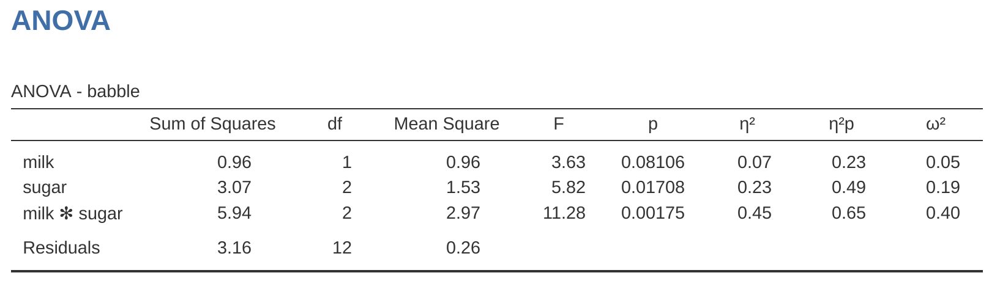
```

相較於第一型與第三型，第二型具有一些明顯的優勢：它既不依賴使用者指定因子的順序(第一型的缺點)，也不依賴使用者設定的對比編碼 (第三型的缺點)。
雖然關於對比編碼，學界尚未有清楚的共識，而且最終的選擇仍取決於研究者想要如何處理資料，但本書作者認為，第二型所檢定的假設，更有可能對應到研究者真正關心的問題。因此，詮釋第二型檢定的結果，通常會比詮釋第一型或第三型更容易。所以本書作者的初步建議是：若研究者想在不平衡設計中執行 ANOVA，卻又不清楚那些是能直接對應研究問題的模型比較組合，採用第二型檢定模式，可能是比第一型或第三型更好的選擇。[^factorial-anova-15]


[^factorial-anova-15]: 有趣的是，R語言的預設是第一型，SPSS 與 jamovi 的預設卻是第三型。這兩種設定都不甚合我意。此外，更令人沮喪的是，心理學文獻中幾乎沒有人會費心報告他們究竟用了哪一種類型的檢定，更不用說報告第一型的變項順序、或第三型的對比類型了。他們通常連自己用了什麼軟體也不報告。唯一能理解這些報告的方式，就是從字裡行間透露的蛛絲馬跡去猜測他們用了哪套軟體，並假設他們從未更改過任何預設值。請千萬不要這麼做！已經了解這些議題的讀者，請務必在報告中註明你所使用的軟體型號；如果報告的資料是用不平衡設計的 ANOVA 結果，請指明你執行的是哪一種類型的檢定；若是第一型，請註明變項順序；若是第三型，請註明對比類型。或者，更好的做法是：直接針對那些能對應你真正關心議題的假說檢定，然後如實報告它們！


<!--- 類型 II 測試比類型 I 和類型 III 測試具有一些明顯的優勢。它們不依賴於指定因子的順序（與類型 I 不同），也不依賴於用於指定因子的對比（與類型 III 不同）。雖然對於最後一點意見可能會有所不同，而且這肯定取決於你想用你的數據做什麼，但我認為它們指定的假設檢驗更有可能對應於你真正關心的事物。因此，我發現解釋類型 II 測試的結果通常比解釋類型 I 或類型 III 測試的結果更容易。基於這個原因，我的初步建議是，如果您無法想出任何直接映射到研究問題的明顯模型比較，但仍想在不平衡設計中運行 ANOVA，類型 II 測試可能是比類型 I 或類型 III 更好的選擇。[^factorial-anova-15]

[^factorial-anova-15]: 我覺得值得一提的是，R 中的默認值是類型 I，而 SPSS 和 jamovi 中的默認值是類型 III。這兩者都不是我特別喜歡的。此外，我覺得令人沮喪的是，在心理學文獻中，幾乎沒有人報告他們運行了哪種類型的測試，更不用說變量的順序（對於類型 I）或用於類型 III 的對比了。通常他們也不報告使用了什麼軟件。我能從人們通常報告的信息中理解的唯一方法就是嘗試從輔助線索猜測他們使用了哪款軟件，並假設他們從未更改過默認設置。請不要這樣做！現在您了解了這些問題，請確保說明您使用了什麼軟件，如果您報告了不平衡數據的 ANOVA 結果，那麼請指定您運行了哪種類型的測試，指定類型 I 測試的順序信息以及類型 III 測試的對比。或者，更好的是，做出與您真正關心的事物相對應的假設檢驗，然後報告這些！

Type II tests have some clear advantages over Type I and Type III tests. They don't depend on the order in which you specify factors (unlike Type I), and they don't depend on the contrasts that you use to specify your factors (unlike Type III). And although opinions may differ on this last point, and it will definitely depend on what you're trying to do with your data, I do think that the hypothesis tests that they specify are more likely to correspond to something that you actually care about. As a consequence, I find that it's usually easier to interpret the results of a Type II test than the results of a Type I or Type III test. For this reason my tentative advice is that, if you can't think of any obvious model comparisons that directly map onto your research questions but you still want to run an ANOVA in an unbalanced design, Type II tests are probably a better choice than Type I or Type III.[^factorial-anova-15]

[^factorial-anova-15]: I find it amusing to note that the default in R is Type I and the default in SPSS and jamovi is Type III. Neither of these appeals to me all that much. Relatedly, I find it depressing that almost nobody in the psychological literature ever bothers to report which Type of tests they ran, much less the order of variables (for Type I) or the contrasts used (for Type III). Often they don't report what software they used either. The only way I can ever make any sense of what people typically report is to try to guess from auxiliary cues which software they were using, and to assume that they never changed the default settings. Please don't do this! Now that you know about these issues make sure you indicate what software you used, and if you're reporting ANOVA results for unbalanced data, then specify what Type of tests you ran, specify order information if you've done Type I tests and specify contrasts if you've done Type III tests. Or, even better, do hypotheses tests that correspond to things you really care about and then report those! --->

### 效果量(還有非加成平方和)


如同 @fig-fig13-30 展示的報表，選取計算效果量的選項，jamovi 會提供 $\eta^2$ 與偏 $\eta^2$ 等效果量估計值。然而，在不平衡設計中，這個課題會更複雜一些。

回顧一下先前有關 ANOVA 的討論，讀者應還記得從計算平方和學到的關鍵概念：將模型的所有效果項平方和 (SS) 與殘差平方和 ($SS_R$) 相加後，總和應等於總平方和 ($SS_T$)。此外，$\eta^2$ 的核心概念是，將某個效果項的 SS 除以總平方和，便能將 $\eta^2$ 詮釋為該效果項所能解釋的變異量百分比。然而，在不平衡設計的狀況，事情就沒那麼單純了，因為部分的變異量會「憑空消失」。

第一次聽到這件事會覺得有點奇怪，原因說明如下：在不平衡的設計，因子之間會存在關聯性，導致我們很難區分因子 A 的效果與因子 B 的效果。最極端情況會像是  @tbl-tab13-29 。

<!--- jamovi 在您選擇這些選項時還會提供效應大小 $\eta^2$ 和部分 $\eta^2$，如 @fig-fig13-30。然而，在不平衡設計中，涉及的額外複雜性有所增加。

如果您回顧我們對 ANOVA 的早期討論，其中一個關鍵想法是在平方和計算的背後，如果我們把所有與模型中的效應相關的 SS 項加起來，再加上殘差 SS，它們應該加起來等於總平方和。此外，$\eta^2$ 背後的整個想法是，因為您將某個 SS 項除以總 SS 值，$\eta^2$ 值可以解釋為由特定項解釋的變異比例。但在不平衡設計中，這並不那麼簡單，因為有些變異會"丟失"。

起初這似乎有點奇怪，但原因是這樣的。當您擁有不平衡設計時，您的因子會相互關聯，因此很難分辨因子 A 的效應和因子 B 的效應。在極端情況下，假設我們進行了一個 $2 \times 2$ 設計，每個組中的參與者人數如 @tbl-tab13-29。


jamovi also provides the effect sizes $\eta^2$ and partial $\eta^2$ when you select these options, as in @fig-fig13-30. However, when you've got an unbalanced design there's a bit of extra complexity involved.

If you remember back to our very early discussions of ANOVA, one of the key ideas behind the sums of squares calculations is that if we add up all the SS terms associated with the effects in the model, and add that to the residual SS, they're supposed to add up to the total sum of squares. And, on top of that, the whole idea behind $\eta^2$ is that, because you're dividing one of the SS terms by the total SS value, an $\eta^2$ value can be interpreted as the proportion of variance accounted for by a particular term. But this is not so straightforward in unbalanced designs because some of the variance goes "missing".

This seems a bit odd at first, but here's why. When you have unbalanced designs your factors become correlated with one another, and it becomes difficult to tell the difference between the effect of Factor A and the effect of Factor B. In the extreme case, suppose that we'd run a $2 \times 2$ design in which the number of participants in each group had been as in @tbl-tab13-29. --->

```{r}
#| label: tbl-tab13-29
#| tbl-cap: $2 \times 2$ 極度不平衡因子設計中的 N 值
#N participants in a 2 x 2 very (very!) unbalanced factorial design
huxtabs[[14]][[29]]
```

在這個 $2 \times 2$ 的實驗設計，各組人數極度不平衡：100 位受試者有牛奶也有糖，100 位受試者既無牛奶也無糖，然而，沒有任何受試者是「有牛奶、無糖」或「有糖、無牛奶」。現在假想一下，蒐集資料後發現，「有牛奶有糖」組與「無牛奶無糖」組之間，存在巨大且有統計顯著的差異。請問這是糖的主要效果？還是牛奶的主要效果？還是兩個變項的交互作用？我們完全無從得知，因為「有沒有糖」與「有沒有牛奶」兩者之間具有完全的關聯性。假如讓這個研究設計變得稍微平衡一些，像是 @tbl-tab13-30 。


<!--- 在這裡，我們有一個非常不平衡的設計：100人有牛奶和糖，100人沒有牛奶和糖，就是這樣。有0人有牛奶沒有糖，也有0人有糖沒有牛奶。現在假設，當我們收集數據時，發現"牛奶和糖"組與"無牛奶無糖"組之間存在很大（並且具有統計顯著性）的差異。這是糖的主要效應嗎？牛奶的主要效應？還是交互作用？這是不可能知道的，因為糖的存在與牛奶的存在具有完美的關聯。現在假設設計稍微平衡一些（@tbl-tab13-30）。

Here we have a spectacularly unbalanced design: 100 people have milk and sugar, 100 people have no milk and no sugar, and that's all. There are 0 people with milk and no sugar, and 0 people with sugar but no milk. Now suppose that, when we collected the data, it turned out there is a large (and statistically significant) difference between the "milk and sugar" group and the "no-milk and no-sugar" group. Is this a main effect of sugar? A main effect of milk? Or an interaction? It's impossible to tell, because the presence of sugar has a perfect association with the presence of milk. Now suppose the design had been a little more balanced (@tbl-tab13-30). --->

```{r}
#| label: tbl-tab13-30
#| tbl-cap: 仍然非常不平衡的 $2 \times 2$ 因子設計中的 N 值
#N participants in a 2 x 2 still very unbalanced factorial design
huxtabs[[14]][[30]]
```

從技術上來說，這一次能夠區分牛奶與糖的效果了，因為總算有一些受試者只有牛奶或只有糖了。然而，區分兩個變項的效果依然相當困難，因為糖與牛奶之間仍然有非常強的關聯性，而且其中兩組的觀察值數量極少。我們很可能再次陷入一種情況：我們*知道*預測變項 (牛奶與糖) 與結果變項 (變得愛說話的程度) 有關，卻無法得知這些關聯性的本質，究竟是其中一個預測變項的主要效果，還是兩者的交互作用。

<!--- 這次，從技術上講，可以區分牛奶和糖的效應，因為我們有一些人只擁有其中之一。然而，由於糖和牛奶之間的關聯仍然非常強烈，兩個小組中的觀察值非常少，因此進行區分仍然相當困難。再次，我們很可能處於這樣一種情況：我們*知道*預測變量（牛奶和糖）與結果（發聲）相關，但我們不知道這種關係的本質是一個或另一個預測因子的主要效應，還是交互作用。

在不平衡設計的背景下，當糖和牛奶的效應相互關聯時，應該選擇 Type II ANOVA 進行分析，因為它更易於解釋並可以避免因變量順序或對比方式帶來的問題。無論您是使用什麼軟件，都應該在報告結果時說明您使用的是哪種類型的 ANOVA 測試，以確保分析結果的準確性。

This time around, it's technically possible to distinguish between the effect of milk and the effect of sugar, because we have a few people that have one but not the other. However, it will still be pretty difficult to do so, because the association between sugar and milk is still extremely strong, and there are so few observations in two of the groups. Again, we're very likely to be in the situation where we *know* that the predictor variables (milk and sugar) are related to the outcome (babbling), but we don't know if the nature of that relationship is a main effect of one or the other predictor, or the interaction.--->

## 本章小結

- [平衡且無交互作用的因子設計分析]以及[有交互作用因子設計分析]
- 因子設計[變異數分析的效果量]估計平均值以及信賴區間。
- [檢核變異數分析的執行條件]
- [共變數分析 (ANCOVA)]
- [變異數分析就是線性模型]還有[各種多重比較方案]
- [事後檢定]談到杜凱氏HSD，還有提到規劃使用[事前檢定方法]要思考的條件。
- [不平衡的因子設計分析]
