# 因素分析 {#sec-Factor-Aanalysis}

```{r}
#| include: FALSE
source("header.R")
```

> **譯者註** 本單元中文內容於2024年1月29日完成編修，jamovi操作示範部分仍持續更新。


<!---Previous chapters have covered statistical tests for differences between two or more groups. However, sometimes when conducting research, we may wish to examine how multiple variables *co-vary*. That is, how they are related to each other and whether the patterns of relatedness suggest anything interesting and meaningful. For example, we are often interested in exploring whether there are any underlying unobserved latent factors that are represented by the observed, directly measured, variables in our dataset. In statistics, latent factors are initially hidden variables that are not directly observed but are rather inferred (through statistical analysis) from other variables that are observed (directly measured).

In this chapter we will consider a number of different Factor Analysis and related techniques, starting with [Exploratory Factor Analysis] (EFA). EFA is a statistical technique for identifying underlying latent factors in a data set. Then we will cover [Principal Component Analysis] (PCA) which is a data reduction technique which, strictly speaking, does not identify underlying latent factors. Instead, PCA simply produces a linear combination of observed variables. Following this, the section on [Confirmatory Factor Analysis] (CFA) shows that, unlike EFA, with CFA you start with an idea - a model - of how the variables in your data are related to each other. You then test your model against the observed data and assess how good a fit the model is. A more sophisticated version of CFA is the so-called [Multi-Trait Multi-Method CFA] approach in which both latent factor and method variance are included in the model. This is useful when there are different methodological approaches used for measurement and therefore method variance is an important consideration. Finally, we will cover a related analysis: [Internal consistency reliability analysis] tests how consistently a scale measures a psychological construct. --->

前幾個單元介紹的統計檢定方法，主要處理兩個或多個研究組別之間的差異。然而，有時研究目的在於檢視多個變項如何「共變」（co-vary），也就是探討變項之間的關聯，以及這些關聯模式是否呈現出任何有趣且具意義的型態。例如，研究者探索資料的過程中，最有興趣的是有沒有由直接測量的觀察變項所代表的潛在、未被觀察到的潛在因素。符合統計學定義的潛在因素，起初是隱藏的、無法直接觀察的變項，而是透過統計分析，從其他可觀察或者直接測量的變項推斷出來。

這個單元探討數種不同的因素分析及相關技術，首先從[探索性因素分析](EFA)開始。EFA是一種用來識別資料集中潛在因素的統計技術。接著，我們將介紹[主成分分析](PCA)，這是一種資料降維技術，嚴格來說，它並非用來識別潛在因素，而是產生觀察變項的線性組合。隨後，在[驗證性因素分析](CFA)的章節中，將會看到CFA與EFA不同之處：進行CFA時，研究者會從一個既有的概念——即一個模型——出發，該模型描述了資料中變項間的預期關係，然後根據觀察資料來檢驗此模型，並評估其適配度。CFA有一個更複雜的版本，稱為[多特質多方法驗證性因素分析](Multi-Trait Multi-Method CFA)，此方法在模型中同時考量潛在因素與方法變異，當研究中使用不同的測量方法時，方法變異便成為一個重要考量，此時這種分析方法就非常有用。最後，我們將介紹一項相關分析：[內部一致性信度分析]，此分析旨在檢測一個量表測量某個心理構念的穩定程度。

## 探索性因素分析 

<!---**Exploratory Factor Analysis (EFA)** is a statistical technique for revealing any hidden latent factors that can be inferred from our observed data. This technique calculates to what extent a set of measured variables, for example $V1, V2, V3, V4$, and $V5$, can be represented as measures of an underlying latent factor. This latent factor cannot be measured through just one observed variable but instead is manifested in the relationships it causes in a set of observed variables.

In @fig-fig15-1 each observed variable $V$ is 'caused' to some extent by the underlying latent factor ($F$), depicted by the coefficients $b_1$ to $b_5$ (also called factor loadings). Each observed variable also has an associated error term, e1 to e5. Each error term is the variance in the associated observed variable, $V_i$ , that is unexplained by the underlying latent factor.

Latent factor underlying the relationship between several observed variables--->

**探索性因素分析(EFA)** 是一種從觀察資料中推斷出隱藏潛在因素的統計技術。此方法計算一組測量變項（例如 $V_1, V_2, V_3, V_4$ 和 $V_5$）在多大程度上可被視為某個潛在因素的測量指標。這種潛在因素無法僅由單一觀察變項測量，而是體現在它所引發的一組觀察變項之間的關係中。

在 @fig-fig15-1 中，每個觀察變項 $V$ 在某種程度上由潛在因素（$F$）所「引發」，此影響由係數 $b_1$ 到 $b_5$（也稱為因素負荷）來表示。每個觀察變項也都有一個相關的誤差項 $e_1$ 到 $e_5$。每個誤差項代表相關觀察變項 $V_i$ 中，無法由潛在因素解釋的變異。


```{r}
#| label: fig-fig15-1
#| fig-cap: 隱藏於數個觀察變項之間的潛在因素  
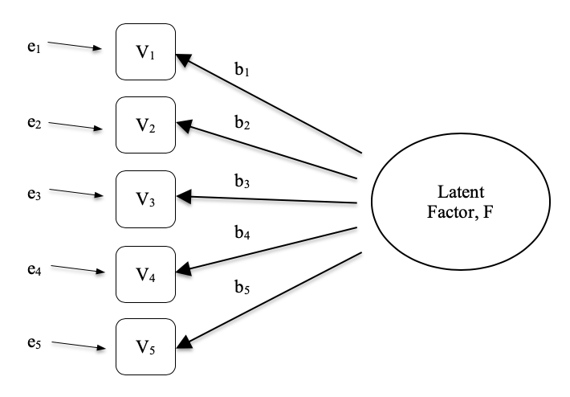
```


<!---In Psychology, latent factors represent psychological phenomena or constructs that are difficult to directly observe or measure. For example, personality, or intelligence, or thinking style. In the example in @fig-fig15-1 we may have asked people five specific questions about their behaviour or attitudes, and from that we are able to get a picture about a personality construct called, for example, extraversion. A different set of specific questions may give us a picture about an individual's introversion, or their conscientiousness.

Here's another example: we may not be able to directly measure statistics anxiety, but we can measure whether statistics anxiety is high or low with a set of questions in a questionnaire. For example, "$Q1$: Doing the assignment for a statistics course", "$Q2$: Trying to understand the statistics described in a journal article", and "$Q3$: Asking the lecturer for help in understanding something from the course", etc., each rated from low anxiety to high anxiety. People with high statistics anxiety will tend to give similarly high responses on these observed variables because of their high statistics anxiety. Likewise, people with low statistics anxiety will give similar low responses to these variables because of their low statistics anxiety.

In exploratory factor analysis (EFA), we are essentially exploring the correlations between observed variables to uncover any interesting, important underlying (latent) factors that are identified when observed variables co-vary. We can use statistical software to estimate any latent factors and to identify which of our variables have a high loading[^factor-analysis-1] (e.g. loading > 0.5) on each factor, suggesting they are a useful measure, or indicator, of the latent factor. Part of this process includes a step called rotation, which to be honest is a pretty weird idea but luckily we don't have to worry about understanding it; we just need to know that it is helpful because it makes the pattern of loadings on different factors much clearer. As such, rotation helps with seeing more clearly which variables are linked substantively to each factor. We also need to decide how many factors are reasonable given our data, and helpful in this regard is something called Eigen values. We'll come back to this in a moment, after we have covered some of the main assumptions of EFA.

[^factor-analysis-1]: Quite helpfully, factor loadings can be interpreted like standardized regression coefficients --->

在心理學中，潛在因素代表難以直接觀察或測量的心理現象或構念，例如人格、智力或思維風格。在 @fig-fig15-1 的例子中，我們可能向人們詢問了五個關於其行為或態度的具體問題，從中我們可以描繪出一個稱為「外向性」的人格構念。另一組不同的具體問題，則可能讓我們了解一個人的「內向性」或「盡責性」。

再舉一個例子：我們或許無法直接測量「統計焦慮」，但可以透過問卷中的一組問題來衡量統計焦慮的高低。例如「$Q1$：完成統計學課程的作業」、「$Q2$：試圖理解期刊文章中描述的統計數據」以及「$Q3$：向講師請教課程中不理解之處」等，每個問題都從低焦慮到高焦慮進行評分。統計焦慮程度高的人，在這些觀察變項上傾向於給出一致的高分；同樣地，統計焦慮程度低的人，則傾向於給出一致的低分。

在探索性因素分析(EFA)中，我們實質上是在探索觀察變項之間的相關性，以揭示當觀察變項共同變動時，所顯現出的任何有趣、重要的潛在因素。我們可以使用統計軟體來估計潛在因素，並識別哪些變項在每個因素上具有高負荷量[^factor-analysis-1]（例如負荷量 > 0.5），這表示它們是該潛在因素的有效測量指標。此過程包含一個稱為「轉軸」(rotation)的步驟，坦白說這是一個有點奇特的想法，但幸運的是我們不必深入理解其原理，只需知道它有助於讓不同因素上的負荷模式更加清晰。因此，轉軸能幫助我們更清楚地看出哪些變項與每個因素有實質性的關聯。此外，我們還需要決定在我們的資料中，保留多少個因素是合理的，而「特徵值」(Eigen values)在這方面很有幫助。在介紹完EFA的主要假設後，我們會再回頭討論這些概念。

[^factor-analysis-1]: 因素負荷量的解讀方式類似於標準化迴歸係數。

### 探索性因素分析的執行條件

<!--- There are a couple of assumptions that need to be checked as part of the analysis. The first assumption is **sphericity**, which essentially checks that the variables in your dataset are correlated with each other to the extent that they can potentially be summarised with a smaller set of factors. Bartlett's test for sphericity checks whether the observed correlation matrix diverges significantly from a zero (or null) correlation matrix. So, if Bartlett's test is significant ($p < .05$), this indicates that the observed correlation matrix is significantly divergent from the null, and is therefore suitable for EFA.

The second assumption is **sampling adequacy** and is checked using the Kaiser-MeyerOlkin (KMO) Measure of Sampling Adequacy (MSA). The KMO index is a measure of the proportion of variance among observed variables that might be common variance. Using partial correlations, it checks for factors that load just two items. We seldom, if ever, want EFA producing a lot of factors loading just two items each. KMO is about sampling adequacy because partial correlations are typically seen with inadequate samples. If the KMO index is high ($\approx 1$), the EFA is efficient whereas if KMO is low ($\approx 0$), the EFA is not relevant. KMO values smaller than $0.5$ indicates that EFA is not suitable and a KMO value of $0.6$ should be present before EFA is considered suitable. Values between $0.5$ and $0.7$ are considered adequate, values between $0.7$ and $0.9$ are good and values between $0.9$ and $1.0$ are excellent. --->


分析過程中需要檢查幾個假設。第一個是**球形性(sphericity)**，它主要檢視資料集中的變項彼此間是否具有足夠的相關性，以致於能被一組較少的因素所概括。巴特利球形檢定(Bartlett's test for sphericity)檢視觀察到的相關矩陣是否顯著偏離零相關（或虛無）矩陣。因此，如果巴特利檢定結果顯著（$p < .05$），表示觀察到的相關矩陣與虛無矩陣有顯著差異，適合進行EFA。

第二個假設是**樣本適足性(sampling adequacy)**，使用凱薩-邁耶-歐金（Kaiser-Meyer-Olkin, KMO）樣本適足性量數（Measure of Sampling Adequacy, MSA）來檢驗。KMO指標衡量觀察變項間的變異，可能為共同變異的比例。KMO運用偏相關來檢視只由兩個項目構成因素的情況。我們幾乎不希望EFA產生許多僅由兩個項目構成的因素。KMO之所以關乎樣本適足性，是因為在樣本不足時，偏相關的數值通常較高。如果KMO指標高（$\approx 1$），表示EFA是有效率的；反之，如果KMO低（$\approx 0$），則EFA不具參考價值。KMO值小於0.5表示不適合進行EFA，至少應達到0.6才被認為適合。0.5到0.7之間的值被視為尚可，0.7到0.9之間為良好，0.9到1.0之間則為極佳。


### 探索性因素分析的用途

<!---If the EFA has provided a good solution (i.e. factor model), then we need to decide what to do with our shiny new factors. Researchers often use EFA during psychometric scale development. They will develop a pool of questionnaire items that they think relate to one or more psychological constructs, use EFA to see which items "go together" as latent factors, and then they will assess whether some items should be removed because they don't usefully or distinctly measure one of the latent factors.

In line with this approach, another consequence of EFA is to combine the variables that load onto distinct factors into a factor score, sometimes known as a scale score. There are two options for combining variables into a scale score:

- Create a new variable with a score weighted by the factor loadings for each item that contributes to the factor.
- Create a new variable based on each item that contributes to the factor, but weighting them equally.

In the first option each item's contribution to the combined score depends on how strongly it relates to the factor. In the second option we typically just average across all the items that contribute substantively to a factor to create the combined scale score variable. Which to choose is a matter of preference, though a disadvantage with the first option is that loadings can vary quite a bit from sample to sample, and in behavioural and health sciences we are often interested in developing and using composite questionnaire scale scores across different studies and different samples. In which case it is reasonable to use a composite measure that is based on the substantive items contributing equally rather than weighting by sample specific loadings from a different sample. In any case, understanding a combined variable measure as an average of items is simpler and more intuitive than using a sample specific optimally-weighted combination.

A more advanced statistical technique, one which is beyond the scope of this book, undertakes regression modelling where latent factors are used in prediction models of other latent factors. This is called "structural equation modelling" and there are specific software programmes and R packages dedicated to this approach. But let's not get ahead of ourselves; what we should really focus on now is how to do an EFA in jamovi. --->

如果EFA提供了一個良好的解（即因素模型），我們就需要決定如何運用這些新發現的因素。研究人員常在心理測量量表的發展過程中使用EFA。他們會先建立一個他們認為與一個或多個心理構念相關的問卷題庫，然後使用EFA來檢視哪些題目會「共同構成」潛在因素，接著評估是否應移除某些無法有效或清晰測量任何一個潛在因素的題目。

順應此思路，EFA的另一個應用是將對特定因素有高負荷量的變項結合成一個因素分數，有時也稱為量表分數。有兩種方法可以將變項結合成量表分數：

-   根據每個項目對因素的負荷量進行加權，創建一個新的加權分數變項。
-   根據每個對因素有貢獻的項目創建一個新變項，但給予它們相等的權重。

第一種選項中，每個項目對總分的貢獻取決於它與因素的關聯強度。第二種選項中，我們通常直接計算所有對某個因素有實質貢獻的項目的平均值，來創建合併的量表分數變項。選擇哪種方法取決於個人偏好，但第一種選項的缺點是負荷量在不同樣本間可能會有很大差異。在行為與健康科學領域，我們常需要在不同研究和樣本中開發和使用綜合問卷量表分數。在這種情況下，使用基於實質項目均等貢獻的綜合測量是合理的，而不是根據來自不同樣本的特定樣本負荷量進行加權。無論如何，將合併變項的測量理解為項目的平均值，比使用特定於樣本的最佳加權組合更為簡單直觀。

還有一種更進階的統計技術，已超出本書範圍，是進行迴歸建模，其中潛在因素被用來預測其他潛在因素。這稱為「結構方程模型」(structural equation modelling)，有專門的軟體程式和R套件可用於此方法。但我們先別操之過急，現在應該專注於如何在jamovi中執行EFA。


### 使用jamovi完成探索性因素分析

<!--- First, we need some data. Twenty-five personality self-report items (see @fig-fig15-2) taken from the <a href="http://ipip.ori.org" target="_blank">International Personality Item Pool</a> were included as part of the Synthetic Aperture Personality Assessment (SAPA) web-based personality assessment (SAPA: <a href="http://sapa-project.org"
target="_blank">http://sapa-project.org</a>) project. The 25 items are organized by five putative factors: Agreeableness, Conscientiousness, Extraversion, Neuroticism, and Openness.

The item data were collected using a 6-point response scale:

1.  Very Inaccurate
2.  Moderately Inaccurate
3.  Slightly Inaccurate
4.  Slightly Accurate
5.  Moderately Accurate
6.  Very Accurate.

A sample of $N=250$ responses is contained in the dataset *bfi_sample.csv* . As researchers, we are interested in exploring the data to see whether there are some underlying latent factors that are measured reasonably well by the $25$ observed variables in the *bfi_sample.csv*  data file. Open up the dataset and check that the $25$ variables are coded as continuous variables (technically they are ordinal though for EFA in jamovi it mostly doesn't matter, except if you decide to calculate weighted factor scores in which case continuous variables are needed). To perform EFA in jamovi:

Twenty-five observed variable items organised by five putative personality factors in the dataset bfi\_sample.csv
--->

首先，我們需要一些資料。@fig-fig15-2 中展示了25個取自<a href="http://ipip.ori.org" target="_blank">國際人格項目庫</a>的自我報告人格題目，這些題目被納入合成孔徑人格評估（SAPA：<a href="http://sapa-project.org" target="_blank">http://sapa-project.org</a>）的網路人格評估專案中。這25個項目依據五個假定因素進行組織：親和性、盡責性、外向性、神經質性與開放性。

項目資料是透過一個六點反應量尺收集的：

1.  非常不準確
2.  中度不準確
3.  輕度不準確
4.  輕度準確
5.  中度準確
6.  非常準確

資料集 *bfi_sample.csv* 包含 $N=250$ 份回覆的樣本。作為研究人員，我們有興趣探索這些資料，看看是否存在一些可由 *bfi_sample.csv* 資料檔中25個觀察變項合理測量的潛在因素。打開資料集並檢查這25個變項是否被編碼為連續變項（技術上它們是次序變項，但在jamovi中進行EFA時，這通常不影響結果，除非您決定計算加權因素分數，此時則需要連續變項）。在jamovi中執行EFA的步驟如下：


```{r}
#| label: fig-fig15-2
#| fig-cap: 資料檔案bfi\_sample.csv的25個假設可測量五大性格因素的題目
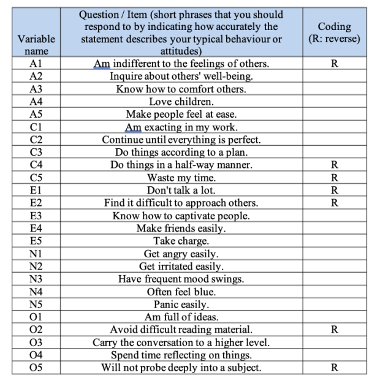
```


示範資料*Personality Questionnaire*包括$N=250$份參與者樣本。研究人員會有興趣的，是檔案裡的$25$個觀察變項，有那些能合理測量的潛在因素。開啟這份檔案後，研究人員會先檢查這$25$個變項是否以連續變項編碼？如果不是，至少要用次序變項編碼，雖然jamovi的EFA模組可以處理類別變項。若是要用因素負荷加權計算因素分數，就需要先轉換為連續變項。

接著執行jamovi的EFA模組：  

<!---
- Select Factor - Exploratory Factor Analysis from the main jamovi button bar to open the EFA analysis window (@fig-fig15-3).

- Select the 25 personality questions and transfer them into the 'Variables' box.

- Check appropriate options, including 'Assumption Checks', but also Rotation 'Method', 'Number of Factors' to extract, and 'Additional Output' options. See @fig-fig15-3 for suggested options for this illustrative EFA, and please note that the Rotation 'Method' and 'Number of Factors' extracted is typically adjusted by the researcher during the analysis to find the best result, as described below.

The jamovi EFA analysis window

jamovi EFA assumption checks for the personality questionnaire data

--->


- 從jamovi主功能列選擇「因素分析」(Factor) -> 「探索性因素分析」(Exploratory Factor Analysis)，開啟EFA分析視窗（@fig-fig15-3）。
- 選取25個人格問卷題目，並將它們移至「變項」(Variables)框中。
- 勾選適當的選項，包括「假設檢定」(Assumption Checks)，以及「轉軸法」(Rotation)的「方法」(Method)、「萃取因素數」(Number of Factors)，和「額外輸出」(Additional Output)選項。請參考 @fig-fig15-3 中此範例EFA的建議選項。請注意，研究人員通常會在分析過程中調整轉軸方法和萃取的因素數量，以尋求最佳結果，詳述如下。


```{r}
#| label: fig-fig15-3
#| classes: .enlarge-image
#| fig-cap: jamovi EFA分析窗口  
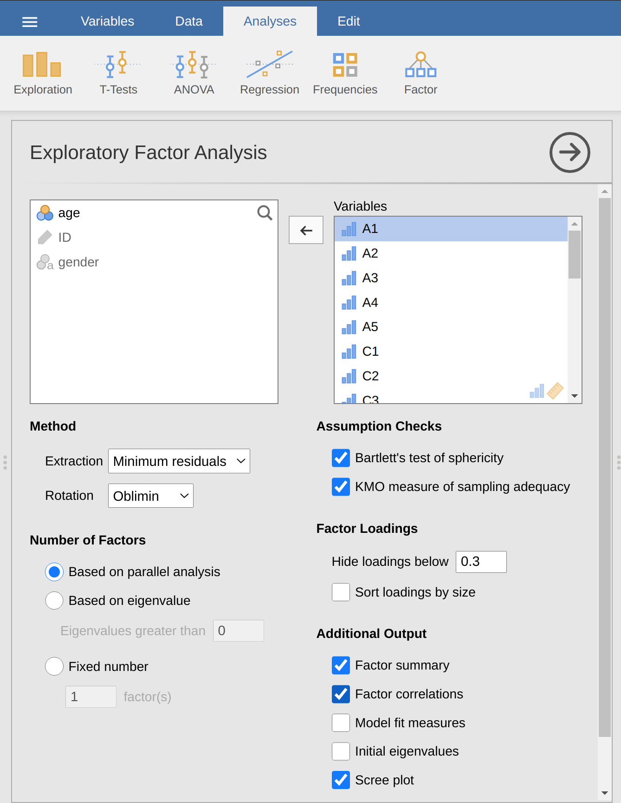
```

<!--- First, check the assumptions (@fig-fig15-4). You can see that (1) Bartlett's test of sphericity is significant, so this assumption is satisfied; and (2) the KMO measure of sampling adequacy (MSA) is $0.81$ overall, suggesting good sampling adequacy. No problems here then!

The next thing to check is how many factors to use (or "extract" from the data). Three different approaches are available:

- One convention is to choose all components with Eigen values greater than 12 . This would give us four factors with our data (try it and see).

- Examination of the scree plot, as in @fig-fig15-5, lets you identify the "point of inflection". This is the point at which the slope of the scree curve clearly levels off, below the "elbow". This would give us five factors with our data. Interpreting scree plots is a bit of an art: in @fig-fig15-5 there is a noticeable step from $5$ to $6$ factors, but in other scree plots you look at it will not be so clear cut.

- Using a parallel analysis technique, the obtained Eigen values are compared to those that would be obtained from random data. The number of factors extracted is the number with Eigen values greater than what would be found with random data.

Scree plot of the personality data in jamovi EFA, showing a noticeable inflection and levelling off after point 5 (the 'elbow') --->


首先，檢查假設（@fig-fig15-4）。您可以看到（1）巴特利球形性檢定結果顯著，因此滿足此假設；（2）KMO樣本適足性量數（MSA）的總體值為0.81，顯示樣本適足性良好。到此為止沒有問題！


```{r}
#| label: fig-fig15-4
#| classes: .enlarge-image
#| fig-cap: SAPA性格問卷資料的jamovi EFA適用條件檢定結果
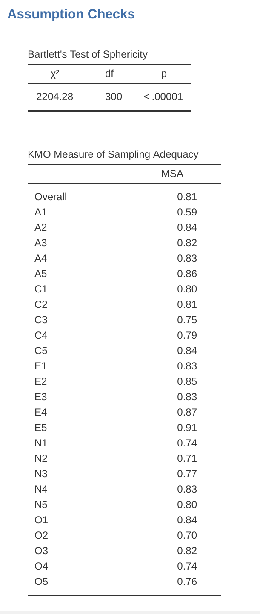
```


接下來要檢查的是要使用（或從資料中「萃取」）多少個因素。有三種不同的方法可供選擇：

-   一種慣例是選擇所有特徵值大於1的成分。在我們的資料中，這會產生四個因素（您可以試試看）。
-   檢視陡坡圖（scree plot），如 @fig-fig15-5 所示，可以幫助您識別「拐點」(point of inflection)。這是陡坡曲線斜率在「彎肘」(elbow)下方明顯趨於平緩的點。在我們的資料中，這會產生五個因素。解讀陡坡圖有點像一門藝術：在 @fig-fig15-5 中，從第5個因素到第6個因素有一個明顯的階梯，但在其他陡坡圖中，情況可能不會這麼清晰。
-   使用平行分析技術，將觀察資料得到的特徵值與隨機資料產生的特徵值進行比較。萃取的因素數量是其特徵值大於隨機資料特徵值的因素個數。


```{r}
#| label: fig-fig15-5
#| fig-cap: jamovi EFA 中的人格資料陡坡圖，顯示在第5點（「彎肘」）後有明顯的拐點並趨於平緩。
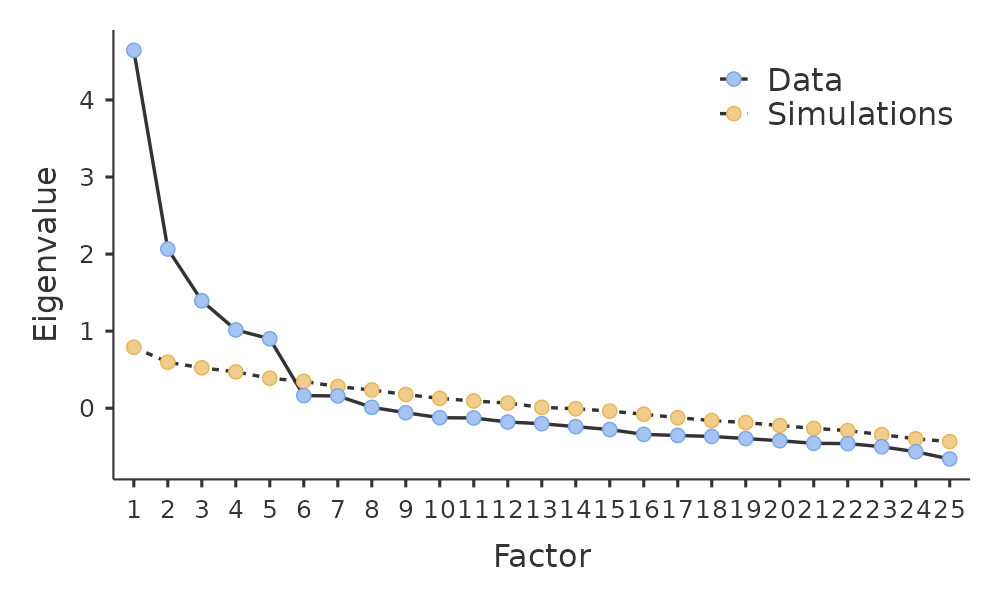
```

<!--- The third approach is a good one according to @Fabrigar1999, although in practice researchers tend to look at all three and then make a judgement about the number of factors that are most easily or helpfully interpreted. This can be understood as the "meaningfulness criterion", and researchers will typically examine, in addition to the solution from one of the approaches above, solutions with one or two more or fewer factors. They then adopt the solution which makes the most sense to them.

At the same time, we should also consider the best way to rotate the final solution. There are two main approaches to rotation: orthogonal (e.g. 'varimax') rotation forces the selected factors to be uncorrelated, whereas oblique (e.g. 'oblimin') rotation allows the selected factors to be correlated. Dimensions of interest to psychologists and behavioural scientists are not often dimensions we would expect to be orthogonal, so oblique solutions are arguably more sensible[^factor-analysis-2]

[^factor-analysis-2]: Oblique rotations provide two factor matrices, one called a structure matrix and one called a pattern matrix. In jamovi just the pattern matrix is shown in the results as this is typically the most useful for interpretation, though some experts suggest that both can be helpful. In a structure matrix coefficients show the relationship between the variable and the factors whilst ignoring the relationship of that factor with all the other factors (i.e. a zero-order correlation). Pattern matrix coefficients show the unique contribution of a factor to a variable whilst controlling for the effects of other factors on that variable (akin to standardized partial regression coefficient). Under orthogonal rotation, structure and pattern coefficients are the same.

Factor summary statistics and correlations for a five factor solution in jamovi EFA--->


根據 @Fabrigar1999 的說法，第三種方法是個好方法，儘管在實務上，研究人員傾向於檢視所有三種方法，然後根據最容易或最有助於解釋的因素數量做出判斷。這可以理解為「意義性準則」，研究人員通常除了檢視上述方法之一的解之外，還會檢視多一個或少一個因素的解，然後採納對他們來說最有意義的解。

同時，我們也應該考慮轉軸最終解的最佳方式。轉軸主要有兩種方法：正交轉軸（例如 'varimax'）會強制所選因素不相關，而斜交轉軸（例如 'oblimin'）則允許所選因素相關。心理學家和行為科學家感興趣的構面通常不是我們預期會是正交的，因此斜交解可以說更為合理[^factor-analysis-2]。

[^factor-analysis-2]: 斜交轉軸會提供兩個因素矩陣，一個稱為結構矩陣(structure matrix)，另一個稱為模式矩陣(pattern matrix)。在jamovi中，結果只會顯示模式矩陣，因為這通常對解釋最有用，不過有些專家建議兩者皆有助益。在結構矩陣中，係數顯示變項與因素之間的關係，同時忽略該因素與所有其他因素的關係（即零階相關）。模式矩陣的係數則顯示一個因素對一個變項的獨特貢獻，同時控制了其他因素對該變項的影響（類似於標準化偏迴歸係數）。在正交轉軸下，結構係數和模式係數是相同的。


```{r}
#| label: fig-fig15-6
#| classes: .enlarge-image
#| fig-cap: jamovi EFA中五因素解的因素摘要統計與相關係數
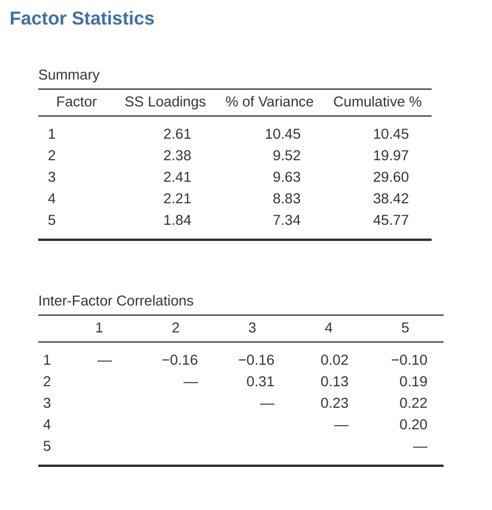
```

<!--- Practically, if in an oblique rotation the factors are found to be substantially correlated (positive or negative, and > 0.3), as in @fig-fig15-6 where a correlation between two of the extracted factors is 0.31, then this would confirm our intuition to prefer oblique rotation. If the factors are, in fact, correlated, then an oblique rotation will produce a better estimate of the true factors and a better simple structure than will an orthogonal rotation. And, if the oblique rotation indicates that the factors have close to zero correlations between one another, then the researcher can go ahead and conduct an orthogonal rotation (which should then give about the same solution as the oblique rotation).

On checking the correlation between the extracted factors at least one correlation was greater than 0.3 (@fig-fig15-6), so an oblique ('oblimin') rotation of the five extracted factors is preferred. We can also see in @fig-fig15-6 that the proportion of overall variance in the data that is accounted for by the five factors is 46%. Factor one accounts for around 10% of the variance, factors two to four around 9% each, and factor five just over 7%. This isn't great; it would have been better if the overall solution accounted for a more substantive proportion of the variance in our data.

Be aware that in every EFA you could potentially have the same number of factors as observed variables, but every additional factor you include will add a smaller amount of explained variance. If the first few factors explain a good amount of the variance in the original 25 variables, then those factors are clearly a useful, simpler substitute for the 25 variables. You can drop the rest without losing too much of the original variability. But if it takes 18 factors (for example) to explain most of the variance in those 25 variables, you might as well just use the original 25.

@fig-fig15-7 shows the factor loadings. That is, how the 25 different personality items load onto each of the five selected factors. We have hidden loadings less than $0.3$ (set in the options shown in @fig-fig15-3.

For Factors $1, 2, 3$ and $4$ the pattern of factor loadings closely matches the putative factors specified in @fig-fig15-2. Phew! And factor $5$ is pretty close, with four of the five observed variables that putatively measure "openness" loading pretty well onto the factor. Variable $04$ doesn't quite seem to fit though, as the factor solution in @fig-fig15-7 suggests that it loads onto factor $4$ (albeit with a relatively low loading) but not substantively onto factor $5$.

The other thing to note is that those variables that were denoted as "R: reverse coding" in @fig-fig15-2 are those that have negative factor loadings. Take a look at the items A1 ("Am indifferent to the feelings of others") and A2 ("Inquire about others' well-being"). We can see that a high score on $A1$ indicates low Agreeableness, whereas a high score on $A2$ (and all the other "A" variables for that matter) indicates high Agreeableness. Therefore A1 will be negatively correlated with the other "A" variables, and this is why it has a negative factor loading, as shown in @fig-fig15-7.

Factor loadings for a five factor solution in jamovi EFA
--->

實務上，如果在斜交轉軸中發現因素之間有實質相關（正或負，且 > 0.3），如 @fig-fig15-6 所示，其中兩個萃取因素之間的相關為0.31，這就證實了我們偏好斜交轉軸的直覺。如果因素確實相關，那麼斜交轉軸會比正交轉軸產生對真實因素更好的估計和更佳的簡單結構。反之，如果斜交轉軸顯示因素間的相關接近於零，那麼研究人員可以進行正交轉軸（其結果應與斜交轉軸大致相同）。

檢查萃取因素間的相關性後，發現至少有一個相關大於0.3（@fig-fig15-6），因此偏好對五個萃取因素進行斜交（'oblimin'）轉軸。我們也可以在 @fig-fig15-6 中看到，五個因素解釋的資料總變異比例為46%。因素一解釋了約10%的變異，因素二到四各約9%，因素五則略高於7%。這並不算太好；如果整體解能解釋資料中更大部分的變異會更好。

請注意，在每次EFA中，您潛在的因素數量可能與觀察變項數量相同，但每增加一個因素，所解釋的變異量就會減少。如果前幾個因素解釋了原始25個變項的大部分變異，那麼這些因素顯然是這25個變項的有用、更簡單的替代品。您可以捨棄其餘的因素而不會損失太多原始的變異性。但是，如果需要18個因素（例如）才能解釋這25個變項的大部分變異，那麼您不妨直接使用原始的25個變項。


```{r}
#| label: fig-fig15-7
#| classes: .enlarge-image
#| fig-cap: jamovi EFA中五因素解的因素負荷量
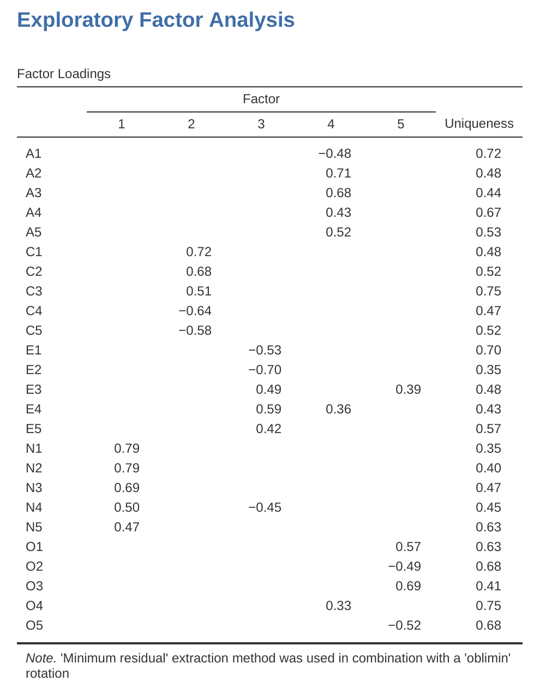
```


@fig-fig15-7 顯示了因素負荷量，即25個不同的人格項目如何在五個選定的因素上負荷。我們隱藏了小於0.3的負荷量（在 @fig-fig15-3 所示的選項中設定）。

對於因素1、2、3和4，因素負荷的模式與 @fig-fig15-2 中指定的假定因素非常吻合。太好了！因素5也非常接近，五個假定測量「開放性」的觀察變項中，有四個在該因素上有很好的負荷。不過，變項O4似乎不太吻合，因為 @fig-fig15-7 的因素解顯示它負荷在因素4上（儘管負荷量相對較低），而沒有實質性地負荷在因素5上。

另一點值得注意的是，在 @fig-fig15-2 中標示為「R：反向計分」的變項，其因素負荷量為負。看看項目A1（「我對他人的感受漠不關心」）和A2（「我會關心他人的福祉」）。我們可以看到，A1的高分表示低親和性，而A2（以及所有其他「A」開頭的變項）的高分表示高親和性。因此，A1會與其他「A」變項呈負相關，這就是為什麼它的因素負荷量為負，如 @fig-fig15-7 所示。

<!--- We can also see in @fig-fig15-7 the "uniqueness" of each variable. Uniqueness is the proportion of variance that is 'unique' to the variable and not explained by the factors[^factor-analysis-3]. For example, 72% of the variance in 'A1' is not explained by the factors in the five factor solution. In contrast, 'N1' has relatively low variance not accounted for by the factor solution (35%). Note that the greater the 'uniqueness', the lower the relevance or contribution of the variable in the factor model.

[^factor-analysis-3]: Sometimes reported in factor analysis is "communality" which is the amount of variance in a variable that is accounted for by the factor solution. Uniqueness is equal to (1 $\sim$ communality)

To be honest, it's unusual to get such a neat solution in EFA. It's typically quite a bit more messy than this, and often interpreting the meaning of the factors is more challenging. It's not often that you have such a clearly delineated item pool. More often you will have a whole heap of observed variables that you think may be indicators of a few underlying latent factors, but you don't have such a strong sense of which variables are going to go where!

So, we seem to have a pretty good five factor solution, albeit accounting for a relatively low overall proportion of the observed variance. Let's assume we are happy with this solution and want to use our factors in further analysis. The straightforward option is to calculate an overall (average) score for each factor by adding together the score for each variable that loads substantively onto the factor and then dividing by the number of variables (in other words create a 'mean score' for each person across the items for each scale. For each person in our dataset that entails, for example for the Agreeableness factor, adding together $A1 + A2 + A3 + A4 + A5$, and then dividing by 5. [^factor-analysis-4] In essence, the factor score we have calculated is based on equally weighted scores from each of the included variables/itmes. We can do this in jamovi in two steps:

[^factor-analysis-4]: remembering to first reverse score some variables if necessary

- Recode A1 into "A1R" by reverse scoring the values in the variable (i.e. $6 = 1$; $5 = 2$; $4 = 3$; $3 = 4$; $2 = 5$; $1 = 6$) using the jamovi transform variable command (see @fig-fig15-8).

- Compute a new variable, called "Agreeableness', by calculating the mean of A1R, A2, A3, A4 and A5. Do this using the jamovi compute new variable command (see @fig-fig15-9).  

Recode variable using the jamovi Transform command

Compute new scale score variable using the jamovi Computed variable command
--->

我們也可以在 @fig-fig15-7 中看到每個變項的「獨特性」(uniqueness)。獨特性是指變項中「獨有」且無法被因素解釋的變異比例[^factor-analysis-3]。例如，「A1」中有72%的變異無法由五因素解中的因素解釋。相比之下，「N1」無法被因素解解釋的變異相對較低（35%）。請注意，「獨特性」越高，該變項在因素模型中的相關性或貢獻就越低。

[^factor-analysis-3]: 因素分析中有時會報告「共同性」(communality)，這是指一個變項中能被因素解解釋的變異量。獨特性等於（1 - 共同性）。

老實說，在EFA中得到如此整潔的解並不常見。結果通常會混亂得多，而且解釋因素的意義也更具挑戰性。很少能有這樣清晰劃分的題庫。更多時候，您會有大量的觀察變項，您認為它們可能是少數潛在因素的指標，但您並不那麼確定哪些變項會歸到哪裡去！

所以，我們似乎得到了一個相當不錯的五因素解，儘管它解釋的觀察總變異比例相對較低。假設我們對這個解感到滿意，並希望在進一步的分析中使用這些因素。最直接的選擇是為每個因素計算一個總體（平均）分數，方法是將對該因素有實質負荷的每個變項的分數相加，然後除以變項的數量（換句話說，為每個人的每個量尺項目創建一個「平均分數」）。例如，對於我們資料集中的每個人，就親和性因素而言，這意味著將 A1 + A2 + A3 + A4 + A5 相加，然後除以5[^factor-analysis-4]。基本上，我們計算的因素分數是基於每個包含的變項/項目的等權分數。我們可以在jamovi中分兩步完成：

[^factor-analysis-4]: 如有必要，記得先對某些變項進行反向計分。

-   使用jamovi的轉換變項指令，將A1反向計分後重新編碼為「A1R」（即 $6 = 1$; $5 = 2$; $4 = 3$; $3 = 4$; $2 = 5$; $1 = 6$）（見 @fig-fig15-8）。
-   使用jamovi的計算新變項指令，計算A1R、A2、A3、A4和A5的平均值，創建一個名為「Agreeableness」的新變項（見 @fig-fig15-9）。


```{r}
#| label: fig-fig15-8
#| classes: .enlarge-image
#| fig-cap: 使用 jamovi 的變項轉換命令重編碼變項
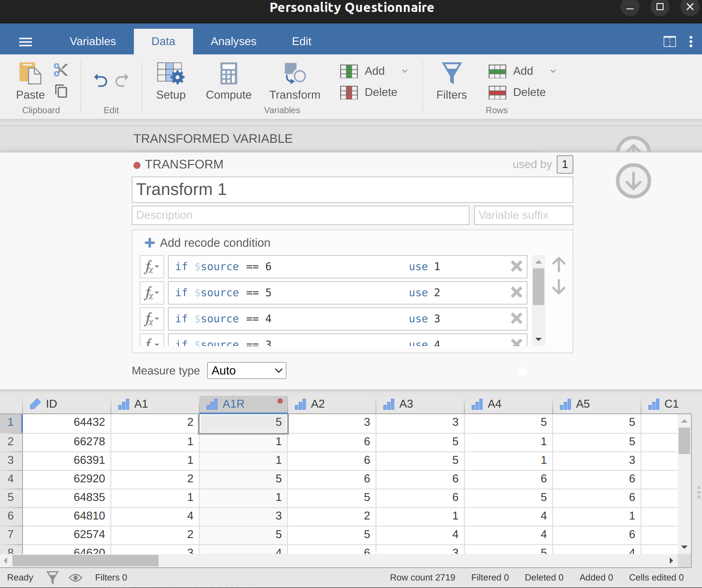
```

```{r}
#| label: fig-fig15-9
#| classes: .enlarge-image
#| fig-cap: 使用 jamovi 的計算新變項命令計算新的量表分數變項
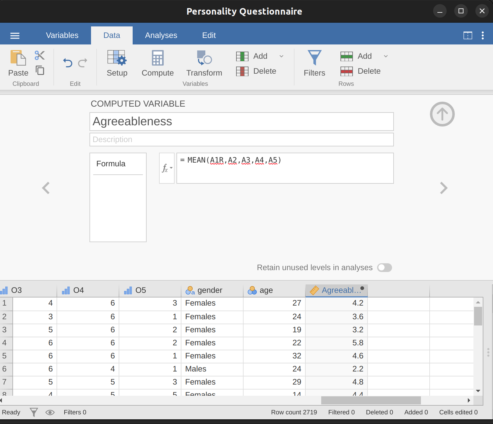
```

<!--- Another option is to create an **optimally-weighted** factor score index. To do this, save the factor scores to the data set, using the 'Save' - 'Factor scores' checkbox. Once you have done this you will see that five new variables (columns) have been added to the data, one for each factor extracted. See @fig-fig15-10 and @fig-fig15-11.

jamovi option for factor scores for the five factor solution, using the 'Bartlett' optimal weighting method

Data sheet view showing the five newly created factor score variables
--->

另一個選擇是創建一個**最佳加權**的因素分數指標。要做到這一點，請使用「儲存」(Save) -> 「因素分數」(Factor scores) 核取方塊將因素分數儲存到資料集中。完成後，您會看到資料中增加了五個新變項（欄），每個萃取的因素各一個。請參見 @fig-fig15-10 和 @fig-fig15-11。


```{r}
#| label: fig-fig15-10
#| classes: .enlarge-image
#| fig-cap: jamovi中五因素解的因素分數選項，使用「巴特利」(Bartlett)最佳加權法
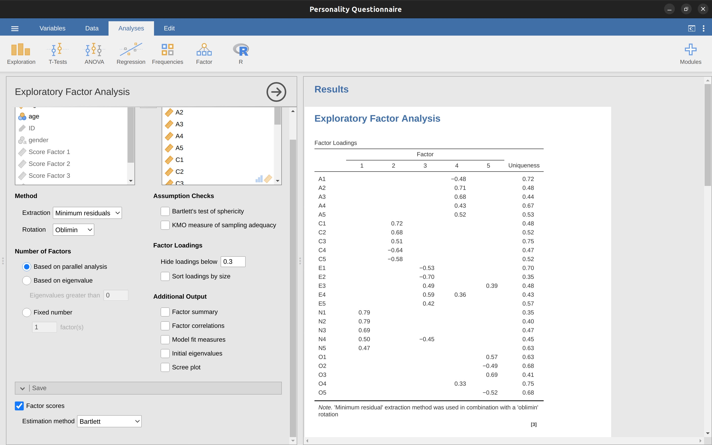
```

```{r}
#| label: fig-fig15-11
#| classes: .enlarge-image
#| fig-cap: 資料表檢視，顯示五個新創建的因素分數變項
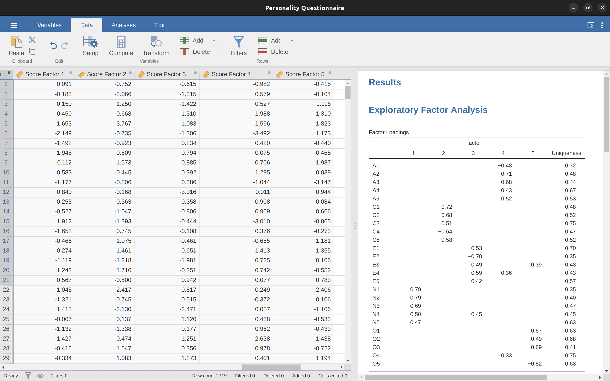
```

<!--- Now you can go ahead and undertake further analyses, using either the mean score based factor scales (e.g. as in @fig-fig15-9) or using the optimally-weighted factor scores calculated by jamovi. Your choice! For example, one thing you might like to do is see whether there are any gender differences in each of our personality scales. We did this for the Agreeableness score that we calculated using the mean score approach, and although the t test plot (@fig-fig15-12) showed that males were less agreeable than females, this was not a significant difference (Mann-Whitney $U = 5768$, $p = .075$). 


Comparing differences in Agreeableness factor-based scores between males and females
--->


現在，您可以繼續進行進一步的分析，可以使用基於平均分數的因素量表（如 @fig-fig15-9 所示），也可以使用jamovi計算的最佳加權因素分數。任君選擇！例如，您可能想看看我們的人格量表中是否存在性別差異。我們對使用平均分數法計算的親和性分數進行了此項分析，儘管t檢定圖（@fig-fig15-12）顯示男性的親和性低於女性，但此差異不顯著（曼-惠特尼U檢定 $U = 5768$, $p = .075$）。


```{r}
#| label: fig-fig15-12
#| classes: .enlarge-image
#| fig-cap: 比較男性與女性基於親和性因素分數的差異
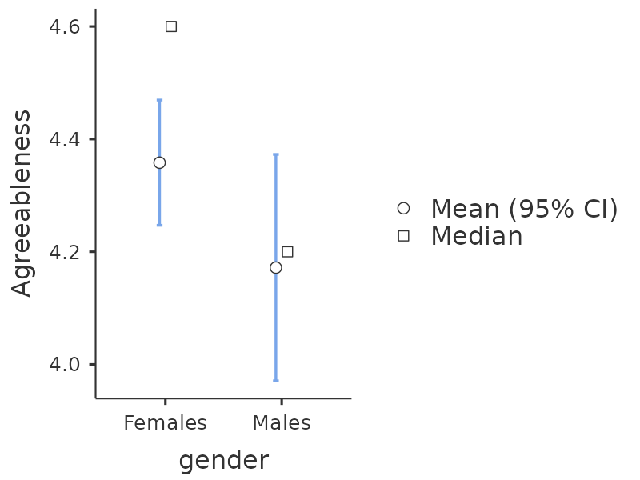
```

### 探索性因素分析的報告須知

<!--- Hopefully, so far we have given you some sense of EFA and how to undertake EFA in jamovi. So, once you have completed your EFA, how do you write it up? There is not a formal standard way to write up an EFA, and examples tend to vary by discipline and researcher. That said, there are some fairly standard pieces of information to include in your write-up:

1.  What are the theoretical underpinnings for the area you are studying, and specifically for the constructs that you are interested in uncovering through EFA.

2.  A description of the sample (e.g. demographic information, sample size, sampling method).

3.  A description of the type of data used (e.g., nominal, continuous) and descriptive statistics.

4.  Describe how you went about testing the assumptions for EFA. Details regarding sphericity checks and measures of sampling adequacy should be reported.

5.  Explain what FA extraction method (e.g. 'Minimum residuals' or 'Maximum likelihood') was used.

6.  Explain the criteria and process used for deciding how many factors were extracted in the final solution, and which items were selected. Clearly explain the rationale for key decisions during the EFA process.

7.  Explain what rotation methods were attempted, the reasons why, and the results.

8.  Final factor loadings should be reported in the results, in a table. This table should also report the uniqueness (or communality) for each variable (in the final column). Factor loadings should be reported with descriptive labels in addition to item numbers. Correlations between the factors should also be included, either at the bottom of this table, in a separate table.

9.  Meaningful names for the extracted factors should be provided. You may like to use previously selected factor names, but on examining the actual items and factors you may think a different name is more appropriate --->


希望到目前為止，您對EFA以及如何在jamovi中進行EFA有了一定的了解。那麼，完成EFA後，該如何撰寫報告呢？EFA的撰寫沒有正式的標準格式，範例因學科和研究人員而異。儘管如此，報告中仍應包含一些相當標準的資訊：

1.  您所研究領域的理論基礎，特別是您有興趣透過EFA揭示的構念。
2.  樣本描述（例如，人口統計資訊、樣本大小、抽樣方法）。
3.  所用資料類型的描述（例如，名義、連續）及描述性統計。
4.  描述您如何檢定EFA的假設。應報告球形性檢定和樣本適足性量數的詳細資訊。
5.  說明使用了哪種因素萃取方法（例如，「最小殘差法」或「最大概似法」）。
6.  說明決定最終解中萃取多少因素及選擇哪些項目的標準和過程。清晰解釋EFA過程中的關鍵決策理由。
7.  說明嘗試了哪些轉軸方法、原因及結果。
8.  最終的因素負荷量應以表格形式呈現在結果中。此表也應報告每個變項的獨特性（或共同性）（在最後一欄）。因素負荷量除項目編號外，還應附有描述性標籤。因素之間的相關性也應包含在內，可以在此表的底部或另一個獨立的表格中呈現。
9.  應為萃取的因素提供有意義的名稱。您可以使用先前選定的因素名稱，但在檢視實際項目和因素後，您可能會認為不同的名稱更為合適。


## 主成分分析

<!--- In the previous section we saw that EFA works to identify underlying latent factors. And, as we saw, in one scenario the smaller number of latent factors can be used in further statistical analysis using some sort of combined factor scores.

In this way EFA is being used as a "data reduction" technique. Another type of data reduction technique, sometimes seen as part of the EFA family, is **principal component analysis (PCA)** . However, PCA does not identify underlying latent factors. Instead it creates a linear composite score from a larger set of measured variables.

PCA simply produces a mathematical transformation to the original data with no assumptions about how the variables co-vary. The aim of PCA is to calculate a few linear combinations (components) of the original variables that can be used to summarize the observed data set without losing much information. However, if identification of underlying structure is a goal of the analysis, then EFA is to be preferred. And, as we saw, EFA produces factor scores that can be used for data reduction purposes just like principal component scores [@Fabrigar1999].

PCA has been popular in Psychology for a number of reasons, and therefore it's worth mentioning, although nowadays EFA is just as easy to do given the power of desktop computers and can be less susceptible to bias than PCA, especially with a small number of factors and variables. Much of the procedure is similar to EFA, so although there are some conceptual differences, practically the steps are the same, and with large samples and a sufficient number of factors and variables, the results from PCA and EFA should be fairly similar.

To undertake PCA in jamovi, all you need to do is select 'Factor' - 'Principal Component Analysis' from the main jamovi button bar to open the PCA analysis window. Then you can follow the same steps from [EFA in jamovi] above. --->


在前一節中，我們看到EFA可用於識別潛在因素。而且，如我們所見，在某些情況下，較少數量的潛在因素可以透過某種組合的因素分數，用於進一步的統計分析。

這樣，EFA就被當作一種「資料降維」技術。另一種資料降維技術，有時被視為EFA家族的一部分，是**主成分分析(PCA)**。然而，PCA並非用來識別潛在因素，而是從一組較大的測量變項中創建一個線性綜合分數。

PCA僅對原始資料進行數學轉換，對變項如何共變不作任何假設。PCA的目標是計算原始變項的幾個線性組合（主成分），這些主成分可用於總結觀察資料集而不會損失太多資訊。然而，如果分析的目標是識別潛在結構，那麼EFA是更佳的選擇。而且，如我們所見，EFA產生的因素分數可以像主成分分數一樣用於資料降維的目的 [@Fabrigar1999]。

PCA在心理學中因多種原因而普及，因此值得一提。不過，如今由於桌上型電腦的強大運算能力，EFA同樣易於執行，且相較於PCA，尤其是在因素和變項數量較少的情況下，EFA較不易產生偏差。PCA的大部分程序與EFA相似，因此儘管在概念上有些差異，但實際操作步驟是相同的。對於大樣本以及足夠數量的因素和變項，PCA和EFA的結果應該相當類似。

要在jamovi中執行PCA，您只需從jamovi主功能列中選擇「因素分析」(Factor) -> 「主成分分析」(Principal Component Analysis)以打開PCA分析視窗。然後，您可以遵循前面[使用jamovi完成探索性因素分析]中的相同步驟。


## 驗證性因素分析

<!---So, our attempt to identify underlying latent factors using EFA with carefully selected questions from the personality item pool seemed to be pretty successful. The next step in our quest to develop a useful measure of personality is to check the latent factors we identified in the original EFA with a different sample. We want to see if the factors hold up, if we can confirm their existence with different data. This is a more rigorous check, as we will see. And it's called **Confirmatory Factor Analysis (CFA)** as we will, unsurprisingly, be seeking to confirm a pre-specified latent factor structure.[^factor-analysis-8]

[^factor-analysis-8]: As an aside, given that we had a pretty firm idea from our initial "putative" factors, we could just have gone straight to CFA and skipped the EFA step. Whether you use EFA and then go on to CFA, or go straight to CFA, is a matter of judgement and how confident you are initially that you have the model about right (in terms of number of factors and variables). Earlier on in the development of scales, or the identification of underlying latent constructs, researchers tend to use EFA. Later on, as they get closer to a final scale, or if they want to check an established scale in a new sample, then CFA is a good option.

In CFA, instead of doing an analysis where we see how the data goes together in an exploratory sense, we instead impose a structure, like in @fig-fig15-13, on the data and see how well the data fits our pre-specified structure. In this sense, we are undertaking a confirmatory analysis, to see how well a pre-specified **model** is confirmed by the observed data.

A straightforward confirmatory factor analysis (CFA) of the personality items would therefore specify five latent factors as shown in @fig-fig15-13, each measured by five observed variables. Each variable is a measure of an underlying latent factor. For example, A1 is predicted by the underlying latent factor Agreeableness. And because A1 is not a perfect measure of the Agreeableness factor, there is an error term, $e$, associated with it. In other words, $e$ represents the variance in A1 that is not accounted for by the Agreeableness factor. This is sometimes called **measurement error**.

Initial pre-specification of latent factor structure for the five factor personality scales, for use in CFA. --->

我們使用EFA從精心挑選的人格題庫中識別潛在因素的嘗試，似乎相當成功。在我們尋求開發一種有用的人格測量工具的下一步，是用不同的樣本來檢驗我們在原始EFA中識別出的潛在因素。我們想看看這些因素是否經得起考驗，是否能用不同的資料來確認它們的存在。這是一個更嚴格的檢驗，我們將會看到。這被稱為**驗證性因素分析(CFA)**，因為我們將尋求確認一個預先指定的潛在因素結構[^factor-analysis-8]。

[^factor-analysis-8]: 順帶一提，鑑於我們從最初的「假定」因素中已經有了相當明確的想法，我們本可以直接進行CFA而跳過EFA步驟。是先用EFA再進行CFA，還是直接進行CFA，取決於判斷以及您最初對模型（在因素和變項數量方面）的正確性有多大信心。在量表開發的早期階段，或在識別潛在構念時，研究人員傾向於使用EFA。後期，當他們接近最終量表，或者想在新樣本中檢驗一個已建立的量表時，CFA是一個很好的選擇。

在CFA中，我們不是以探索性的方式分析資料如何組合，而是將一個結構（如 @fig-fig15-13 所示）強加於資料之上，然後看資料與我們預先指定的結構的擬合程度。從這個意義上說，我們是在進行驗證性分析，以檢視一個預先指定的**模型**在多大程度上被觀察資料所證實。

因此，對人格項目進行直接的驗證性因素分析(CFA)將指定五個潛在因素，如 @fig-fig15-13 所示，每個因素由五個觀察變項測量。每個變項都是一個潛在因素的測量指標。例如，A1由潛在因素「親和性」預測。而且因為A1不是親和性因素的完美測量，所以有一個與之相關的誤差項 $e$。換句話說，$e$ 代表了A1中無法被親和性因素解釋的變異，這有時被稱為**測量誤差**。


```{r}
#| label: fig-fig15-13
#| classes: .enlarge-image
#| fig-cap: 用於CFA的五因素人格量表的潛在因素結構初始預設
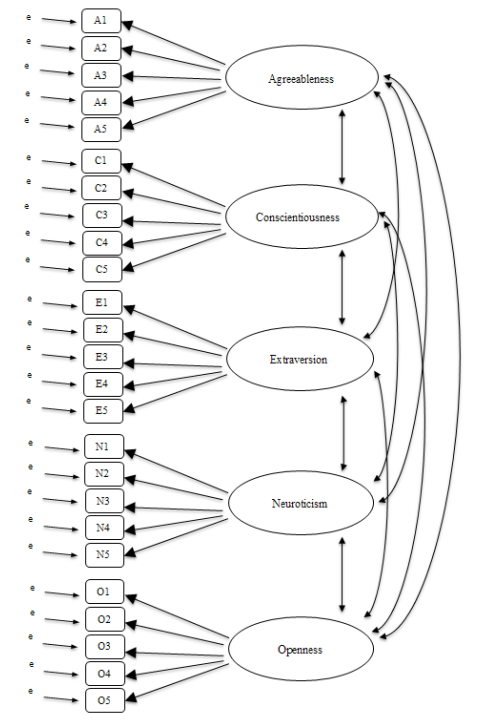
```

<!--- The next step is to consider whether the latent factors should be allowed to correlate in our model. As mentioned earlier, in the psychological and behavioural sciences constructs are often related to each other, and we also think that some of our personality factors may be correlated with each other. So, in our model, we should allow these latent factors to co-vary, as shown by the double-headed arrows in @fig-fig15-13.

At the same time, we should consider whether there is any good, systematic, reason for some of the error terms to be correlated with each other. One reason for this might be that there is a shared methodological feature for particular sub-sets of the observed variables such that the observed variables might be correlated for methodological rather than substantive latent factor reasons. We'll return to this possibility in a later section but, for now, there are no clear reasons that we can see that would justify correlating some of the error terms with each other

Without any correlated error terms, the model we are testing to see how well it fits with our observed data is just as specified in @fig-fig15-13. Only parameters that are included in the model are expected to be found in the data, so in CFA all other possible parameters (coefficients) are set to zero. So, if these other parameters are not zero (for example there may be a substantial loading from A1 onto the latent factor Extraversion in the observed data, but not in our model) then we may find a poor fit between our model and the observed data.

Right, let's take a look at how we set this CFA analysis up in jamovi. --->


下一步是考慮是否應允許模型中的潛在因素相關。如前所述，在心理學和行為科學中，構念之間通常是相互關聯的，我們也認為我們的一些人格因素可能彼此相關。因此，在我們的模型中，我們應該允許這些潛在因素共變，如 @fig-fig15-13 中的雙箭頭所示。

同時，我們應該考慮是否有任何充分的、系統性的理由讓某些誤差項彼此相關。一個可能的原因是，特定觀察變項子集存在共同的方法學特徵，使得這些觀察變項可能因方法學而非實質潛在因素的原因而相關。我們將在後面的章節中回到這個可能性，但目前，我們看不到任何明確的理由來證明某些誤差項之間應該相關。

在沒有任何相關誤差項的情況下，我們用來檢驗其與觀察資料擬合程度的模型，就如 @fig-fig15-13 所指定。模型中只預期找到包含的參數，因此在CFA中，所有其他可能的參數（係數）都被設定為零。所以，如果這些其他參數不為零（例如，觀察資料中可能存在從A1到潛在因素「外向性」的實質負荷，但在我們的模型中沒有），那麼我們可能會發現我們的模型與觀察資料的擬合度不佳。

好了，讓我們來看看如何在jamovi中設定這個CFA分析。

### 使用jamovi完成驗證性因素分析

<!--- Open up the *bfi_sample2.csv*  file, check that the 25 variables are coded as ordinal (or continuous; it won't make any difference for this analysis). To perform CFA in jamovi:

- Select Factor - Confirmatory Factor Analysis from the main jamovi button bar to open the CFA analysis window (@fig-fig15-14).

- Select the 5 A variables and transfer them into the 'Factors' box and give then the label "Agreeableness".

- Create a new Factor in the 'Factors' box and label it "Conscientiousness". Select the 5 C variables and transfer them into the 'Factors' box under the "Conscientiousness" label.

- Create another new Factor in the 'Factors' box and label it "Extraversion". Select the 5 E variables and transfer them into the 'Factors' box under the "Extraversion" label.

- Create another new Factor in the 'Factors' box and label it "Neuroticism". Select the 5 N variables and transfer them into the 'Factors' box under the "Neuroticism" label.

- Create another new Factor in the 'Factors' box and label it "Openness". Select the 5 O variables and transfer them into the 'Factors' box under the "Openness" label.

- Check other appropriate options, the defaults are ok for this initial work through, though you might want to check the "Path diagram" option under 'Plots' to see jamovi produce a (fairly) similar diagram to our @fig-fig15-13.

The jamovi CFA analysis window.--->

打開 *bfi_sample2.csv* 檔案，檢查25個變項是否被編碼為次序（或連續）變項；對於此分析，這不會產生任何差異。在jamovi中執行CFA的步驟如下：

-   從jamovi主功能列中選擇「因素分析」(Factor) -> 「驗證性因素分析」(Confirmatory Factor Analysis)以打開CFA分析視窗（@fig-fig15-14）。
-   選取5個A開頭的變項，將它們移至「因素」(Factors)框中，並給予標籤「Agreeableness」。
-   在「因素」框中創建一個新因素，並標記為「Conscientiousness」。選取5個C開頭的變項，將它們移至「Conscientiousness」標籤下的「因素」框中。
-   在「因素」框中再創建一個新因素，並標記為「Extraversion」。選取5個E開頭的變項，將它們移至「Extraversion」標籤下的「因素」框中。
-   在「因素」框中再創建一個新因素，並標記為「Neuroticism」。選取5個N開頭的變項，將它們移至「Neuroticism」標籤下的「因素」框中。
-   在「因素」框中再創建一個新因素，並標記為「Openness」。選取5個O開頭的變項，將它們移至「Openness」標籤下的「因素」框中。
-   檢查其他適當的選項，對於初次操作，預設值即可。不過，您可能想在「繪圖」(Plots)下勾選「路徑圖」(Path diagram)選項，以讓jamovi生成一個與我們的 @fig-fig15-13（相當）相似的圖表。


```{r}
#| label: fig-fig15-14
#| classes: .enlarge-image
#| fig-cap: jamovi驗證性因素分析窗口
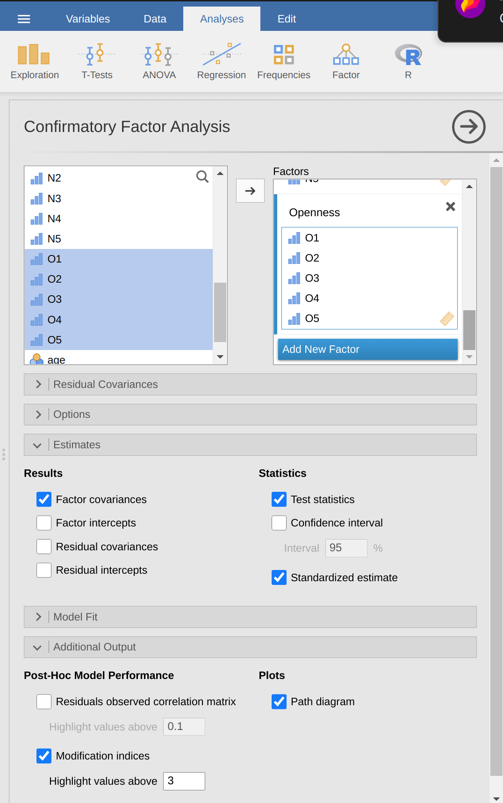
```

<!--- Once we have set up the analysis we can turn our attention to the jamovi results window and see what's what. The first thing to look at is **model fit** (@fig-fig15-15) as this tells us how good a fit our model is to the observed data. NB in our model only the pre-specified covariances are estimated, including the factor correlations by default. Everything else is set to zero.

The jamovi CFA Model Fit results for our CFA model. --->

設定好分析後，我們可以將注意力轉向jamovi的結果視窗，看看結果如何。首先要看的是**模型適配度**（@fig-fig15-15），因為它告訴我們模型與觀察資料的擬合程度。請注意，在我們的模型中，只估計了預先指定的共變異，預設情況下包括因素相關。其餘所有參數都設定為零。


```{r}
#| label: fig-fig15-15
#| classes: .enlarge-image
#| fig-cap: jamovi CFA模型適配結果
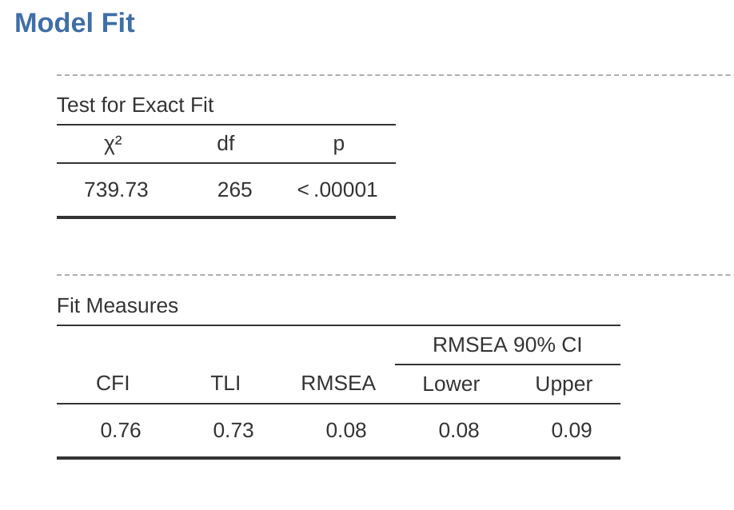
```

<!--- There are several ways of assessing model fit. The first is a chi-square statistic that, if small, indicates that the model is a good fit to the data. However, the chi-squared statistic used for assessing model fit is pretty sensitive to sample size, meaning that with a large sample a good enough fit between the model and the data almost always produces a large and significant ($p$ < .05) chi-square value.

So, we need some other ways of assessing model fit. In jamovi several are provided by default. These are the Comparative Fit Index (CFI), the Tucker Lewis Index (TLI) and the Root Mean Square Error of Approximation (RMSEA) together with the 90% confidence interval for the RMSEA. Some useful rules of thumb are that a satisfactory fit is indicated by CFI > 0.9, TLI > 0.9, and RMSEA of about 0.05 to 0.08. A good fit is CFI > 0.95, TLI > 0.95, and RMSEA and upper CI for RMSEA < 0.05.

So, looking at @fig-fig15-15 we can see that the chi-square value is large and highly significant. Our sample size is not too large, so this possibly indicates a poor fit. The CFI is $0.762$ and the TLI is 0.731, indicating poor fit between the model and the data. The RMSEA is $0.085$ with a $90\%$ confidence interval from $0.077$ to $0.092$, again this does not indicate a good fit.

Pretty disappointing, huh? But perhaps not too surprising given that in the earlier EFA, when we ran with a similar data set (see [Exploratory Factor Analysis] section), only around half of the variance in the data was accounted for by the five factor model.

Let's go on to look at the factor loadings and the factor covariance estimates, shown in @fig-fig15-16 and @fig-fig15-17. The Z-statistic and p-value for each of these parameters indicates they make a reasonable contribution to the model (i.e. they are not zero) so there doesn't appear to be any reason to remove any of the specified variable-factor paths, or factor-factor correlations from the model. Often the standardized estimates are easier to interpret, and these can be specified under the 'Estimates' option. These tables can usefully be incorporated into a written report or scientific article.

The jamovi CFA Factor Loadings table for our CFA model.

The jamovi CFA Factor Covariances table for our CFA model. --->

評估模型適配度有幾種方法。第一種是卡方統計量，如果值很小，表示模型與資料擬合良好。然而，用於評估模型適配的卡方統計量對樣本大小相當敏感，這意味著對於大樣本，模型與資料之間足夠好的擬合幾乎總會產生一個大而顯著（$p < .05$）的卡方值。

因此，我們需要其他方法來評估模型適配度。在jamovi中，預設提供了幾種。這些是比較適配指數（CFI）、塔克-路易斯指數（TLI）和近似誤差均方根（RMSEA）及其90%信賴區間。一些實用的經驗法則是：CFI > 0.9、TLI > 0.9，以及RMSEA約在0.05到0.08之間表示滿意的擬合。CFI > 0.95、TLI > 0.95，以及RMSEA及其信賴區間上限 < 0.05則表示良好的擬合。

從 @fig-fig15-15 中我們可以看到，卡方值很大且高度顯著。我們的樣本量不算太大，所以這可能表示擬合不佳。CFI為0.762，TLI為0.731，表示模型與資料之間的擬合不佳。RMSEA為0.085，90%信賴區間為0.077到0.092，這同樣未顯示出良好的擬合。

相當令人失望，是吧？但考慮到在早前的EFA中，當我們使用類似的資料集（見[探索性因素分析]一節）時，五因素模型僅解釋了資料中約一半的變異，這個結果或許不太令人意外。

讓我們接著看 @fig-fig15-16 和 @fig-fig15-17 中顯示的因素負荷量和因素共變異估計。每個參數的Z統計量和p值表明它們對模型做出了合理的貢獻（即它們不為零），因此似乎沒有理由從模型中移除任何指定的變項-因素路徑或因素-因素相關。通常標準化估計值更容易解釋，這些可以在「估計」(Estimates)選項下指定。這些表格可以有效地整合到書面報告或科學文章中。


```{r}
#| label: fig-fig15-16
#| classes: .enlarge-image
#| fig-cap: jamovi CFA模型之因素負荷量表
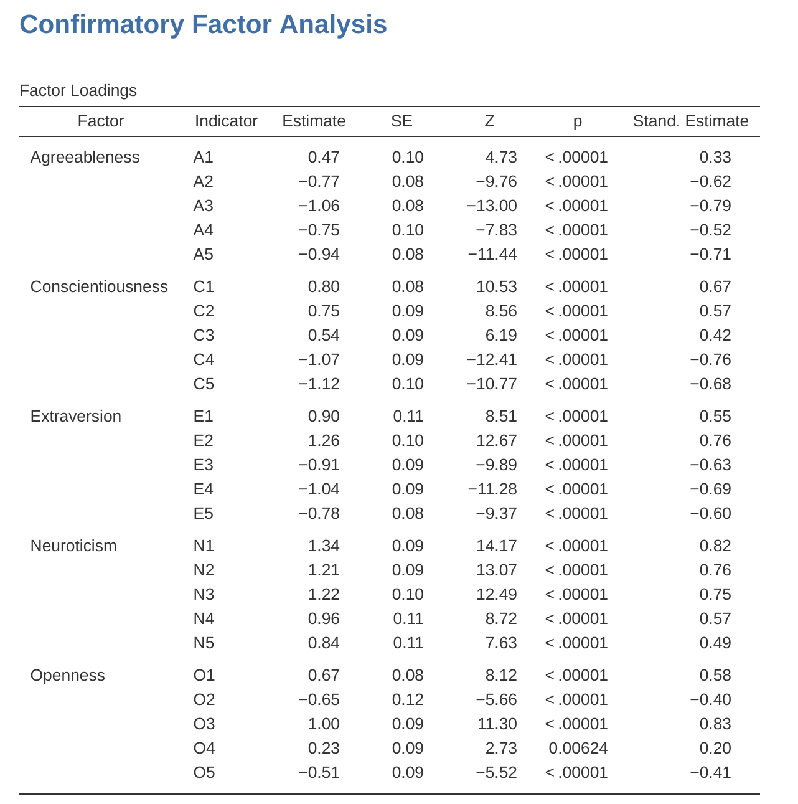
```

```{r}
#| label: fig-fig15-17
#| classes: .enlarge-image
#| fig-cap: jamovi CFA模型之因素共變異表
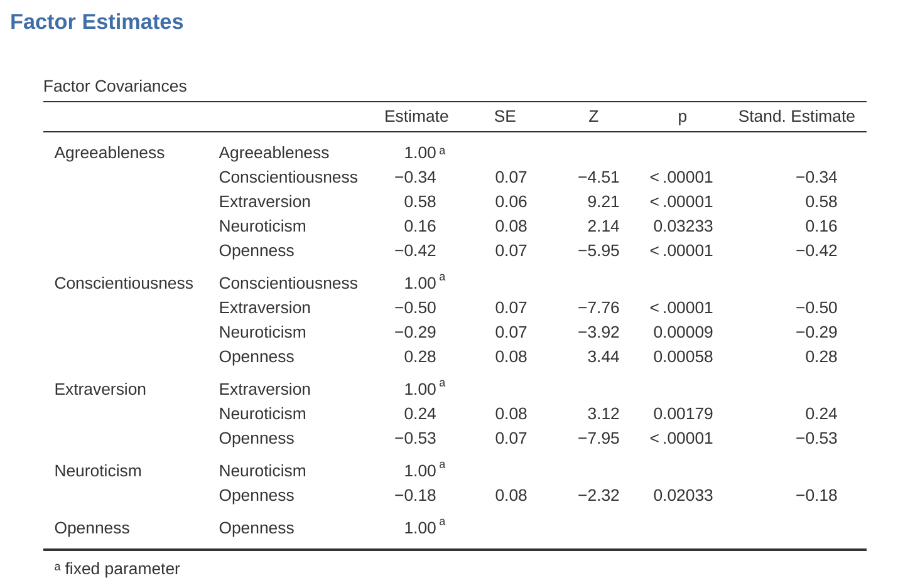
```

<!---How could we improve the model? One option is to go back a few stages and think again about the items / measures we are using and how they might be improved or changed. Another option is to make some post hoc tweaks to the model to improve the fit. One way of doing this is to use "modification indices" (@fig-fig15-18), specified as an 'Additional output' option in jamovi.

The jamovi CFA Factor Loadings Modification Indices.--->


我們該如何改進模型呢？一個選擇是回到前幾個階段，重新思考我們正在使用的項目/測量，以及如何改進或更改它們。另一個選擇是對模型進行一些事後調整以改善擬合度。實現此目的的一種方法是使用「修正指標」(modification indices)（@fig-fig15-18），在jamovi中它被指定為「額外輸出」(Additional output)選項。


```{r}
#| label: fig-fig15-18
#| classes: .enlarge-image
#| fig-cap: jamovi CFA 因素負荷修正指標
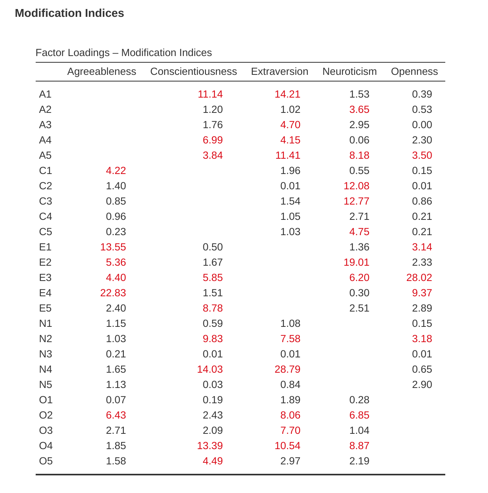
```

<!---What we are looking for is the highest modification index (MI) value. We would then judge whether it makes sense to add that additional term into the model, using a *post hoc* rationalisation. For example, we can see in @fig-fig15-18 that the largest MI for the factor loadings that are not already in the model is a value of 28.786 for the loading of N4 ("Often feel blue") onto the latent factor Extraversion. This indicates that if we add this path into the model then the chi-square value will reduce by around the same amount.

But in our model adding this path arguably doesn't really make any theoretical or methodological sense, so it's not a good idea (unless you can come up with a persuasive argument that "Often feel blue" measures both Neuroticism and Extraversion). I can't think of a good reason. But, for the sake of argument, let's pretend it does make some sense and add this path into the model. Go back to the CFA analysis window (see @fig-fig15-14) and add N4 into the Extraversion factor. The results of the CFA will now change (not shown); the chi-square has come down to around 709 (a drop of around 30, roughly similar to the size of the MI) and the other fit indices have also improved, though only a bit. But it's not enough: it's still not a good fitting model.

If you do find yourself adding new parameters to a model using the MI values then always re-check the MI tables after each new addition, as the MIs are refreshed each time.

There is also a Table of Residual Covariance Modification Indices produced by jamovi (@fig-fig15-19). In other words, a table showing which correlated errors, if added to the model, would improve the model fit the most. It's a good idea to look across both MI tables at the same time, spot the largest MI, think about whether the addition of the suggested parameter can be reasonably justified and, if it can, add it to the model. And then you can start again looking for the biggest MI in the re-calculated results.

Residual Covariance Modification Indices produced by jamovi.--->


我們要尋找的是最高的修正指標(MI)值。然後，我們將判斷將該附加項加入模型中是否有意義，並使用事後合理化的方式。例如，我們可以在 @fig-fig15-18 中看到，對於模型中尚未包含的因素負荷量，最大的MI值是N4（「經常感到憂鬱」）對潛在因素「外向性」的負荷，其值為28.786。這表示如果我們將此路徑加入模型，卡方值將減少大約相同的量。

但在我們的模型中，加入這條路徑在理論上或方法論上可以說並不合理，所以這不是一個好主意（除非您能提出有說服力的論點，證明「經常感到憂鬱」同時測量神經質性與外向性）。我想不出好的理由。但是，為了論證起見，讓我們假裝它確實有一定意義，並將此路徑加入模型中。回到CFA分析視窗（見 @fig-fig15-14）並將N4加入外向性因素中。CFA的結果現在會改變（未顯示）；卡方值下降到約709（下降了約30，大致與MI的大小相當），其他擬合指標也有所改善，儘管只是一點點。但這還不夠：它仍然不是一個擬合良好的模型。

如果您發現自己正在使用MI值向模型中添加新參數，請務必在每次新增後重新檢查MI表，因為MI每次都會重新計算。

jamovi還產生了殘差共變異修正指標表（@fig-fig15-19）。換句話說，這是一個顯示如果將哪些相關誤差加入模型中，可以最大程度地改善模型擬合度的表格。同時查看這兩個MI表是一個好主意，找出最大的MI，思考是否可以合理地證明建議參數的增加，如果可以，就將其加入模型中。然後，您可以在重新計算的結果中再次開始尋找最大的MI。


```{r}
#| label: fig-fig15-19
#| out.width: 60%
#| classes: .enlarge-image
#| fig-cap: jamovi 產生的殘差共變異修正指標
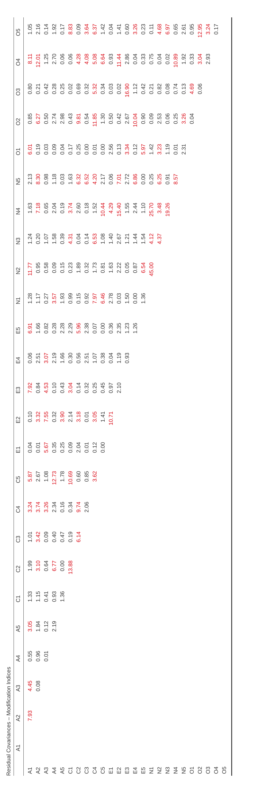
```

<!--- You can keep going this way for as long as you like, adding parameters to the model based on the largest MI, and eventually you will achieve a satisfactory fit. But there will also be a strong possibility that in doing this you will have created a monster! A model that is ugly and deformed and doesn't have any theoretical sense or purity. In other words, be very careful!

So far, we have checked out the factor structure obtained in the EFA using a second sample and CFA. Unfortunately, we didn't find that the factor structure from the EFA was confirmed in the CFA, so it's back to the drawing board as far as the development of this personality scale goes.

Although we could have tweaked the CFA using modification indexes, there really were not any good reasons (that I could think of) for these suggested additional factor loadings or residual covariances to be included. However, sometimes there is a good reason for residuals to be allowed to co-vary (or correlate), and a good example of this is shown in the next section on [Multi-Trait Multi-Method CFA]. Before we do that, let's cover how to report the results of a CFA. --->


您可以隨心所欲地以這種方式繼續操作——根據最大的MI將參數加入模型中，最終您將達到令人滿意的擬合效果。但這樣做的同時，也極有可能創造出一個怪物！一個醜陋、畸形、在理論上毫無意義或純粹性的模型。換句話說，要非常小心！

到目前為止，我們已經使用第二個樣本和CFA檢驗了在EFA中獲得的因素結構。不幸的是，我們發現EFA的因素結構在CFA中未得到確認，因此就這個人格量表的開發而言，我們又回到了原點。

儘管我們本可以使用修正指標來調整CFA，但我真的想不出任何好的理由（至少我想不出）來包含這些建議的額外因素負荷量或殘差共變異。然而，在某些情況下，允許殘差共變（或相關）是有充分理由的，下一節關於[多特質多方法驗證性因素分析]就提供了一個很好的例子。在此之前，讓我們先了解如何報告CFA的結果。

### 驗證性因素分析的報告須知

<!---There is not a formal standard way to write up a CFA, and examples tend to vary by discipline and researcher. That said, there are some fairly standard pieces of information to include in your write-up:

1.  A theoretical and empirical justification for the hypothesized model.

2.  A complete description of how the model was specified (e.g. the indicator variables for each latent factor, covariances between latent variables, and any correlations between error terms). A path diagram, like the one in @fig-fig15-13 would be good to include.

3.  A description of the sample (e.g. demographic information, sample size, sampling method).

4.  A description of the type of data used (e.g., nominal, continuous) and descriptive statistics.

5.  Tests of assumptions and estimation method used.

6.  A description of missing data and how the missing data were handled.

7.  The software and version used to fit the model.

8.  Measures, and the criteria used, to judge model fit.

9.  Any alterations made to the original model based on model fit or modification indices.

10. All parameter estimates (i.e., loadings, error variances, latent (co)variances) and their standard errors, probably in a table. --->


CFA報告沒有正式的標準格式，範例因學科和研究人員而異。儘管如此，報告中仍應包含以下幾項標準資訊：

1.  假設模型的理論和實證依據。
2.  完整描述模型的設定方式（例如，每個潛在因素的指標變項、潛在變項之間的共變異，以及任何誤差項之間的相關）。包含像 @fig-fig15-13 這樣的路徑圖會很有幫助。
3.  樣本描述（例如，人口統計資訊、樣本大小、抽樣方法）。
4.  所用資料類型的描述（例如，名義、連續）及完整的描述性統計。
5.  假設檢定及所用的估計方法。
6.  遺失資料的描述及其處理方式。
7.  用於擬合模型的軟體及版本。
8.  用於判斷模型擬合度的測量指標及標準。
9.  基於模型擬合度或修正指標對原始模型所做的任何修改。
10. 所有參數估計值（即負荷量、誤差變異、潛在（共）變異）及其標準誤，最好以表格呈現。

## 多特質多方法驗證性因素分析

<!--- In this section we're going to consider how different measurement techniques or questions can be an important source of data variability, known as **method variance**. To do this, we'll use another psychological data set, one that contains data on "attributional style".

The Attributional Style Questionnaire (ASQ) was used [@Hewitt2004] to collect psychological wellbeing data from young people in the United Kingdom and New Zealand. They measured attributional style for negative events, which is how people habitually explain the cause of bad things that happen to them [@Peterson1984]. The attributional style questionnaire (ASQ) measures three aspects of attributional style:

- Internality is the extent to which a person believes that the cause of a bad event is due to his/her own actions.

- Stability refers to the extent to which a person habitually believes the cause of a bad event is stable across time.

- Globality refers to the extent to which a person habitually believes that the cause of a bad event in one area will affect other areas of their lives.

There are six hypothetical scenarios and for each scenario respondents answer a question aimed at (a) internality, (b) stability and (c) globality. So there are $6 \times 3 = 18$ items overall. See @fig-fig15-20 for more details.

The Attributional Style Questionnaire (ASQ) for negative events. --->

在本節中，我們將探討不同的測量技術或問題如何成為資料變異的一個重要來源，這被稱為**方法變異**。為此，我們將使用另一個心理學資料集，其中包含關於「歸因風格」的資料。

@Hewitt2004 使用歸因風格問卷(ASQ)從英國和紐西蘭的年輕人那裡收集心理健康資料。他們測量了負面事件的歸因風格，即人們習慣性地如何解釋發生在他們身上的壞事的原因 [@Peterson1984]。歸因風格問卷(ASQ)測量歸因風格的三個方面：

-   內歸因(Internality)是一個人相信壞事的原因是出於自身行為的程度。
-   穩定性(Stability)是一個人習慣性地相信壞事的原因會隨時間保持穩定的程度。
-   全面性(Globality)是一個人習慣性地相信一個領域的壞事原因會影響到他們生活其他領域的程度。

問卷中有六個假設情境，對於每個情境，受訪者需回答旨在測量(a)內歸因、(b)穩定性和(c)全面性的問題。因此，總共有 $6 \times 3 = 18$ 個項目。更多細節請參見 @fig-fig15-20。


```{r}
#| label: fig-fig15-20
#| classes: .enlarge-image
#| fig-cap: 負面事件的歸因風格問卷(ASQ)部分題目 
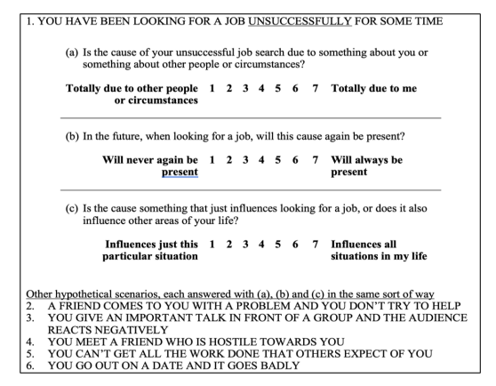
```

<!--- Researchers are interested in checking their data to see whether there are some underlying latent factors that are measured reasonably well by the 18 observed variables in the ASQ.

First, they try EFA with these 18 variables (not shown), but no matter how they extract or rotate, they can't find a good factor solution. Their attempt to identify underlying latent factors in the Attributional Style Questionnaire (ASQ) proved fruitless. If you get results like this then either your theory is wrong (there is no underlying latent factor structure for attributional style, which is possible), the sample is not relevant (which is unlikely given the size and characteristics of this sample of young adults from the United Kingdom and New Zealand), or the analysis was not the right tool for the job. We're going to look at this third possibility.

Remember that there were three dimensions measured in the ASQ: Internality, Stability and Globality, each measured by six questions as shown in @fig-fig15-21.

What if, instead of doing an analysis where we see how the data goes together in an exploratory sense, we instead impose a structure, like in @fig-fig15-21, on the data and see how well the data fits our pre-specified structure. In this sense, we are undertaking a confirmatory analysis, to see how well a pre-specified model is confirmed by the observed data.

A straightforward confirmatory factor analysis (CFA) of the ASQ would therefore specify three latent factors as shown in the columns of @fig-fig15-27, each measured by six observed variables.

Six questions on the ASQ for each of the Internality, Stability and Globality dimensions. --->


研究人員有興趣檢驗他們的資料，看看ASQ中的18個觀察變項是否能合理地測量某些潛在因素。

首先，他們對這18個變項進行EFA（未顯示），但無論如何萃取或轉軸，都找不到一個好的因素解。他們試圖在歸因風格問卷(ASQ)中識別潛在因素的嘗試證明是徒勞的。如果得到這樣的結果，那麼要麼您的理論是錯誤的（歸因風格可能沒有潛在因素結構，這是可能的），要麼樣本不具代表性（考慮到這個來自英國和紐西蘭的年輕成人樣本的大小和特徵，這不太可能），要麼分析方法不適合這項工作。我們將探討第三種可能性。

回想一下，ASQ測量了三個構面：內歸因、穩定性和全面性，每個構面由六個問題測量，如 @fig-fig15-21 所示。

如果我們不以探索性的方式分析資料如何組合，而是將一個結構（如 @fig-fig15-21 所示）強加於資料之上，然後看資料與我們預先指定的結構的擬合程度，會怎麼樣呢？從這個意義上說，我們是在進行驗證性分析，以檢視一個預先指定的模型在多大程度上被觀察資料所證實。

因此，對ASQ進行直接的驗證性因素分析(CFA)將指定三個潛在因素，如 @fig-fig15-21 的欄位所示，每個因素由六個觀察變項測量。


```{r}
#| label: fig-fig15-21
#| classes: .enlarge-image
#| fig-cap: ASQ包括的三個潛在因素~內隱性、穩定性和全局性及對應的六道題目編碼
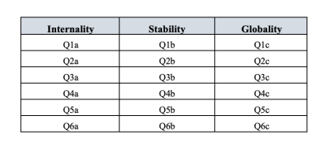
```

<!--- We could depict this as in the diagram in @fig-fig15-22, which shows that each variable is a measure of an underlying latent factor. For example INT1 is predicted by the underlying latent factor Internality. And because INT1 is not a perfect measure of the Internality factor, there is an error term, e1, associated with it. In other words, e1 represents the variance in INT1 that is not accounted for by the Internality factor. This is sometimes called "measurement error".

Initial pre-specification of latent factor structure for the ASQ. --->

我們可以將此描繪成 @fig-fig15-22 中的圖表，該圖顯示每個變項都是一個潛在因素的測量指標。例如，INT1由潛在因素「內歸因」預測。而且因為INT1不是內歸因因素的完美測量，所以有一個與之相關的誤差項 $e_1$。換句話說，$e_1$ 代表了INT1中無法被內歸因因素解釋的變異，這有時被稱為「測量誤差」。


```{r}
#| label: fig-fig15-22
#| classes: .enlarge-image
#| fig-cap: ASQ潛在因素結構的初始預設
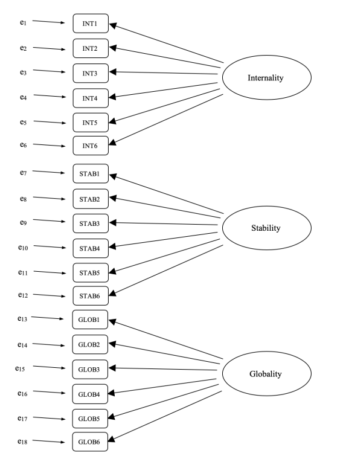
```

<!--- The next step is to consider whether the latent factors should be allowed to correlate in our model. As mentioned earlier, in the psychological and behavioural sciences constructs are often related to each other, and we also think that Internality, Stability, and Globality might be correlated with each other, so in our model we should allow these latent factors to co-vary, as shown in @fig-fig15-23.

Final pre-specification of latent factor structure for the ASQ, including latent factor correlations, and shared method error term correlations for the observed variable INT1, STAB1 and GLOB1, in a CFA MTMM model. For clarity, other pre-specified error term correlations are not shown. --->

下一步是考慮是否應允許模型中的潛在因素相關。如前所述，在心理學和行為科學中，構念之間通常是相互關聯的，我們也認為內歸因、穩定性和全面性可能彼此相關，因此在我們的模型中，我們應該允許這些潛在因素共變，如 @fig-fig15-23 所示。


```{r}
#| label: fig-fig15-23
#| classes: .enlarge-image
#| fig-cap: 在CFA MTMM模型中，ASQ潛在因素結構的最終預設，包括潛在因素相關，以及觀察變項INT1、STAB1和GLOB1的共享方法誤差項相關。為清晰起見，未顯示其他預設的誤差項相關。
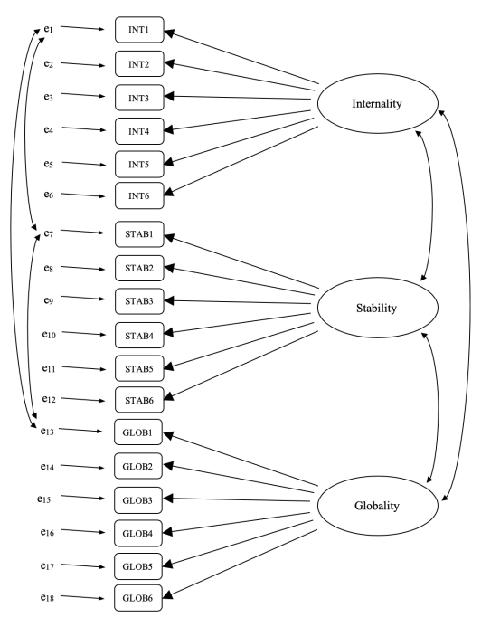
```

<!--- At the same time, we should consider whether there is any good, systematic, reason for some of the error terms to be correlated with each other. Thinking back to the ASQ questions, there were three different sub-questions (a, b and c) for each main question (1-6). Q1 was about unsuccessful job hunting and it is plausible that this question has some distinctive artefactual or methodological aspects over and above the other questions (2-5), something to do with job hunting perhaps. Similarly, Q2 was about not helping a friend with a problem, and there may be some distinctive artefactual or methodological aspects to do with not helping a friend that is not present in the other questions (1, and 3-5).

So, as well as multiple factors, we also have multiple methodological features in the ASQ, where each of Questions 1-6 has a slightly different "method", but each "method" is shared across the sub-questions a, b and c. In order to incorporate these different methodological features into the model we can specify that certain error terms are correlated with each other. For example, the errors associated with INT1, STAB1 and GLOB1 should be correlated with each other to reflect the distinct and shared methodological variance of Q1a, Q1b and Q1c. Looking at @fig-fig15-21, this means that as well as the latent factors represented by the columns, we will have correlated measurement errors for the variables in each row of the Table.

Whilst a basic CFA model like the one shown in @fig-fig15-22 could be tested against our observed data, we have in fact come up with a more sophisticated model, as shown in the diagram in @fig-fig15-23. This more sophisticated CFA model is known as a **Multi-Trait Multi-Method (MTMM)** model, and it is the one we will test in jamovi. --->


同時，我們應該考慮是否有任何充分的、系統性的理由讓某些誤差項彼此相關。回想ASQ的問題，每個主要問題（1-6）都有三個不同的子問題（a、b和c）。Q1是關於求職失敗，這個問題可能比其他問題（2-5）具有某些獨特的人為或方法論方面，也許與求職有關。同樣地，Q2是關於不幫助朋友解決問題，在不幫助朋友這一點上，可能存在某些獨特的人為或方法論方面，而這是其他問題（1和3-5）所沒有的。

因此，除了多個因素外，ASQ中還存在多種方法學特徵，其中每個問題1-6都有略微不同的「方法」，但每個「方法」在子問題a、b和c之間是共享的。為了將這些不同的方法學特徵納入模型，我們可以指定某些誤差項彼此相關。例如，與INT1、STAB1和GLOB1相關的誤差應該彼此相關，以反映Q1a、Q1b和Q1c的獨特和共享的方法學變異。從 @fig-fig15-21 來看，這意味著除了由欄位代表的潛在因素外，我們還將對表中每一列的變項有相關的測量誤差。

雖然像 @fig-fig15-22 所示的基本CFA模型可以與我們的觀察資料進行檢驗，但我們實際上提出了一個更複雜的模型，如 @fig-fig15-23 的圖表所示。這種更複雜的CFA模型被稱為**多特質多方法(MTMM)**模型，這就是我們將在jamovi中檢驗的模型。


### 使用jamovi完成多特質多方法驗證性因素分析

<!---Open up the *ASQ.csv*  file and check that the 18 variables (six "Internality", six "Stability" and six "Globality" variables) are specified as continuous variables.

To perform MTMM CFA in jamovi:

- Select Factor - Confirmatory Factor Analysis from the main jamovi button bar to open the CFA analysis window (@fig-fig15-24).

- Select the 6 INT variables and transfer them into the 'Factors' box and give them the label "Internality".

- Create a new Factor in the 'Factors' box and label it "Stability". Select the 6 STAB variables and transfer them into the 'Factors' box under the "Stability" label.

- Create another new Factor in the 'Factors' box and label it "Globality". Select the 6 GLOB variables and transfer them into the 'Factors' box under the "Globality" label.

- Open up the Residual Covariances options, and for each of our pre-specified correlations move the associated variables across into the 'Residual Covariances' box on the right. For example, highlight both INT1 and STAB1 and then click the arrow to move these across. Now do the same for INT1 and GLOB1, for STAB1 and GLOB1, for INT2 and STAB2, for INT2 and GLOB2, for STAB2 and GLOB2, for INT3 and STAB3, and so on.

- Check other appropriate options, the defaults are ok for this initial work through, though you might want to check the "Path diagram" option under 'Plots' to see jamovi produce a (fairly) similar diagram to our @fig-fig15-23, and including all the error term correlations that we have added above.

The jamovi CFA analysis window. --->


打開 *ASQ.csv* 檔案，並檢查18個變項（六個「內歸因」、六個「穩定性」和六個「全面性」變項）是否被指定為連續變項。

在jamovi中執行MTMM CFA的步驟如下：

-   從jamovi主功能列中選擇「因素分析」(Factor) -> 「驗證性因素分析」(Confirmatory Factor Analysis)以打開CFA分析視窗（@fig-fig15-24）。
-   選取6個INT變項，將它們移至「因素」(Factors)框中，並給予標籤「Internality」。
-   在「因素」框中創建一個新因素，並標記為「Stability」。選取6個STAB變項，將它們移至「Stability」標籤下的「因素」框中。
-   在「因素」框中再創建一個新因素，並標記為「Globality」。選取6個GLOB變項，將它們移至「Globality」標籤下的「因素」框中。
-   打開「殘差共變異」(Residual Covariances)選項，對於每個預先指定的相關，將相關的變項移至右側的「殘差共變異」框中。例如，同時反白INT1和STAB1，然後點擊箭頭將它們移過去。現在對INT1和GLOB1、STAB1和GLOB1、INT2和STAB2、INT2和GLOB2、STAB2和GLOB2、INT3和STAB3等執行相同操作。
-   檢查其他適當的選項，對於初次操作，預設值即可。不過，您可能想在「繪圖」(Plots)下勾選「路徑圖」(Path diagram)選項，以讓jamovi生成一個與我們的 @fig-fig15-23（相當）相似的圖表，並包含我們上面添加的所有誤差項相關。


```{r}
#| label: fig-fig15-24
#| classes: .enlarge-image
#| fig-cap: jamovi驗證性因素分析窗口
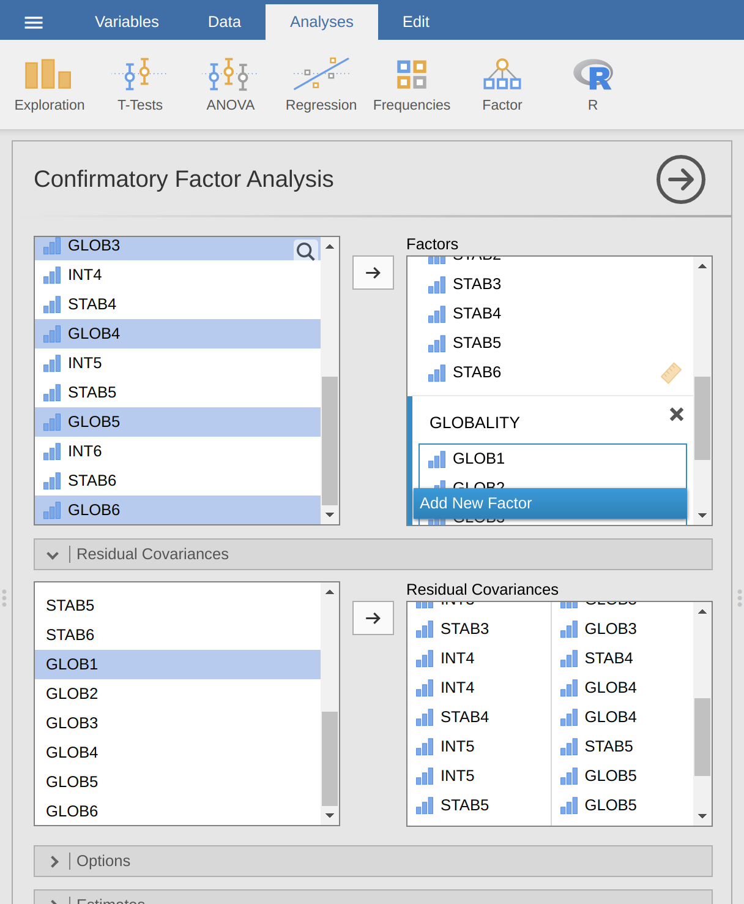
```

<!---Once we have set up the analysis we can turn our attention to the jamovi results window and see what's what. The first thing to look at is "Model fit" as this tells us how good a fit our model is to the observed data (@fig-fig15-25). NB in our model only the pre-specified covariances are estimated, everything else is set to zero, so model fit is testing both whether the pre-specified "free" parameters are not zero, and conversely whether the other relationships in the data -- the ones we have not specified in the model -- can be held at zero.

The jamovi CFA Model Fit results for our CFA MTMM model.--->


一旦設定好分析，我們就可以將注意力轉向jamovi的結果視窗，看看結果如何。首先要看的是「模型適配度」，因為它告訴我們模型與觀察資料的擬合程度（@fig-fig15-25）。請注意，在我們的模型中，只估計了預先指定的共變異，其餘所有參數都設定為零，所以模型適配度測試的是預先指定的「自由」參數是否不為零，反之，資料中我們未在模型中指定的其他關係是否可以保持為零。


```{r}
#| label: fig-fig15-25
#| classes: .enlarge-image
#| fig-cap: jamovi MTMM驗證性因素分析模型適配結果
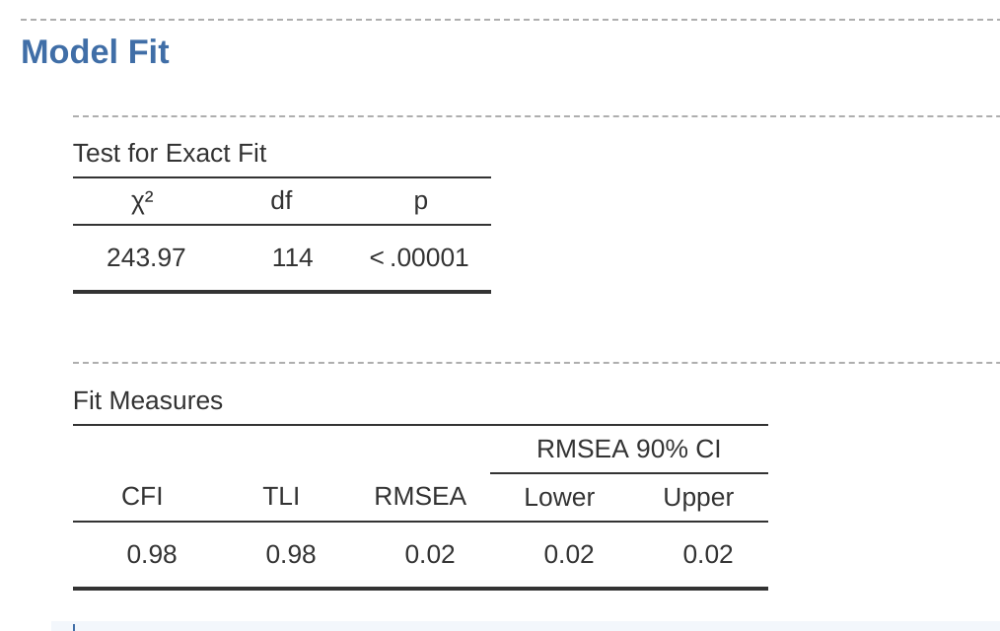
```

<!---
Looking at @fig-fig15-25 we can see that the chi-square value is highly significant, which is not a surprise given the large sample size (N = 2748). The CFI is 0.98 and the TLI is also 0.98, indicating a very good fit. The RMSEA is 0.02 with a 90% confidence interval from 0.02 to 0.02 -- pretty tight!

Overall, I think we can be satisfied that our pre-specified model is a very good fit to the observed data, lending support to our MTMM model for the ASQ.

We can now go on to look at the factor loadings and the factor covariance estimates, as in @fig-fig15-26. Often the standardized estimates are easier to interpret, and these can be specified under the 'Estimates' option. These tables can usefully be incorporated into a written report or scientific article.

The jamovi CFA Factor Loadings and Covariances tables for our CFA MTMM model.
--->

從 @fig-fig15-25 中我們可以看到，卡方值非常顯著，考慮到樣本量很大（N = 2748），這一點也不足為奇。CFI為0.98，TLI也為0.98，表示模型擬合非常好。RMSEA為0.02，90%信賴區間為0.02到0.02——非常精確！

總的來說，我認為我們可以滿意地認為我們預先指定的模型與觀察資料的擬合非常好，這為我們的ASQ之MTMM模型提供了支持。

現在我們可以繼續查看因素負荷量和因素共變異估計，如 @fig-fig15-26 所示。通常標準化估計值更容易解釋，這些可以在「估計」(Estimates)選項下指定。這些表格可以有效地整合到書面報告或科學文章中。


```{r}
#| label: fig-fig15-26
#| classes: .enlarge-image
#| fig-cap: jamovi MTMM驗證性因素分析的因素負荷量和共變異表
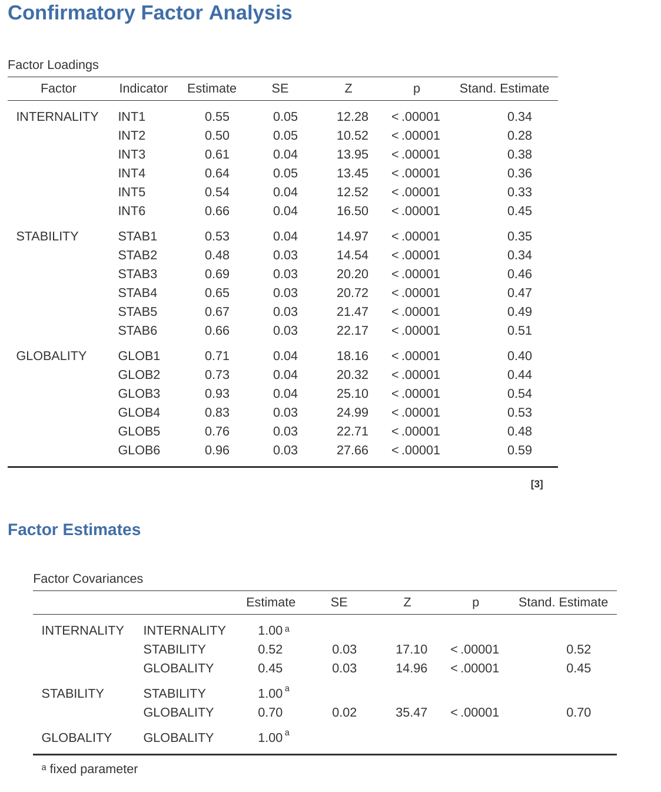
```

<!---You can see from @fig-fig15-26 that all of our pre-specified factor loadings and factor covariances are significantly different from zero. In other words, they all seem to be making a useful contribution to the model.

We've been pretty lucky with this analysis, getting a very good fit on our first attempt! --->

從 @fig-fig15-26 您可以看到，我們預先指定的所有因素負荷量和因素共變異都顯著不為零。換句話說，它們似乎都在為模型做出有用的貢獻。

在這次分析中，我們相當幸運，在第一次嘗試就得到了非常好的擬合效果！


## 內部一致性信度分析 {#sec-Internal-consistency-reliability-analysis}

<!---
After you have been through the process of initial scale development using EFA and CFA, you should have reached a stage where the scale holds up pretty well using CFA with different samples. One thing that you might also be interested in at this stage is to see how well the factors are measured using a scale that combines the observed variables.

In psychometrics we use reliability analysis to provide information about how consistently a scale measures a psychological construct (See earlier section on @sec-Assessing-the-reliability-of-a-measurement). **Internal consistency** is what we are concerned with here, and that refers to the consistency across all the individual items that make up a measurement scale. So, if we have $V1, V2, V3, V4$ and $V5$ as observed item variables, then we can calculate a statistic that tells us how internally consistent these items are in measuring the underlying construct.

A popular statistic used to check the internal consistency of a scale is **Cronbach's alpha** [@Cronbach1951]. Cronbach's alpha is a measure of equivalence (whether different sets of scale items would give the same measurement outcomes). Equivalence is tested by dividing the scale items into two groups (a "split-half") and seeing whether analysis of the two parts gives comparable results. Of course, there are many ways a set of items could be split, but if all possible splits are made then it is possible to produce a statistic that reflects the overall pattern of split-half coefficients. Cronbach's alpha ($\alpha$) is such a statistic: a function of all the split-half coefficients for a scale. If a set of items that measure a construct (e.g. an Extraversion scale) has an $\alpha$ of $0.80$, then the proportion of error variance in the scale is $0.20$. In other words, a scale with an $\alpha$ of $0.80$ includes approximately 20% error.

BUT, (and that's a BIG "BUT"), Cronbach's alpha is not a measure of unidimensionality (i.e. an indicator that a scale is measuring a single factor or construct rather than multiple related constructs). Scales that are multidimensional will cause alpha to be under-estimated if not assessed separately for each dimension, but high values for alpha are not necessarily indicators of unidimensionality. So, an $\alpha$ of 0.80 does not mean that 80% of a single underlying construct is accounted for. It could be that the 80% comes from more than one underlying construct. That's why EFA and CFA are useful to do first.

Further, another feature of $\alpha$ is that it tends to be sample specific: it is not a characteristic of the scale, but rather a characteristic of the sample in which the scale has been used. A biased, unrepresentative, or small sample could produce a very different $\alpha$ coefficient than a large, representative sample. $\alpha$ can even vary from large sample to large sample. Nevertheless, despite these limitations, Cronbach's $\alpha$ has been popular in Psychology for estimating internal consistency reliability. It's pretty easy to calculate, understand and interpret, and therefore it can be a useful initial check on scale performance when you administer a scale with a different sample, from a different setting or population, for example.

An alternative is **McDonald's omega** ($\omega$), and jamovi also provides this statistic. Whereas $\alpha$ makes the following assumptions: (a) no residual correlations, (b) items have identical loadings, and (c) the scale is unidimensional, $\omega$ does not and is therefore a more robust reliability statistic. If these assumptions are not violated then $\alpha$ and $\omega$ will be similar, but if they are then $\omega$ is to be preferred.

Sometimes a threshold for $\alpha$ or $\omega$ is provided, suggesting a "good enough" value. This might be something like $\alpha$s of $0.70$ or $0.80$ representing "acceptable" and "good" reliability, respectively. However, this does depend on what exactly the scale is supposed to be measuring, so thresholds like this should be used cautiously. It could be better to simply state that an $\alpha$ or $\omega$ of $0.70$ is associated with 30% error variance in a scale, and an $\alpha$ or $\omega$ of $0.80$ is associated with 20%.

Can $\alpha$ be too high? Probably: if you are getting an $\alpha$ coefficient above $0.95$ then this indicates high inter-correlations between the items and that there might be too much overly redundant specificity in the measurement, with a risk that the construct being measured is perhaps overly narrow.
--->


在您經歷了使用EFA和CFA進行初始量表開發的過程後，您應該已經達到一個階段，即量表在使用不同樣本的CFA中表現得相當不錯。在這個階段，您可能還會有興趣看看使用結合觀察變項的量表來測量因素的效果如何。

在心理計量學中，我們使用信度分析來提供關於一個量表測量某個心理構念的穩定性資訊（請參閱前面關於 @sec-Assessing-the-reliability-of-a-measurement 的章節）。我們這裡關心的是**內部一致性**，它指的是構成一個測量量表的所有個別項目之間的一致性。因此，如果我們有 $V1, V2, V3, V4$ 和 $V5$ 作為觀察項目變項，我們就可以計算一個統計量，告訴我們這些項目在測量潛在構念方面的內部一致性如何。

一個常用於檢查量表內部一致性的統計量是**克隆巴赫α係數** (Cronbach's alpha) [@Cronbach1951]。克隆巴赫α係數是等價性的一種測量（即不同組的量表項目是否會給出相同的測量結果）。等價性是透過將量表項目分成兩組（「折半」）並觀察兩部分的分析是否給出可比較的結果來檢驗的。當然，一組項目可以有多種折半方式，但如果進行所有可能的折半，就有可能產生一個反映折半係數整體模式的統計量。克隆巴赫α係數（$\alpha$）就是這樣一個統計量：一個量表所有折半係數的函數。如果一組測量某個構念（例如外向性量表）的項目其 $\alpha$ 為0.80，那麼該量表的誤差變異比例為0.20。換句話說，$\alpha$ 為0.80的量表包含大約20%的誤差。

**但是**（這是一個很大的「但是」），克隆巴赫α係數並非單維性的測量（即一個指標，表明一個量表是測量單一因素或構念，而不是多個相關的構念）。如果多維度的量表沒有對每個維度分開評估，會導致α係數被低估，但高的α值不必然是單維性的指標。因此，$\alpha$ 為0.80並不意味著80%來自單一潛在構念。這80%可能來自多於一個潛在構念。這就是為什麼先做EFA和CFA很有用。

此外，$\alpha$ 的另一個特點是它傾向於樣本特定：它不是量表的特性，而是使用該量表的樣本的特性。一個有偏誤、不具代表性或小樣本可能產生與大而具代表性的樣本截然不同的 $\alpha$ 係數。$\alpha$ 甚至可以在不同的大樣本之間變化。儘管有這些限制，克隆巴赫α係數在心理學中一直被廣泛用於估計內部一致性信度。它計算簡單、易於理解和解釋，因此當您在不同樣本、不同情境或族群中使用量表時，它可以作為一個有用的初步檢查量表表現的指標。

另一種選擇是**麥當勞ω係數** (McDonald's omega)（$\omega$），jamovi也提供此統計量。$\alpha$ 係數有以下假設：(a)無殘差相關，(b)項目具有相同的負荷量，以及(c)量表是單維的，而 $\omega$ 則沒有這些假設，因此是一個更穩健的信度統計量。如果這些假設未被違反，$\alpha$ 和 $\omega$ 會相似，但如果被違反，則應優先選擇 $\omega$。

有時會提供 $\alpha$ 或 $\omega$ 的閾值，建議一個「足夠好」的值。例如 $\alpha$ 為0.70或0.80分別代表「可接受」和「良好」的信度。然而，這確實取決於量表確切要測量的是什麼，所以應謹慎使用這樣的閾值。更好的做法可能是簡單地陳述 $\alpha$ 或 $\omega$ 為0.70與量表中30%的誤差變異相關，而 $\alpha$ 或 $\omega$ 為0.80與20%的誤差變異相關。

$\alpha$ 會不會太高？可能會：如果您得到的 $\alpha$ 係數高於0.95，這表示項目之間有很高的相互關聯，測量中可能存在過多的冗餘特異性，有風險的是所測量的構念可能過於狹隘。


### 使用jamovi完成內部一致性信度分析

<!---
We have a third sample of personality data to use to undertake reliability analysis: in the bfi_sample3.csv file. Once again, check that the 25 personality item variables are coded as continuous. To perform reliability analysis in jamovi:

- Select Factor - Reliability Analysis from the main jamovi button bar to open the reliability analysis window (@fig-fig15-27).

- Select the 5 A variables and transfer them into the 'Items' box.

- Under the "Reverse Scaled Items" option, select variable A1 in the "Normal Scaled Items" box and move it across to the "Reverse Scaled Items" box.

- Check other appropriate options, as in @fig-fig15-27.

The jamovi Reliability Analysis window.
--->

我們有第三份人格資料樣本可用於進行信度分析：在 bfi_sample3.csv 檔案中。再次檢查25個人格項目變項是否被編碼為連續變項。在jamovi中執行信度分析的步驟如下：

-   從jamovi主功能列中選擇「因素分析」(Factor) -> 「信度分析」(Reliability Analysis)以打開信度分析視窗（@fig-fig15-27）。
-   選取5個A開頭的變項，將它們移至「項目」(Items)框中。
-   在「反向計分項目」(Reverse Scaled Items)選項下，在「正常計分項目」(Normal Scaled Items)框中選取變項A1，並將其移至「反向計分項目」框中。
-   檢查其他適當的選項，如 @fig-fig15-27 所示。


```{r}
#| label: fig-fig15-27
#| classes: .enlarge-image
#| fig-cap: jamovi 信度分析窗口
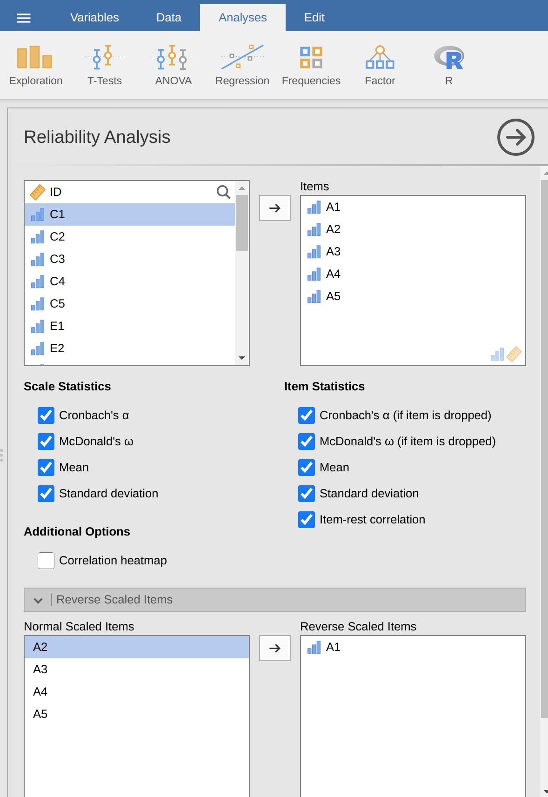
```

<!---
Once done, look across at the jamovi results window. You should see something like @fig-fig15-28. This tells us that the Cronbach's $\alpha$ coefficient for the Agreeableness scale is 0.72. This means that just under 30% of the Agreeableness scale score is error variance. McDonald's $\omega$ is also given, and this is 0.74, not much different from $\alpha$.

The jamovi Reliability Analysis results for the Agreeableness factor.
--->


完成後，查看jamovi的結果視窗。您應該會看到類似 @fig-fig15-28 的內容。這告訴我們親和性量表的克隆巴赫α係數為0.72。這意味著親和性量表分數中略低於30%是誤差變異。同時也給出了麥當勞ω係數，為0.74，與α沒有太大區別。


```{r}
#| label: fig-fig15-28
#| classes: .enlarge-image
#| fig-cap: jamovi 親和力因子的信度分析結果
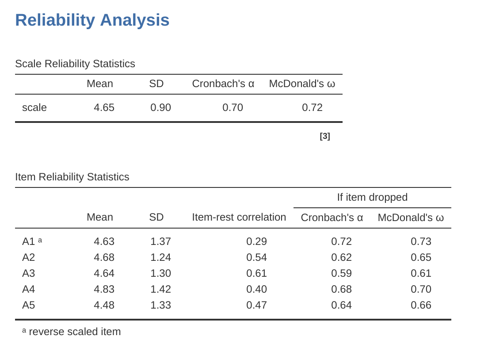
```

<!---
We can also check how $\alpha$ or $\omega$ can be improved if a specific item is dropped from the scale. For example, $\alpha$ would increase to 0.74 and $\omega$ to 0.75 if we dropped item A1. This isn't a big increase, so probably not worth doing.

The process of calculating and checking scale statistics ($\alpha$ and $\omega$) is the same for all the other scales, and they all had similar reliability estimates apart from Openness. For Openness, the amount of error variance in the Scale score is around 40%, which is high and indicates that Openness is substantially less consistent as a reliable measure of a personality attribute than the other personality scales.
--->


我們也可以檢查如果從量表中刪除特定項目，α或ω如何得到改善。例如，如果刪除項目A1，α將增加到0.74，ω增加到0.75。這個增幅並不大，所以可能不值得這樣做。

計算和檢查量表統計量（α和ω）的過程對於所有其他量表也是相同的，除了開放性之外，它們都有類似的信度估計。對於開放性，量表分數中的誤差變異量約為40%，這很高，並表明與其他人格量表相比，開放性作為人格屬性的可靠測量的一致性要差得多。


## 本章小結

<!---
In this chapter on factor analysis and related techniques we have introduced and demonstrated statistical analyses that assess the pattern of relationships in a data set. Specifically, we have covered:

- [Exploratory Factor Analysis] (EFA). EFA is a statistical technique for identifying underlying latent factors in a data set. Each observed variable is conceptualised as representing the latent factor to some extent, indicated by a factor loading. Researchers also use EFA as a way of data reduction, i.e. identifying observed variables than can be combined into new factor variables for subsequent analysis.

- [Principal Component Analysis] (PCA) is a data reduction technique which, strictly speaking, does not identify underlying latent factors. Instead, PCA simply produces a linear combination of observed variables.

- [Confirmatory Factor Analysis] (CFA). Unlike EFA, with CFA you start with an idea - a model - of how the variables in your data are related to each other. You then test your model against the observed data and assess how good a fit the model is to the data.

- In [Multi-Trait Multi-Method CFA] (MTMM CFA), both latent factor and method variance are included in the model in an approach that is useful when there are different methodological approaches used and therefore method variance is an important consideration.

- [Internal consistency reliability analysis]. This form of reliability analysis tests how consistently a scale measures a measurement (psychological) construct. --->

在關於因素分析及相關技術的本章中，我們介紹並示範了評估資料集中關係模式的統計分析。具體來說，我們涵蓋了：

-   **[探索性因素分析](EFA)**：EFA是一種用於識別資料集中潛在因素的統計技術。每個觀察變項在概念上被視為在某種程度上代表潛在因素，由因素負荷量表示。研究人員也使用EFA作為資料降維的一種方式，即識別可以組合成新因素變項以供後續分析的觀察變項。
-   **[主成分分析](PCA)**：PCA是一種資料降維技術，嚴格來說，它並非用來識別潛在因素，而是產生觀察變項的線性組合。
-   **[驗證性因素分析](CFA)**：與EFA不同，進行CFA時，您從一個關於資料中變項如何相互關聯的想法——一個模型——開始。然後，您根據觀察資料檢驗您的模型，並評估模型與資料的擬合程度。
-   在**[多特質多方法驗證性因素分析](MTMM CFA)**中，潛在因素和方法變異都包含在模型中，這種方法在使用了不同的方法論途徑，因此方法變異是一個重要考量時非常有用。
-   **[內部一致性信度分析]**：這種信度分析形式檢驗一個量表測量某個（心理）構念的穩定程度。
