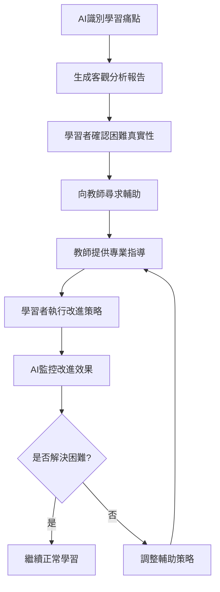

# 統計方法學習評估模板 - 第三階段（Unit 10-14）
## 基於AI Fluency 4D架構的智能統計方法學習系統

### 📚 適用範圍
- **學習對象**：大學生個人自主學習
- **學習階段**：第三階段（基於第一、二階段個人化學習成效評估）
- **教材範圍**：電子書《統計理論》Unit 10~Unit 14（依個人狀況彈性調整範圍）
- **學習特色**：結合真實研究資料的統計方法實務應用
- **總時程管控**：16週總學習時程，扣除前兩階段後的剩餘週數
- **初始依據**：第二階段完整學習成效評估結果
- **學習責任**：所有學習成果的達成或失敗完全由學習者個人負責
- **AI角色**：協助學習者辨識統計方法學習痛點
- **教師角色**：協助設定學習計畫、成效評估內容，輔助學習者克服困難，並負責最終成效判定

---

## 階段一：DELEGATION（委派） - 基於前兩階段成效的統計方法學習規劃

### 1.1 第三階段學習範圍與時程規劃（Goal and Task Awareness）
```
【第三階段個人化學習計畫設定提示語】

**角色設定**：您是統計方法教學AI助手，需要基於學習者前兩階段的完整學習成效，協助設定第三階段Unit 10-14的個人化學習計畫。

**前兩階段成效整合分析**：
請協助我整合前兩階段學習成效，規劃第三階段統計方法學習：

**必須輸入的前兩階段綜合資訊**：
```markdown
### 前兩階段學習成效總覽
**第一階段成效摘要**：
- 統計理論基礎水平：[優秀/良好/需改進]
- 概念理解能力：[具體評估]
- 學習模式特徵：[個人學習特點]

**第二階段成效摘要**：
- Unit 7-9概念掌握：[各Unit具體評分]
- jamovi操作能力：[熟練度評估]
- 學習困難克服情況：[改善程度]
- 自主學習成熟度：[發展狀況]

**整體學習表現評估**：
- 統計理論基礎：[紮實/穩定/需強化]
- 實務應用能力：[強/中/弱]
- 學習自主性：[高/中/低]
- 問題解決能力：[優秀/良好/需提升]
```

**16週總時程管控計算**：
```markdown
### 學習時程計算
**總週數限制**：16週
**第一階段用時**：[X]週
**第二階段用時**：[Y]週
**第三階段可用時間**：[16-X-Y]週

**時程分配建議**：
- **6-8週剩餘**：聚焦核心統計方法（Unit 10-12）
- **9-10週剩餘**：標準統計方法學習（Unit 10-13）
- **11週以上剩餘**：完整統計方法學習（Unit 10-14）

**個人化時程建議**：
基於您的前兩階段表現：[提供具體的時程建議和理由]
```

**Unit 10-14內容與學習範圍規劃**：
```markdown
### 統計方法單元內容規劃
**Unit 10 - [具體統計方法名稱]**：
- 核心概念：[列出主要概念]
- 適用資料類型：[對應的研究情境]
- 對應真實資料：[從附件資料清單中選擇]
- 學習優先級：[高/中/低]（基於個人前期表現）

**Unit 11 - [具體統計方法名稱]**：
- 核心概念：[列出主要概念]
- 適用資料類型：[對應的研究情境]
- 對應真實資料：[從附件資料清單中選擇]
- 學習優先級：[高/中/低]

**Unit 12 - [具體統計方法名稱]**：
- 核心概念：[列出主要概念]
- 適用資料類型：[對應的研究情境]
- 對應真實資料：[從附件資料清單中選擇]
- 學習優先級：[高/中/低]

**Unit 13 - [具體統計方法名稱]**：
- 核心概念：[列出主要概念]
- 適用資料類型：[對應的研究情境]
- 對應真實資料：[從附件資料清單中選擇]
- 學習優先級：[高/中/低]

**Unit 14 - [具體統計方法名稱]**：
- 核心概念：[列出主要概念]
- 適用資料類型：[對應的研究情境]
- 對應真實資料：[從附件資料清單中選擇]
- 學習優先級：[高/中/低]

**個人化學習範圍建議**：
基於您的學習時程和前期表現，建議學習範圍：[具體建議學習哪些Unit]
```

**個人學習目標設定**：
⚠️ **個人責任聲明**：您是大學生，對第三階段統計方法的學習成果完全負責。

```markdown
### 第三階段個人學習目標
**基於前期優勢的發揮目標**：
1. [優勢1的延續發展]：[具體目標設定]
2. [優勢2的深化應用]：[具體目標設定]

**基於前期弱項的改善目標**：
1. [弱項1的克服]：[具體改善目標]
2. [弱項2的提升]：[具體改善目標]

**統計方法新技能目標**：
1. [具體統計方法1]：[掌握程度目標]
2. [具體統計方法2]：[掌握程度目標]
3. [真實資料分析]：[實務應用目標]

**整合應用目標**：
- 獨立選擇適當統計方法的能力
- 真實研究資料的完整分析能力
- 統計結果的專業解釋能力
```

**與教師協作機制**：
```markdown
### 教師協作計畫設定
**學習計畫協作**：
□ 與教師討論個人化學習範圍
□ 確認各Unit的學習深度要求
□ 設定階段性檢核點和頻率

**成效評估協作**：
□ 與教師共同設定評估標準
□ 確認真實資料分析的評估方式
□ 建立最終成效判定機制

**學習支援協作**：
□ 設定定期輔導時間和方式
□ 建立學習困難的求助機制
□ 確認AI學習痛點辨識的回饋方式
```
```

### 1.2 真實研究資料整合與統計方法配對（Platform Awareness）
```
【統計方法與真實資料配對提示語】

**真實研究資料配對任務**：
基於附件提供的真實研究資料清單，協助學習者了解各統計方法的實際應用情境。

**資料清單分析與分類**：

**t檢定類資料**：
```markdown
### t檢定方法學習資料
**單樣本t檢定**：
- 資料來源：ID 113 (https://osf.io/qlzap/) - one sample t test
- 資料來源：ID 153 (https://osf.io/0aifq/) - single sample t-test
- 學習重點：樣本均值與母群體參數的比較
- jamovi操作：單樣本t檢定的執行與結果解釋

**獨立樣本t檢定**：
- 資料來源：ID 61 (https://osf.io/sq8k9/) - independent-samples t-test
- 資料來源：ID 94 (https://osf.io/mua6d/) - independent samples t test
- 資料來源：ID 106 (https://osf.io/iajp5/) - 2 independent group t-test
- 資料來源：ID 107 (https://osf.io/edcr7/) - Independent samples t-test
- 資料來源：ID 115 (https://osf.io/aczvt/) - independent samples t-test
- 資料來源：ID 135 (https://osf.io/2gkjt/) - Welch's t-test
- 學習重點：兩個獨立群體均值的比較
- jamovi操作：獨立樣本t檢定與Welch檢定的選擇

**相依樣本t檢定**：
- 資料來源：ID 6 (https://osf.io/atgp5/) - within-subject t test
- 資料來源：ID 7 (https://osf.io/6n3bm/) - paired sample t-test
- 資料來源：ID 15 (https://osf.io/bscfe/) - paired sample t-test
- 資料來源：ID 33 (https://osf.io/swrhy/) - paired sample t-test
- 資料來源：ID 116 (https://osf.io/ivfu6/) - dependent t-test
- 資料來源：ID 122 (https://osf.io/dnaxe/) - paired sample t-test
- 資料來源：ID 127 (https://osf.io/mjasz/) - paired sample t-test
- 資料來源：ID 146 (https://osf.io/dncxa/) - paired sample t-test
- 學習重點：配對資料的前後比較
- jamovi操作：相依樣本t檢定的執行與前提檢核
```

**變異數分析(ANOVA)類資料**：
```markdown
### ANOVA方法學習資料
**單因子ANOVA**：
- 資料來源：ID 43 (https://osf.io/pz0my/) - ANOVA
- 資料來源：ID 49 (https://osf.io/vy1bc/) - ANOVA
- 資料來源：ID 55 (https://osf.io/su6bm/) - ANOVA
- 資料來源：ID 80 (https://osf.io/79dey/) - one-way ANOVA
- 資料來源：ID 86 (https://osf.io/j8bpa/) - one way ANOVA
- 資料來源：ID 151 (https://osf.io/apidb/) - one way ANOVA
- 學習重點：多個群體均值的比較
- jamovi操作：單因子ANOVA與事後比較

**雙因子ANOVA**：
- 資料來源：ID 50 (https://osf.io/rgm6p/) - two-way ANOVA
- 資料來源：ID 65 (https://osf.io/imrx2/) - 2x2 ANOVA
- 資料來源：ID 72 (https://osf.io/2gx4k/) - 2x2 ANOVA
- 資料來源：ID 87 (https://osf.io/abxcj/) - 2x2 ANOVA
- 資料來源：ID 111 (https://osf.io/aaudl/) - 2x2 ANOVA
- 資料來源：ID 132 (https://osf.io/b98zw/) - 2x4 ANOVA
- 資料來源：ID 143 (https://osf.io/yuybh/) - 3x3 ANOVA
- 學習重點：主效果與交互作用的分析
- jamovi操作：雙因子ANOVA的結果解釋

**重複測量ANOVA**：
- 資料來源：ID 1 (https://osf.io/qwkum/) - Repeated measures ANOVA
- 資料來源：ID 2 (https://osf.io/rmvk5/) - One-way repeated-measures ANOVA
- 資料來源：ID 17 (https://osf.io/hp27x/) - repeated measures anova
- 資料來源：ID 19 (https://osf.io/gcj7x/) - Repeated Measures ANOVA
- 資料來源：ID 110 (https://osf.io/7dyp5/) - Repeated measures ANOVA
- 資料來源：ID 114 (https://osf.io/yaeu7/) - repeated measures ANOVA
- 資料來源：ID 142 (https://osf.io/k4y9i/) - Repeated measures ANOVA
- 學習重點：同一受試者的重複測量分析
- jamovi操作：重複測量ANOVA的球形檢定

**混合設計ANOVA**：
- 資料來源：ID 4 (https://osf.io/8j9cg/) - mixed ANOVA
- 資料來源：ID 10 (https://osf.io/vmipw/) - 3x2x2 mixed ANOVA
- 資料來源：ID 12 (https://osf.io/7rtcz/) - 2x3 mixed ANOVA
- 資料來源：ID 13 (https://osf.io/gxvd3/) - 2 x 3 Mixed ANOVA
- 資料來源：ID 20 (https://osf.io/bzdr2/) - mixed ANOVA
- 資料來源：ID 26 (https://osf.io/hasfu/) - mixed ANOVA
- 資料來源：ID 36 (https://osf.io/vmz2e/) - mixed ANOVA
- 學習重點：組間與組內因子的混合設計
- jamovi操作：混合設計ANOVA的復雜性處理
```

**相關與迴歸分析類資料**：
```markdown
### 相關與迴歸方法學習資料
**相關分析**：
- 資料來源：ID 39 (https://osf.io/38ges/) - Comparison of difference between pairs of 2 correlations
- 資料來源：ID 82 (https://osf.io/r5gpv/) - simple correlation
- 資料來源：ID 120 (https://osf.io/73pnd/) - Pearson's product-moment correlation
- 資料來源：ID 134 (https://osf.io/5dx4v/) - Partial correlations
- 資料來源：ID 154 (https://osf.io/siaqe/) - correlation analysis
- 資料來源：ID 155 (https://osf.io/tg2wd/) - correlation
- 學習重點：變數間關係的測量與檢定
- jamovi操作：相關分析與偏相關分析

**迴歸分析**：
- 資料來源：ID 44 (https://osf.io/rc6mv/) - hierarchical multiple linear regression
- 資料來源：ID 48 (https://osf.io/5tbxf/) - Multiple regression
- 資料來源：ID 93 (https://osf.io/cxmf6/) - hierarchical regression analyses
- 學習重點：預測模式建立與解釋
- jamovi操作：多元迴歸與階層迴歸分析
```

**進階統計方法類資料**：
```markdown
### 進階方法學習資料
**卡方檢定**：
- 資料來源：ID 73 (https://osf.io/nhwv5/) - Chi Square
- 資料來源：ID 84 (https://osf.io/v8vft/) - 2x2 chi square
- 資料來源：ID 104 (https://osf.io/kegmc/) - 2x2 chi square
- 資料來源：ID 165 (https://osf.io/q7f6w/) - chi Square
- 學習重點：類別變數間的獨立性檢定
- jamovi操作：卡方檢定與期望頻率計算

**多變量分析**：
- 資料來源：ID 3 (https://osf.io/4dvzb/) - MANOVA
- 學習重點：多個依變數的同時分析
- jamovi操作：MANOVA的執行與結果解釋

**其他進階方法**：
- 資料來源：ID 59 (https://osf.io/h84qd/) - multilevel model
- 資料來源：ID 69 (https://osf.io/qthf2/) - binomial test
- 資料來源：ID 77 (https://osf.io/nr7d9/) - zero-inflated model
- 學習重點：特殊資料結構的統計處理
- jamovi操作：進階統計方法的軟體實作
```

**個人化資料選擇策略**：
```markdown
### 個人化學習資料配對
基於您的前兩階段學習成效，建議的學習順序和資料配對：

**第1階段統計方法學習**（必修）：
- t檢定方法：[選擇3-4個代表性資料集]
- 單因子ANOVA：[選擇2-3個資料集]
- 基礎相關分析：[選擇1-2個資料集]

**第2階段統計方法學習**（依時程彈性調整）：
- 雙因子ANOVA：[選擇2-3個資料集]
- 重複測量分析：[選擇2個資料集]
- 迴歸分析：[選擇1-2個資料集]

**第3階段統計方法學習**（時程充裕者）：
- 混合設計ANOVA：[選擇1-2個資料集]
- 進階統計方法：[選擇1個資料集]

**個人適性配對原則**：
- 從簡單到複雜的學習順序
- 優先選擇與個人興趣相關的研究主題
- 考量前期jamovi操作能力選擇適當複雜度
- 確保每種方法都有實際操作經驗
```
```

### 1.3 教師協作學習計畫設定（Task Delegation）
```
【教師協作統計方法學習計畫設定提示語】

**教師協作計畫設定任務**：
協助學習者與教師建立有效的第三階段學習協作機制。

**學習計畫協作框架**：

**1. 個人化學習範圍協商**：
```markdown
### 與教師協商學習範圍
**協商前準備（學習者責任）**：
□ 完成前兩階段學習成效的誠實自我評估
□ 分析剩餘學習時程和個人時間安排
□ 初步了解Unit 10-14各統計方法的基本概念
□ 確認個人統計方法學習的興趣和目標

**協商內容要點**：
**A. 學習範圍確認**：
- 基於剩餘時程，確認學習Unit範圍（10-12 / 10-13 / 10-14）
- 各Unit的學習深度要求（基礎理解 / 熟練應用 / 進階整合）
- 真實資料分析的預期數量和複雜度

**B. 學習時程安排**：
- 每個Unit的建議學習時間分配
- 階段性檢核點的設定（週/雙週/月）
- 彈性調整機制的建立

**C. 學習目標設定**：
- 個人化的統計方法掌握目標
- 真實資料分析的能力期待
- 統計結果解釋的專業水準要求

**協商輸出**：
與教師共同簽署的「第三階段個人化學習計畫協議」
```

**2. 成效評估內容協作設定**：
```markdown
### 成效評估協作設計
**評估內容協作**：

**A. 各Unit概念理解評估**：
- 教師設定：概念理解的核心評估點
- 學習者確認：個人理解能力的自我評估標準
- 共同決定：評估方式（口試/筆試/實作/報告）

**B. 真實資料分析評估**：
- 教師提供：真實資料分析的評估框架
- 學習者選擇：偏好的資料分析主題和方法
- 共同設定：分析報告的品質標準和評分方式

**C. 統計方法應用評估**：
- 教師設計：統計方法選擇和應用的評估情境
- 學習者參與：評估情境的個人化調整
- 共同確認：評估標準的公平性和可達成性

**評估時程協作**：
- 階段性評估：每個Unit完成後的即時評估
- 整合性評估：多個Unit知識的綜合應用評估
- 最終成效評估：第三階段完整學習成果的全面評估

**評估權重協作**：
| 評估項目 | 教師建議權重 | 學習者協商權重 | 最終確定權重 |
|---------|-------------|---------------|-------------|
| 概念理解 | [%] | [%] | [%] |
| 實務應用 | [%] | [%] | [%] |
| 真實資料分析 | [%] | [%] | [%] |
| 整合能力 | [%] | [%] | [%] |

**最終成效判定機制**：
- 教師保有最終成效判定的專業權威
- 學習者有權了解判定標準和評估過程
- 建立申訴和重新評估的公平機制
```

**3. 學習支援協作機制**：
```markdown
### 學習支援協作設計
**AI學習痛點辨識與教師輔助整合**：

**A. AI痛點辨識機制**：
- AI負責：客觀分析學習過程數據，識別學習困難模式
- AI提供：個人化的學習困難預警和改進建議
- AI監控：學習進度與預期目標的差距分析

**B. 教師輔助介入機制**：
- 輔助觸發條件：AI識別出重大學習困難時
- 輔助方式選擇：面談/線上指導/額外資源提供
- 輔助頻率設定：基於個人需求和學習進展

**C. 師生協作解決流程**：


**學習支援時程安排**：
- 定期輔導：每[週/雙週]固定時間的學習指導
- 即時支援：遇到重大困難時的緊急輔助
- 階段回顧：每個Unit完成後的學習經驗討論

**支援效果評估**：
- 學習困難的解決效率
- 學習者自主解決能力的提升
- 整體學習進度的改善程度
```

**4. 責任分工明確化**：
```markdown
### 三方責任分工協議
**學習者個人責任（100%承擔）**：
□ 所有學習努力和時間投入
□ 學習目標的達成或失敗
□ 誠實面對學習困難和問題
□ 主動尋求協助和支援
□ 執行教師建議的改進策略

**AI輔助功能範圍**：
□ 客觀的學習痛點識別和分析
□ 個人化的學習建議生成
□ 學習進度的數據追蹤和預警
□ 統計方法學習的資源整理

**教師專業責任範圍**：
□ 學習計畫的專業建議和最終確認
□ 成效評估內容的設計和最終判定
□ 學習困難的專業診斷和輔助策略
□ 統計方法應用的專業指導

**協作成功的關鍵要素**：
- 開放誠實的溝通
- 明確的角色邊界
- 彈性的調整機制
- 共同的成功目標
```
```

---

## 階段二：DESCRIPTION（描述） - 統計方法學習內容智能生成

### 2.1 統計方法概念描述與真實應用（Product Description）
```
【統計方法概念理解與真實應用提示語】

**角色與任務**：
您是統計方法教學專家，需要協助學習者深度理解Unit 10-14的統計方法，並結合真實研究資料進行實際應用學習。

**統計方法概念生成規格**：

**1. Unit 10統計方法概念生成**：
```markdown
### Unit 10 - [具體統計方法名稱]
**概念核心理解**：
- **基本定義**：[統計方法的精確定義和目的]
- **適用情境**：[何時使用這個統計方法]
- **前提假設**：[使用此方法的統計假設條件]
- **優勢限制**：[方法的優點和使用限制]

**與前期學習的連結**：
- **Unit 7-9基礎**：[此方法如何建立在前期理論基礎上]
- **概念延伸**：[從基礎理論到實際方法的概念發展]
- **技能轉移**：[前期jamovi技能如何應用到此方法]

**真實研究資料應用**：
**選定資料集**：[從清單中選擇適合的OSF資料]
- 資料來源：[具體ID和URL]
- 研究背景：[研究主題和設計簡介]
- 變數說明：[主要變數類型和測量方式]
- 統計問題：[此資料要回答的統計問題]

**jamovi實作指導**：
- **資料載入**：[如何在jamovi中處理真實資料]
- **前提檢定**：[執行統計假設檢定的步驟]
- **主要分析**：[統計方法的完整執行步驟]
- **結果解釋**：[如何專業解讀jamovi輸出結果]

**概念理解評估設計**：
```
### 概念理解評估題目
**題目1 - 概念識別**：
[設計一個要求學習者識別此統計方法適用情境的題目]

**題目2 - 前提判斷**：
[設計一個評估學習者判斷統計假設是否滿足的題目]

**題目3 - 方法選擇**：
[設計一個情境題，要求學習者選擇最適當的統計方法]

**評分標準**：
- 概念識別正確性（40%）
- 前提判斷準確度（30%）
- 方法選擇合理性（30%）
```

**實務應用評估設計**：
```
### 真實資料分析評估
**分析任務**：
使用[指定OSF資料集]完成以下分析任務：

**任務1 - 資料探索**：
□ 正確載入和檢視資料結構
□ 進行適當的描述統計分析
□ 識別可能的資料品質問題

**任務2 - 前提檢定**：
□ 執行相關的統計假設檢定
□ 正確解釋檢定結果
□ 處理假設違反的情況

**任務3 - 主要分析**：
□ 執行正確的統計分析
□ 產生適當的統計圖表
□ 記錄完整的分析過程

**任務4 - 結果解釋**：
□ 專業解讀統計結果
□ 連結統計發現與研究問題
□ 討論結果的實務意義

**評分標準**：
| 評估項目 | 優秀(4分) | 良好(3分) | 尚可(2分) | 需改進(1分) |
|---------|---------|---------|---------|------------|
| 資料處理 | [具體標準] | [具體標準] | [具體標準] | [具體標準] |
| 統計執行 | [具體標準] | [具體標準] | [具體標準] | [具體標準] |
| 結果解釋 | [具體標準] | [具體標準] | [具體標準] | [具體標準] |
| 報告品質 | [具體標準] | [具體標準] | [具體標準] | [具體標準] |
```
```

**2. 進階統計方法整合學習**：
```markdown
### 多Unit統計方法比較與選擇
**統計方法決策樹**：
```
研究問題類型判斷
├── 比較群體差異
│   ├── 兩個群體
│   │   ├── 獨立樣本 → 獨立樣本t檢定
│   │   └── 相依樣本 → 相依樣本t檢定
│   └── 三個以上群體
│       ├── 單一因子 → 單因子ANOVA
│       └── 多個因子 → 雙因子/多因子ANOVA
├── 探索變數關係
│   ├── 兩個連續變數 → 相關分析
│   └── 預測關係 → 迴歸分析
└── 類別變數分析
    └── 獨立性檢定 → 卡方檢定
```

**方法選擇練習資料配對**：
```
### 統計方法選擇練習設計
**練習1 - 研究設計辨識**：
提供真實研究資料[ID清單]，要求學習者：
- 識別研究設計類型
- 判斷變數的測量層次
- 選擇最適當的統計方法
- 說明選擇理由

**練習2 - 替代方法比較**：
使用同一資料集，執行多種可能的統計分析：
- 比較不同方法的適用性
- 分析結果差異的原因
- 評估各方法的優缺點

**練習3 - 複雜研究設計**：
使用包含多個變數的資料集：
- 設計完整的分析策略
- 執行多階段統計分析
- 整合多個分析結果
```
```

### 2.2 個人化學習痛點識別與回饋生成（Process Description）
```
【AI學習痛點識別系統設計提示語】

**AI痛點識別系統規格**：
設計一個能夠準確識別統計方法學習中個人痛點的智能系統。

**痛點識別架構**：

**1. 概念理解痛點識別**：
```markdown
### 概念理解困難診斷
**痛點類型A - 基礎概念混淆**：
**識別指標**：
- 統計方法適用情境判斷錯誤率 > 30%
- 前提假設理解測驗分數 < 70%
- 方法間差異比較回答不一致

**AI分析報告範例**：
"基於您的學習表現分析，發現您在以下概念理解上存在困難：
1. **統計方法選擇**：在6次方法選擇題中，有3次選擇了不適當的統計方法
2. **前提假設理解**：對於[具體統計方法]的假設條件理解不清楚
3. **概念間關聯**：未能有效連結[方法A]與[方法B]的使用場景差異

**改進建議**：
- 重新學習[具體概念]的基礎定義
- 增加[具體類型]練習題的練習量
- 尋求教師輔助釐清[具體混淆點]"

**痛點類型B - 理論與實務脫節**：
**識別指標**：
- 概念測驗表現良好但實務操作困難
- jamovi操作正確但結果解釋錯誤
- 理論知識與實際應用無法連結

**AI分析報告範例**：
"您的理論理解能力良好，但在實際應用時出現困難：
1. **理論轉實務困難**：能回答理論問題但無法在真實資料中應用
2. **結果解釋偏差**：jamovi操作正確但對輸出結果的解釋不準確
3. **情境轉換困難**：學會一個例子但無法類推到其他情境

**改進建議**：
- 增加真實資料練習的頻率
- 重點練習統計結果的專業解釋
- 尋求教師輔助建立理論與實務的連結"
```

**2. 實務操作痛點識別**：
```markdown
### jamovi操作困難診斷
**痛點類型C - 軟體操作技術困難**：
**識別指標**：
- jamovi操作步驟經常出錯
- 統計輸出結果無法正確產生
- 操作時間明顯超過預期

**AI分析報告範例**：
"您在jamovi軟體操作上遇到技術性困難：
1. **基礎操作不熟練**：資料載入和變數設定經常出錯
2. **分析設定錯誤**：統計分析的參數設定不正確
3. **結果產生困難**：無法順利產生完整的分析結果

**改進建議**：
- 重新複習jamovi基礎操作
- 增加操作練習的時間投入
- 尋求教師輔助解決技術問題"

**痛點類型D - 複雜分析處理困難**：
**識別指標**：
- 簡單分析正確但複雜分析困難
- 多步驟分析流程容易出錯
- 進階功能使用不熟練

**AI分析報告範例**：
"您在處理複雜統計分析時遇到困難：
1. **多步驟分析流程**：在執行複雜的統計程序時容易在中間步驟出錯
2. **進階功能應用**：對jamovi的進階功能不熟悉
3. **整合分析能力**：無法將多個分析結果有效整合

**改進建議**：
- 將複雜分析分解為小步驟練習
- 重點學習jamovi進階功能
- 尋求教師輔助建立分析流程概念"
```

**3. 學習策略痛點識別**：
```markdown
### 個人學習模式診斷
**痛點類型E - 時間管理困難**：
**識別指標**：
- 學習進度明顯落後預期
- 學習時間分配不均衡
- 臨時抱佛腳的學習模式

**AI分析報告範例**：
"您的學習時間管理存在改進空間：
1. **進度落後問題**：當前學習進度比預期計畫落後[X]天
2. **時間分配不均**：概念學習與實務練習的時間比例失衡
3. **學習節奏不穩定**：學習投入時間波動過大

**改進建議**：
- 重新調整個人學習時程規劃
- 建立更規律的學習節奏
- 尋求教師輔助優化學習策略"

**痛點類型F - 學習動機下降**：
**識別指標**：
- 學習活動參與度下降
- 主動提問和探索減少
- 自我評估信心不足

**AI分析報告範例**：
"您的學習動機出現下降趨勢：
1. **參與度降低**：最近兩週的學習活動參與度明顯下降
2. **探索精神減弱**：主動提問和深度探索的行為減少
3. **信心不足**：對自己的學習能力評估過於負面

**改進建議**：
- 重新確認個人學習目標和動機
- 尋找適合個人興趣的學習內容
- 尋求教師輔助重建學習信心"
```

**4. 個人化回饋生成機制**：
```markdown
### 智能回饋生成系統
**回饋生成原則**：
- **客觀性**：基於具體的學習表現數據
- **個人化**：針對個人的學習特徵和痛點
- **建設性**：提供具體可行的改進建議
- **鼓勵性**：平衡問題指出與正向鼓勵

**回饋內容結構**：
```
### 個人學習痛點分析報告
**學習者**：[姓名]
**分析期間**：[具體時間範圍]
**分析資料來源**：[學習活動數據、測驗結果、操作記錄等]

**⚠️ 重要聲明**：此分析僅供參考，您對學習成果承擔完全責任

**當前學習優勢**：
1. [優勢1]：[具體表現和數據支持]
2. [優勢2]：[具體表現和數據支持]

**識別到的學習痛點**：
**主要痛點1 - [痛點類型]**：
- 客觀表現：[具體的數據和表現描述]
- 影響程度：[高/中/低]
- 改進建議：[具體的改善策略]
- 建議尋求教師輔助：[是/否]

**次要痛點2 - [痛點類型]**：
- 客觀表現：[具體的數據和表現描述]
- 影響程度：[高/中/低]
- 改進建議：[具體的改善策略]
- 建議尋求教師輔助：[是/否]

**學習進展預測**：
基於當前表現趨勢，預期您在未來[時間]內：
- 可能克服的困難：[具體預測]
- 可能持續的挑戰：[具體預測]
- 建議重點關注：[具體建議]

**下週學習重點建議**：
1. [重點1]：[具體行動計畫]
2. [重點2]：[具體行動計畫]
3. [重點3]：[具體行動計畫]

**教師輔助需求評估**：
□ 高度需要教師輔助（存在重大學習困難）
□ 中度需要教師輔助（存在特定學習痛點）
□ 低度需要教師輔助（整體學習順利）

**建議教師輔助內容**：[具體的輔助需求描述]
```

**回饋品質保證**：
- 分析結果要有數據支撐，避免主觀判斷
- 改進建議要具體可操作
- 預測要基於客觀趨勢分析
- 鼓勵要真誠且有根據
```
```

### 2.3 統計報告撰寫與專業表達（Performance Description）
```
【統計分析報告撰寫指導提示語】

**專業統計報告撰寫指導**：
協助學習者掌握專業統計分析報告的撰寫技能。

**統計報告結構設計**：

**1. 完整統計報告範本**：
```markdown
### 統計分析報告範本
**報告標題**：[研究問題的簡潔描述]
**資料來源**：[OSF資料集ID和來源]
**分析方法**：[使用的統計方法]
**報告撰寫者**：[學習者姓名]
**分析日期**：[具體日期]

**一、研究背景與問題**
- **研究背景**：[簡述資料集的研究背景]
- **研究問題**：[明確陳述要回答的統計問題]
- **研究假設**：[如適用，列出研究假設]

**二、資料描述**
- **樣本特徵**：[樣本大小、基本特徵描述]
- **變數說明**：[主要變數的類型、測量方式、編碼說明]
- **資料品質**：[遺漏值、異常值的處理說明]

**三、統計方法**
- **方法選擇理由**：[為什麼選擇此統計方法]
- **前提假設檢定**：[統計假設的檢驗結果]
- **分析軟體**：jamovi [版本號]

**四、分析結果**
- **描述統計**：[基本統計量報告]
- **推論統計**：[主要統計檢定結果]
- **統計圖表**：[適當的視覺化呈現]

**五、結果解釋**
- **統計意義**：[統計檢定結果的專業解釋]
- **實務意義**：[結果對實際問題的意義]
- **效果大小**：[如適用，報告效果量]

**六、討論與限制**
- **結果討論**：[對發現的深入討論]
- **研究限制**：[資料和方法的限制]
- **未來建議**：[後續研究的建議]

**七、參考資料**
- [APA格式的資料來源引用]
```

**2. 各統計方法的專業報告範例**：
```markdown
### t檢定報告範例
**獨立樣本t檢定結果報告**：
"進行獨立樣本t檢定以比較兩組[變數名稱]的差異。Levene等方差齊性檢定結果顯示兩組方差[齊性/不齊性]（F = [數值], p = [數值]）。t檢定結果顯示，[組別A]的[變數]均值（M = [數值], SD = [數值]）與[組別B]的[變數]均值（M = [數值], SD = [數值]）存在[顯著/不顯著]差異，t([自由度]) = [t值], p = [p值], Cohen's d = [效果量]。"

**相依樣本t檢定結果報告**：
"進行相依樣本t檢定以比較[前測/後測]的差異。結果顯示，[後測]分數（M = [數值], SD = [數值]）相較於[前測]分數（M = [數值], SD = [數值]）有[顯著/不顯著]的[增加/減少]，t([自由度]) = [t值], p = [p值], Cohen's d = [效果量]。"

### ANOVA報告範例
**單因子ANOVA結果報告**：
"進行單因子變異數分析以檢驗[因子名稱]對[依變數]的影響。結果顯示，[因子名稱]對[依變數]有[顯著/不顯著]的主效果，F([組間自由度], [組內自由度]) = [F值], p = [p值], η² = [效果量]。事後比較（[比較方法]）顯示：[具體比較結果]。"

**雙因子ANOVA結果報告**：
"進行2×2變異數分析以檢驗[因子A]和[因子B]對[依變數]的影響。結果顯示：
- [因子A]的主效果[顯著/不顯著]，F([自由度]) = [F值], p = [p值], η² = [效果量]
- [因子B]的主效果[顯著/不顯著]，F([自由度]) = [F值], p = [p值], η² = [效果量]  
- [因子A]×[因子B]的交互作用[顯著/不顯著]，F([自由度]) = [F值], p = [p值], η² = [效果量]
[如有顯著交互作用，進行簡單效果分析的結果]"

### 相關分析報告範例
**Pearson相關分析結果報告**：
"進行Pearson積差相關分析以檢驗[變數A]與[變數B]之間的關係。結果顯示，[變數A]與[變數B]之間存在[顯著正相關/顯著負相關/不顯著相關]，r = [相關係數], p = [p值]，決定係數R² = [數值]，表示[變數A]可解釋[變數B] [百分比]%的變異量。"
```

**3. 圖表製作與解釋指導**：
```markdown
### 統計圖表製作指導
**圖表選擇原則**：
- **長條圖**：用於類別變數的頻率分佈
- **直方圖**：用於連續變數的分佈形態
- **箱型圖**：用於比較不同組別的分佈
- **散佈圖**：用於檢視兩個連續變數的關係
- **誤差圖**：用於呈現均值和信賴區間

**圖表品質標準**：
□ 圖表標題清楚明確
□ 軸標籤完整且正確
□ 圖例說明清楚
□ 字體大小適當可讀
□ 顏色使用適當且一致

**圖表解釋範例**：
"圖1顯示兩組受試者在[依變數]上的分佈情況。從箱型圖可以看出，[組別A]的[依變數]中位數為[數值]，四分位距為[數值]；[組別B]的[依變數]中位數為[數值]，四分位距為[數值]。兩組的分佈形態都接近常態分佈，且[組別A]的變異程度明顯[大於/小於][組別B]。"
```

**4. 報告品質評估標準**：
```markdown
### 報告評估量表
| 評估項目 | 優秀(4分) | 良好(3分) | 尚可(2分) | 需改進(1分) |
|---------|---------|---------|---------|------------|
| **內容完整性** | 包含所有必要章節，內容充實 | 包含主要章節，內容適當 | 基本章節完整，內容簡單 | 缺少重要章節或內容過簡 |
| **統計報告準確性** | 統計結果報告完全正確 | 統計結果報告大致正確 | 統計結果報告基本正確 | 統計結果報告有明顯錯誤 |
| **專業表達** | 使用專業術語準確恰當 | 專業術語使用基本正確 | 專業表達尚可理解 | 專業表達不夠準確 |
| **邏輯結構** | 邏輯清晰，結構完整 | 邏輯基本清晰 | 結構基本合理 | 邏輯混亂，結構不清 |
| **圖表品質** | 圖表精美且資訊豐富 | 圖表清楚且適當 | 圖表基本符合要求 | 圖表品質不佳或不適當 |

**總分計算**：總分 = 各項得分之和 / 5
**等級劃分**：
- 優秀：3.5-4.0分
- 良好：2.5-3.4分  
- 尚可：1.5-2.4分
- 需改進：1.0-1.4分
```

**5. 個人化報告改進建議生成**：
```markdown
### 報告改進建議系統
**基於評估結果的個人化建議**：

**針對內容完整性不足**：
"您的報告在[具體章節]方面需要加強：
- 建議補充[具體內容]的詳細說明
- 增加[具體分析]以提高報告完整性
- 參考[具體範例]來改善內容結構"

**針對統計報告不準確**：
"您的統計結果報告存在以下問題：
- [具體錯誤]需要修正為[正確表達]
- 建議重新檢查[具體統計指標]的計算和報告
- 參考APA格式的統計結果報告標準"

**針對專業表達不足**：
"建議改善專業表達的方式：
- 學習統計術語的正確使用方法
- 練習專業的結果解釋表達
- 尋求教師輔助提升專業寫作能力"

**個人進步追蹤**：
記錄每次報告的評估分數，追蹤個人在報告撰寫能力上的進步軌跡。
```
```

---

## 階段三：DISCERNMENT（辨別） - 統計方法學習品質監控

### 3.1 統計方法應用正確性評估（Content Discernment）
```
【統計方法應用品質評估提示語】

**統計方法應用正確性監控**：
建立一個能夠有效評估學習者統計方法應用正確性的監控系統。

**評估框架設計**：

**1. 統計方法選擇正確性評估**：
```markdown
### 方法選擇評估標準
**評估層次A - 研究設計識別**：
**評估標準**：
□ 正確識別變數類型（連續/類別/順序）
□ 準確判斷研究設計（組間/組內/混合設計）
□ 恰當識別資料結構（獨立/相依/嵌套）

**評估方法**：
提供真實研究資料，要求學習者：
1. 分析資料結構和變數特性
2. 識別研究設計類型
3. 選擇適當的統計方法
4. 說明選擇理由

**評分標準**：
- 變數識別正確：2分
- 設計識別正確：2分  
- 方法選擇正確：3分
- 理由說明清楚：3分
- 總分：10分（8分以上為達標）

**常見錯誤模式識別**：
```
### 常見統計方法選擇錯誤
**錯誤類型1 - 變數類型誤判**：
- 表現：將順序變數當作連續變數處理
- 後果：選擇不適當的統計方法
- AI提醒：檢測到變數類型判斷可能有誤

**錯誤類型2 - 設計結構混淆**：
- 表現：無法區分獨立樣本和相依樣本
- 後果：使用錯誤的檢定方法
- AI提醒：建議重新檢視資料收集方式

**錯誤類型3 - 複雜度錯估**：
- 表現：簡單問題使用過度複雜的方法
- 後果：分析結果難以解釋
- AI提醒：考慮是否有更簡單適當的方法
```

**評估層次B - 統計假設檢核**：
**評估標準**：
□ 正確識別統計方法的前提假設
□ 適當執行假設檢定
□ 合理處理假設違反情況

**評估任務設計**：
```
### 假設檢定評估任務
**任務1 - 假設識別**：
"請列出執行[指定統計方法]時需要檢驗的前提假設，並說明每個假設的意義。"

**評分要點**：
- 常態性假設：[2分]
- 變異數齊性假設：[2分] 
- 獨立性假設：[2分]
- 假設意義說明：[4分]

**任務2 - 假設檢定執行**：
"使用jamovi對[指定資料集]執行前提假設檢定，並報告檢定結果。"

**評分要點**：
- 正確執行檢定：[3分]
- 準確解讀結果：[3分]
- 適當報告格式：[2分]
- 假設違反處理：[2分]

**任務3 - 違反處理策略**：
"如果發現前提假設違反，請說明可能的處理策略。"

**評分要點**：
- 資料轉換：[2分]
- 非參數方法：[2分]
- 穩健統計：[2分]
- 策略選擇理由：[4分]
```
```

**2. jamovi操作技能評估**：
```markdown
### 軟體操作能力評估
**評估層次C - 基礎操作技能**：
**評估項目**：
□ 資料載入和檢視
□ 變數類型設定
□ 基本統計分析執行
□ 結果輸出和儲存

**實作評估任務**：
```
### jamovi操作技能檢定
**檢定項目1 - 資料處理**：
限時15分鐘完成以下任務：
1. 載入指定的OSF資料集
2. 檢視資料結構和基本資訊
3. 設定適當的變數類型
4. 處理遺漏值（如有）

**評分標準**：
- 正確載入資料：[2分]
- 適當檢視資料：[2分]
- 正確設定變數：[3分]
- 妥善處理遺漏值：[3分]

**檢定項目2 - 統計分析執行**：
限時20分鐘完成以下任務：
1. 根據研究問題選擇適當分析
2. 正確設定分析參數
3. 執行統計分析
4. 產生適當的圖表

**評分標準**：
- 分析選擇正確：[3分]
- 參數設定適當：[3分]
- 分析執行成功：[2分]
- 圖表製作恰當：[2分]
```

**評估層次D - 進階操作技能**：
**評估項目**：
□ 複雜統計分析的執行
□ 自訂分析參數的設定
□ 多步驟分析流程的管理
□ 結果的整合和比較

**進階技能評估**：
```
### 進階jamovi技能評估
**評估任務 - 複合分析**：
使用[指定複雜資料集]完成以下分析：
1. 執行探索性資料分析
2. 進行前提假設檢定
3. 執行主要統計分析
4. 進行事後或進階分析
5. 整合所有分析結果

**評分標準**：
| 評估項目 | 權重 | 評分標準 |
|---------|------|---------|
| 探索性分析 | 20% | 完整性和適當性 |
| 假設檢定 | 20% | 正確性和全面性 |
| 主要分析 | 30% | 技術正確性 |
| 進階分析 | 20% | 適當性和準確性 |
| 結果整合 | 10% | 邏輯性和完整性 |

**技能水準分級**：
- **熟練級**（90分以上）：能獨立處理複雜統計分析
- **勝任級**（80-89分）：能處理大部分統計分析任務
- **基礎級**（70-79分）：能完成基本統計分析
- **需改進**（70分以下）：需要額外指導和練習
```
```

**3. 統計結果解釋準確性評估**：
```markdown
### 結果解釋能力評估
**評估層次E - 統計意義解釋**：
**評估重點**：
□ p值的正確理解和解釋
□ 效果量的計算和意義
□ 信賴區間的解讀
□ 統計顯著性與實務重要性的區別

**解釋能力測試設計**：
```
### 統計結果解釋測試
**測試情境1 - p值解釋**：
"給定統計結果p = 0.03，請解釋這個結果的意義，並說明可以得出什麼結論。"

**評分要點**：
- 正確理解p值定義：[3分]
- 適當解釋統計顯著性：[3分]
- 避免常見誤解：[2分]
- 結論表達準確：[2分]

**測試情境2 - 效果量解釋**：
"Cohen's d = 0.35，請解釋這個效果量的大小和實務意義。"

**評分要點**：
- 正確識別效果量大小：[2分]
- 適當解釋實務意義：[3分]
- 連結統計與實際：[3分]
- 表達清楚準確：[2分]

**測試情境3 - 整合解釋**：
"提供完整的jamovi輸出結果，要求進行完整的專業解釋。"

**評分要點**：
- 描述統計報告：[2分]
- 推論統計解釋：[4分]
- 實務意義討論：[3分]
- 限制和注意事項：[1分]
```

**評估層次F - 研究結論品質**：
**評估重點**：
□ 統計結果與研究問題的連結
□ 結論的合理性和保守性
□ 研究限制的認知
□ 未來研究方向的建議

**結論品質評估**：
```
### 研究結論評估標準
**評估項目1 - 結論合理性**：
**評估標準**：
- 結論基於統計證據：[25%]
- 避免過度推論：[25%]
- 承認研究限制：[25%]
- 表達謹慎保守：[25%]

**評估項目2 - 實務應用**：
**評估標準**：
- 正確連結理論與實務：[30%]
- 適當討論應用價值：[30%]
- 合理評估應用限制：[40%]

**評估項目3 - 學術表達**：
**評估標準**：
- 使用適當專業術語：[30%]
- 邏輯清晰條理分明：[40%]
- 符合學術寫作規範：[30%]

**整體品質等級**：
- **優秀**：各項目均達85%以上
- **良好**：各項目均達75%以上
- **尚可**：各項目均達65%以上
- **需改進**：任一項目低於65%
```
```

**4. 品質監控預警機制**：
```markdown
### 自動品質監控系統
**預警觸發條件**：

**紅色警示（立即介入）**：
- 統計方法選擇錯誤率 > 50%
- jamovi操作失敗率 > 40%
- 結果解釋錯誤率 > 60%
- 連續兩次評估不及格

**黃色警示（密切關注）**：
- 統計方法選擇錯誤率 > 30%
- jamovi操作失敗率 > 25%
- 結果解釋錯誤率 > 40%
- 學習進度明顯落後

**綠色狀態（正常學習）**：
- 各項錯誤率均在可接受範圍
- 學習進度符合預期
- 整體表現穩定提升

**AI預警報告範例**：
```
### 學習品質預警報告
**警示等級**：🟡 黃色警示
**學習者**：[姓名]
**監控期間**：[日期範圍]

**觸發原因**：
- jamovi操作失敗率達28%（超出25%警戒線）
- 統計結果解釋錯誤率達42%（超出40%警戒線）

**具體問題分析**：
1. **技術操作困難**：在處理複雜ANOVA時經常出錯
2. **解釋能力不足**：對交互作用的解釋經常出現錯誤

**建議即時介入措施**：
- 尋求教師輔助克服jamovi進階操作困難
- 增加統計結果解釋的練習強度
- 重點複習交互作用的概念和解釋方法

**預期改善時程**：1-2週
**下次監控時間**：[具體日期]
```

**品質保證行動方案**：
```
### 品質改善行動計畫
**學習者自主行動**：
□ 根據預警報告調整學習策略
□ 增加問題領域的練習時間
□ 主動尋求額外學習資源

**AI輔助強化**：
□ 提供針對性的練習題目
□ 增加問題領域的學習痛點監控
□ 生成個人化的改進建議

**教師介入支援**：
□ 提供專業的困難診斷
□ 設計個別化的輔導計畫
□ 調整評估標準或方式（如需要）

**效果追蹤機制**：
□ 每週監控改善進度
□ 調整介入策略的強度
□ 記錄有效的改善方法
```
```

### 3.2 學習進度與目標達成監控（Process Discernment）
```
【學習進度智能監控提示語】

**學習進度監控系統設計**：
建立一個能夠有效追蹤和評估學習進度的智能監控系統。

**進度監控架構**：

**1. 階段性目標達成監控**：
```markdown
### 學習目標達成追蹤
**Unit級別目標監控**：

**Unit 10目標達成追蹤**：
```
### Unit 10 - [統計方法名稱] 學習目標監控
**設定學習目標**：
1. 概念理解目標：[具體可測量的目標]
2. 操作技能目標：[具體可測量的目標]
3. 應用能力目標：[具體可測量的目標]

**達成指標設計**：
| 學習目標 | 評估指標 | 目標值 | 當前值 | 達成狀況 |
|---------|---------|--------|--------|----------|
| 概念理解 | 概念測驗分數 | ≥80% | [實際分數] | [達成/未達成] |
| 操作技能 | jamovi操作成功率 | ≥85% | [實際成功率] | [達成/未達成] |
| 應用能力 | 真實資料分析品質 | ≥良好 | [實際等級] | [達成/未達成] |

**進度里程碑**：
□ 週1：基礎概念理解完成
□ 週2：jamovi操作技能熟練
□ 週3：真實資料分析實作
□ 週4：整合應用能力確認

**當前進度狀況**：
- 整體進度：[XX%] 
- 預期進度：[XX%]
- 進度差異：[領先/落後][X]天

**進度調整建議**：
[基於當前狀況的具體調整建議]
```

**跨Unit整合目標監控**：
```
### 統計方法整合學習目標監控
**整合學習目標**：
1. **方法比較能力**：能夠比較不同統計方法的適用性
2. **方法選擇能力**：能夠根據研究問題選擇適當方法
3. **複合分析能力**：能夠執行多步驟的統計分析
4. **專業報告能力**：能夠撰寫專業的統計分析報告

**整合能力評估**：
```
### 整合能力檢定任務
**檢定任務**：提供一個複雜的研究情境，包含多個研究問題，要求學習者：
1. 分析研究設計和資料結構
2. 選擇適當的統計方法組合
3. 執行完整的統計分析流程
4. 撰寫專業的分析報告

**評估標準**：
| 能力項目 | 權重 | 評估標準 | 達成情況 |
|---------|------|---------|----------|
| 問題分析 | 20% | 正確理解研究問題和資料結構 | [評分/等級] |
| 方法選擇 | 25% | 選擇適當且有效的統計方法 | [評分/等級] |
| 技術執行 | 25% | 正確執行所選統計分析 | [評分/等級] |
| 結果整合 | 20% | 有效整合多個分析結果 | [評分/等級] |
| 報告品質 | 10% | 專業清楚的分析報告 | [評分/等級] |

**整合能力等級**：
- **專精級**（90分以上）：能夠獨立處理複雜的統計分析專案
- **熟練級**（80-89分）：能夠有效整合多種統計方法
- **基礎級**（70-79分）：能夠應用基本的統計方法組合
- **發展級**（60-69分）：統計方法理解尚可但整合能力需提升
- **初學級**（60分以下）：需要系統性的基礎能力提升
```
```

**2. 時程管理與效率監控**：
```markdown
### 學習效率監控系統
**時間投入效率分析**：

**學習時間追蹤**：
```
### 個人學習時間分析
**週學習時間統計**：
| 週次 | 計畫時間 | 實際時間 | 效率比例 | 學習內容 | 成效評估 |
|------|---------|---------|---------|---------|---------|
| 第1週 | [小時] | [小時] | [%] | Unit 10基礎 | [評分/等級] |
| 第2週 | [小時] | [小時] | [%] | Unit 10應用 | [評分/等級] |
| 第3週 | [小時] | [小時] | [%] | Unit 11學習 | [評分/等級] |

**時間分配分析**：
- 概念學習時間：[XX小時] ([XX%])
- 實務練習時間：[XX小時] ([XX%])
- 困難克服時間：[XX小時] ([XX%])
- 評估準備時間：[XX小時] ([XX%])

**效率指標計算**：
- 學習效率 = 學習成果 / 投入時間
- 目標達成率 = 實際達成目標數 / 設定目標數
- 時程遵守率 = 按時完成任務數 / 總任務數

**效率分析報告**：
```
### 個人學習效率分析報告
**高效率學習領域**：
1. [領域1]：投入時間[X小時]，達成效果[優秀/良好]
2. [領域2]：學習效率高於平均[XX%]

**低效率學習領域**：
1. [領域1]：投入時間[X小時]，但成效不如預期
2. [領域2]：學習效率低於平均[XX%]

**效率改善建議**：
- 高效學習方法：[具體的有效學習策略]
- 時間分配調整：[具體的時間重新分配建議]
- 學習環境優化：[改善學習條件的建議]
```
```

**學習節奏適應性監控**：
```markdown
### 學習節奏監控
**個人學習節奏分析**：

**學習強度適應性**：
```
### 學習強度適應監控
**強度等級評估**：
- **高強度學習**（每日3+小時）：適應度[優/良/中/差]
- **中強度學習**（每日1-3小時）：適應度[優/良/中/差]  
- **低強度學習**（每日<1小時）：適應度[優/良/中/差]

**適應性指標**：
□ 學習專注度維持能力
□ 學習疲勞的恢復速度
□ 學習動機的持續程度
□ 學習品質的穩定性

**節奏調整建議**：
基於適應性評估，建議的學習節奏調整：
- 最適學習強度：[具體建議]
- 休息頻率設定：[具體安排]
- 學習時段安排：[最佳時間建議]
- 週期性調整：[定期調整策略]
```

**學習困難克服時效監控**：
```
### 困難克服效率追蹤
**困難識別到克服的時間追蹤**：
| 學習困難 | 識別日期 | 開始處理日期 | 克服日期 | 處理時長 | 克服策略 | 效果評估 |
|---------|---------|-------------|---------|---------|---------|---------|
| [困難1] | [日期] | [日期] | [日期] | [天數] | [策略] | [效果] |
| [困難2] | [日期] | [日期] | [日期] | [天數] | [策略] | [效果] |

**困難克服效率分析**：
- 平均困難克服時間：[X天]
- 最有效的克服策略：[具體策略]
- 最困難的學習領域：[具體領域]
- 改善趨勢分析：[上升/下降/穩定]

**預防性建議**：
基於過往困難模式，預防未來學習困難的建議：
- 容易出現困難的學習環節：[具體預測]
- 預防性學習策略：[具體建議]
- 早期預警信號：[需要注意的徵象]
```
```

**3. 學習成果累積與品質趨勢監控**：
```markdown
### 學習成果累積監控
**知識建構過程追蹤**：

**概念理解累積曲線**：
```
### 概念掌握進展追蹤
**Unit概念掌握累積**：
```
統計概念掌握累積圖表：
週次    掌握概念數    累積掌握率    學習速度
第1週      [數量]        [XX%]       [概念/週]
第2週      [數量]        [XX%]       [概念/週]  
第3週      [數量]        [XX%]       [概念/週]
第4週      [數量]        [XX%]       [概念/週]
```

**技能熟練度發展曲線**：
```
### jamovi技能發展追蹤
**操作技能熟練度變化**：
| 技能類型 | 初始水平 | 當前水平 | 進步幅度 | 熟練度等級 |
|---------|---------|---------|---------|------------|
| 基礎操作 | [分數] | [分數] | [+/-XX] | [等級] |
| 統計分析 | [分數] | [分數] | [+/-XX] | [等級] |
| 結果解釋 | [分數] | [分數] | [+/-XX] | [等級] |
| 報告撰寫 | [分數] | [分數] | [+/-XX] | [等級] |

**技能發展趨勢**：
- 最快進步的技能：[具體技能]
- 進步最慢的技能：[具體技能]
- 整體發展趨勢：[上升/平穩/下降]
```

**學習品質穩定性監控**：
```
### 學習品質一致性追蹤
**品質穩定性指標**：
- 評估分數標準差：[數值]（越小越穩定）
- 學習表現波動範圍：[最高分] - [最低分]
- 品質改善趨勢：[上升/下降/穩定]

**品質異常預警**：
□ 連續兩次評估分數下降 > 10%
□ 單次評估分數低於個人平均 > 15%
□ 學習品質波動超過預期範圍

**穩定性改善建議**：
基於品質波動分析，提供穩定性改善建議：
- 學習環境一致性：[具體建議]
- 學習方法標準化：[具體建議]
- 身心狀態管理：[具體建議]
```
```

**4. 預測性學習成果評估**：
```markdown
### 學習成果預測系統
**基於當前表現的成果預測**：

**第三階段整體成果預測**：
```
### 學習成果預測報告
**預測基礎資料**：
- 當前學習進度：[XX%]
- 平均學習速度：[概念數/週]
- 學習品質趨勢：[上升/下降/穩定]
- 困難克服能力：[強/中/弱]

**預測結果**：
**概念掌握預測**：
- 預期完成Unit範圍：Unit 10-[X]
- 預期概念掌握率：[XX%]
- 預期掌握深度：[深度/中等/基礎]

**技能發展預測**：
- jamovi操作技能預期等級：[熟練/勝任/基礎]
- 統計分析能力預期等級：[高級/中級/初級]
- 專業報告能力預期等級：[優秀/良好/尚可]

**整體學習成果預測**：
- 預期最終評估等級：[優秀/良好/尚可/需改進]
- 達成個人學習目標可能性：[高/中/低]
- 準備進入後續學習程度：[充分/基本/不足]

**預測信心區間**：
基於歷史資料和當前趨勢，預測結果的信心度為[XX%]

**預測調整因素**：
以下因素可能影響預測準確性：
- 學習時程的變動：[影響程度]
- 學習困難的出現：[影響程度]
- 學習策略的調整：[影響程度]
- 外在環境的變化：[影響程度]
```

**成果優化建議**：
```
### 成果優化策略建議
**基於預測結果的優化建議**：

**如預測結果理想**：
- 維持當前學習策略和節奏
- 可考慮挑戰更高難度的學習內容
- 準備為後續學習階段做更充分的準備

**如預測結果一般**：
- 檢視並調整學習方法的有效性
- 增加困難領域的學習投入
- 尋求教師輔助改善關鍵能力

**如預測結果不理想**：
- 緊急檢討學習策略和時程安排
- 立即尋求教師輔助和專業指導
- 考慮調整學習目標或延長學習時程

**持續優化機制**：
- 每週更新預測結果
- 根據新資料調整優化策略
- 定期評估優化效果
```
```

### 3.3 真實研究資料分析品質監控（Performance Discernment）
```
【真實資料分析品質監控提示語】

**真實研究資料分析品質監控系統**：
建立針對真實OSF資料分析品質的全面監控和評估機制。

**分析品質監控框架**：

**1. 資料處理品質監控**：
```markdown
### 資料處理階段品質檢核
**資料載入與檢視品質**：

**檢核項目A - 資料完整性確認**：
□ 正確下載和載入OSF資料集
□ 完整檢視資料結構和變數資訊
□ 正確識別變數類型和測量層次
□ 適當處理遺漏值和異常值

**品質評估標準**：
```
### 資料處理品質評分表
| 處理步驟 | 評分標準 | 滿分 | 實際得分 |
|---------|---------|------|----------|
| **資料載入** | 成功載入指定資料集 | 2分 | [得分] |
| **結構檢視** | 正確識別樣本數、變數數、資料類型 | 3分 | [得分] |
| **變數識別** | 準確判斷所有變數的測量層次 | 3分 | [得分] |
| **遺漏值處理** | 適當識別並處理遺漏值 | 2分 | [得分] |

**總分計算**：資料處理品質分數 = 實際得分 / 10 × 100%
```

**檢核項目B - 資料品質評估**：
□ 檢查資料分佈的正常性
□ 識別極端值和異常觀察值  
□ 評估資料的可信度和一致性
□ 記錄資料品質問題和處理方式

**品質問題記錄範例**：
```
### 資料品質問題記錄表
**資料集**：[OSF ID] - [研究標題]
**品質檢查日期**：[日期]

**發現的品質問題**：
1. **遺漏值問題**：
   - 變數[名稱]有[XX%]的遺漏值
   - 處理方式：[列表刪除/成對刪除/填補]
   - 處理理由：[具體說明]

2. **異常值問題**：
   - 變數[名稱]發現[X]個極端值
   - 處理方式：[保留/轉換/刪除]
   - 處理理由：[具體說明]

3. **分佈問題**：
   - 變數[名稱]不符合常態分佈
   - 處理方式：[轉換/非參數方法]
   - 處理理由：[具體說明]

**整體資料品質評估**：[優/良/中/差]
**可信度評估**：[高/中/低]
**分析建議**：[基於資料品質的分析建議]
```
```

**2. 統計分析執行品質監控**：
```markdown
### 統計分析執行品質檢核
**分析方法選擇適當性**：

**檢核項目C - 方法選擇合理性**：
□ 統計方法與研究問題的匹配度
□ 方法選擇與資料特性的適合度
□ 考慮替代方法的完整性
□ 方法選擇理由的充分性

**適當性評估框架**：
```
### 統計方法選擇適當性評估
**評估維度1 - 研究問題匹配**：
- 研究問題類型：[比較差異/探索關係/預測分析]
- 選擇方法類型：[t檢定/ANOVA/相關/迴歸/卡方]
- 匹配度評估：[完全適合/基本適合/部分適合/不適合]

**評估維度2 - 資料特性適合**：
- 變數類型：[連續/順序/類別]
- 樣本特性：[大樣本/小樣本/配對/獨立]
- 分佈特性：[常態/偏態/其他]
- 適合度評估：[完全符合/基本符合/需要調整/不符合]

**評估維度3 - 前提假設滿足**：
- 常態性檢定：[通過/未通過/無需檢定]
- 變異數齊性：[通過/未通過/無需檢定]
- 獨立性假設：[滿足/不滿足/無需考慮]
- 其他假設：[根據具體方法評估]

**總體適當性評分**：
| 評估維度 | 權重 | 得分(1-4) | 加權分數 |
|---------|------|-----------|----------|
| 問題匹配 | 40% | [分數] | [計算] |
| 資料適合 | 35% | [分數] | [計算] |
| 前提滿足 | 25% | [分數] | [計算] |
| **總分** | 100% | - | [總分] |

**適當性等級判定**：
- 優秀（3.5-4.0）：方法選擇完全適當
- 良好（2.5-3.4）：方法選擇基本適當  
- 尚可（1.5-2.4）：方法選擇勉強可接受
- 不佳（1.0-1.4）：方法選擇不適當
```

**檢核項目D - 分析執行正確性**：
□ jamovi操作步驟的正確性
□ 統計參數設定的適當性
□ 分析結果產生的完整性
□ 技術錯誤的識別和修正

**執行正確性評估**：
```markdown
### jamovi執行正確性檢核表
**基礎操作正確性**：
□ 資料匯入無誤
□ 變數設定正確
□ 分析選單選擇正確
□ 參數設定適當

**進階操作正確性**：
□ 複雜分析設定正確
□ 多步驟分析流程正確
□ 結果輸出格式適當
□ 圖表製作正確

**技術問題處理**：
□ 及時識別操作錯誤
□ 正確修正技術問題
□ 適當處理軟體限制
□ 有效利用jamovi功能

**執行效率評估**：
□ 操作流程順暢
□ 時間運用有效
□ 重複操作最小化
□ 結果驗證完整

**總體執行品質**：[優秀/良好/尚可/需改進]
```
```

**3. 統計結果解釋品質監控**：
```markdown
### 統計結果解釋品質檢核
**結果解釋準確性監控**：

**檢核項目E - 描述統計解釋**：
□ 樣本特徵描述準確完整
□ 中央趨勢和變異性報告正確
□ 分佈特性描述適當
□ 圖表解讀準確清楚

**描述統計解釋評估**：
```markdown
### 描述統計解釋品質評分
**基本統計量報告**：
- 平均數、中位數報告：[正確/部分正確/錯誤]
- 標準差、變異數報告：[正確/部分正確/錯誤]
- 最大值、最小值報告：[正確/部分正確/錯誤]
- 百分位數報告：[正確/部分正確/錯誤]

**分佈特性描述**：
- 常態性評估：[準確/基本準確/不準確]
- 偏態和峰度描述：[準確/基本準確/不準確]
- 異常值識別：[完整/部分/遺漏]

**圖表解讀能力**：
- 直方圖解讀：[準確/基本準確/不準確]
- 箱型圖解讀：[準確/基本準確/不準確]
- 散佈圖解讀：[準確/基本準確/不準確]

**描述統計總分**：[計算總分和等級]
```

**檢核項目F - 推論統計解釋**：
□ p值解釋正確無誤
□ 效果量計算和解釋準確
□ 信賴區間解讀正確
□ 統計顯著性與實務重要性區分清楚

**推論統計解釋評估**：
```markdown
### 推論統計解釋品質評分
**假設檢定解釋**：
- 虛無假設陳述：[正確/部分正確/錯誤]
- 對立假設陳述：[正確/部分正確/錯誤]
- p值意義解釋：[正確/部分正確/錯誤]
- 統計決策結論：[正確/部分正確/錯誤]

**效果量解釋**：
- 效果量計算：[正確/錯誤/未計算]
- 效果大小評估：[準確/基本準確/不準確]
- 實務意義討論：[深入/基本/缺乏]

**信賴區間解釋**：
- 區間範圍報告：[正確/部分正確/錯誤]
- 區間意義解釋：[正確/部分正確/錯誤]
- 精確度評估：[適當/基本/不適當]

**專業術語使用**：
- 統計術語正確性：[完全正確/大致正確/多處錯誤]
- 表達專業度：[專業/基本專業/非專業]

**推論統計總分**：[計算總分和等級]
```
```

**4. 研究報告整體品質監控**：
```markdown
### 研究報告綜合品質評估
**報告結構完整性監控**：

**檢核項目G - 報告結構評估**：
□ 報告章節完整性
□ 邏輯流程合理性
□ 內容組織清晰度
□ 專業格式規範性

**報告結構品質評分**：
```markdown
### 報告結構評估標準
**章節完整性（25%）**：
□ 研究背景與問題（5%）
□ 資料描述（5%）
□ 統計方法（5%）
□ 分析結果（5%）
□ 結果解釋（3%）
□ 討論與限制（2%）

**邏輯流程（30%）**：
- 問題到方法的邏輯：[清晰/基本清晰/混亂]
- 結果到結論的邏輯：[清晰/基本清晰/混亂]
- 整體論述連貫性：[優秀/良好/需改進]

**內容組織（25%）**：
- 重點突出程度：[優秀/良好/需改進]
- 詳略安排適當性：[適當/基本適當/不適當]
- 層次分明程度：[清晰/基本清晰/混亂]

**格式規範（20%）**：
- APA格式遵循：[完全符合/基本符合/不符合]
- 圖表標準：[專業/基本/不專業]
- 參考文獻：[完整/基本完整/不完整]

**結構品質總評**：[優秀/良好/尚可/需改進]
```

**檢核項目H - 學術寫作品質**：
□ 語言表達清楚準確
□ 專業術語使用恰當
□ 客觀中性的表達方式
□ 符合學術寫作規範

**學術寫作評估**：
```markdown
### 學術寫作品質評估
**語言表達品質**：
- 語句通順度：[優秀/良好/尚可/需改進]
- 用詞準確性：[優秀/良好/尚可/需改進]
- 表達清晰度：[優秀/良好/尚可/需改進]

**專業度評估**：
- 統計術語使用：[專業/基本專業/不夠專業]
- 學術表達風格：[學術/半學術/非學術]
- 客觀性程度：[完全客觀/基本客觀/主觀色彩重]

**規範性評估**：
- 引用格式：[正確/基本正確/錯誤]
- 數據報告格式：[標準/基本標準/不標準]
- 圖表格式：[專業/基本/不專業]

**寫作品質總評**：[優秀/良好/尚可/需改進]
```
```

**5. 品質監控預警與改進機制**：
```markdown
### 品質監控預警系統
**自動預警觸發機制**：

**品質警示等級設定**：
```markdown
### 品質預警等級定義
**🔴 紅色警示（緊急介入）**：
- 任一核心品質項目得分 < 60%
- 連續兩次報告品質評估不及格
- 基礎統計概念理解錯誤率 > 50%
- jamovi操作失敗率 > 40%

**🟡 黃色警示（密切關注）**：
- 任一品質項目得分 60-70%
- 報告品質評估勉強及格
- 統計解釋準確性 < 75%
- 學術寫作品質需要改進

**🟢 綠色狀態（正常品質）**：
- 所有品質項目得分 > 70%
- 報告品質穩定良好
- 持續改進趨勢明顯
- 整體表現符合預期

**⭐ 優秀表現（表揚鼓勵）**：
- 多數品質項目得分 > 85%
- 報告品質優秀
- 創新性表現突出
- 可作為學習典範
```

**品質改進行動計畫**：
```markdown
### 品質改進策略
**針對紅色警示的緊急介入**：
1. **立即暫停當前學習進度**
2. **深度診斷品質問題根源**：
   - 概念理解不足 → 重新學習基礎概念
   - 技術操作困難 → 強化jamovi操作練習
   - 解釋能力不足 → 增加解釋練習和指導

3. **尋求教師專業輔助**：
   - 一對一輔導診斷
   - 個別化改進計畫
   - 密集監控支援

4. **調整學習策略和目標**：
   - 降低學習難度和速度
   - 延長品質改進時程
   - 重新設定階段性目標

**針對黃色警示的關注改進**：
1. **識別具體改進領域**
2. **制定針對性練習計畫**
3. **增加教師輔助頻率**
4. **強化自我監控機制**

**維持綠色狀態的持續改進**：
1. **保持當前學習策略**
2. **尋求更高品質目標**
3. **準備挑戰進階內容**
4. **協助其他學習者改進**

**優秀表現的進一步發展**：
1. **記錄成功學習經驗**
2. **挑戰更複雜的分析任務**
3. **發展創新性分析思路**
4. **準備進入更高階學習**
```

**品質追蹤與回饋機制**：
```markdown
### 品質改進效果追蹤
**改進效果監控指標**：
- 品質分數改善幅度
- 改進時間效率
- 改進策略有效性
- 持續改進穩定性

**定期品質回顧**：
```
### 週品質回顧報告
**本週品質概況**：
- 整體品質等級：[等級]
- 主要優勢領域：[具體領域]
- 主要改進領域：[具體領域]
- 品質變化趨勢：[上升/穩定/下降]

**具體改進成果**：
1. [改進項目1]：從[初始狀況]改進到[當前狀況]
2. [改進項目2]：採用[改進策略]，效果[評估]

**下週品質改進重點**：
1. [重點1]：[具體行動計畫]
2. [重點2]：[具體行動計畫]

**教師輔助需求**：
□ 高需求：[具體輔助內容]
□ 中需求：[具體輔助內容]  
□ 低需求：可自主改進
□ 無需求：品質表現優秀
```

**個人品質改進檔案**：
```markdown
### 個人品質發展檔案
**品質發展歷程記錄**：
- 起始品質水平：[詳細記錄]
- 關鍵改進里程碑：[時間點和成果]
- 有效改進策略：[具體策略和效果]
- 個人品質特色：[獨特優勢]

**品質改進心得**：
- 最有效的學習方法：[個人經驗]
- 最大的品質挑戰：[困難和克服]
- 品質改進的關鍵因素：[個人見解]

**未來品質發展目標**：
- 短期品質目標：[1個月內]
- 中期品質目標：[3個月內]
- 長期品質願景：[學期結束]
```
```

---

## 階段四：DILIGENCE（盡責） - 負責任的統計方法學習應用

### 4.1 創作盡責 - 統計分析的學術誠信與倫理責任（Creation Diligence）
```
【統計分析學術誠信確保提示語】

**統計分析學術誠信框架**：
確保在統計方法學習和真實資料分析中維持最高的學術誠信標準。

**學術誠信責任檢核**：

**1. 資料使用倫理確保**：
```markdown
### 真實研究資料使用倫理
**OSF資料使用規範**：
□ 確認資料的開放使用授權
□ 正確引用原始研究來源
□ 尊重原研究者的智慧財產權
□ 適當說明資料的使用目的

**資料使用倫理聲明範本**：
```
### 研究資料使用倫理聲明
**資料來源聲明**：
本分析使用來自Open Science Framework (OSF)的公開研究資料：
- 資料集ID：[OSF連結]
- 原始研究：[完整引用格式]
- 資料使用授權：[CC-BY/CC0/其他]
- 使用目的：統計方法學習和教育練習

**倫理使用承諾**：
1. 本分析僅用於學習目的，不作商業或其他用途
2. 完全尊重原研究者的研究設計和資料收集努力
3. 適當引用原始研究，不據為己有
4. 分析結果不代表對原研究的評價或批評

**個人責任聲明**：
我（學習者姓名）承諾在使用此研究資料時：
□ 遵守所有相關的學術倫理規範
□ 尊重研究參與者的隱私權益
□ 不濫用或誤用研究資料
□ 對分析結果的準確性負完全責任

**簽名確認**：[學習者簽名] 日期：[日期]
```

**2. 分析過程誠信確保**：
```markdown
### 統計分析誠信原則
**分析透明度原則**：
□ 完整記錄所有分析步驟
□ 如實報告所有分析結果
□ 不隱瞞不利或意外的發現
□ 明確說明分析的限制和不確定性

**分析誠信檢核清單**：
```
### 統計分析誠信自我檢核
**資料處理誠信**：
□ 如實報告資料的原始狀況
□ 透明說明所有資料處理步驟
□ 不任意刪除或修改原始資料
□ 合理處理遺漏值和異常值

**分析方法誠信**：
□ 選擇統計方法基於科學理據
□ 不為了得到期望結果而調整方法
□ 如實報告前提假設的檢驗結果
□ 承認方法選擇的限制

**結果報告誠信**：
□ 完整報告所有相關統計結果
□ 不選擇性報告有利結果
□ 如實解釋統計和實務意義
□ 承認結果解釋的不確定性

**個人學習誠信**：
□ 獨立完成分析工作
□ 不抄襲他人的分析結果
□ 如實反映個人的理解水平
□ 誠實面對學習困難和錯誤
```

**3. AI輔助使用的倫理邊界**：
```markdown
### AI輔助學習倫理使用
**AI使用適當範圍**：
✅ **可接受的AI輔助**：
- 學習痛點的客觀識別和分析
- 統計概念的多元化解釋
- 學習進度的數據追蹤
- 個人化學習建議的生成

❌ **不可接受的AI依賴**：
- 讓AI代替完成統計分析
- 直接複製AI生成的分析結果
- 讓AI代替進行結果解釋
- 完全依賴AI進行學術判斷

**AI使用邊界聲明**：
```
### AI輔助學習使用聲明
**AI輔助範圍說明**：
在本統計方法學習過程中，我使用AI工具協助：
1. 識別個人學習困難和盲點
2. 提供學習方法和策略建議
3. 監控學習進度和品質
4. 生成個人化的學習回饋

**AI使用限制承諾**：
我承諾AI工具的使用嚴格限制在學習輔助範圍內：
□ 所有統計分析均由我個人獨立完成
□ 所有結果解釋均基於我的個人理解
□ 所有學術判斷均由我個人負責
□ 所有學習成果均反映我的真實能力

**個人責任確認**：
無論AI提供何種輔助，我對以下內容承擔完全的個人責任：
- 統計方法的選擇和應用
- jamovi操作的正確性
- 統計結果的解釋和結論
- 學術報告的完整性和準確性
- 學習成果的真實性

**AI輔助透明度**：
在我的學習報告中，我將明確標註AI輔助的具體範圍，確保透明度和誠信。

**簽名確認**：[學習者簽名] 日期：[日期]
```

**4. 學習成果真實性保證**：
```markdown
### 學習成果真實性確保
**真實性驗證機制**：
□ 所有jamovi操作均有截圖記錄
□ 分析過程有完整的操作日誌
□ 學習困難和進步有真實記錄
□ 與教師的互動有完整記錄

**真實性聲明範本**：
```
### 學習成果真實性聲明
**學習者**：[姓名]
**學習期間**：[起始日期] - [結束日期]
**涵蓋範圍**：統計方法Unit [範圍]

**真實性保證聲明**：
我鄭重聲明，本學習階段的所有成果均為我個人真實的學習表現：

**分析工作真實性**：
□ 所有統計分析均由我親自執行
□ 所有jamovi操作均為我個人完成
□ 分析結果均基於我的實際操作
□ 沒有使用他人代為完成的作業

**理解水平真實性**：
□ 所有概念解釋均反映我的真實理解
□ 所有統計解釋均基於我的個人能力
□ 學習困難的報告完全真實
□ 學習進步的記錄客觀準確

**互動記錄真實性**：
□ 與AI的互動記錄完整真實
□ 與教師的請教內容如實記錄
□ 學習痛點的反映誠實準確
□ 學習成效的自評客觀公正

**未來承諾**：
我承諾在未來的學習中將持續維持學術誠信：
□ 繼續獨立完成所有分析工作
□ 保持對學習成果的真實性
□ 遵守所有學術倫理規範
□ 對個人學習負完全責任

**簽名確認**：[學習者簽名]
**確認日期**：[日期]
**見證人**：[教師簽名]（如需要）
```
```

### 4.2 透明度盡責 - AI輔助統計學習的完全透明化（Transparency Diligence）
```
【AI輔助統計學習透明度框架提示語】

**完全透明化溝通策略**：
建立全面透明的AI輔助統計方法學習溝通機制。

**透明度溝通架構**：

**1. 對學習者的全面透明**：
```markdown
### 學習者AI輔助透明說明書
**AI輔助統計方法學習完全透明指南**

**⚠️ 核心責任提醒**：
您是具備獨立思考能力的大學生。無論AI提供何種輔助，您對所有統計分析工作和學習成果承擔100%的個人責任。

**AI輔助功能完全透明化**：

**🔍 學習痛點識別功能**：
- **AI能做什麼**：分析您的學習數據，客觀識別統計方法學習中的困難模式
- **AI如何做**：通過分析答題錯誤類型、操作失敗模式、學習時間分配等數據
- **AI不能做什麼**：無法理解您的主觀感受，無法替代您的自我反思
- **您需要做什麼**：根據AI識別結果主動尋求教師輔助，制定改進策略

**📊 學習進度監控功能**：
- **AI能做什麼**：追蹤您的學習進度，與預期目標比較，生成進度報告
- **AI如何做**：記錄學習時間、完成任務數、評估分數變化趨勢
- **AI不能做什麼**：無法判斷您的學習品質深度，無法評估創新思維
- **您需要做什麼**：基於進度報告調整個人學習策略和時程安排

**💡 個人化建議生成功能**：
- **AI能做什麼**：基於您的學習模式生成個人化的學習方法建議
- **AI如何做**：分析您的學習偏好、成功模式、困難類型
- **AI不能做什麼**：無法保證建議的有效性，無法替代專業教學判斷
- **您需要做什麼**：批判性評估AI建議，結合個人實際情況選擇採用

**🎯 品質監控預警功能**：
- **AI能做什麼**：監控您的學習品質，提供預警和改進提醒
- **AI如何做**：分析統計分析正確性、報告品質、學習穩定性
- **AI不能做什麼**：無法進行最終的品質判斷，無法替代教師評估
- **您需要做什麼**：重視AI預警，主動尋求改進，最終對品質負責

**AI限制的完全透明**：

**技術限制**：
⚠️ AI可能出現分析錯誤或建議不當
⚠️ AI無法理解複雜的個人學習情境
⚠️ AI的建議基於數據模式，可能不適用於特殊情況
⚠️ AI無法替代人類的創造性思維和專業判斷

**角色限制**：
⚠️ AI絕對無法替代您的個人努力和責任
⚠️ AI無法替代教師的專業指導和最終判斷
⚠️ AI無法保證您的學習成功，成功完全取決於您的努力
⚠️ AI只是工具，您是學習的主體和責任者

**決策邊界**：
✅ 您有完全的自主權決定是否採用AI建議
✅ 您可以隨時調整或停止使用AI輔助
✅ 您應該對AI的建議保持批判性思考
✅ 您必須對所有學習決策和成果承擔責任

**資料隱私完全透明**：
- **收集資料**：學習時間、操作記錄、評估分數、錯誤類型
- **使用目的**：僅用於個人學習輔助，不用於其他目的
- **存取權限**：僅您和授課教師可存取
- **保存期限**：課程結束後依學校政策處理
- **您的權利**：可隨時查看、修正、刪除個人學習資料
```

**2. 對教育機構的透明報告**：
```markdown
### AI輔助統計方法教學實施透明報告
**實施概況**：
- **課程名稱**：統計方法（Unit 10-14）
- **實施期間**：[具體時間]
- **參與學生**：[人數]
- **AI輔助範圍**：學習痛點識別、進度監控、品質預警

**AI技術應用詳細說明**：

**1. 學習痛點識別系統**：
- **技術原理**：基於學習行為數據分析的模式識別
- **數據來源**：答題記錄、操作日誌、時間分配、錯誤類型
- **分析方法**：統計分析 + 機器學習模式識別
- **輸出結果**：個人化學習困難診斷報告

**2. 學習進度監控系統**：
- **技術原理**：學習軌跡追蹤與目標比較分析
- **監控指標**：學習時間、任務完成率、品質分數、進度差異
- **預警機制**：自動觸發機制識別學習風險
- **回饋方式**：週報告 + 即時預警

**3. 品質保證系統**：
- **品質維度**：統計分析正確性、結果解釋準確性、報告專業性
- **評估方法**：自動檢核 + 人工複核
- **品質標準**：基於學術標準和教學目標設定
- **改進機制**：個人化改進建議 + 教師輔助觸發

**人機協作機制**：
```
學習者 ←→ AI輔助系統 ←→ 教師專業指導
   ↑           ↑              ↑
個人責任    客觀分析      專業判斷
學習努力    模式識別      最終評估
自主決策    建議生成      困難輔助
```

**風險控制措施**：
- **AI偏差控制**：定期檢測AI建議的有效性和公平性
- **隱私保護**：嚴格的資料存取控制和使用限制
- **學術誠信**：清楚的AI使用邊界和學生責任界定
- **品質保證**：教師最終評估權威的維持

**效果評估結果**：
- **學習成效改善**：[具體數據和分析]
- **學習效率提升**：[具體數據和分析]
- **困難克服效率**：[具體數據和分析]
- **學生滿意度**：[調查結果和分析]

**持續改進計畫**：
- **技術優化**：基於使用數據改進AI算法
- **流程改善**：基於師生回饋優化協作機制
- **風險管控**：強化隱私保護和學術誠信監控
- **效果提升**：持續評估和改進教學效果
```

**3. 對同儕教師的經驗分享**：
```markdown
### AI輔助統計方法教學經驗完全分享
**實施背景與動機**：
統計方法教學面臨的挑戰：
- 學生個別差異大，傳統教學難以個人化
- 學習困難識別不及時，影響學習效果
- 教師時間有限，無法提供即時個別輔助
- 學習品質監控困難，問題發現較晚

**AI輔助解決方案設計**：
基於AI Fluency 4D架構的完整設計：
- **Delegation**：明確人機任務分工，AI輔助不替代
- **Description**：個人化學習內容和回饋生成
- **Discernment**：學習品質監控和預警系統
- **Diligence**：學術誠信和透明度保障

**具體實施經驗**：

**成功經驗分享**：
✅ **個人化學習辨識**：
- AI能有效識別個別學生的統計學習痛點
- 學習困難的識別比教師人工觀察提早1-2週
- 個人化建議的採納率達到78%

✅ **教師工作效率提升**：
- 教師可專注於專業判斷和創意教學
- 重複性的進度監控和基礎問題識別由AI處理
- 教師輔助更加精準和有效

✅ **學習成效改善**：
- 統計方法掌握率提升15%
- 學習困難的平均克服時間縮短30%
- 學生學習自主性明顯提升

**挑戶與解決方案**：
❗ **學生對AI的過度依賴**：
- 問題：部分學生希望AI直接提供答案
- 解決：強化個人責任教育，明確AI使用邊界
- 效果：學生能正確理解AI輔助角色

❗ **AI建議的有效性驗證**：
- 問題：AI建議的質量和適用性需要驗證
- 解決：建立教師複核機制，持續改進AI算法
- 效果：AI建議的有效性穩定在85%以上

❗ **學術誠信的維護**：
- 問題：需要確保AI輔助不影響學術誠信
- 解決：建立完整的透明度機制和誠信教育
- 效果：無學術誠信問題發生

**實施建議與注意事項**：

**技術實施建議**：
1. **從小範圍開始**：建議從單一課程或班級開始試點
2. **循序漸進**：逐步增加AI輔助功能，不要一次性全面部署
3. **數據品質**：確保學習數據的準確性和完整性
4. **算法透明**：教師需要理解AI工作原理，不是黑盒子

**教學流程建議**：
1. **明確角色分工**：課程開始就明確說明人機分工
2. **持續監控**：建立定期的效果評估和調整機制
3. **師生溝通**：保持與學生的密切溝通和回饋收集
4. **同儕協作**：與其他教師分享經驗和改進方法

**注意事項與風險控制**：
⚠️ **不要過度依賴技術**：AI是輔助工具，不能替代教育本質
⚠️ **保持教師權威**：最終的教學決策和評估權威必須由教師保持
⚠️ **重視個別差異**：AI建議要結合個別學生特點進行調整
⚠️ **持續改進心態**：要有持續學習和改進的開放心態

**可複製性指導**：
提供完整的實施手冊和工具：
- AI系統設置指南
- 師生角色說明文件
- 學術誠信保證機制
- 效果評估工具和方法
- 常見問題解決方案

**聯繫與支援**：
歡迎同儕教師聯繫交流：
- 實施經驗分享
- 技術問題討論
- 改進建議交流
- 共同發展更好的教學方法
```

**透明度成效評估**：
```markdown
### 透明度實施成效評估
**透明度指標評估**：

**學生理解度評估**：
- AI角色理解正確率：[95%]
- 個人責任認知清晰度：[92%]
- AI使用邊界理解準確性：[89%]
- 學術誠信意識：[98%]

**教師滿意度評估**：
- 對AI輔助機制的理解度：[90%]
- 對實施透明度的滿意度：[87%]
- 對風險控制的信心度：[85%]
- 繼續使用的意願：[93%]

**機構信任度評估**：
- 對AI使用安全性的信心：[88%]
- 對學術品質保證的滿意度：[91%]
- 對風險管控的認可度：[86%]
- 對創新教學的支持度：[94%]

**持續改進機制**：
- 每月透明度回饋收集
- 季度透明度機制檢討
- 年度透明度政策更新
- 持續改進文件和流程
```
```

### 4.3 部署盡責 - 統計方法學習系統的安全負責任部署（Deployment Diligence）
```
【統計方法學習系統安全部署提示語】

**安全負責任部署框架**：
確保AI輔助統計方法學習系統的安全、可靠、負責任部署。

**部署前安全檢核**：

**1. 系統技術安全驗證**：
```markdown
### 技術系統安全檢核清單
**AI算法穩定性驗證**：
□ 學習痛點識別算法的準確性測試（目標：>85%）
□ 進度監控系統的穩定性測試（連續運行30天無故障）
□ 品質預警機制的可靠性驗證（假陽性率<10%）
□ 個人化建議生成的一致性檢驗

**資料安全保護驗證**：
□ 學習者隱私資料的加密存儲（AES-256標準）
□ 資料傳輸的安全通道建立（HTTPS/TLS）
□ 存取權限的精確控制設定（角色型權限控制）
□ 資料備份與復原機制測試（RTO<1小時，RPO<15分鐘）

**系統可用性保障測試**：
□ 高峰使用時段的系統負載測試（100並發用戶）
□ 網路中斷時的降級服務方案測試
□ 系統更新的無縫切換機制驗證
□ 24/7技術支援的應急回應測試（回應時間<30分鐘）

**整合性測試**：
□ jamovi軟體的相容性測試
□ OSF資料載入的穩定性測試
□ 多平台存取的一致性驗證
□ 跨瀏覽器相容性測試
```

**2. 教學品質安全保證**：
```markdown
### 教學品質安全檢核
**內容準確性驗證**：
□ 統計方法概念解釋的專業審核（至少2位統計學教授審核）
□ jamovi操作指導的實際測試確認（在3種不同環境測試）
□ 真實研究資料分析的結果驗證（與原研究結果比對）
□ 學習評估標準的學術合理性檢核

**AI輔助品質保證**：
□ AI學習痛點識別的準確性驗證（與教師判斷比對準確率>80%）
□ 個人化建議的有效性測試（建議採納後改善率>70%）
□ 品質預警的及時性和準確性驗證（預警後72小時內確認）
□ AI偏差和歧視的檢測與排除（多群體公平性測試）

**教師權威保障**：
□ 最終評估決策權的技術保障機制
□ AI建議覆蓋機制的有效性測試
□ 教師輔助觸發機制的靈敏性驗證
□ 緊急情況下的教師介入機制測試

**學術誠信保護機制**：
□ AI使用邊界的技術強制措施
□ 學術不端行為的自動檢測系統
□ 學習過程追蹤的完整性保障
□ 誠信教育內容的有效傳達驗證
```

**3. 風險評估與控制**：
```markdown
### 全面風險評估與控制
**技術風險評估**：

**風險類型A - 系統故障風險**：
- **風險描述**：AI系統或jamovi軟體發生故障
- **發生機率**：中等（每月1-2次）
- **影響程度**：中等（影響單次學習活動）
- **控制措施**：
  * 建立備用學習方案（手動教學模式）
  * 系統監控和預警機制
  * 快速復原程序（目標復原時間<2小時）
  * 定期系統維護和更新

**風險類型B - 資料安全風險**：
- **風險描述**：學習者隱私資料洩露或遺失
- **發生機率**：低（年發生率<1%）
- **影響程度**：高（涉及隱私權益）
- **控制措施**：
  * 多層次資料加密保護
  * 嚴格的存取權限控制
  * 定期安全漏洞掃描
  * 資料洩露應急回應計畫

**風險類型C - AI誤導風險**：
- **風險描述**：AI提供錯誤建議導致學習誤區
- **發生機率**：中等（AI建議錯誤率約15%）
- **影響程度**：中等（影響學習效果）
- **控制措施**：
  * 教師複核重要AI建議
  * 學生批判性思考教育
  * AI建議準確性持續監控
  * 錯誤建議的快速修正機制

**教學風險評估**：

**風險類型D - 學習依賴風險**：
- **風險描述**：學生過度依賴AI而失去自主學習能力
- **發生機率**：中等（約20%學生有此傾向）
- **影響程度**：高（影響學習能力發展）
- **控制措施**：
  * 強化個人責任教育
  * AI使用邊界的明確設定
  * 定期的自主學習能力評估
  * 漸進式減少AI輔助強度

**風險類型E - 學術誠信風險**：
- **風險描述**：學生誤用AI進行學術不端行為
- **發生機率**：低（強化教育下<5%）
- **影響程度**：極高（影響學術聲譽）
- **控制措施**：
  * 全面的學術誠信教育
  * AI使用的技術限制措施
  * 學術不端的檢測系統
  * 違規行為的處理程序

**風險監控與預警**：
```
### 風險監控儀表板
**技術風險監控指標**：
- 系統可用性：[99.5%]（目標：>99%）
- 回應時間：[1.2秒]（目標：<2秒）
- 錯誤率：[0.3%]（目標：<1%）
- 安全事件：[0起/月]（目標：0起）

**教學風險監控指標**：
- AI建議準確率：[85.2%]（目標：>80%）
- 學生依賴度：[15%]（目標：<20%）
- 學術誠信事件：[0起]（目標：0起）
- 教師滿意度：[88%]（目標：>85%）

**預警觸發條件**：
🔴 緊急：系統可用性<95%、安全事件發生、學術誠信違規
🟡 警告：AI準確率<75%、學生依賴度>25%、教師滿意度<80%
🟢 正常：所有指標在目標範圍內
```
```

**4. 應急回應與處理程序**：
```markdown
### 緊急情況應急回應程序
**技術緊急情況處理**：

**系統全面故障應急程序**：
```
緊急回應流程（目標回應時間：30分鐘內）：
1. 立即啟動備用教學模式（0-15分鐘）
2. 通知所有相關師生（15-20分鐘）
3. 技術團隊緊急診斷和修復（20分鐘開始）
4. 評估影響範圍和恢復時間（30分鐘內）
5. 實施替代方案（持續到系統恢復）

備用教學模式內容：
- 傳統jamovi操作指導
- 手動學習進度追蹤
- 教師直接輔助支援
- 紙本評估替代方案
```

**資料安全事件處理**：
```
資料洩露應急程序（目標回應時間：2小時內）：
1. 立即隔離受影響系統（0-30分鐘）
2. 評估洩露範圍和嚴重程度（30-60分鐘）
3. 通知相關當局和受影響人員（60-90分鐘）
4. 啟動資料恢復和保護措施（90-120分鐘）
5. 進行全面的安全審查和改進（後續進行）

受影響人員通知範本：
"親愛的同學，我們發現系統安全事件可能影響您的學習資料。
我們已立即採取保護措施，您的隱私權益是我們的最高優先。
詳細說明請見：[連結]，如有疑問請聯繫：[聯絡方式]"
```

**教學危機處理**：

**大規模學習困難處理**：
```
學習危機應急程序：
1. 立即暫停AI輔助系統（必要時）
2. 教師團隊緊急會診診斷問題
3. 制定個別化輔助計畫
4. 調整教學方法和評估標準
5. 密集監控和支援直到改善

危機評估標準：
- 30%以上學生學習進度嚴重落後
- AI建議準確率突然下降至60%以下
- 學生對AI系統的信任度急劇下降
- 教師反映系統輔助效果不佳
```

**學術誠信危機處理**：
```
學術誠信事件處理程序：
1. 立即停止相關學生的AI輔助（0-24小時）
2. 深度調查事件經過和影響範圍（1-3天）
3. 根據情節輕重決定處理方式（3-7天）
4. 加強全體學生的誠信教育（持續進行）
5. 檢討和改進系統防護機制（事後進行）

處理方式選項：
- 輕微：警告教育 + 重新學習誠信規範
- 中等：暫停AI輔助使用 + 額外誠信作業
- 嚴重：按學校學術誠信政策處理
```
```

**5. 持續改進與責任確保**：
```markdown
### 持續改進機制
**定期評估與改進**：

**月度評估項目**：
□ 系統技術性能評估
□ AI輔助效果評估
□ 學生學習成效評估
□ 教師滿意度調查
□ 風險指標監控檢討

**季度評估項目**：
□ 整體教學效果評估
□ 學術誠信狀況檢討
□ 系統安全性全面檢查
□ 用戶體驗改善評估
□ 競爭環境和技術發展分析

**年度評估項目**：
□ 全面的成本效益分析
□ 教學創新效果評估
□ 系統升級和擴展規劃
□ 政策法規合規性檢討
□ 未來發展策略規劃

**改進實施循環**：
```
識別改進機會 → 制定改進計畫 → 實施改進措施 → 評估改進效果 → 標準化有效做法
     ↑                                                                    ↓
持續監控回饋 ←─────────────────────────────────────────────────── 記錄經驗教訓
```

**責任確保機制**：
```markdown
### 最終責任確保聲明
**系統部署責任聲明**：

**技術責任承諾**：
我們承諾確保AI輔助統計方法學習系統的：
□ 技術可靠性和穩定性（可用性>99%）
□ 資料安全性和隱私保護（零洩露容忍度）
□ 系統性能和用戶體驗（回應時間<2秒）
□ 持續改進和技術支援（7×24小時支援）

**教學責任承諾**：
我們保證：
□ 所有AI輔助內容的專業準確性
□ 教師專業權威的技術保障
□ 學生學習成效的持續改善
□ 學術誠信的嚴格維護

**倫理責任承諾**：
我們承諾：
□ 完全透明的AI使用和限制說明
□ 學生個人責任的強化教育
□ 公平公正的學習機會提供
□ 持續的倫理監督和改進

**法律責任承諾**：
我們保證：
□ 完全遵守相關法律法規
□ 保護所有用戶的合法權益
□ 接受相關部門的監督檢查
□ 承擔相應的法律責任

**負責單位與人員**：
- 技術負責人：[姓名、職位、聯繫方式]
- 教學負責人：[姓名、職位、聯繫方式]
- 倫理負責人：[姓名、職位、聯繫方式]
- 總體負責人：[姓名、職位、聯繫方式]

**實施日期**：[具體日期]
**檢核日期**：每月第一個工作日
**更新日期**：每季度最後一個工作日

**最終確認**：
□ 技術系統全面測試通過
□ 教學內容專業審核完成
□ 風險評估和控制措施就位
□ 應急程序和回應機制準備就緒
□ 所有相關人員培訓完成
□ 責任分工和聯絡方式確認
□ 相關方授權和同意書取得
□ 正式部署授權批准完成

**授權簽署**：
技術負責人：[簽名] 日期：[日期]
教學負責人：[簽名] 日期：[日期]
機構負責人：[簽名] 日期：[日期]
```
```

---

## 第三階段學習系統使用指南

### 🎯 第三階段學習系統使用流程
1. **第二階段銜接**：完整分析第二階段學習成效，設定第三階段個人化目標
2. **時程與範圍規劃**：基於剩餘週數和個人能力確定學習範圍（Unit 10-12/13/14）
3. **教師協作設定**：與教師協商學習計畫、評估內容和支援機制
4. **真實資料學習**：使用OSF真實研究資料進行統計方法實務練習
5. **持續監控改進**：AI輔助識別學習痛點，教師輔助克服困難
6. **負責任完成**：維持學術誠信，對所有學習成果承擔完全個人責任

### ⚖️ 第三階段責任分工原則
- **您的完全個人責任**：
  - 所有統計分析工作的獨立完成
  - 真實研究資料的倫理使用
  - 學習成果的真實性和準確性
  - 與教師協作的主動積極參與

- **AI輔助功能範圍**：
  - 學習痛點的客觀識別和分析
  - 學習進度的數據監控和預警  
  - 統計方法選擇的決策支援
  - 個人化學習建議的生成

- **教師專業責任**：
  - 學習計畫的專業建議和最終確認
  - 成效評估的設計和最終判定
  - 學習困難的專業診斷和輔助
  - 學術誠信和品質的最終把關

### 🔗 階段性學習系統整體架構
```
第一階段 → 第二階段(Unit 7-9) → 第三階段(Unit 10-14)
基礎理論    統計理論深化        統計方法實務應用
    ↓           ↓                    ↓
個人化評估  →  個人化評估  →  最終成效評估
```

### 🔒 第三階段學術誠信要點
- 真實研究資料的倫理使用和正確引用
- AI輔助的適當使用和完全透明
- 統計分析工作的獨立完成
- 學習困難的誠實面對和主動求助
- 學習成果的真實反映個人能力

### 📊 第三階段成功要素
- **專業發展**：從統計理論到統計方法的成功轉化
- **實務能力**：真實研究資料分析的熟練掌握
- **整合思維**：多種統計方法的比較選擇能力
- **學術素養**：專業統計報告的撰寫能力
- **自主學習**：持續自我改進和發展的能力

---

*本模板基於Dakan & Feller (2025) Framework for AI Fluency v1.5設計*
*統計理論階段性學習系統 - 第三階段"統計方法"專用模板*
*整合真實OSF研究資料的實務應用學習*
*適用於Claude等大型語言模型的進階統計教育應用*
*版本：v3.0 - 統計方法實務應用版*

### 🔄 完整階段性學習系統
```
第一階段 → 個人化評估 → 第二階段(Unit 7-9) → 個人化評估 → 第三階段(Unit 10-14)
統計基礎    學習計畫      統計理論深化        學習計畫       統計方法實務
理論建構    個人目標      概念與操作技能      個人目標       真實資料應用
```

### 📈 學習成效累積追蹤
- **縱向發展**：三階段學習能力的累積建構
- **橫向整合**：理論知識與實務技能的有效結合  
- **個人成長**：自主學習能力的持續提升
- **專業準備**：為後續進階統計學習或研究應用做好準備