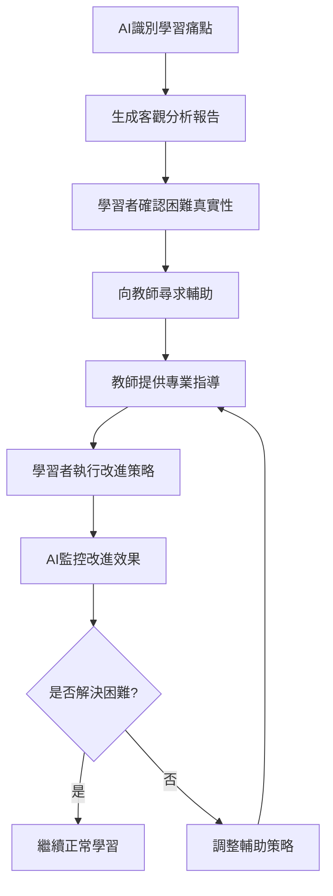

# 統計方法學習評估模板 - 第三階段（Unit 10-14）
## 基於AI Fluency 4D架構的智能統計方法學習系統 v3.1

### 🔄 第二階段銜接強化版

---

## 階段一：DELEGATION（委派） - 基於前期成效的統計方法學習規劃

### 1.1 第三階段學習範圍與時程規劃（Goal and Task Awareness）

```
【第三階段個人化學習計劃設定提示語 - v3.1增強版】

**角色設定**：您是統計方法教學AI助手，需要基於學習者前兩階段的完整學習成效，協助設定第三階段Unit 10-14的個人化學習計劃，並延續人物史探究與研究實戰的學習特色。

**前兩階段成效整合分析**：
請協助我整合前兩階段學習成效，規劃第三階段統計方法學習：

**必須輸入的前兩階段綜合資訊**：
```markdown
### 前兩階段學習成效總覽
**第一階段成效摘要**：
- 統計理論基礎水平：[優秀/良好/需改進]
- 概念理解能力：[具體評估]
- 學習模式特徵：[個人學習特點]

**第二階段成效摘要**：
- Unit 7-9概念掌握：[各Unit具體評分]
- jamovi操作能力：[熟練度評估]
- **【新增】人物史學習成果**：[對統計學家及發展脈絡的理解程度]
- **【新增】Zhang研究實戰表現**：[單一樣本t檢定的掌握程度]
- 學習困難克服情況：[改善程度]
- 自主學習成熟度：[發展狀況]

**整體學習表現評估**：
- 統計理論基礎：[紮實/穩定/需強化]
- 實務應用能力：[強/中/弱]
- **【新增】統計學文化素養**：[高/中/低]（基於人物史學習）
- **【新增】研究方法理解**：[深入/基本/淺層]（基於Zhang研究）
- 學習自主性：[高/中/低]
- 問題解決能力：[優秀/良好/需提升]
```

**16週總時程管控計算**：
```markdown
### 學習時程計算
**總週數限制**：16週
**第一階段用時**：[X]週
**第二階段用時**：[Y]週
**第三階段可用時間**：[16-X-Y]週

**時程分配建議**：
- **6-8週剩餘**：聚焦核心統計方法（Unit 10-12）
- **9-10週剩餘**：標準統計方法學習（Unit 10-13）
- **11週以上剩餘**：完整統計方法學習（Unit 10-14）

**個人化時程建議**：
基於您的前兩階段表現：[提供具體的時程建議和理由]
```

**Unit 10-14內容與學習範圍規劃**：
```markdown
### 統計方法單元內容規劃
**Unit 10 - [具體統計方法名稱]**：
- 核心概念：[列出主要概念]
- 適用資料類型：[對應的研究情境]
- **【新增】歷史發展脈絡**：[此方法的發展史和重要人物]
- **【新增】Zhang研究延伸**：[與張研究方法的關聯性]
- 對應真實資料：[從附件資料清單中選擇]
- 學習優先級：[高/中/低]（基於個人前期表現）

**Unit 11 - [具體統計方法名稱]**：
- 核心概念：[列出主要概念]
- 適用資料類型：[對應的研究情境]
- **【新增】方法論發展史**：[此方法的理論發展和創新者]
- **【新增】現代應用典型**：[在當代研究中的應用案例]
- 對應真實資料：[從附件資料清單中選擇]
- 學習優先級：[高/中/低]

**Unit 12 - [具體統計方法名稱]**：
- 核心概念：[列出主要概念]
- 適用資料類型：[對應的研究情境]
- **【新增】統計學派貢獻**：[不同統計學派對此方法的貢獻]
- **【新增】研究實戰案例**：[類似Zhang研究的實際應用]
- 對應真實資料：[從附件資料清單中選擇]
- 學習優先級：[高/中/低]

**Unit 13 - [具體統計方法名稱]**：
- 核心概念：[列出主要概念]
- 適用資料類型：[對應的研究情境]
- **【新增】方法創新歷程**：[此方法的創新發展過程]
- **【新增】跨領域應用**：[在不同研究領域的應用]
- 對應真實資料：[從附件資料清單中選擇]
- 學習優先級：[高/中/低]

**Unit 14 - [具體統計方法名稱]**：
- 核心概念：[列出主要概念]
- 適用資料類型：[對應的研究情境]
- **【新增】前沿發展趨勢**：[統計方法的最新發展]
- **【新增】未來應用前景**：[在新興研究中的潛力]
- 對應真實資料：[從附件資料清單中選擇]
- 學習優先級：[高/中/低]

**個人化學習範圍建議**：
基於您的學習時程和前期表現，建議學習範圍：[具體建議學習哪些Unit]
```

**個人學習目標設定**：
⚠️ **個人責任聲明**：您是大學生，對第三階段統計方法的學習成果完全負責。

```markdown
### 第三階段個人學習目標
**基於前期優勢的發揮目標**：
1. [優勢1的延續發展]：[具體目標設定]
2. [優勢2的深化應用]：[具體目標設定]

**基於前期弱項的改善目標**：
1. [弱項1的克服]：[具體改善目標]
2. [弱項2的提升]：[具體改善目標]

**統計方法新技能目標**：
1. [具體統計方法1]：[掌握程度目標]
2. [具體統計方法2]：[掌握程度目標]
3. **【新增】統計學文化深化**：[基於人物史學習的延伸]
4. **【新增】研究實戰能力**：[基於Zhang研究經驗的拓展]
5. [真實資料分析]：[實務應用目標]

**整合應用目標**：
- **【新增】方法比較選擇能力**：獨立選擇適當統計方法的能力
- **【新增】跨方法整合思維**：將多種統計方法結合應用的思維
- 真實研究資料的完整分析能力
- 統計結果的專業解釋能力
- **【新增】統計學史觀應用**：從統計發展史角度理解方法演進
```

**與教師協作機制**：
```markdown
### 教師協作計劃設定
**學習計劃協作**：
□ 與教師討論個人化學習範圍
□ 確認各Unit的學習深度要求
□ 設定階段性檢核點和頻率

**成效評估協作**：
□ 與教師共同設定評估標準
□ 確認真實資料分析的評估方式
□ 建立最終成效判定機制

**學習支持協作**：
□ 設定定期輔導時間和方式
□ 建立學習困難的求助機制
□ **【新增】統計學史學習的深化指導**
□ **【新增】研究實戰能力的專業培養**
□ 確認AI學習痛點辨識的回饋方式
```
```

### 1.2 真實研究資料整合與統計方法配對（Platform Awareness）

```
【統計方法與真實資料配對提示語 - v3.1研究實戰版】

**真實研究資料配對任務**：
基於附件提供的真實研究資料清單，協助學習者了解各統計方法的實際應用情境，延續第二階段Zhang研究實戰的學習特色。

**資料清單分析與分類**：

**t檢定類資料**：
```markdown
### t檢定方法學習資料
**單樣本t檢定**：
- 資料來源：ID 113 (https://osf.io/qlzap/) - one sample t test
- 資料來源：ID 153 (https://osf.io/0aifq/) - single sample t-test
- **【新增】Zhang研究經驗遷移**：基於第二階段Zhang研究的單一樣本t檢定經驗
- 學習重點：樣本均值與母群體參數的比較
- **【新增】統計學史連結**：Gosset (Student)的t檢定發明背景
- jamovi操作：單樣本t檢定的執行與結果解釋

**獨立樣本t檢定**：
- 資料來源：ID 61 (https://osf.io/sq8k9/) - independent-samples t-test
- 資料來源：ID 94 (https://osf.io/mua6d/) - independent samples t test
- 資料來源：ID 106 (https://osf.io/iajp5/) - 2 independent group t-test
- 資料來源：ID 107 (https://osf.io/edcr7/) - Independent samples t-test
- 資料來源：ID 115 (https://osf.io/aczvt/) - independent samples t-test
- 資料來源：ID 135 (https://osf.io/2gkjt/) - Welch's t-test
- 學習重點：兩個獨立群體均值的比較
- **【新增】方法發展史**：從Fisher到Welch的t檢定改進歷程
- jamovi操作：獨立樣本t檢定與Welch檢定的選擇

**相依樣本t檢定**：
- 資料來源：ID 6 (https://osf.io/atgp5/) - within-subject t test
- 資料來源：ID 7 (https://osf.io/6n3bm/) - paired sample t-test
- 資料來源：ID 15 (https://osf.io/bscfe/) - paired sample t-test
- 資料來源：ID 33 (https://osf.io/swrhy/) - paired sample t-test
- 資料來源：ID 116 (https://osf.io/ivfu6/) - dependent t-test
- 資料來源：ID 122 (https://osf.io/dnaxe/) - paired sample t-test
- 資料來源：ID 127 (https://osf.io/mjasz/) - paired sample t-test
- 資料來源：ID 146 (https://osf.io/dncxa/) - paired sample t-test
- 學習重點：配對資料的前後比較
- **【新增】實驗設計連結**：重複測量設計的統計學理論發展
- jamovi操作：相依樣本t檢定的執行與前提檢核
```

**變異數分析(ANOVA)類資料**：
```markdown
### ANOVA方法學習資料
**單因子ANOVA**：
- 資料來源：ID 43 (https://osf.io/pz0my/) - ANOVA
- 資料來源：ID 49 (https://osf.io/vy1bc/) - ANOVA
- 資料來源：ID 55 (https://osf.io/su6bm/) - ANOVA
- 資料來源：ID 80 (https://osf.io/79dey/) - one-way ANOVA
- 資料來源：ID 86 (https://osf.io/j8bpa/) - one way ANOVA
- 資料來源：ID 151 (https://osf.io/apidb/) - one way ANOVA
- 學習重點：多個群體均值的比較
- **【新增】Fisher的ANOVA革命**：變異數分析的理論突破意義
- jamovi操作：單因子ANOVA與事後比較

**雙因子ANOVA**：
- 資料來源：ID 50 (https://osf.io/rgm6p/) - two-way ANOVA
- 資料來源：ID 65 (https://osf.io/imrx2/) - 2x2 ANOVA
- 資料來源：ID 72 (https://osf.io/2gx4k/) - 2x2 ANOVA
- 資料來源：ID 87 (https://osf.io/abxcj/) - 2x2 ANOVA
- 資料來源：ID 111 (https://osf.io/aaudl/) - 2x2 ANOVA
- 資料來源：ID 132 (https://osf.io/b98zw/) - 2x4 ANOVA
- 資料來源：ID 143 (https://osf.io/yuybh/) - 3x3 ANOVA
- 學習重點：主效果與交互作用的分析
- **【新增】實驗設計發展史**：多因子設計的統計學理論演進
- jamovi操作：雙因子ANOVA的結果解釋

**重複測量ANOVA**：
- 資料來源：ID 1 (https://osf.io/qwkum/) - Repeated measures ANOVA
- 資料來源：ID 2 (https://osf.io/rmvk5/) - One-way repeated-measures ANOVA
- 資料來源：ID 17 (https://osf.io/hp27x/) - repeated measures anova
- 資料來源：ID 19 (https://osf.io/gcj7x/) - Repeated Measures ANOVA
- 資料來源：ID 110 (https://osf.io/7dyp5/) - Repeated measures ANOVA
- 資料來源：ID 114 (https://osf.io/yaeu7/) - repeated measures ANOVA
- 資料來源：ID 142 (https://osf.io/k4y9i/) - Repeated measures ANOVA
- 學習重點：同一受試者的重複測量分析
- **【新增】球形檢定的發展**：Mauchly檢定的統計學意義
- jamovi操作：重複測量ANOVA的球形檢定

**混合設計ANOVA**：
- 資料來源：ID 4 (https://osf.io/8j9cg/) - mixed ANOVA
- 資料來源：ID 10 (https://osf.io/vmipw/) - 3x2x2 mixed ANOVA
- 資料來源：ID 12 (https://osf.io/7rtcz/) - 2x3 mixed ANOVA
- 資料來源：ID 13 (https://osf.io/gxvd3/) - 2 x 3 Mixed ANOVA
- 資料來源：ID 20 (https://osf.io/bzdr2/) - mixed ANOVA
- 資料來源：ID 26 (https://osf.io/hasfu/) - mixed ANOVA
- 資料來源：ID 36 (https://osf.io/vmz2e/) - mixed ANOVA
- 學習重點：組間與組內因子的混合設計
- **【新增】混合設計理論**：實驗設計統計學的複雜性發展
- jamovi操作：混合設計ANOVA的複雜性處理
```

**相關與迴歸分析類資料**：
```markdown
### 相關與迴歸方法學習資料
**相關分析**：
- 資料來源：ID 39 (https://osf.io/38ges/) - Comparison of difference between pairs of 2 correlations
- 資料來源：ID 82 (https://osf.io/r5gpv/) - simple correlation
- 資料來源：ID 120 (https://osf.io/73pnd/) - Pearson's product-moment correlation
- 資料來源：ID 134 (https://osf.io/5dx4v/) - Partial correlations
- 資料來源：ID 154 (https://osf.io/siaqe/) - correlation analysis
- 資料來源：ID 155 (https://osf.io/tg2wd/) - correlation
- 學習重點：變數間關係的測量與檢定
- **【新增】Pearson的統計革命**：相關分析理論的奠基意義
- jamovi操作：相關分析與偏相關分析

**迴歸分析**：
- 資料來源：ID 44 (https://osf.io/rc6mv/) - hierarchical multiple linear regression
- 資料來源：ID 48 (https://osf.io/5tbxf/) - Multiple regression
- 資料來源：ID 93 (https://osf.io/cxmf6/) - hierarchical regression analyses
- 學習重點：預測模型建立與解釋
- **【新增】迴歸分析發展史**：從Galton到現代預測模型的演進
- jamovi操作：多元迴歸與階層迴歸分析
```

**進階統計方法類資料**：
```markdown
### 進階方法學習資料
**卡方檢定**：
- 資料來源：ID 73 (https://osf.io/nhwv5/) - Chi Square
- 資料來源：ID 84 (https://osf.io/v8vft/) - 2x2 chi square
- 資料來源：ID 104 (https://osf.io/kegmc/) - 2x2 chi square
- 資料來源：ID 165 (https://osf.io/q7f6w/) - chi Square
- 學習重點：類別變數間的獨立性檢定
- **【新增】Pearson的χ²貢獻**：類別資料分析的統計學基礎
- jamovi操作：卡方檢定與期望頻率計算

**多變量分析**：
- 資料來源：ID 3 (https://osf.io/4dvzb/) - MANOVA
- 學習重點：多個依變數的同時分析
- **【新增】多變量統計學派**：Hotelling等人的理論貢獻
- jamovi操作：MANOVA的執行與結果解釋

**其他進階方法**：
- 資料來源：ID 59 (https://osf.io/h84qd/) - multilevel model
- 資料來源：ID 69 (https://osf.io/qthf2/) - binomial test
- 資料來源：ID 77 (https://osf.io/nr7d9/) - zero-inflated model
- 學習重點：特殊資料結構的統計處理
- **【新增】現代統計學趨勢**：貝葉斯方法與計算統計學發展
- jamovi操作：進階統計方法的軟體實作
```

**個人化資料選擇策略**：
```markdown
### 個人化學習資料配對
基於您的前兩階段學習成效，建議的學習順序和資料配對：

**第1階段統計方法學習**（必修）：
- t檢定方法：[選擇3-4個代表性資料集]
- 單因子ANOVA：[選擇2-3個資料集]
- 基礎相關分析：[選擇1-2個資料集]

**第2階段統計方法學習**（依時程彈性調整）：
- 雙因子ANOVA：[選擇2-3個資料集]
- 重複測量分析：[選擇2個資料集]
- 迴歸分析：[選擇1-2個資料集]

**第3階段統計方法學習**（時程充裕者）：
- 混合設計ANOVA：[選擇1-2個資料集]
- 進階統計方法：[選擇1個資料集]

**個人適性配對原則**：
- 從簡單到複雜的學習順序
- 優先選擇與個人興趣相關的研究主題
- **【新增】延續Zhang研究的方法學習**：選擇與單一樣本t檢定相關的進階方法
- 考量前期jamovi操作能力選擇適當複雜度
- 確保每種方法都有實際操作經驗
```
```

### 1.3 教師協作學習計劃設定（Task Delegation）

```
【教師協作統計方法學習計劃設定提示語 - v3.1研究導向版】

**教師協作計劃設定任務**：
協助學習者與教師建立有效的第三階段學習協作機制，延續第二階段的成功協作經驗。

**學習計劃協作框架**：

**1. 個人化學習範圍協商**：
```markdown
### 與教師協商學習範圍
**協商前準備（學習者責任）**：
□ 完成前兩階段學習成效的誠實自我評估
□ 分析剩餘學習時程和個人時間安排
□ 初步了解Unit 10-14各統計方法的基本概念
□ 確認個人統計方法學習的興趣和目標

**協商內容要點**：
**A. 學習範圍確認**：
- 基於剩餘時程，確認學習Unit範圍（10-12 / 10-13 / 10-14）
- 各Unit的學習深度要求（基礎理解 / 熟練應用 / 進階整合）
- 真實資料分析的預期數量和複雜度

**B. 學習時程安排**：
- 每個Unit的建議學習時間分配
- 階段性檢核點的設定（週/雙週/月）
- 彈性調整機制的建立

**C. 學習目標設定**：
- 個人化的統計方法掌握目標
- 真實資料分析的能力期待
- **【新增】統計學史觀的應用目標**（基於第二階段人物史學習）
- **【新增】研究實戰能力的發展期待**（基於Zhang研究經驗）
- 統計結果解釋的專業水準要求

**協商輸出**：
與教師共同簽署的「第三階段個人化學習計劃協議」
```

**2. 成效評估內容協作設定**：
```markdown
### 成效評估協作設計
**評估內容協作**：

**A. 各Unit概念理解評估**：
- 教師設定：概念理解的核心評估點
- 學習者確認：個人理解能力的自我評估標準
- 共同決定：評估方式（口試/筆試/實作/報告）

**B. 真實資料分析評估**：
- 教師提供：真實資料分析的評估框架
- 學習者選擇：偏好的資料分析主題和方法
- 共同設定：分析報告的品質標準和評分方式

**C. 統計方法應用評估**：
- 教師設計：統計方法選擇和應用的評估情境
- 學習者參與：評估情境的個人化調整
- **【新增】統計學史觀評估**：基於第二階段人物史學習的史觀應用評估
- **【新增】研究實戰能力評估**：基於Zhang研究經驗的實戰能力檢核
- 共同確認：評估標準的公平性和可達成性

**評估時程協作**：
- 階段性評估：每個Unit完成後的即時評估
- 整合性評估：多個Unit知識的綜合應用評估
- 最終成效評估：第三階段完整學習成果的全面評估

**評估權重協作**：
| 評估項目 | 教師建議權重 | 學習者協商權重 | 最終確定權重 |
|---------|-------------|---------------|-------------|
| 概念理解 | [%] | [%] | [%] |
| 實務應用 | [%] | [%] | [%] |
| 真實資料分析 | [%] | [%] | [%] |
| **【新增】統計學史觀應用** | [%] | [%] | [%] |
| **【新增】研究實戰能力** | [%] | [%] | [%] |
| 整合能力 | [%] | [%] | [%] |

**最終成效判定機制**：
- 教師保有最終成效判定的專業權威
- 學習者有權了解判定標準和評估過程
- 建立申訴和重新評估的公平機制
```

**3. 學習支持協作機制**：
```markdown
### 學習支持協作設計
**AI學習痛點辨識與教師輔助整合**：

**A. AI痛點辨識機制**：
- AI負責：客觀分析學習過程數據，識別學習困難模式
- AI提供：個人化的學習困難預警和改進建議
- AI監控：學習進度與預期目標的差距分析

**B. 教師輔助介入機制**：
- 輔助觸發條件：AI識別出重大學習困難時
- 輔助方式選擇：面談/線上指導/額外資源提供
- **【新增】統計學史輔助**：當統計方法學習困難時，運用歷史發展脈絡輔助理解
- **【新增】研究實戰輔助**：基於Zhang研究經驗，提供類似研究案例輔助學習
- 輔助頻率設定：基於個人需求和學習進展

**C. 師生協作解決流程**：


**學習支持時程安排**：
- 定期輔導：每[週/雙週]固定時間的學習指導
- 即時支持：遇到重大困難時的緊急輔助
- 階段回顧：每個Unit完成後的學習經驗討論

**支持效果評估**：
- 學習困難的解決效率
- 學習者自主解決能力的提升
- 整體學習進度的改善程度
```

**4. 責任分工明確化**：
```markdown
### 三方責任分工協議
**學習者個人責任（100%承擔）**：
□ 所有學習努力和時間投入
□ 學習目標的達成或失敗
□ 誠實面對學習困難和問題
□ 主動尋求協助和支持
□ 執行教師建議的改進策略

**AI輔助功能範圍**：
□ 客觀的學習痛點識別和分析
□ 個人化的學習建議生成
□ 學習進度的數據追蹤和預警
□ 統計方法學習的資源整理

**教師專業責任範圍**：
□ 學習計劃的專業建議和最終確認
□ 成效評估內容的設計和最終判定
□ 學習困難的專業診斷和輔助策略
□ 統計方法應用的專業指導

**協作成功的關鍵要素**：
- 開放誠實的溝通
- 明確的角色邊界
- 彈性的調整機制
- 共同的成功目標
```
```

---

## 階段二：DESCRIPTION（描述） - 統計方法學習內容智能生成

### 2.1 統計方法概念描述與真實應用（Product Description）

```
【統計方法概念理解與真實應用提示語 - v3.1史觀整合版】

**角色與任務**：
您是統計方法教學專家，需要協助學習者深度理解Unit 10-14的統計方法，並結合真實研究資料進行實際應用學習，延續第二階段的統計學史觀和研究實戰特色。

**統計方法概念生成要格**：

**1. Unit 10統計方法概念生成**：
```markdown
### Unit 10 - [具體統計方法名稱]
**概念核心理解**：
- **基本定義**：[統計方法的精確定義和目的]
- **適用情境**：[何時使用這個統計方法]
- **前提假設**：[使用此方法的統計假設條件]
- **優勢限制**：[方法的優點和使用限制]

**【新增】歷史發展脈絡**：
- **發展背景**：[此方法產生的歷史背景和需求]
- **關鍵人物**：[對此方法發展有重要貢獻的統計學家]
- **理論演進**：[方法的理論發展歷程和重要突破]
- **現代應用**：[在當代研究中的重要應用領域]

**與前期學習的連結**：
- **Unit 7-9基礎**：[此方法如何建立在前期理論基礎上]
- **概念延伸**：[從基礎理論到實際方法的概念發展]
- **技能轉移**：[前期jamovi技能如何應用到此方法]
- **【新增】Zhang研究延伸**：[從張研究的單一樣本t檢定到此方法的概念連結]

**真實研究資料應用**：
**選定資料集**：[從清單中選擇適合的OSF資料]
- 資料來源：[具體ID和URL]
- 研究背景：[研究主題和設計簡介]
- 變數說明：[主要變數類型和測量方式]
- 統計問題：[此資料要回答的統計問題]

**jamovi實作指導**：
- **資料載入**：[如何在jamovi中處理真實資料]
- **前提檢定**：[執行統計假設檢定的步驟]
- **主要分析**：[統計方法的完整執行步驟]
- **結果解釋**：[如何專業解讀jamovi輸出結果]

**概念理解評估設計**：
```
### 概念理解評估題目
**題目1 - 概念識別**：
[設計一個要求學習者識別此統計方法適用情境的題目]

**題目2 - 前提判斷**：
[設計一個評估學習者判斷統計假設是否滿足的題目]

**題目3 - 方法選擇**：
[設計一個情境題，要求學習者選擇最適當的統計方法]

**【新增】題目4 - 歷史脈絡理解**：
[設計一個評估學習者對此方法發展史理解的題目]

**【新增】題目5 - 研究實戰應用**：
[設計一個基於真實研究情境的方法應用題目]

**評分標準**：
- 概念識別正確性（30%）
- 前提判斷準確度（25%）
- 方法選擇合理性（25%）
- 歷史脈絡理解（10%）
- 實戰應用能力（10%）
```

**實務應用評估設計**：
```
### 真實資料分析評估
**分析任務**：
使用[指定OSF資料集]完成以下分析任務：

**任務1 - 資料探索**：
□ 正確載入和檢視資料結構
□ 進行適當的描述統計分析
□ 識別可能的資料品質問題

**任務2 - 前提檢定**：
□ 執行相關的統計假設檢定
□ 正確解釋檢定結果
□ 處理假設違反的情況

**任務3 - 主要分析**：
□ 執行正確的統計分析
□ 產生適當的統計圖表
□ 記錄完整的分析過程

**任務4 - 結果解釋**：
□ 專業解讀統計結果
□ 連結統計發現與研究問題
□ 討論結果的實務意義

**【新增】任務5 - 統計學史觀應用**：
□ 從統計發展史角度理解方法選擇
□ 討論此方法的理論意義和局限性
□ 反思統計方法在研究中的價值

**評分標準**：
| 評估項目 | 優秀(4分) | 良好(3分) | 尚可(2分) | 需改進(1分) |
|---------|---------|---------|---------|------------|
| 資料處理 | [具體標準] | [具體標準] | [具體標準] | [具體標準] |
| 統計執行 | [具體標準] | [具體標準] | [具體標準] | [具體標準] |
| 結果解釋 | [具體標準] | [具體標準] | [具體標準] | [具體標準] |
| 報告品質 | [具體標準] | [具體標準] | [具體標準] | [具體標準] |
| **【新增】史觀應用** | [具體標準] | [具體標準] | [具體標準] | [具體標準] |
```
```

**2. 進階統計方法整合學習**：
```markdown
### 多Unit統計方法比較與選擇
**統計方法決策樹**：
```
研究問題類型判斷
├── 比較群體差異
│   ├── 兩個群體
│   │   ├── 獨立樣本 → 獨立樣本t檢定
│   │   └── 相依樣本 → 相依樣本t檢定
│   └── 三個以上群體
│       ├── 單一因子 → 單因子ANOVA
│       └── 多個因子 → 雙因子/多因子ANOVA
├── 探索變數關係
│   ├── 兩個連續變數 → 相關分析
│   └── 預測關係 → 迴歸分析
└── 類別變數分析
    └── 獨立性檢定 → 卡方檢定
```

**方法選擇練習資料配對**：
```
### 統計方法選擇練習設計
**練習1 - 研究設計辨識**：
提供真實研究資料[ID清單]，要求學習者：
- 識別研究設計類型
- 判斷變數的測量層次
- 選擇最適當的統計方法
- 說明選擇理由

**練習2 - 替代方法比較**：
使用同一資料集，執行多種可能的統計分析：
- 比較不同方法的適用性
- 分析結果差異的原因
- 評估各方法的優缺點

**【新增】練習3 - 統計學史觀分析**：
- 從統計發展史角度理解方法演進
- 分析不同統計學派的方法偏好
- 討論統計方法的哲學基礎

**練習4 - 複雜研究設計**：
使用包含多個變數的資料集：
- 設計完整的分析策略
- 執行多階段統計分析
- 整合多個分析結果
```
```

### 2.2 個人化學習痛點識別與回饋生成（Process Description）

```
【AI學習痛點識別系統設計提示語 - v3.1多維統計版】

**AI痛點識別系統要格**：
設計一個能夠準確識別統計方法學習中個人痛點的智能系統。

**痛點識別架構**：

**1. 概念理解痛點識別**：
```markdown
### 概念理解困難診斷
**痛點類型A - 基礎概念混淆**：
**識別指標**：
- 統計方法適用情境判斷錯誤率 > 30%
- 前提假設理解測驗分數 < 70%
- 方法間差異比較回答不一致

**AI分析報告範例**：
"基於您的學習表現分析，發現您在以下概念理解上存在困難：
1. **統計方法選擇**：在6次方法選擇題中，有3次選擇了不適當的統計方法
2. **前提假設理解**：對於[具體統計方法]的假設條件理解不清楚
3. **概念間關聯**：未能有效連結[方法A]與[方法B]的使用場景差異

**改進建議**：
- 重新學習[具體概念]的基礎定義
- 增加[具體類型]練習題的練習量
- 尋求教師輔助重清[具體混淆點]"

**痛點類型B - 理論與實務脫節**：
**識別指標**：
- 概念測驗表現良好但實務操作困難
- jamovi操作正確但結果解釋錯誤
- 理論知識與實際應用無法連結

**AI分析報告範例**：
"您的理論理解能力良好，但在實際應用時出現困難：
1. **理論轉實務困難**：能回答理論問題但無法在真實資料中應用
2. **結果解釋偏差**：jamovi操作正確但對輸出結果的解釋不準確
3. **情境轉換困難**：學會一個例子但無法類推到其他情境

**改進建議**：
- 增加真實資料練習的頻率
- 重點練習統計結果的專業解釋
- 尋求教師輔助建立理論與實務的連結"

**【新增】痛點類型C - 統計學史觀缺失**：
**識別指標**：
- 對統計方法發展脈絡理解不足
- 無法從歷史角度理解方法選擇
- 缺乏統計學方法論的深層理解

**AI分析報告範例**：
"您在統計學史觀和方法論理解上需要加強：
1. **歷史脈絡缺失**：對統計方法的發展背景理解不足
2. **方法論思維不足**：缺乏對統計方法哲學基礎的思考
3. **整合視野缺乏**：無法從統計學發展史角度整合不同方法

**改進建議**：
- 回顧第二階段的統計學人物史學習成果
- 增加統計學方法論的閱讀和思考
- 從歷史發展角度重新理解統計方法的意義"
```

**2. 實務操作痛點識別**：
```markdown
### jamovi操作困難診斷
**痛點類型D - 軟體操作技術困難**：
**識別指標**：
- jamovi操作步驟經常出錯
- 統計輸出結果無法正確產生
- 操作時間明顯超過預期

**AI分析報告範例**：
"您在jamovi軟體操作上遇到技術性困難：
1. **基礎操作不熟練**：資料載入和變數設定經常出錯
2. **分析設定錯誤**：統計分析的參數設定不正確
3. **結果產生困難**：無法順利產生完整的分析結果

**改進建議**：
- 重新複習jamovi基礎操作
- 增加操作練習的時間投入
- 尋求教師輔助解決技術問題"

**痛點類型E - 複雜分析處理困難**：
**識別指標**：
- 簡單分析正確但複雜分析困難
- 多步驟分析流程容易出錯
- 進階功能使用不熟練

**AI分析報告範例**：
"您在處理複雜統計分析時遇到困難：
1. **多步驟分析流程**：在執行複雜的統計程序時容易在中間步驟出錯
2. **進階功能應用**：對jamovi的進階功能不熟悉
3. **整合分析能力**：無法將多個分析結果有效整合

**改進建議**：
- 將複雜分析分解為小步驟練習
- 重點學習jamovi進階功能
- 尋求教師輔助建立分析流程概念"

**【新增】痛點類型F - 研究實戰轉化困難**：
**識別指標**：
- 練習資料分析成功但真實研究應用困難
- 缺乏將統計方法應用到新情境的能力
- 對統計方法的實際研究價值理解不足

**AI分析報告範例**：
"您在將統計學習轉化為研究實戰能力時遇到障礙：
1. **方法遷移困難**：無法將學會的方法應用到新的研究情境
2. **研究思維不足**：缺乏將統計方法與研究問題連結的思維
3. **實戰經驗缺乏**：對統計方法在實際研究中的應用缺乏經驗

**改進建議**：
- 回顧第二階段Zhang研究的成功經驗
- 增加真實研究案例的分析練習
- 從研究方法論角度理解統計分析的價值"
```

**3. 學習策略痛點識別**：
```markdown
### 個人學習模式診斷
**痛點類型G - 時間管理困難**：
**識別指標**：
- 學習進度明顯落後預期
- 學習時間分配不均衡
- 臨時抱佛腳的學習模式

**AI分析報告範例**：
"您的學習時間管理存在改進空間：
1. **進度落後問題**：當前學習進度比預期計劃落後[X]天
2. **時間分配不均**：概念學習與實務練習的時間比例失衡
3. **學習節奏不穩定**：學習投入時間波動過大

**改進建議**：
- 重新調整個人學習時程規劃
- 建立更規律的學習節奏
- 尋求教師輔助優化學習策略"

**痛點類型H - 學習動機下降**：
**識別指標**：
- 學習活動參與度下降
- 主動提問和探索減少
- 自我評估信心不足

**AI分析報告範例**：
"您的學習動機出現下降趨勢：
1. **參與度降低**：最近兩週的學習活動參與度明顯下降
2. **探索精神減弱**：主動提問和深度探索的行為減少
3. **信心不足**：對自己的學習能力評估過於負面

**改進建議**：
- 重新確認個人學習目標和動機
- 尋找適合個人興趣的學習內容
- 尋求教師輔助重建學習信心"

**【新增】痛點類型I - 整合思維發展困難**：
**識別指標**：
- 單一方法掌握良好但缺乏整合能力
- 無法比較和選擇不同統計方法
- 缺乏統計學的整體思維框架

**AI分析報告範例**：
"您在發展統計學整合思維時遇到挑戰：
1. **方法孤立學習**：各種統計方法的學習缺乏有機連結
2. **比較選擇困難**：面對多種方法選擇時缺乏判斷依據
3. **整體視野缺乏**：尚未建立統計學的整體思維框架

**改進建議**：
- 增加統計方法比較和選擇的練習
- 從統計學發展史角度建立整體視野
- 注重多種方法的綜合應用練習"
```

**4. 個人化回饋生成機制**：
```markdown
### 智能回饋生成系統
**回饋生成原則**：
- **客觀性**：基於具體的學習表現數據
- **個人化**：針對個人的學習特徵和痛點
- **建設性**：提供具體可行的改進建議
- **鼓勵性**：平衡問題指出與正向鼓勵

**回饋內容結構**：
```
### 個人學習痛點分析報告
**學習者**：[姓名]
**分析期間**：[具體時間範圍]
**分析資料來源**：[學習活動數據、測驗結果、操作記錄等]

**⚠️ 重要聲明**：此分析僅供參考，您對學習成果承擔完全責任

**當前學習優勢**：
1. [優勢1]：[具體表現和數據支持]
2. [優勢2]：[具體表現和數據支持]

**識別到的學習痛點**：
**主要痛點1 - [痛點類型]**：
- 客觀表現：[具體的數據和表現描述]
- 影響程度：[高/中/低]
- 改進建議：[具體的改善策略]
- 建議尋求教師輔助：[是/否]

**次要痛點2 - [痛點類型]**：
- 客觀表現：[具體的數據和表現描述]
- 影響程度：[高/中/低]
- 改進建議：[具體的改善策略]
- 建議尋求教師輔助：[是/否]

**學習進展預測**：
基於當前表現趨勢，預期您在未來[時間]內：
- 可能克服的困難：[具體預測]
- 可能持續的挑戰：[具體預測]
- 建議重點關注：[具體建議]

**下週學習重點建議**：
1. [重點1]：[具體行動計劃]
2. [重點2]：[具體行動計劃]
3. [重點3]：[具體行動計劃]

**教師輔助需求評估**：
□ 高度需要教師輔助（存在重大學習困難）
□ 中度需要教師輔助（存在特定學習痛點）
□ 低度需要教師輔助（整體學習順利）

**建議教師輔助內容**：[具體的輔助需求描述]
```

**回饋品質保證**：
- 分析結果要有數據支撐，避免主觀判斷
- 改進建議要具體可操作
- 預測要基於客觀趨勢分析
- 鼓勵要真誠且有根據
```
```

### 2.3 統計報告撰寫與專業表達（Performance Description）

```
【統計分析報告撰寫指導提示語 - v3.1研究實戰版】

**專業統計報告撰寫指導**：
協助學習者掌握專業統計分析報告的撰寫技能。

**統計報告結構設計**：

**1. 完整統計報告範本**：
```markdown
### 統計分析報告範本
**報告標題**：[研究問題的簡潔描述]
**資料來源**：[OSF資料集ID和來源]
**分析方法**：[使用的統計方法]
**報告撰寫者**：[學習者姓名]
**分析日期**：[具體日期]

**一、研究背景與問題**
- **研究背景**：[簡述資料集的研究背景]
- **研究問題**：[明確陳述要回答的統計問題]
- **研究假設**：[如適用，列出研究假設]

**二、資料描述**
- **樣本特徵**：[樣本大小、基本特徵描述]
- **變數說明**：[主要變數類型、測量方式、編碼說明]
- **資料品質**：[遺漏值、異常值的處理說明]

**三、統計方法**
- **方法選擇理由**：[為什麼選擇此統計方法]
- **前提假設檢定**：[統計假設的檢驗結果]
- **分析軟體**：jamovi [版本號]

**【新增】四、統計學史觀分析**
- **方法發展背景**：[此統計方法的歷史發展脈絡]
- **理論基礎**：[方法的統計學理論基礎]
- **現代意義**：[此方法在當代統計實踐中的地位]

**五、分析結果**
- **描述統計**：[基本統計量報告]
- **推論統計**：[主要統計檢定結果]
- **統計圖表**：[適當的視覺化呈現]

**六、結果解釋**
- **統計意義**：[統計檢定結果的專業解釋]
- **實務意義**：[結果對實際問題的意義]
- **效果量**：[如適用，報告效果量]

**七、討論與限制**
- **結果討論**：[對發現的深入討論]
- **研究限制**：[資料和方法的限制]
- **未來建議**：[後續研究的建議]

**八、參考資料**
- [APA格式的資料來源引用]
```

**2. 各統計方法的專業報告範例**：
```markdown
### t檢定報告範例
**獨立樣本t檢定結果報告**：
"進行獨立樣本t檢定以比較兩組[變數名稱]的差異。Levene等方差齊性檢定結果顯示兩組方差[齊性/不齊性]（F = [數值], p = [數值]）。t檢定結果顯示，[組別A]的[變數]均值（M = [數值], SD = [數值]）與[組別B]的[變數]均值（M = [數值], SD = [數值]）存在[顯著/不顯著]差異，t([自由度]) = [t值], p = [p值], Cohen's d = [效果量]。"

**【新增】統計學史觀補充**：
"本分析使用的t檢定方法由William Sealy Gosset（筆名Student）於1908年發明，是為了解決小樣本統計推論問題。此方法的發展標誌著現代統計學從大樣本理論向小樣本實用統計的重要轉變，對教育和心理學研究具有革命性意義。"

**相依樣本t檢定結果報告**：
"進行相依樣本t檢定以比較[前測/後測]的差異。結果顯示，[後測]分數（M = [數值], SD = [數值]）相較於[前測]分數（M = [數值], SD = [數值]）有[顯著/不顯著]的[增加/減少]，t([自由度]) = [t值], p = [p值], Cohen's d = [效果量]。"

### ANOVA報告範例
**單因子ANOVA結果報告**：
"進行單因子變異數分析以檢驗[因子名稱]對[依變數]的影響。結果顯示，[因子名稱]對[依變數]有[顯著/不顯著]的主效果，F([組間自由度], [組內自由度]) = [F值], p = [p值], η² = [效果量]。事後比較（[比較方法]）顯示：[具體比較結果]。"

**【新增】ANOVA發展史補充**：
"變異數分析(ANOVA)由Ronald Fisher於1920年代發明，是統計學史上的重大突破。Fisher將變異數分解為組間變異與組內變異的概念，不僅解決了多組比較的統計問題，更建立了實驗設計的理論基礎，對現代科學研究方法論產生深遠影響。"

**雙因子ANOVA結果報告**：
"進行2×2變異數分析以檢驗[因子A]和[因子B]對[依變數]的影響。結果顯示：
- [因子A]的主效果[顯著/不顯著]，F([自由度]) = [F值], p = [p值], η² = [效果量]
- [因子B]的主效果[顯著/不顯著]，F([自由度]) = [F值], p = [p值], η² = [效果量]  
- [因子A]×[因子B]的交互作用[顯著/不顯著]，F([自由度]) = [F值], p = [p值], η² = [效果量]
[如有顯著交互作用，進行簡單效果分析的結果]"

### 相關分析報告範例
**Pearson相關分析結果報告**：
"進行Pearson積差相關分析以檢驗[變數A]與[變數B]之間的關係。結果顯示，[變數A]與[變數B]之間存在[顯著正相關/顯著負相關/不顯著相關]，r = [相關係數], p = [p值]，決定係數R² = [數值]，表示[變數A]可解釋[變數B] [百分比]%的變異量。"

**【新增】相關分析發展史補充**：
"相關分析的概念由Francis Galton首先提出，並由其學生Karl Pearson發展成完整的統計方法。Pearson積差相關係數的發明不僅為心理測量學奠定基礎，更開啟了統計學在社會科學中的廣泛應用，體現了統計學從純數學轉向實用科學的重要轉折。"
```

**3. 圖表製作與解釋指導**：
```markdown
### 統計圖表製作指導
**圖表選擇原則**：
- **長條圖**：用於類別變數的頻率分佈
- **直方圖**：用於連續變數的分佈形態
- **箱型圖**：用於比較不同組別的分佈
- **散佈圖**：用於檢視兩個連續變數的關係
- **誤差圖**：用於呈現均值和信賴區間

**圖表品質標準**：
□ 圖表標題清楚明確
□ 軸標籤完整且正確
□ 圖例說明清楚
□ 字體大小適當可讀
□ 顏色使用適當且一致

**圖表解釋範例**：
"圖1顯示兩組受試者在[依變數]上的分佈情況。從箱型圖可以看出，[組別A]的[依變數]中位數為[數值]，四分位距為[數值]；[組別B]的[依變數]中位數為[數值]，四分位距為[數值]。兩組的分佈形態都接近常態分佈，且[組別A]的變異程度明顯[大於/小於][組別B]。"

**【新增】統計圖表發展史**：
"統計圖表的歷史可追溯至18世紀的William Playfair，他發明了線圖、長條圖和圓餅圖等基本圖形。現代統計圖表在John Tukey的探索性資料分析理論推動下，發展出箱型圖等創新視覺化方法，體現了統計學從純粹計算轉向資料理解的重要發展。"
```

**4. 報告品質評估標準**：
```markdown
### 報告評估量表
| 評估項目 | 優秀(4分) | 良好(3分) | 尚可(2分) | 需改進(1分) |
|---------|---------|---------|---------|------------|
| **內容完整性** | 包含所有必要章節，內容充實 | 包含主要章節，內容適當 | 基本章節完整，內容簡單 | 缺少重要章節或內容過簡 |
| **統計報告準確性** | 統計結果報告完全正確 | 統計結果報告大致正確 | 統計結果報告基本正確 | 統計結果報告有明顯錯誤 |
| **專業表達** | 使用專業術語準確恰當 | 專業術語使用基本正確 | 專業表達尚可理解 | 專業表達不夠準確 |
| **邏輯結構** | 邏輯清晰，結構完整 | 邏輯基本清晰 | 結構基本合理 | 邏輯混亂，結構不清 |
| **圖表品質** | 圖表精美且資訊豐富 | 圖表清楚且適當 | 圖表基本符合要求 | 圖表品質不佳或不適當 |
| **【新增】統計學史觀應用** | 深度整合統計發展史觀點 | 適當應用歷史觀點 | 基本提及歷史背景 | 缺乏歷史視野或應用不當 |

**總分計算**：總分 = 各項得分之和 / 6
**等級劃分**：
- 優秀：3.5-4.0分
- 良好：2.5-3.4分  
- 尚可：1.5-2.4分
- 需改進：1.0-1.4分
```

**5. 個人化報告改進建議生成**：
```markdown
### 報告改進建議系統
**基於評估結果的個人化建議**：

**針對內容完整性不足**：
"您的報告在[具體章節]方面需要加強：
- 建議補充[具體內容]的詳細說明
- 增加[具體分析]以提高報告完整性
- 參考[具體範例]來改善內容結構"

**針對統計報告不準確**：
"您的統計結果報告存在以下問題：
- [具體錯誤]需要修正為[正確表達]
- 建議重新檢查[具體統計指標]的計算和報告
- 參考APA格式的統計結果報告標準"

**針對專業表達不足**：
"建議改善專業表達的方式：
- 學習統計術語的正確使用方法
- 練習專業的結果解釋表達
- 尋求教師輔助提升專業寫作能力"

**【新增】針對統計學史觀應用不足**：
"您的報告在統計學史觀應用方面可以加強：
- 補充統計方法的歷史發展背景
- 討論統計方法的理論意義和哲學基礎
- 從統計學發展史角度反思方法的適用性和限制"

**個人進步追蹤**：
記錄每次報告的評估分數，追蹤個人在報告撰寫能力上的進步軌跡。
```
```

---

## 階段三：DISCERNMENT（辨別） - 統計方法學習品質監控

### 3.1 統計方法應用正確性評估（Content Discernment）

```
【統計方法應用品質評估提示語 - v3.1整合評估版】

**統計方法應用正確性監控**：
建立一個能夠有效評估學習者統計方法應用正確性的監控系統。

**評估框架設計**：

**1. 統計方法選擇正確性評估**：
```markdown
### 方法選擇評估標準
**評估層次A - 研究設計識別**：
**評估標準**：
□ 正確識別變數類型（連續/順序/類別）
□ 準確判斷研究設計（組間/組內/混合設計）
□ 恰當識別資料結構（獨立/相依/嵌套）

**評估方法**：
提供真實研究資料，要求學習者：
1. 分析資料結構和變數特性
2. 識別研究設計類型
3. 選擇最適當的統計方法
4. 說明選擇理由

**評分標準**：
- 變數識別正確：2分
- 設計識別正確：2分  
- 方法選擇正確：3分
- 理由說明清楚：3分
- 總分：10分（8分以上為達標）

**常見錯誤模式識別**：
```
### 常見統計方法選擇錯誤
**錯誤類型1 - 變數類型誤判**：
- 表現：將順序變數當作連續變數處理
- 後果：選擇不適當的統計方法
- AI提醒：檢測到變數類型判斷可能有誤

**錯誤類型2 - 設計結構混淆**：
- 表現：無法區分獨立樣本和相依樣本
- 後果：使用錯誤的檢定方法
- AI提醒：建議重新檢視資料收集方式

**錯誤類型3 - 複雜度錯估**：
- 表現：簡單問題使用過度複雜的方法
- 後果：分析結果難以解釋
- AI提醒：考慮是否有更簡單適當的方法
```

**評估層次B - 統計假設檢核**：
**評估標準**：
□ 正確識別統計方法的前提假設
□ 適當執行假設檢定
□ 合理處理假設違反情況

**評估任務設計**：
```
### 假設檢定評估任務
**任務1 - 假設識別**：
"請列出執行[指定統計方法]時需要檢驗的前提假設，並說明每個假設的意義。"

**評分要點**：
- 常態性假設：[2分]
- 變異數齊性假設：[2分] 
- 獨立性假設：[2分]
- 假設意義說明：[4分]

**任務2 - 假設檢定執行**：
"使用jamovi對[指定資料集]執行前提假設檢定，並報告檢定結果。"

**評分要點**：
- 正確執行檢定：[3分]
- 準確解讀結果：[3分]
- 適當報告格式：[2分]
- 假設違反處理：[2分]

**任務3 - 違反處理策略**：
"如果發現前提假設違反，請說明可能的處理策略。"

**評分要點**：
- 資料轉換：[2分]
- 非參數方法：[2分]
- 穩健統計：[2分]
- 策略選擇理由：[4分]
```
```

**2. jamovi操作技能評估**：
```markdown
### 軟體操作能力評估
**評估層次C - 基礎操作技能**：
**評估項目**：
□ 資料載入和檢視
□ 變數類型設定
□ 基本統計分析執行
□ 結果輸出和儲存

**實作評估任務**：
```
### jamovi操作技能檢定
**檢定項目1 - 資料處理**：
限時15分鐘完成以下任務：
1. 載入指定的OSF資料集
2. 檢視資料結構和基本資訊
3. 設定適當的變數類型
4. 處理遺漏值（如有）

**評分標準**：
- 正確載入資料：[2分]
- 適當檢視資料：[2分]
- 正確設定變數：[3分]
- 妥善處理遺漏值：[3分]

**檢定項目2 - 統計分析執行**：
限時20分鐘完成以下任務：
1. 根據研究問題選擇適當分析
2. 正確設定分析參數
3. 執行統計分析
4. 產生適當的圖表

**評分標準**：
- 分析選擇正確：[3分]
- 參數設定適當：[3分]
- 分析執行成功：[2分]
- 圖表製作恰當：[2分]
```

**評估層次D - 進階操作技能**：
**評估項目**：
□ 複雜統計分析的執行
□ 自訂分析參數的設定
□ 多步驟分析流程的管理
□ 結果的整合和比較

**進階技能評估**：
```markdown
### 進階jamovi技能評估
**評估任務 - 複合分析**：
使用[指定複雜資料集]完成以下分析：
1. 進行探索性資料分析
2. 進行前提假設檢定
3. 執行主要統計分析
4. 進行事後或進階分析
5. 整合所有分析結果

**評分標準**：
| 評估項目 | 權重 | 評分標準 |
|---------|------|---------|
| 探索性分析 | 20% | 完整性和適當性 |
| 假設檢定 | 20% | 正確性和全面性 |
| 主要分析 | 30% | 技術正確性 |
| 進階分析 | 20% | 適當性和準確性 |
| 結果整合 | 10% | 邏輯性和完整性 |

**技能水準分級**：
- **熟練級**（90分以上）：能獨立處理複雜統計分析
- **勝任級**（80-89分）：能處理大部分統計分析任務
- **基礎級**（70-79分）：能完成基本統計分析
- **需改進**（70分以下）：需要額外指導和練習
```
```

**3. 統計結果解釋準確性評估**：
```markdown
### 統計結果解釋能力評估
**評估層次E - 統計意義解釋**：
**評估重點**：
□ p值的正確理解和解釋
□ 效果量的計算和意義
□ 信賴區間的解讀
□ 統計顯著性與實務重要性的區別

**解釋能力測試設計**：
```
### 統計結果解釋測試
**測試情境1 - p值解釋**：
"給定統計結果p = 0.03，請解釋這個結果的意義，並說明可以得出什麼結論。"

**評分要點**：
- 正確理解p值定義：[3分]
- 適當解釋統計顯著性：[3分]
- 避免常見誤解：[2分]
- 結論表達準確：[2分]

**測試情境2 - 效果量解釋**：
"Cohen's d = 0.35，請解釋這個效果量的大小和實務意義。"

**評分要點**：
- 正確識別效果量大小：[2分]
- 適當解釋實務意義：[3分]
- 連結統計與實際：[3分]
- 表達清楚準確：[2分]

**測試情境3 - 整合解釋**：
"提供完整的jamovi輸出結果，要求進行完整的專業解釋。"

**評分要點**：
- 描述統計報告：[2分]
- 推論統計解釋：[4分]
- 實務意義討論：[3分]
- 限制和注意事項：[1分]
```

**評估層次F - 研究結論品質**：
**評估重點**：
□ 統計結果與研究問題的連結
□ 結論的合理性和保守性
□ 研究限制的認知
□ 未來研究方向的建議

**結論品質評估**：
```markdown
### 研究結論評估標準
**評估項目1 - 結論合理性**：
**評估標準**：
- 結論基於統計證據：[25%]
- 避免過度推論：[25%]
- 承認研究限制：[25%]
- 表達謹慎保守：[25%]

**評估項目2 - 實務應用**：
**評估標準**：
- 正確連結理論與實務：[30%]
- 適當討論應用價值：[30%]
- 合理評估應用限制：[40%]

**評估項目3 - 學術表達**：
**評估標準**：
- 使用適當專業術語：[30%]
- 邏輯清晰條理分明：[40%]
- 符合學術寫作規範：[30%]

**整體品質總評**：[計算總分和等級]
```
```

**4. 品質監控預警與改進機制**：
```markdown
### 自動品質監控系統
**品質預警觸發條件**：

**🔴 紅色警示（立即介入）**：
- 任一核心品質項目得分 < 60%
- 連續兩次報告品質評估不及格
- 基礎統計概念理解錯誤率 > 50%
- jamovi操作失敗率 > 40%

**🟡 黃色警示（密切關注）**：
- 任一品質項目得分 60-70%
- 報告品質評估勉強及格
- 統計解釋準確性 < 75%
- 學術寫作品質需要改進

**🟢 綠色狀態（正常品質）**：
- 所有品質項目得分 > 70%
- 報告品質穩定良好
- 持續改進趨勢明顯
- 整體表現符合預期

**品質改進行動計劃**：
```
### 品質改進策略
**針對紅色警示的緊急介入**：
1. **立即暫停當前學習進度**
2. **深度診斷品質問題根源**：
   - 概念理解不足 → 重新學習基礎概念
   - 技術操作困難 → 強化jamovi操作練習
   - 解釋能力不足 → 增加解釋練習和指導

3. **尋求教師專業輔助**：
   - 一對一輔導診斷
   - 個別化改進計劃
   - 密集監控支持

4. **調整學習策略和目標**：
   - 降低學習難度和速度
   - 延長品質改進時程
   - 重新設定階段性目標

**針對黃色警示的關注改進**：
1. **識別具體改進領域**
2. **制定針對性練習計劃**
3. **增加教師輔助頻率**
4. **強化自我監控機制**

**維持綠色狀態的持續改進**：
1. **保持當前學習策略和節奏**
2. **可考慮挑戰更高難度的學習內容**
3. **準備為後續學習階段做更充分的準備**
4. **協助其他學習者改進**

**效果追蹤機制**：
□ 每週監控改善進度
□ 調整介入策略的強度
□ 記錄有效的改善方法
```

**品質追蹤與回饋機制**：
```markdown
### 品質改進效果追蹤
**改進效果監控指標**：
- 品質分數改善幅度
- 改進時間效率
- 改進策略有效性
- 持續改進穩定性

**定期品質回顧**：
```
### 週品質回顧報告
**本週品質概況**：
- 整體品質等級：[等級]
- 主要優勢領域：[具體領域]
- 主要改進領域：[具體領域]
- 品質變化趨勢：[上升/穩定/下降]

**具體改進成果**：
1. [改進項目1]：從[初始狀況]改進到[當前狀況]
2. [改進項目2]：採用[改進策略]，效果[評估]

**下週品質改進重點**：
1. [重點1]：[具體行動計劃]
2. [重點2]：[具體行動計劃]

**教師輔助需求**：
□ 高需求：[具體輔助內容]
□ 中需求：[具體輔助內容]  
□ 低需求：可自主改進
□ 無需求：品質表現優秀

**個人品質改進檔案**：
記錄每次品質評估的結果，建立個人品質改進的完整軌跡。
```
```

### 3.2 學習進度與目標達成監控（Process Discernment）

```
【學習進度智能監控提示語 - v3.1目標達成版】

**學習進度監控系統設計**：
建立一個能夠有效追蹤和評估學習進度的智能監控系統。

**進度監控架構**：

**1. 階段性目標達成監控**：
```markdown
### 學習目標達成追蹤
**Unit級別目標監控**：

**Unit 10目標達成追蹤**：
```
### Unit 10 - [統計方法名稱] 學習目標監控
**設定學習目標**：
1. 概念理解目標：[具體可測量的目標]
2. 操作技能目標：[具體可測量的目標]
3. 應用能力目標：[具體可測量的目標]

**達成指標設計**：
| 學習目標 | 評估指標 | 目標值 | 當前值 | 達成狀況 |
|---------|---------|--------|--------|----------|
| 概念理解 | 概念測驗分數 | ≥80% | [實際分數] | [達成/未達成] |
| 操作技能 | jamovi操作成功率 | ≥85% | [實際成功率] | [達成/未達成] |
| 應用能力 | 真實資料分析品質 | ≥良好 | [實際等級] | [達成/未達成] |

**進度里程碑**：
□ 週1：基礎概念理解完成
□ 週2：jamovi操作技能熟練
□ 週3：真實資料分析實作
□ 週4：整合應用能力確認

**當前進度狀況**：
- 整體進度：[XX%] 
- 預期進度：[XX%]
- 進度差異：[領先/落後][X]天

**進度調整建議**：
[基於當前狀況的具體調整建議]
```

**跨Unit整合目標監控**：
```
### 統計方法整合學習目標監控
**整合學習目標**：
1. **方法比較能力**：能夠比較不同統計方法的適用性
2. **方法選擇能力**：能夠根據研究問題選擇適當方法
3. **複合分析能力**：能夠執行多步驟的統計分析
4. **專業報告能力**：能夠撰寫專業的統計分析報告

**整合能力評估**：
```
### 整合能力檢定任務
**檢定任務**：提供一個複雜的研究情境，包含多個研究問題，要求學習者：
1. 分析研究設計和變數特性
2. 選擇適當的統計方法組合
3. 執行完整的統計分析流程
4. 撰寫專業的分析報告

**評估標準**：
| 能力項目 | 權重 | 評分標準 | 達成情況 |
|---------|------|---------|----------|
| 問題分析 | 20% | 正確理解研究問題和資料結構 | [評分/等級] |
| 方法選擇 | 25% | 選擇適當且有效的統計方法 | [評分/等級] |
| 技術執行 | 25% | 正確執行所選統計分析 | [評分/等級] |
| 結果整合 | 20% | 有效整合多個分析結果 | [評分/等級] |
| 報告品質 | 10% | 專業清楚的分析報告 | [評分/等級] |

**整合能力等級**：
- **專精級**（90分以上）：能夠獨立處理複雜的統計分析專案
- **熟練級**（80-89分）：能夠有效整合多種統計方法
- **基礎級**（70-79分）：能夠應用基本的統計方法組合
- **發展級**（60-69分）：統計方法理解尚可但整合能力需提升
- **初學級**（60分以下）：需要系統性的基礎能力提升
```
```

**2. 時程管理與效率監控**：
```markdown
### 學習效率監控系統
**時間投入效率分析**：

**週學習時間追蹤**：
```
### 個人學習時間分析
**週學習時間統計**：
| 週次 | 計劃時間 | 實際時間 | 效率比例 | 學習內容 | 成效評估 |
|------|---------|---------|---------|---------|---------|
| 第1週 | [小時] | [小時] | [%] | Unit 10基礎 | [評分/等級] |
| 第2週 | [小時] | [小時] | [%] | Unit 10應用 | [評分/等級] |
| 第3週 | [小時] | [小時] | [%] | Unit 11學習 | [評分/等級] |

**時間分配分析**：
- 概念學習時間：[XX小時] ([XX%])
- 實務練習時間：[XX小時] ([XX%])
- 困難克服時間：[XX小時]